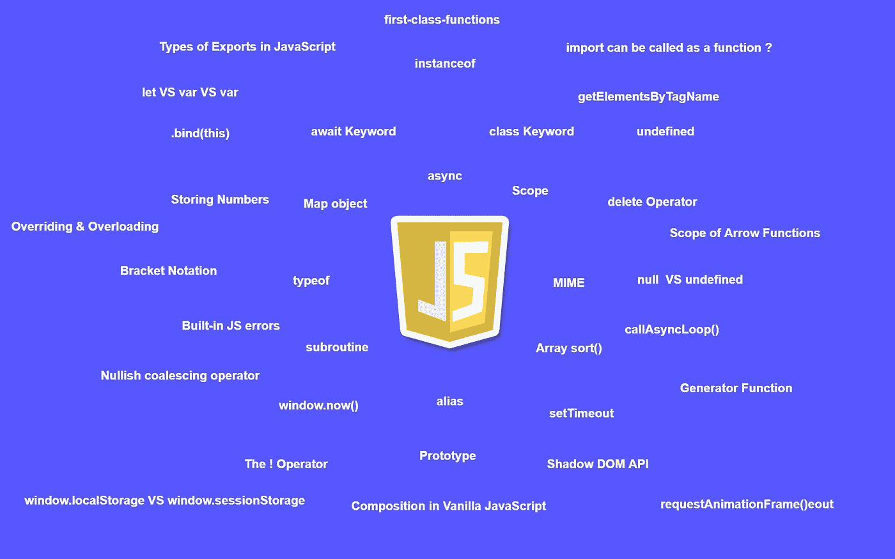

# 掌握 JavaScript 编码面试的问题

> 原文：<https://javascript.plainenglish.io/questions-to-master-the-javascript-coding-interview-12b07d4b77e7?source=collection_archive---------14----------------------->

## 第 4 部分:另外 11 个 JavaScript 编码面试问题

## 1.当考虑强制时，包装对象是什么？

*   它可以是**原语**的包装，以赋予*原语属性*。
*   ***例如，当 **attr** 被包裹在 **String** 对象中时*** 我们尝试访问 **String 对象**属性。

## 2.你所说的 JavaScript 中的真实值是什么意思？

*   **真**值是在布尔上下文中被认为是**真**的值。

## 3.以下语法的名称是什么？

*   是一个**立即被调用的函数执行**，由于函数后的**(**)该函数立即执行。

## 4.箭头功能的范围是什么？

*   定义它们的范围。

## 5.shift 和 pop 方法返回一个新的数组，而不改变原始数组的值。是真的吗？

*   否， **shift** 方法删除*第一个元素* **(索引 0)** 并返回，但确实修改了原始数组，但 **pop** 方法对数组中的*最后一个元素* t 也是如此，

## 6.命令式编程和声明式编程有什么不同？

*   **命令式**编程主要关注如何控制代码执行的路径。
*   **声明性的**编程专注于做什么，这在构建**API**方面有优势。

## 7.陈述和表达有什么不同？

*   **语句**执行一个动作，其中**表达式**引出一个值的求值。

## 8.控制台输出将是什么？

*   控制台输出将为 **False** ，这是由于 JavaScript 中数字的精度是固定的。由于 **(2.2 + 7.7)** 的总和接近于 JavaScript 中的 **9.9000000001** 。

## 9.我们应该在哪里使用 new.target？

*   当一个类或某个函数没有被调用之前的新关键字调用时，我们会抛出一个特定的错误。

## 10.使用哪种方法将节点列表转换为新数组？

*   Array.from()

## 11.哪种 JavaScript 错误类型通常用作用户定义的错误对象的基础？

*   错误。

 [## 掌握 JavaScript 编码面试的 50 个问题

### JavaScript 编码面试问题:第 1 部分

javascript.plainenglish.io](/50-questions-to-master-the-javascript-coding-interview-639d2ac12630)  [## 掌握 JavaScript 编码面试的问题(下)

### JavaScript 编码面试问题-第 2 部分。

javascript.plainenglish.io](/55-questions-to-master-the-javascript-coding-interview-ba49f7b2065a)  [## 掌握 JavaScript 编码面试的问题

### 第 3 部分:另外 11 个 JavaScript 编码面试问题

javascript.plainenglish.io](/questions-to-master-the-javascript-coding-interview-part-3-7f26339f9caf) 

*更多内容看*[***plain English . io***](http://plainenglish.io)