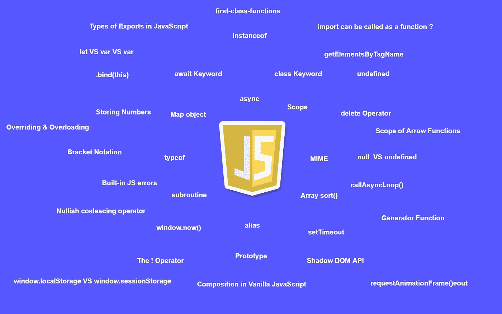
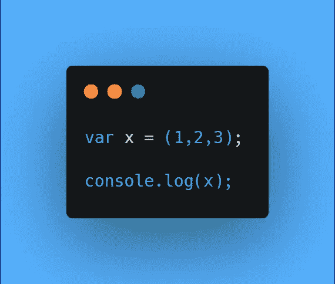
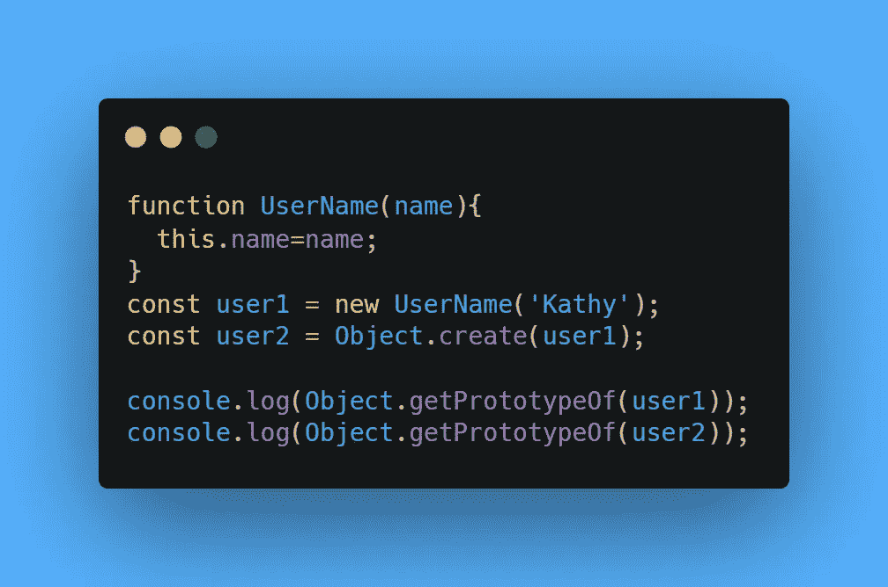
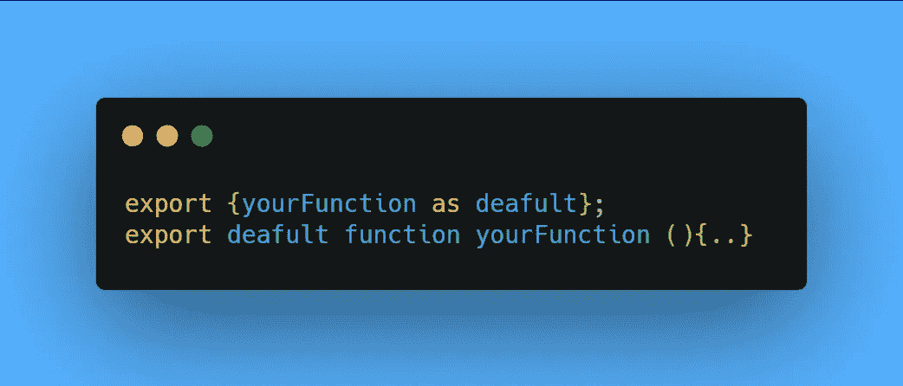

# 掌握 JavaScript 编码面试的问题(第 3 部分)

> 原文：<https://javascript.plainenglish.io/questions-to-master-the-javascript-coding-interview-part-3-7f26339f9caf?source=collection_archive---------6----------------------->

## 11 个 JavaScript 编码面试问题。

## 1.JavaScript 中的生成器函数是什么？

*   **根据 MDN 文档:**生成器是可以退出的函数，以后再重新进入。*例如*，发电机功能中的 **while-loop** 可以暂停。

## 2.RegExp 文字符号和构造函数有什么区别？

*   文字符号的参数用斜线括起来，没有引号。
*   构造函数不使用斜线，而是使用引号。
*   字面符号在编译时计算。
*   构造函数在运行时计算。

## 3.do-while 循环总是至少执行一次。这是真的吗？

*   是的，在处理任何 ***真值*** 求值之前，进入 do-while 循环的**‘do’**部分。

## 4.JSON 支持哪些数据类型？

*   线
*   数字
*   目标
*   空
*   排列
*   布尔型

## 5.控制台输出会是什么？

*   因为逗号分隔符总是返回最终值，所以输出将是 **3。**

## 6.控制台输出会是什么？

*   **用户名{name:'Kathy'}** 和对**用户名**类的引用。

## 7.将函数导出为默认值的两种语法是什么？

## 8.导入可以作为一个函数来调用。这是真的吗？

*   是的， ***导入*** 可以被动态调用，它返回一个承诺。

## 9.什么是识记？

*   通过缓存以前计算的结果来提高函数的性能。

## 10.对象中重复的属性名被视为语法错误。这是真的吗？

*   不，在 *ECMAScript 5* strict 模式下，重复的属性名会引发语法错误。但是，自从 *ECMAScript 2015* 以来，它不再是一个错误。

## 11.哪个类似数组的对象包含传递给函数的所有对象的值？

*   ***arguments*** 对象可以在所有非箭头函数中访问。

 [## 掌握 JavaScript 编码面试的问题(第 2 部分)

### JavaScript 编码面试问题—第 2 部分。

javascript.plainenglish.io](/55-questions-to-master-the-javascript-coding-interview-ba49f7b2065a) 

*更多内容请看*[***plain English . io***](https://plainenglish.io/)