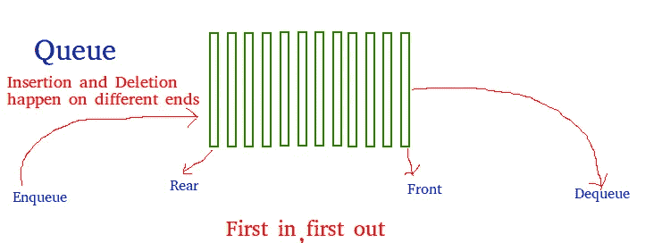

# 用 JavaScript 简单解释队列数据结构

> 原文：<https://javascript.plainenglish.io/queue-data-structure-explained-simply-with-javascript-f6261f68b0b9?source=collection_archive---------13----------------------->


Photo by [Krists Luhaers](https://unsplash.com/@kristsll?utm_source=medium&utm_medium=referral) on [Unsplash](https://unsplash.com?utm_source=medium&utm_medium=referral)

大家好！我是潘杜，欢迎来到我的博客。今天，我将与你分享你需要知道的关于**队列**的一切——软件工程师必须掌握的基本算法之一。

# 什么是队列？

队列是一种先进先出的数据结构。这意味着如果数据排在第一位，它将首先被输出。与**栈**的区别在于，栈使用 LIFO(后进先出)的概念。最后输入的数据将首先输出。

想象一下你在排队买音乐会门票。第一个排队的人会得到票，对吗？这与队列数据结构类似。


Photo by [Lisanto 李奕良](https://unsplash.com/@lisanto_?utm_source=medium&utm_medium=referral) on [Unsplash](https://unsplash.com?utm_source=medium&utm_medium=referral)

就像这张图片一样，第一个人会离收银台更近，可以订票和买别的东西。



[https://www.geeksforgeeks.org/queue-data-structure/#operations](https://www.geeksforgeeks.org/queue-data-structure/#operations)

第一个在右边(前面)，最后一个在左边(后面)。移除将发生在队列的第一个(前面)，我们称之为**出列**。并且插入发生在该行的最后(**入队**)。我们可以用 **Peek** 来称呼第一个。

当然，我们将使用 JavaScript 编写一个简单的脚本。

```
class Queue {
  constructor() {
    this.lines = []
  } enqueue(element) {
    this.lines.push(element)
  } dequeue() {
    return this.lines.shift()
  } isEmpty() {
    return this.lines.length === 0
  } peek() {
    return !this.isEmpty() ? this.lines[0] : undefined;
  }}
```

现在，您应该对队列数据结构有了很好的理解，并且知道如何使用数组类型的`push()`和`shift()`方法在 JavaScript 中实现队列。

蓝图已经创建。你可以随心所欲地应用那个蓝图。

# 警惕！

如果你们来自印度尼西亚，想要支持我越来越多的写作，希望你们能从钱包里拿出一点来。你可以通过一些方式分享你的天赋，

## 萨韦里亚

[https://saweria.co/pandhuwibowo](https://saweria.co/pandhuwibowo)


## 特拉克特尔

[https://trakteer.id/goodpeopletogivemoney](https://trakteer.id/goodpeopletogivemoney)


请多看几篇我的其他博客:

[](https://pandhuwibowo.medium.com/typescript-why-should-use-typescript-part-1-a590f025d7e2) [## Typescript:为什么要使用 TypeScript？—第一部分

pandhuwibowo.medium.com](https://pandhuwibowo.medium.com/typescript-why-should-use-typescript-part-1-a590f025d7e2) [](https://pandhuwibowo.medium.com/part-9-buat-login-dari-model-bernama-eloquent-laravel-8-2201bdbdc999) [## [第 9 部分] — Buat Login dari Model Bernama 口才| Laravel 8

### 哈洛泰曼-泰曼，塞拉马特大唐。我们需要一种新的模式，而在未来的几年里，我们将会实现这种模式…

pandhuwibowo.medium.com](https://pandhuwibowo.medium.com/part-9-buat-login-dari-model-bernama-eloquent-laravel-8-2201bdbdc999) [](https://pandhuwibowo.medium.com/error-stale-postmaster-pid-file-di-mac-os-5927039925e0) [## 错误:过时的 postmaster.pid 文件 di Mac OS

### 你好，泰曼，我是大唐博客的萨拉马特。这是我第一次看到处理错误…

pandhuwibowo.medium.com](https://pandhuwibowo.medium.com/error-stale-postmaster-pid-file-di-mac-os-5927039925e0) 

# 参考

[](https://www.geeksforgeeks.org/queue-data-structure/#operations) [## 队列数据结构- GeeksforGeeks

### 队列是一种线性结构，它遵循操作执行的特定顺序。顺序是…

www.geeksforgeeks.org](https://www.geeksforgeeks.org/queue-data-structure/#operations) [](https://www.tutorialspoint.com/data_structures_algorithms/dsa_queue.htm) [## 数据结构和算法-队列

### 队列是一种抽象的数据结构，有点类似于堆栈。与堆栈不同，队列的两端都是开放的。一…

www.tutorialspoint.com](https://www.tutorialspoint.com/data_structures_algorithms/dsa_queue.htm) 

*更多内容看*[***plain English . io***](http://plainenglish.io/)