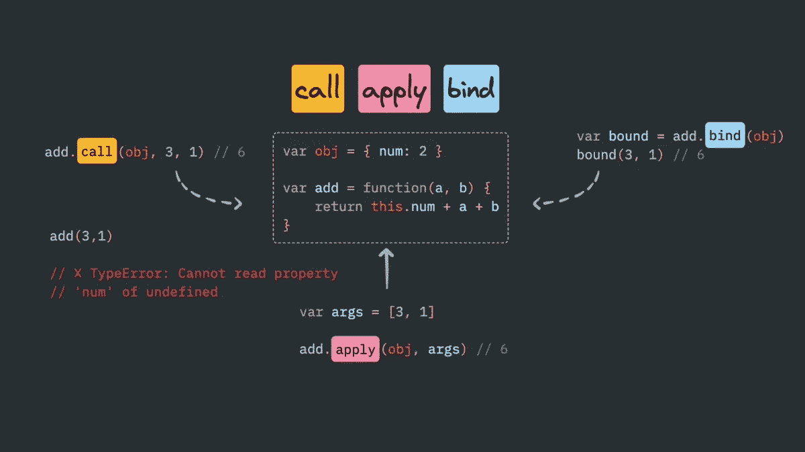

# JavaScript 中调用、应用和绑定方法的快速指南

> 原文：<https://javascript.plainenglish.io/quick-guide-to-call-apply-and-bind-methods-in-javascript-5c00cd856cfa?source=collection_archive---------5----------------------->

## 调用、应用和绑定方法——结合实际应用和聚合来解释绑定方法。

我们将讨论函数原型链的调用、应用和绑定方法。它们是 JavaScript 中最重要和最常用的概念，与 *this* 关键字密切相关。



# 调用方法

`**call()**`方法调用具有给定`this`值和单独提供的参数的函数。

```
func.call([thisArg[, arg1, arg2, ...argN]])
```

**参数:** `thisArg`——可选项。当调用`func`时，使用`this`是有价值的。 `arg1, arg2, ...argN`-函数的可选参数。

**返回值:**用指定的`**this**`值和参数调用函数的结果。

## 描述

*   使用调用方法我们可以进行**函数/方法借用**，我们可以从其他对象中借用函数，并与其他一些对象的数据一起使用。
*   有了`call()`，您可以一次性编写一个方法，然后在另一个对象中继承它，而不必为新的对象重写方法。
*   在 call 方法中，第一个参数将是引用或我们希望“this”指向的内容。
*   后面的参数可以是该函数的参数。我们可以传递任意数量的逗号分隔的参数。

## 实际应用

## **1)使用** `**call**` **为对象链接构造函数**

使用`call`为一个对象链接构造器(类似于 Java)。

在以下示例中，`Person`对象的构造函数由两个参数定义:`name`和`age`。

另外两个功能`Engineer`、`Doctor`调用`Person`，通过`this`、`name`和`age`。`Person`初始化属性`name`和`age`，这两个专用函数定义了`category`。

```
function Person(name, age) {
  this.name = name;
  this.age = age;
}function Engineer(name, age) {
  Person.call(this, name, age);
  this.category = 'Engineer';
}function Doctor(name, age) {
  Person.call(this, name, age);
  this.category = 'Doctor';
}const engineer = new Engineer('Ayush', 28);
console.log(engineer);
//Engineer {name: "Ayush", age: 28, category: "Engineer"}const doctor = new Doctor('Anu', 30);
console.log(doctor);
//Doctor {name: "Anu", age: 30, category: "Doctor"}
```

## **2)使用** `**call**` **调用一个函数并指定上下文为**

**在下面的例子中，当我们调用`print`时，`this`的值必然会反对`person`。**

```
const person = {
    name: 'Ayush', 
    age: '28'
};
function print() {
  const reply = [this.name, 'is', this.age, 'years old.'].join(' ');
  console.log(reply);
}print.call(person);
//Ayush is 28 years old.
```

## ****3)使用** `**call**` **调用函数而不指定第一个参数****

**在下面的例子中，我们调用`display`函数而不传递第一个参数。如果第一个参数没有被传递，则`this`的值被绑定到全局对象。**

```
var name = 'Ayush';function display() {
  console.log('Your name: ', this.name);
}display.call();
// Your name:  Ayush**Caution:** In strict mode, the value of this will be undefined.'use strict'var name = 'Ayush';function display() {
  console.log('Your name: ', this.name);}display.call();
//Uncaught TypeError: Cannot read property 'name' of undefined
```

# **运用方法**

**`**apply()**`方法调用给定`this`值的函数，并将`arguments`作为数组(或[数组状对象](https://developer.mozilla.org/en-US/docs/Web/JavaScript/Guide/Indexed_collections#working_with_array-like_objects))提供。**

```
func.apply(thisArg, [ argsArray])
```

****参数:** `thisArg` 为调用`func`提供的值。
注意`this`可能不是该方法看到的实际值:如果该方法是[非严格模式](https://developer.mozilla.org/en-US/docs/Web/JavaScript/Reference/Strict_mode)下的函数，则`[null](https://developer.mozilla.org/en-US/docs/Web/JavaScript/Reference/Global_Objects/null)`和`[undefined](https://developer.mozilla.org/en-US/docs/Web/JavaScript/Reference/Global_Objects/undefined)`将被全局对象替换，基元值将被装箱。这个参数是必需的。**

**`argsArray`可选。一个类似数组的对象，指定调用`func`时应该使用的参数，如果没有参数提供给函数，则指定`[null](https://developer.mozilla.org/en-US/docs/Web/JavaScript/Reference/Global_Objects/null)`或`[undefined](https://developer.mozilla.org/en-US/docs/Web/JavaScript/Reference/Global_Objects/undefined)`。**

****返回值:**用指定的`**this**`值和参数调用函数的结果。**

## **描述**

*   **有了`apply`，你可以写一次方法，然后在另一个对象中继承它，而不必为新对象重写方法。**
*   **`apply`与`call()`非常相似，除了它支持的参数类型。**
*   **使用`apply`，还可以使用一个数组文字，例如`func.apply(this, ['eat', 'bananas'])`，或者一个`Array`对象，例如`func.apply(this, new Array('eat', 'bananas'))`。**
*   **您也可以将`[arguments](https://developer.mozilla.org/en-US/docs/Web/JavaScript/Reference/Functions/arguments)`用于`argsArray`参数。`[arguments](https://developer.mozilla.org/en-US/docs/Web/JavaScript/Reference/Functions/arguments)`是函数的局部变量。它可以用于被调用对象的所有未指定的参数。因此，当您使用`apply`方法时，您不必知道被调用对象的参数。**

## **实际应用**

## **1)使用 apply 将数组附加到另一个数组**

**使用`push`将一个元素添加到数组中。而且，因为`push`接受可变数量的参数，所以您也可以一次推送多个元素。**

**但是，如果您将一个数组传递给`push`，它实际上将该数组作为单个元素添加，而不是单独添加元素。所以你最终得到了一个数组中的数组。**

**如果这不是你想要的呢？在这种情况下,`concat`确实具有期望的行为，但是它没有附加到现有的数组中——而是创建并返回一个新数组。**

**但是您想追加到现有的数组中…那么现在该怎么办呢？写循环？肯定不会吗？**

**`apply`来救援了！**

```
const arr = [1, 2, 3]; 
const numbers = [4, 5, 6];arr.push.apply(arr, numbers);  
console.log(arr);
//[1, 2, 3, 4, 5, 6]
```

## **2)使用应用和内置函数**

**巧妙使用`apply`允许您使用内置函数来完成一些任务，否则这些任务可能会通过循环数组值来编写。**

**这里有`Math.max` / `Math.min`作为例子，用来找出一个数组中的最大/最小值。**

```
// Min/Max number in an array
const numbers = [9, 8, 1, 2, 3, 5, 6, 7];// Using Math.min/Math.max apply
let max = Math.max.apply(null, numbers);
console.log(max); //9// This about equal to Math.max(numbers[0], ...)
// or Math.max(5, 6, ...)let min = Math.min.apply(null, numbers);
console.log(min); //1
```

# **绑定方法**

**`**bind()**`方法返回一个新函数，当被调用时，它的`this`被设置为一个特定的值。**

```
func.bind(thisArg[, arg1[, arg2[, ...]]])
```

****参数:** `thisArg`调用绑定函数时，作为`this`参数传递给目标函数`func`的值。如果没有向`bind` 提供参数，或者如果`thisArg`是`null`或`undefined`，则执行范围的`this`被视为新函数的`thisArg`。**

**`arg1, arg2, ...argN`可选。调用`func`时提供给绑定函数的参数的前置参数。**

****返回值:**给定函数的副本，带有指定的`this`值和初始参数(如果提供的话)。**

## **描述**

*   **`bind()`函数创建一个新的**绑定函数**，它是一个*外来函数对象*(ECMAScript 2015 中的一个术语)包装了原来的函数对象。调用绑定函数通常会导致执行其包装函数。**
*   **bind 方法看起来与 call 方法完全相同，但唯一的区别是，bind 方法将该方法与对象绑定，并返回该方法的副本，而不是在这里直接调用该方法。并将**返回一个函数。****
*   **这里有一个问题，它不直接调用那个方法，而是返回一个以后可以调用的方法。这基本上只是用来绑定和保存那个方法的副本，以后再用。**

## **实际应用**

## **1)创建绑定函数**

**`bind()`最简单的用法是创建一个函数，不管它是如何被调用的，都是用一个特定的`this`值来调用的。**

**新的 JavaScript 程序员的一个常见错误是从一个对象中提取一个方法，然后调用该函数并期望它使用原始对象作为它的`this`(例如，通过在基于回调的代码中使用该方法)。**

**然而，如果不特别小心，原始对象通常会丢失。使用原始对象从函数创建绑定函数，巧妙地解决了这个问题:**

```
this.x = 9;    // 'this' refers to global 'window' object here in a browser
const module = {
  x: 81,
  getX: function() { return this.x; }
};

module.getX();
//  returns 81

const retrieveX = module.getX;
retrieveX();
//  returns 9; the function gets invoked at the global scope

//  Create a new function with 'this' bound to module
//  New programmers might confuse the
//  global variable 'x' with module's property 'x'const boundGetX = retrieveX.bind(module);
boundGetX();
//  returns 81
```

## **2)部分应用的功能**

**下一个最简单的使用`bind()`的方法是使用预先指定的初始参数创建一个函数。**

**这些参数(如果有的话)遵循提供的`this`值，然后被插入到传递给目标函数的参数的开头，后面是调用时传递给绑定函数的任何参数。**

```
function addArguments(arg1, arg2) {
  return arg1 + arg2
}const result1 = addArguments(1, 2);
console.log(result1); //3// Create a function with a preset first argument.
const addThirtySeven = addArguments.bind(null, 37);
const result2 = addThirtySeven(5);console.log(result2); 
//  37 + 5 = 42const result3 = addThirtySeven(5, 10);
console.log(result3);
//  37 + 5 = 42
//  (the second argument is ignored)
```

## **3)使用 JavaScript `bind()`进行函数绑定(使用`setTimeout()`**

**当你把一个方法对象作为回调传递给另一个函数时，`this`就丢失了。例如:**

```
let person = {
    firstName: 'John Doe',
    getName: function() {
        console.log(this.firstName);
    }
};setTimeout(person.getName, 1000); //undefinedlet f = person.getName; 
setTimeout(f, 1000); //undefined
```

**`setTimeout()`函数内的`this`在非严格模式下设置为全局对象，在严格模式下设置为`undefined`。**

**因此，当回调`person.getName`被调用时，全局对象中不存在`name`，它被设置为`undefined`。**

**要解决这个问题，您可以将对`person.getName`方法的调用包装在一个匿名函数中，如下所示:**

```
setTimeout(function () {
    person.getName();
}, 1000); 
// "John Doe"
```

**这是可行的，因为它从外部范围获取`person`，然后调用方法`getName()`。**

**或者您可以使用`bind()`方法:**

```
let f = person.getName.bind(person); 
setTimeout(f, 1000); 
// "John Doe"
```

## **4)使用`bind()`从不同的对象借用方法**

**在 JavaScript 中，借用对象的方法而不复制该方法并在两个不同的地方维护它的能力非常强大。**

```
let runner = {
    name: 'Runner',
    run: function(speed) {
        console.log(this.name + ' runs at ' + speed + ' mph.');
    }
};let flyer = {
    name: 'Flyer',
    fly: function(speed) {
        console.log(this.name + ' flies at ' + speed + ' mph.');
    }
};let run = runner.run.bind(flyer, 20);
run();
// Flyer runs at 20 mph.
```

# **粘合剂法用聚合填料**

*   **首先，你需要让它对所有方法都可用，所以我们将从`Function`的`prototype`中获得帮助**
*   **`customBind`是一个用户定义的函数，你可以给它起任何你想要的名字，现在它可以用于你在代码中定义的任何函数，就像其他函数 toString()、toLocaleString()等等。**
*   **`customBind`函数应返回一个函数，该函数在被调用时应调用应用了 customBind 的函数。**
*   **所有对象的范围都应该作为**上下文**来传递。**
*   **通过 **args1 和 args2** 获取`customBind`中传递的所有参数和返回的函数，创建一个包含两个数组元素的更大的数组，并将其作为参数传递给我们绑定的函数。**

# **结论**

**我们已经讨论了 JavaScript 调用、应用和绑定方法。还学习了使用 apply 方法从头开始创建 bind 方法。**

**我希望你已经发现这是有用的。感谢您的阅读。**

***更多内容尽在*[*plain English . io*](http://plainenglish.io/)**