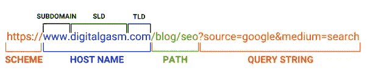
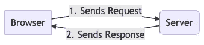
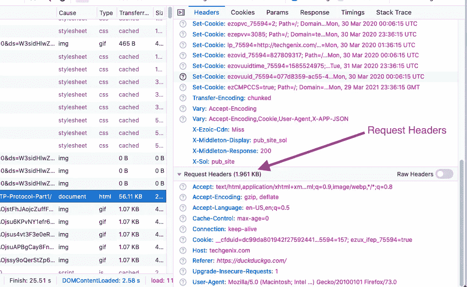
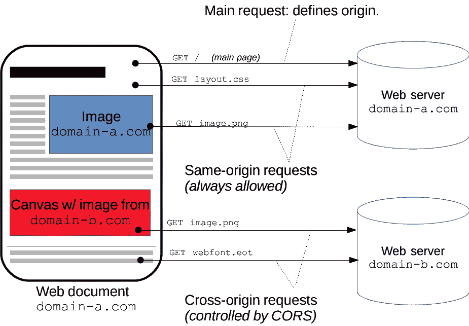

# HTTP 请求和跨源资源共享概述(CORS)

> 原文：<https://javascript.plainenglish.io/quick-overview-of-http-requests-cross-origin-resource-sharing-cors-db139b41d71?source=collection_archive---------5----------------------->

*快速概述 URL 由什么组成，HTTP 请求如何工作，一些重要的请求头，跨源资源共享(CORS)。*


Photo by [Alina Grubnyak](https://unsplash.com/@alinnnaaaa?utm_source=unsplash&utm_medium=referral&utm_content=creditCopyText) on [Unsplash](https://unsplash.com/s/photos/network?utm_source=unsplash&utm_medium=referral&utm_content=creditCopyText)

首先，我们先来看一个 URL(统一资源定位器)是什么样子的。

一个示例 URL 由 4 部分组成。



**方案:**方案标识将要使用的协议。**协议**指定数据如何传输以及如何解释请求。当你看协议的时候，你会很好的理解这个 URL 是用来做什么的。(例如，它是 SMTP、POP3、IMAP 的电子邮件协议，还是访问和管理 git 存储库的 SSH 请求，还是 web 的 HTTP 请求)

**HTTP** —默认情况下在端口 80 上运行，它指定请求中有哪些报头。

**HTTPS** —与 *HTTP* 协议相同，但 HTTPS 被认为是浏览器和服务器之间的安全通信。它与 HTTP 不同；

*   默认情况下，在端口 443 上运行
*   加密除请求 IP 之外的所有请求/响应头

**主机名:**

只是一个更好命名的 IP 地址。

**路径:**

URL 路径就像你的目录路径。它让用户和搜索引擎了解他们当前所在的版块，比如“/关于”版块。事实上，这一部分对于更好地优化 SEO 非常重要。

**查询参数:**

它用于向服务器发送数据。这通常用于营销原因，以了解广告做得如何。以`?`开头，以`&`分隔数据

***注意*** *:出于安全考虑(这样大家都能看到)不建议用查询参数发送数据，而且还有字符限制。(2048 个字符后不允许)。*

有了 HTTP 和 HTTPS 协议，我们还可以通过其他方式向服务器发送数据。

## 请求和响应



Taken from C0D3.com

当用户在浏览器中键入域名时，browser go 会找到该服务器(只是其他人的计算机)并向该服务器发送请求。如果从服务器获得成功的响应，则在浏览器上呈现页面。

***注意*** *:使用终端发送请求时(比如运行* `*node index.js*` *时)流程是一样的。要向服务器发送请求，您不一定需要浏览器，您也可以使用您的终端来完成。但是，如果响应是 HTML，终端不会做任何事情，因为 HTML 只是浏览器的指令。*

## 头球

浏览器和服务器都需要知道彼此的一堆信息才能相互识别并最终发送请求或响应。比如 IP 地址、内容类型、Cookie、[、缓存控制](https://en.wikipedia.org/wiki/Cache-Control)等等。你可以在这里找到完整的列表。它们用**报头**携带这些数据，报头就是键值对。



Request Headers Example | Taken from C0D3.com

发送请求时，您只需手动设置两个头: **Content-Type** 和 **Authorization** 。虽然您可以设置其他标题，但它们通常由浏览器自动处理。

**Content-Type —** 当你用 body ( POST，PATCH，PUT 请求)向服务器发送数据时，你需要指定它的内容类型是`application/json`、`text/html`、 `image/gif`还是 `video/mpeg.`

**授权** —这是服务器用来识别用户的。与 cookie 头不同，这个头必须由开发人员在发送请求时手动设置。通常用于 API 请求和 JWT 认证。

## 请求

通过互联网发送的每个请求由 2 个强制部分和 1 个可选部分组成。

1.  **请求行**；由请求方法(获取、发布、删除等)和路径(从 URL 中提取)组成
2.  **表头**上面简要说明了
3.  **Body** (可选):当你向服务器发出 POST、PUT、PATCH 请求时，你需要发送一个 Body 来告诉服务器你想发送什么数据。示例:

```
axios.post(‘/users’, 
{id: “5fddfefc4fbd19494493cd71”, name: "username"} // **this part is body**
).then(console.log)
```

*   axios 是一个发送请求的库。浏览器还为您提供了一个名为 **fetch** 的函数，该函数允许发送请求。还有一个过时的**请求**库发送请求。
*   **post** 是请求方法，意思是我们正在向服务器发送信息。在这里详细查看 HTTP 请求方法[。](https://developer.mozilla.org/en-US/docs/Web/HTTP/Methods)
*   **'/users'** 是指定您在服务器中发送请求的确切位置的路径。这个 URL 部分其实叫 API。当一个 API 遵循 **REST** 模式，就变成了 **REST API** ，让开发者快速理解和使用 API。正如 REST pattern 所说，例如，**路径**应该总是复数形式。

> REST 代表表述性状态转移，它是一套设计原则，允许你使用 API 来使用和修改服务器上的资源。

*   **body** 是数据对象本身，因此服务器可以获得该数据。

如您所见，除了在浏览器中输入域名之外，还有其他方法可以向服务器发送请求。

> **AJAX** :从浏览器发送请求。如果有人告诉你他们知道 ajax，这意味着他们知道如何从浏览器发送请求。

# 期权方法&跨产地资源共享(CORS)

**选项**请求被称为*飞行前请求。*

目前，你看到的响应来自*medium.com*服务器。假设我写了一个 JS 代码，当你浏览这个的时候，它发送一个 POST 请求到我自己的网站。这被称为**跨域请求**。

> **跨域请求:**发送到与您当前所在的 url 主机名不同的 url 的请求。

使用我的 JS 代码，我希望浏览器向另一个域(另一个服务器)发送另一个请求。然而，这并不容易。出于安全原因，浏览器限制从脚本发起的跨来源 HTTP 请求。

某些"**跨域**"请求，特别是 Ajax 请求，默认情况下被[同源安全策略](https://en.wikipedia.org/wiki/Same-origin_policy)禁止，而"**同源**"请求总是被允许的。

**CORS** 定义了浏览器和服务器交互的方式，并确定允许跨源请求是否安全。

> **跨来源资源共享** ( [CORS](https://developer.mozilla.org/en-US/docs/Glossary/CORS) )是一种基于 HTTP 报头的机制，它允许服务器指示除它自己之外的任何其他[来源](https://developer.mozilla.org/en-US/docs/Glossary/origin) s(域、方案或端口)，浏览器应该允许从这些来源加载资源。



Taken from [https://developer.mozilla.org/en-US/docs/Web/HTTP/CORS](https://developer.mozilla.org/en-US/docs/Web/HTTP/CORS)

## 所以我发了一份跨产地请求。现在发生了什么？

浏览器注意到域是不同的，所以它发送一个**选项**请求到服务器，只是为了检查请求是否被允许。这与开发者无关，它是由浏览器自动完成的。但是开发者在发送跨源请求之前，可以在请求中添加一些头，这可能有助于获得允许。

就像其他浏览器请求一样，像`[Access-Control-Request-Method](https://developer.mozilla.org/en-US/docs/Web/HTTP/Headers/Access-Control-Request-Method), [Access-Control-Request-Headers](https://developer.mozilla.org/en-US/docs/Web/HTTP/Headers/Access-Control-Request-Headers)` 头中的一些数据是用 OPTIONS 方法发送的，它提供了一些信息，如真正的请求何时到来，数据类型是什么，请求方法是什么等等。

如果在这些情况下接受请求，服务器现在可以做出响应。故事的其余部分只取决于服务器。作为响应，服务器可能会发回一个带有`Access-Control-Allow-Origin: *`的`[Access-Control-Allow-Origin](https://developer.mozilla.org/en-US/docs/Web/HTTP/Headers/Access-Control-Allow-Origin)`头，这意味着**任何**域都可以访问该资源。

虽然它允许来自其他域的 GET 请求，但可能会限制 POST 请求。

## 跨域请求的一些重要响应头

**Access-Control-Allow-Origin**—包含允许发送跨域请求的主机名。如果这与用户所在站点的主机名不匹配，则跨域将被拒绝。

**Access-Control-Allow-Credentials**—如果在响应头中为真，则跨域请求将包括 cookie 头。

**Access-Control-Allow-Methods**—这是一个逗号分隔的字符串，告诉浏览器在跨域请求中允许哪些请求方法。如果请求方法未包含在此响应标头中，则不会发送请求。

用于设置标题的 Node.js 代码之一；

```
router.options('/api/*', (req, res) => {
  res.header('Access-Control-Allow-Credentials', true)
  res.header('Access-Control-Allow-Origin', req.headers.origin)
  res.header('Access-Control-Allow-Methods', 'GET, PUT, POST, PATCH, DELETE')
  res.header(
    'Access-Control-Allow-Headers',
    'Origin, X-Requested-With, Content-Type, Accept, Credentials'
  )
  res.send('ok')
})
```

## **为什么服务器开发者需要知道这个**

CORS 标准意味着，服务器开发人员必须处理新的请求和响应头。他们需要用标题来划分界限，这样他们可以防止安全漏洞。

我试着简单地解释这些重要的概念，如果你有任何问题或者想知道更多关于上面提到的某个特定话题，请告诉我。

干杯！