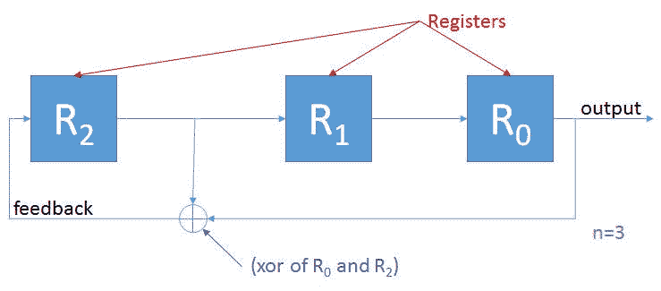

# 随机性:JavaScript 中的 LFSR 和密码学

> 原文：<https://javascript.plainenglish.io/randomness-lfsr-and-cryptography-in-javascript-9a7bc89edbe4?source=collection_archive---------22----------------------->

在之前的中，我写过用 JavaScript 实现一个流密码。我忽略了生成用于加密纯文本的比特流的复杂问题。坐了一个星期，我觉得我需要探索随机性的领域，以完成关于流密码的思考周期。

一种易于实现的算法是线性反馈移位寄存器(LFSR ),因为它在硬件和软件方面都有简单的解决方案。虽然它们并非没有缺陷(例如[关联攻击](https://en.wikipedia.org/wiki/Correlation_attack)，但它们代表了进入该领域的坚实的第一步，并在许多生产系统中使用(例如 [A5/1](https://en.wikipedia.org/wiki/A5/1) )。

该算法具有以下特征:一个*初始状态*(不能为 0)，该状态应该由 *n 个*位(每个位在*寄存器*中有一个位置)表示，一个移动这些位的*移位*周期，一个产生随机 its 的*输出*路径，一个向空出的点返回新位的*反馈*路径(来自移位和输出)，以及一个

由算法产生的随机序列的最大数量被定义为 2^n-1，并被称为*周期*。三位 LFSR 最多可以产生 7 个唯一序列，而四位 LFSR 最多可以产生 15 个唯一序列。您应该注意术语最大值:不是所有的 3 位、4 位或 n 位 LFSR 都会产生最大数量的唯一序列——这取决于您选择的“抽头”(稍后将详细介绍)。

LFSR 算法有两种类型:内部算法，在寄存器之间引入位突变；和外部，其引入突变作为反馈循环的一部分。本文的剩余部分将关注外部 LFSR。让我们通过图表来研究这些概念:



本例中有三个寄存器，需要 3 位初始状态，因此 n=3。周期是 2 -1 = 7 个最大唯一序列。移位发生时，从寄存器 2 和寄存器 0 中抽取值，两者的 XOR 运算成为反馈，寄存器 0 中的值成为输出位。“移位”是将寄存器 1 的值移入寄存器 0，将寄存器 2 的值移入寄存器 1，最后将新计算的反馈位放入寄存器 2 的过程。比特流最终会重复。

[1，0，1]的初始寄存器将输出比特流:

```
10111001011100101110010111001011100101110010111001011100
```

在它重复之前。如果您将其切割成 8 位整数，我们将得到输出[185，114，229，203，151，46，92]，序列在 185 处重复。以下是确认测试的情况:

```
consr reference = ' matching: https:*//cs.stackexchange.com/questions/3337/lfsr-sequence-computation'*it('3 Bit LFSR of ' + taps[3].polynomial + reference*, () => {* const ring = ExternalLfsrByteRing(8, [1,0,1])
    ring.next(*/*10111001*/*).should.be.an('object').to.have.
        a.property('value').equal(185)
    ring.next(*/*01110010*/*).should.be.an('object').to.have.
        a.property('value').equal(114)
    ring.next(*/*11100101*/*).should.be.an('object').to.have.
        a.property('value').equal(229)
    ring.next(*/*11001011*/*).should.be.an('object').to.have.
        a.property('value').equal(203)
    ring.next(*/*10010111*/*).should.be.an('object').to.have.
        a.property('value').equal(151)
    ring.next(*/*00101110*/*).should.be.an('object').to.have.
        a.property('value').equal(46)
    ring.next(*/*01011100*/*).should.be.an('object').to.have.
        a.property('value').equal(92)

    *// here is the the sequence restarting...*
    ring.next(*/*10111001*/*).should.be.an('object').to.have.
        a.property('value').equal(185)
})
```

您可能会注意到，在测试中有一个语句 **ring.next()。value** 语法，它应该提示我实现:生成器。我选择了一个生成器，因为下一个状态是前一个状态/寄存器值的一个因子。实现的核心实际上是两个函数:生成器本身和移位函数。

```
*// shifter*
*//  shifts the bits outputting the next bit out in the register 
//   THEN calculating a new bit and feeding*
*//  it back to the other side of the register (the input and output 
//   sides are dependent on the input functions / direction)*
*//*
*// shifter :: ( ([x] -> x -> [x]), ([x] -> {[x], x}), [Number] ) ->  //                [Bit] -> {newRegister: [x], output: x}*
const shifter = (append, remove,  taps) =>
    register => {
        const feedbackBit = calculateNewBit(taps, register)
        const appendedRegister = append(register, feedbackBit)
        const { output, array } = remove(appendedRegister)

        return { newRegister: array, output: output }
    }

const ExternalLfsrByteRing = 
  function *(byteLength, initialRegisterBitArray) {
    const n = initialRegisterBitArray.length

    *// shift :: [Bit] -> {newRegister: [x], output: x}*
    const shift = buildShifter(LEFT_TO_RIGHT, tapLookup[n])

    *// register is an array representing the current state of bits*
    let register = initialRegisterBitArray ;

    *// shiftRegister*
    *//  shifts the bits in the register (CAUTION: MUTATES register)
    //
    // shiftRegister :: unit -> Bit*
    const shiftRegister = () => {
        const {newRegister, output} = shift(register)
        *// side-effect here*
        register = newRegister
        return output
    }

    *// return a byte whenever asked*
    while(true) {
        yield getNextByte(shiftRegister)(byteLength)
    }
}
```

关注生成器函数(ExternalLfsrByteRing)，最重要的位(双关语)是 **while** 语句。每当用户请求下一个字节时，我们使用移位寄存器作为位源和指定的字节长度(8)来聚合足够的位(getNextByte)。移位寄存器是一个很容易理解的函数，它调用 shift 并更新寄存器的状态，然后输出移位后的结果位。

shift 函数(通过 Shifter 从 buildShifter 返回)以从左到右和从右到左的方式运行(使与其他项目的比较/ ab 测试更容易)。因此，append 和 remove 具有特定于方向的实现，就像要 tap 的寄存器的索引一样。这些函数只是计算新的输入，并将其附加到寄存器中，然后删除被移位的位。

基于寄存器位数的元数据有助于实现这一切，因此我按照这种思路构建了一个简单的散列表:

```
{
    "2": {
        n: 2,
        maxSequence: 3,
        polynomial: "p(x) = x^2 + x^1 + 1",
        taps: [
            2,
            1
        ]
    },
    "3": {
        n: 3,
        maxSequence: 7,
        polynomial: "p(x) = x^3 + x^2 + 1",
        taps: [
            3,
            2
        ]
    },
    "4": {
        n: 4,
        maxSequence: 15,
        polynomial: "p(x) = x^4 + x^3 + 1",
        taps: [
            4,
            3
        ]
    },...
}
```

多项式中的指数和抽头之间有一种关系，这应该很容易看出。抽头和抽头索引之间的关系取决于寄存器方向(如附加和移除)，但是，这相当简单:

```
const getDirectionalFunctions = (direction, n) => {
    const subtractOne = x => x - 1
    const subtractFromN = x => n - x

    const append = 
       (direction == LEFT_TO_RIGHT) ? appendLeft  : appendRight ;
    const remove = 
       (direction == LEFT_TO_RIGHT) ? removeRight  : removeLeft ;
    const tapIndexMapper = 
       (direction == LEFT_TO_RIGHT) ? subtractOne : subtractFromN ;

    return {
      append, remove, tapIndexMapper
    }
}
```

这个字节环可以替代我在文章开始提到的流密码，成为更安全的对称流解决方案(注意:重点是*更*安全，这是**而不是**安全的解决方案——目的是展示复杂性是如何发展的)。

[代码](https://github.com/tb01923/understanding-cryptography/blob/master/prng/external-lfsr-byte-ring.js)和[测试](https://github.com/tb01923/understanding-cryptography/blob/master/test/prng/external-lfsr-byte-ring.test.js)可供您选择！

*喜欢代码？—打电话给我我一直在寻找与合作者、共谋者和创新者会面和合作的机会。*

[](https://www.linkedin.com/in/tb02118/) [## Todd Brown-Liberty Mutual 创新和敏捷工程副总裁兼高级总监…

### Todd 在软件行业有 20 多年的经验，专注于架构、安全和…

www.linkedin.com](https://www.linkedin.com/in/tb02118/) 

*最初发表于*[*【https://www.linkedin.com】*](https://www.linkedin.com/pulse/randomness-lfsr-cryptography-javascript-todd-brown/)*。*

*更多内容请看*[*plain English . io*](http://plainenglish.io/)