# 从最好到最差排列在线反应开发环境

> 原文：<https://javascript.plainenglish.io/ranking-online-react-sandboxes-b11f963dcb1d?source=collection_archive---------5----------------------->

## Create-React-App 很棒，但有时你只是想做一些原型，而不是构建一个完整的 React 项目

Photo by [Markus Spiske](https://unsplash.com/@markusspiske?utm_source=medium&utm_medium=referral) on [Unsplash](https://unsplash.com?utm_source=medium&utm_medium=referral)

如果你曾经想做一个快速反应的概念验证或实验，那么你需要一个沙箱。但是有这么多沙盒可供选择，哪一个是最好的呢？这里列出了 5 个值得你花时间和精力的沙盒。

# 5.Codepen.io

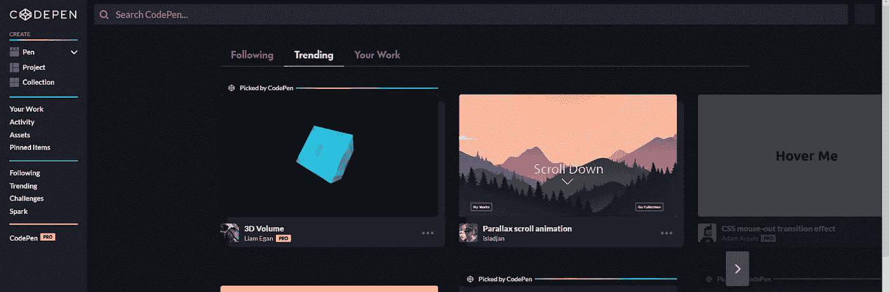

Codepen.io Home Screen

— —
美学:4/5
易用性:2/5
功能:2/5
第三方集成:1/5
定价:3/5
——
**总体:12/25**

首先，我们有 [Codepen](https://codepen.io/trending) ，这是一个非常受欢迎的前端沙盒，不仅允许原型制作，还允许发现新的有趣的 FE 想法。

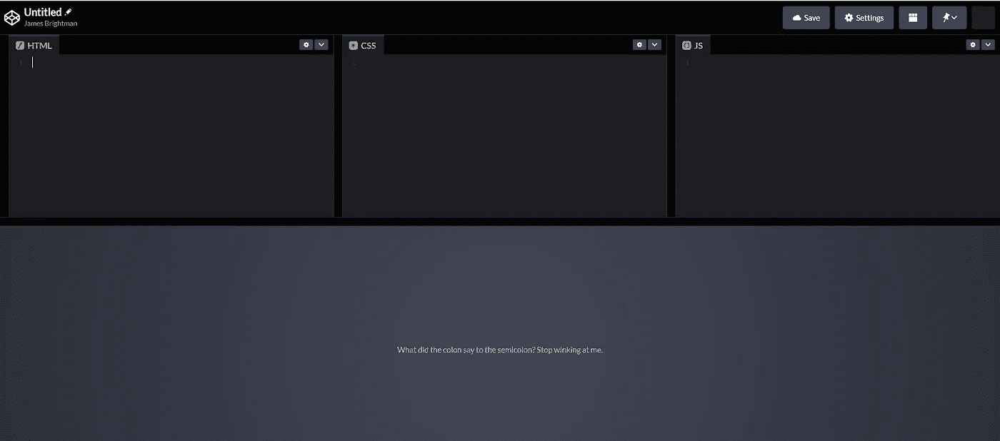

Codepen 在主屏幕和 IDE 界面上使用深色主题和简单的基于卡/块的 UI。虽然不浮华，但它肯定是清晰和结构良好的。

不幸的是，我发现与列表中的其他人相比，Codepen 的功能非常少。像格式化和添加 npm 包到项目中这样的任务比其他编辑器更加困难和乏味。你可以玩的设置数量也低于平均水平，而且你必须浏览菜单才能到达那里。对于 React 开发人员来说，最糟糕的是没有默认的 React 模板来开始工作。从头开始设置并不困难，但是使用沙箱的部分原因是它通常会为您处理这些事情。

也缺乏第三方集成。除了登录/认证集成，我不认为还有其他的。

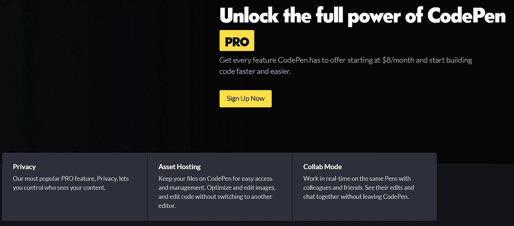

CodePen Pro perks.

价格结构从每月 8 美元开始，并为您提供奖金，如私人代码笔、实时协作和托管资产。免费版本是 *ok* ，但有 10 个免费代码笔的限制，所以你可能会发现自己很快用完。令人遗憾的是，当沙盒可以从更多功能中受益时，像实时协作这样的伟大功能却隐藏在付费墙后面。

以我的既定排名体系来评判 CodePen.io 可能略显不公。Codepen 更多的是寻找令人兴奋的新的和酷的 CSS/JS 技巧，并展示你自己的小代码片段(想想 Github gists)，公平地说，它做得很出色。基于编码的社交媒体风格平台的想法当然很有趣。如果你认为你擅长 CSS，就等着看真正的 CSS 向导的笔吧。

它并不意味着是一个原型和共享复杂项目的平台，所以如果这是你所需要的，那么我会去别处看看。

# 4.JSFiddle

JS Fiddle Home Screen

— —
美观度:2/5
易用性:3/5
功能:3/5
第三方集成:2/5
定价:3/5
——
**整体:13/25**

与今天这些崭新闪亮的沙箱相比，JSFiddle 可能被认为是老古董。老实说，它开始显示出它的年龄。

UI 极其简单干净，到了空无一物的地步。感觉空间可以得到更好的利用，而不是占据整个左下角作为永久广告。有调整用户界面和改变面板顺序的选项，但它看起来不像其他沙盒那么吸引人。

有相当多的模板可供选择，包括各种 React 模板(React+JSX，React，Preact)。

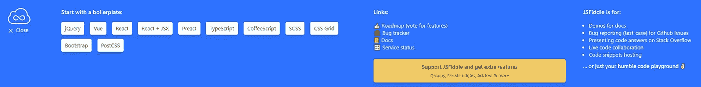

The different JSFiddle templates

不幸的是，看起来所有默认的 React 模板都使用基于类的 React。这不一定是错误的，因为基于类的 React 仍然是有效的 React。但是自从 16.8 引入钩子之后，functional React 已经成为元编码标准。

JSFiddle 的特点是鱼龙混杂。一方面，你有非常聪明的 API 模仿特性，但另一方面，所有的代码林挺都包含在控制台中，不会在你的代码中突出显示。总的来说，我认为好处大于坏处，JSFiddle 有足够的特性来满足沙盒的需求。

Github 第三方链接可以让你将代码提取并提交到你的公共库。这是一个相当标准的集成，但也是一个非常有用的集成。

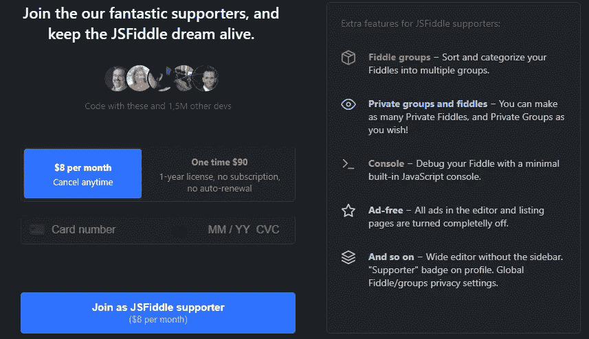

JSFiddle pricing

成为 JSFiddle 的支持者将花费你 8 美元/月，这是一个很常见的沙盒价格。为此，老实说，除了私人工作空间，你没有太多的额外津贴。移除广告和能够对你的作品进行分组并没有让我觉得物有所值，但这取决于你觉得哪些东西有用。

# 3.斯塔克布里茨

Stackblitz Home Page

— —
美观度:5/5
易用性:4/5
功能:4/5
第三方集成:3/5
定价:3/5
——
**整体:19/25**

Stackblitz 是一个现代化的在线 JS 编辑器。它不仅为 React(包括 TS)提供模板，还包括其他流行的框架，如 Svelte、Ionic 和 Vue。有趣的是，您还可以构建 Node.js、GraphQL 和 Next.js 等后端服务的原型。

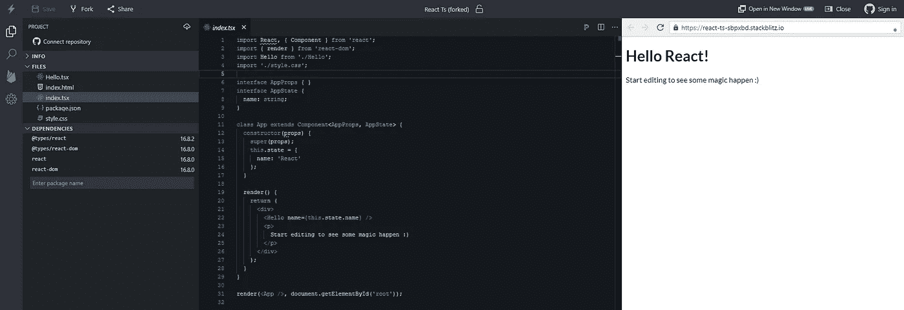

Stackblitz IDE layout.

入门就像选择一个项目模板一样简单，点击一次就被带到一个清晰实用的在线 IDE(默认使用黑暗模式！).所有标准的 IDE 特性，如林挺和格式化，都存在并按预期工作。

在集成方面，Stackblizt 有一个 Github 链接，允许您访问您的公共回购。除此之外，还有一个 Firebase 集成，可以直接从 IDE 中进行部署。非常方便您快速和基本的主机需求。

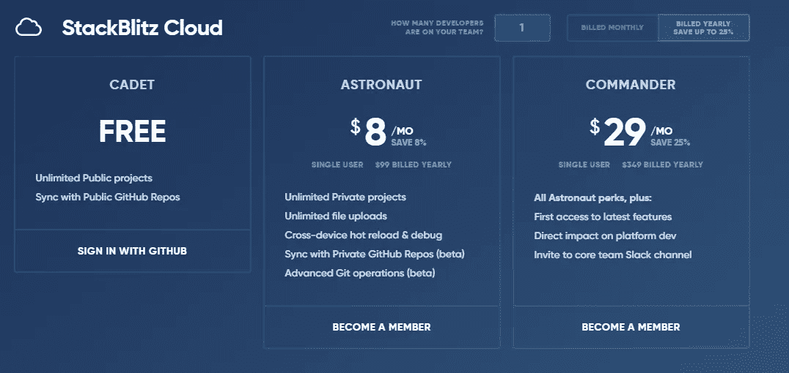

Stackblitz pricing plans

可用的定价计划与其他在线沙盒一致，允许无限的公共项目，但私人项目和回购是一个付费的奖金。

总的来说，Stackblitz 设计得很好，也很坚固，是快速构建前端和后端项目原型的绝佳选择。虽然这是这个列表中的第三个，但它可能是全栈开发沙箱的最佳选择。

# 2.CodeSandbox.io

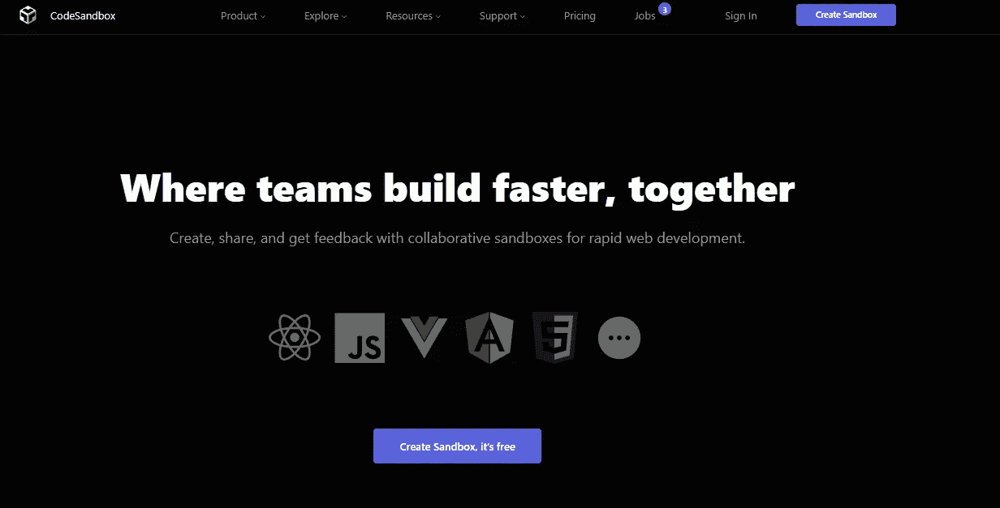

Codesandbox Home Page

— —
美观度:5/5
易用性:5/5
功能:4/5
第三方集成:4/5
定价:2/5
——
**整体:20/25**

CodeSandbox 近年来迅速流行起来。虽然它可能不是沙盒世界中最新或最热门的东西，但它是业余爱好/中型项目的绝佳选择。

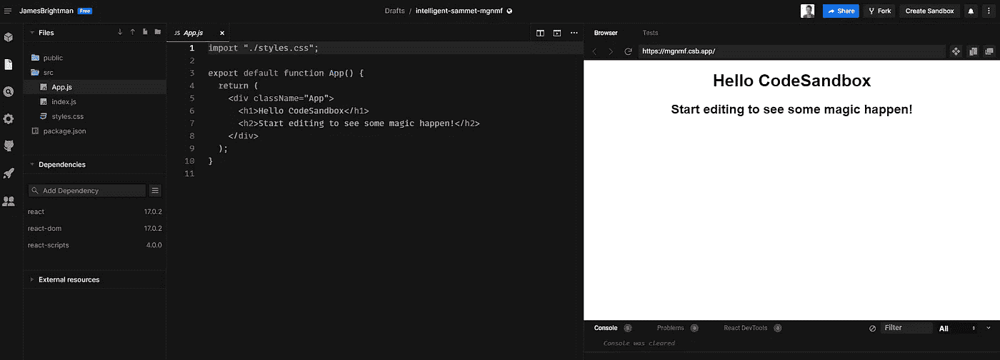

Codesandbox IDE

CodeSandbox 提供了一个严肃的黑暗主题 UI，向你展示你需要看到的所有信息。我特别喜欢 IDE 用不同颜色突出显示方法/变量代码的方式。整个事情给我非常强烈的 *Visual Studio 代码*的共鸣，这绝对不是一件坏事。基于卡片的主屏幕略显乏味，但这仅仅是因为它是显示数据的一种非常好且常见的方式。

CodeSandbox 非常容易使用和导航。创建新的沙箱是一个轻松的过程，编辑现有的或分叉的沙箱也是如此。添加包是一个简单的过程，不会让你拔毛。偶尔，如果你写无限重复的代码，你可能会崩溃的沙箱，将不得不刷新。事实上，我不得不刮了这么小的底片应该告诉你所有你需要知道它是多么容易使用。

CodeSandbox 具有丰富的功能，也有相当多的第三方集成。我们拥有你期望从一个好的沙盒中得到的所有特性，比如 Github 集成、版本控制和共享/分叉沙盒。除此之外，我们还有一些更高级的功能，例如在课堂模式下只有你可以编辑的实时共享，或者在自由模式下每个人都可以编辑。如果你需要和其他人一起开发代码原型，这是非常宝贵的。此外，还有与 Netlify、Vercel 和 Github 页面的集成，用于直接从 IDE 部署您的沙箱。

CodeSandbox 唯一可以改进的是沙盒的社交方面。虽然您可以找到并“喜欢”其他人的沙箱，但您没有太多可以做的事情，比如开始发布线程或做出贡献。

Codesandbox pricing

每月 9 美元(每年订阅 7 美元)的 CodeSandbox 是这个列表中价格最高的沙盒。额外津贴是否超过了成本？在我看来，不尽然。你得到的只是私人沙箱和更多的沙箱/文件存储空间。如果隐私对你那么重要，那么订阅是值得的，但如果不是，那么这不是一个很有吸引力的提议。

# 1.回复它

Repl.it Home Page

— —
美观度:4/5
易用性:5/5
功能:5/5
第三方集成:2/5
定价:5/5
——
**整体:21/25**

Replit 可能是这个列表中最新的沙箱，它被认为是下一个大事件。在花了一些时间后，你可能会明白为什么。

从 UI 开始，Replit 使用了一种材料设计风格，这意味着许多带有蓝色按钮、灰色图标和圆角的白色卡片。我个人认为材料设计是一个很好的全面*安全*的选择，我很喜欢。虽然它不像其他沙箱那样大胆或黑暗，但您可能会立即认出所使用的 UI 隐喻。

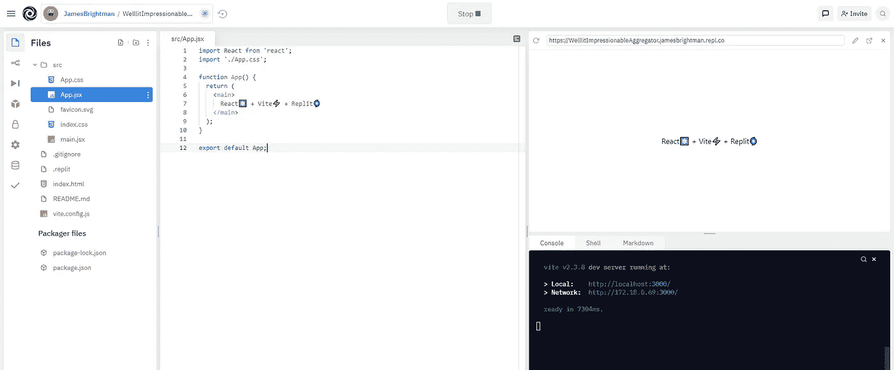

Replit IDE

部分由于材料设计，Replit 感觉非常容易使用。主页上的大命令行为各种操作提供了直观的快捷方式，汉堡菜单也很容易导航。

至于 IDE 本身，没有什么突破性的东西，只是典型的文件、控制台、预览结构的一个非常坚实的实现。添加包和查看版本控制历史很简单，可以通过垂直的上下文菜单访问。感觉一切都在正确的位置，这使得使用 Replit 成为一个简单的过程。我不喜欢的一件事是，必须创建一个帐户来设置一个沙箱。只要你打开 URL，其他沙盒就可以使用，所以这感觉有点像进入的障碍。

从功能上来说，很难想到 Replit 缺少了什么。有几种支持的语言甚至超越了 JS/TS。Replit 有一些你在其他沙箱中看不到的特性，比如调试器、环境秘密、单元测试和模拟数据库。除了纯粹的代码特性之外，还有一个庞大的开发人员社区渴望展示他们自己的 Replits。你可以认为这是一个更容易理解和面向社会的 Github。我还没有深入研究 Replit 的社会方面，但它似乎是沙盒对许多人的吸引力的一大部分。

除了花哨的功能，Replit 还有一些基本功能，如派生回购(或 Replits，但这听起来不太好听)、林挺和向下格式化等。

如果 Replit 有一个弱点，那就是第三方集成。他们有用于版本控制和发布代码的 Github，但除此之外就没什么了。看到 Firebase 或 Azure/AWS 集成从 IDE 托管您的项目会很酷，类似于 Stackblitz 和 Codesandbox。

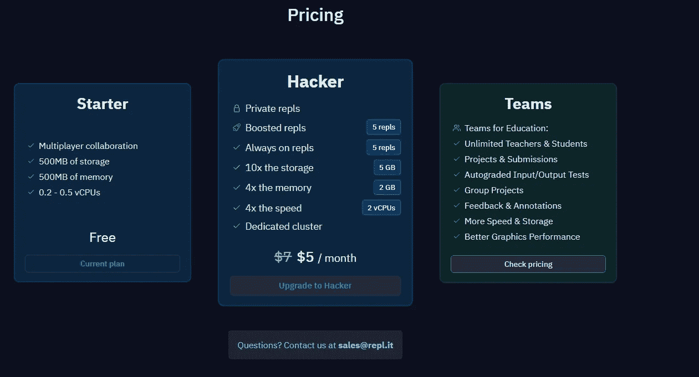

Replit membership perks

只要每月支付 7 美元，您就可以成为 Replit“黑客”，从而增加一定的隐私和存储空间。有趣的是，作为 Replit 成员并不能给你无限的 Replit，这是沙箱成员更常见的结构。限制 Replits 付费用户的数量似乎有点贪心，但是由于免费用户的数量是免费用户的 10 倍，要达到这个极限可能需要很长时间。免费层对于正常使用肯定是可以接受的。

如果您正在寻找一个沙箱来制作原型并分享一些想法，那么 Replit 是一个很好的工作工具。然而，这个用例似乎更适合于将作为社交网络而不仅仅是编码工具与 Replit 交互的用户，所以需要记住这一点。

## 结论

虽然 Replit 可能有更多的社区功能，但它似乎是为更大的项目规模服务的。如果我只是想做一个小东西的原型，我还是会坚持代码沙盒。

感谢您花时间阅读这个排名。希望您能更好地了解什么样的沙箱适合您。这些意见是我自己的，所以请随意在评论中提出不同意见。

*如果你喜欢这篇文章或觉得它有用，请不要客气。或者，你可以在中号***上支持我，或者给我买杯* [*咖啡*](https://ko-fi.com/jamesbrightman) *！非常感谢所有的支持。**

**多内容于* [***通俗易懂***](http://plainenglish.io)*