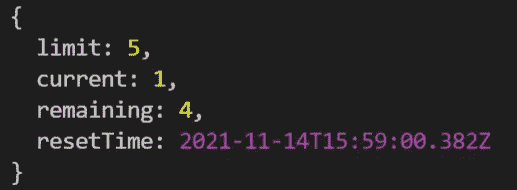

# Node.js 中的速率限制 API:它是什么，是如何工作的？

> 原文：<https://javascript.plainenglish.io/rate-limiting-apis-in-node-js-what-is-it-and-how-does-it-work-f19b4aff3f38?source=collection_archive---------6----------------------->


速率限制是一种策略，在这种策略中，您可以通过为 API 的使用限制设置上限来保护 API。你通常希望你的用户在使用你的 API 时有一个愉快的体验。假设有人向您的服务器发送大量请求，不管是合法的还是恶意的，都会给其他用户带来问题，还可能完全阻塞服务。在这篇博文中，我们将看看如何在 Node.js 中为我们的 API 实现速率限制。这种速率限制策略有助于缓解一些常见问题，如暴力攻击或 DoS/DDoS 攻击。

> 你也可以看这篇文章的视频版本，点击 [**这里**](https://youtu.be/iicNZf3eGCI) 。

## 项目设置

要快速设置节点项目，请打开您选择的代码编辑器，并在一个空文件夹中运行以下命令。

```
npm init -y
```

“ **-y** ”标志将直接创建您的 package.json 文件，而不会询问任何样板问题。一旦完成，继续安装快速和快速速率限制。

```
npm install express express-rate-limit
```

之后，在您的项目目录中创建一个服务器文件，并在该文件中复制以下代码。

我们来分析一下。我们首先导入 express 并为其创建一个实例。我们还导入了快速速率限制库。

因为我们的 API 端点将返回一个帖子列表，所以我们在这里创建了一个帖子数组，并将其存储在一个变量中。之后，我们创建一个速率限制配置对象，并将其传递到“rate limit”函数中。现在，在这个配置中，有相当多的键可以传递。一些最常见的是

*   **max** —给定时间范围内的最大请求数
*   **windowMs —** 时间范围(毫秒)
*   **onLimitReached —** 用户第一次超过速率限制时调用的函数
*   **跳过—** 用于跳过请求的功能

你可以在官方[文档](https://www.npmjs.com/package/express-rate-limit)中读到更多细节。对于我们的例子，我们将使用 **max** 和 **windowMs** 键来配置我们的速率限制器。最大值设置为 5 个请求，时间范围设置为 20 秒(20000 毫秒)。

在这个配置下面，我们有我们的 API 端点。这个端点将是一个非常基本的 GET 请求，它返回一组 posts(我们在上面创建的那个)以及一个状态标志。

最后，我们监听端口 5000 上的请求。就是这样。

现在我们可以运行这个应用程序并打开 postman 来测试我们的 API 端点。

```
node app
```

在请求 URL 块中输入 API 端点(**http://localhost:5000/posts**)，并将请求类型设置为“ **GET** ”。现在，如果我们将这个请求发送到我们的服务器，我们将首先得到预期的响应，即 posts 数组。


Successful request

现在尝试连续多次发送相同的请求。在第五次请求后，您会得到一个回应，说“**请求太多，请稍后再试**”。这意味着我们的限速器工作正常。您可以使用配置中的值来测试多种情况。


如果打开“回复标题”选项卡，您会看到一些新的标题被添加到列表中。


*   X-RateLimit-Limit —告诉您在时间范围内可以发出的请求总数
*   X-RateLimit-Remaining —告诉您在特定时间段内剩余的请求数量
*   X-RateLimit-Reset —重置您的使用限制上限的时间。

如果你看一下上面的代码，我已经尝试在我们的 API 控制器中控制台记录" **req.rateLimit** "这个" **rateLimit"** 属性被添加到我们的请求对象中，它有几个方便的属性，可以用来通知用户它们的使用状态。



req.rateLimit object

大概就是这样。默认情况下，此限制映射到一个 IP 地址。因此用户仍然可以从多个 IP 地址向您的应用程序发出请求。因此，理想的解决方案是保持这种基于 IP 地址的速率限制，并在此基础上添加一个额外的基于 userId 的速率限制(为此需要认证)。因此，即使用户移动到不同的 IP 地址，他/她仍然只有一个 userId。所以这个基于用户标识的速率限制可以解决这个问题。

如果你更好地理解视频格式，我有一个单独的视频，你可以在这里观看。如果你有任何疑问或建议，你可以在评论中提出来，或者你可以在我的任何一个社交网站上与我联系。干杯！。

[LinkedIn](https://www.linkedin.com/in/akilesh-rao-610357137/)
[Twitter](https://twitter.com/themangalorian)
[GitHub](https://github.com/AkileshRao)
[YouTube](https://www.youtube.com/channel/UCaktnqx_IENyT5T2lJ3F09w)

*更多内容请看*[***plain English . io***](http://plainenglish.io/)