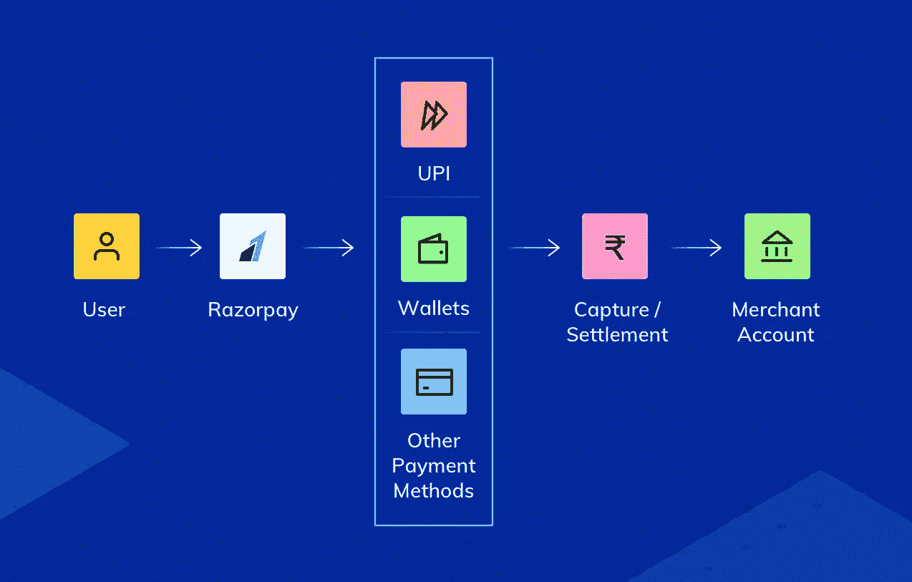
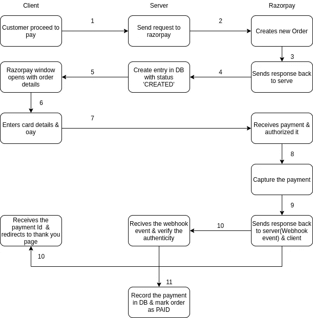
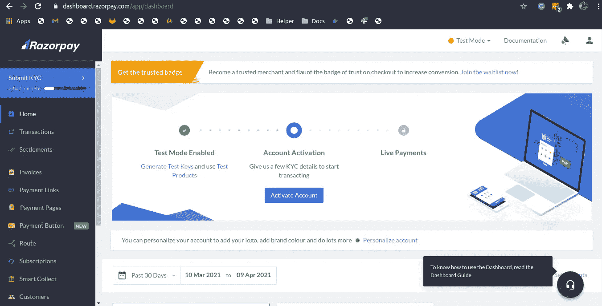
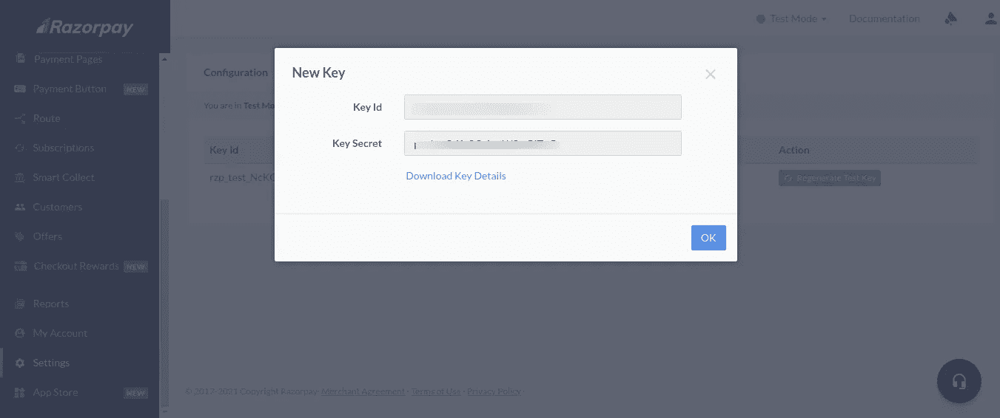
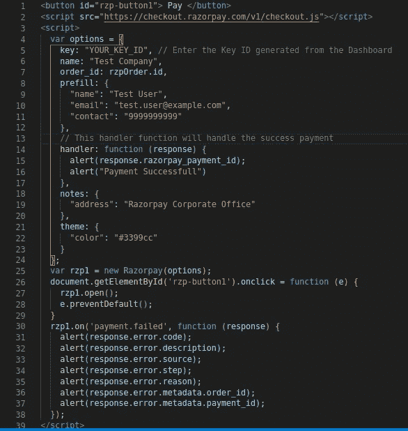
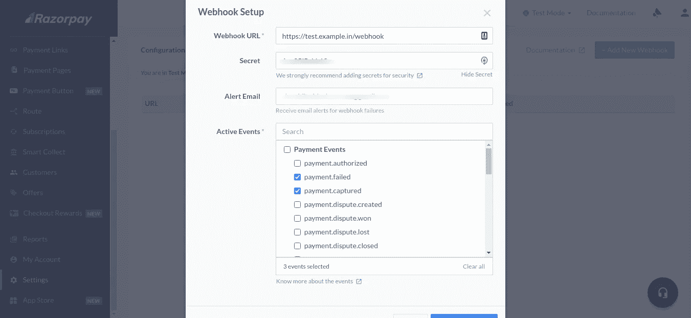

# RazorPay 与 Node.js 的集成

> 原文：<https://javascript.plainenglish.io/razorpay-integration-with-node-js-4915d03ad8ce?source=collection_archive---------0----------------------->

Razorpay 是印度一个流行的支付网关，用于电子商务网站或任何付费服务。只需几个步骤，您就可以开始使用这项服务向客户收款。

今天的帖子将涉及 Razorpay 上的帐户创建&与 node.js 应用程序的集成。



Razorpay payment flow



Order creation to Payment received via webhook flow

## 第一步。RazorPay 帐户设置

前往[https://dashboard.razorpay.com/signup](https://dashboard.razorpay.com/signup)并输入您的电子邮件地址&必要信息。



Dashboard of RazorPay

默认情况下，它会为您创建一个测试环境，让您尝试所有选项。您可以在“我的帐户->个人资料-> T2 帐户激活”部分填写 KYC 表格来激活您的帐户。

现在转到“设置-> API 密钥”来为节点连接生成 API 密钥。下载密钥并将其存储在安全的地方。



API key generation

## **第二步。Node.js 设置**

使用 npm 安装 Razorpay 包。

```
npm i --save razorpay
```

现在让我们创建 index.js 文件，并用我们作为 API 密钥下载的 key_id & key_secret 实例化 Razorpay 实例。

```
const rzp = new Razorpay({
 key_id: "YOUR_KEY_ID",
 key_secret: "YOUR_KEY_SECRET",
})
```

创建订单，并将订单 id 发回以便结账。

```
const rzpOrder = await rzp.orders.create({
 amount: amount * 100, // rzp format with paise
 currency: 'INR',
 receipt: "receipt#1" //Receipt no that corresponds to this Order,
 payment_capture: true,
 notes: {
  orderType: "Pre"
 } //Key-value pair used to store additional information
})// To create recurring subscription
const subscriptionObject = {
 plan_id: PLAN_ID,
 total_count: 60,
 quantity: 1,
 customer_notify: 1,
 notes,
}const subscription = await rzp.subscriptions.create(subscriptionObject)
```

传递订单 Id 以生成结帐对象

```
<button id=”rzp-button1">Pay</button>
<script src=”https://checkout.razorpay.com/v1/checkout.js"></script> <script> 
 var options = 
  {
   “key”: “YOUR_KEY_ID”, // Enter the Key ID generated from the Dashboard 
   "name": "Test Company", 
   "order_id": "rzpOrder.id", // For one time payment
   "subscription_id" : "subscription.id" // For recurring subscription
   "prefill": {
     "name": "Test User",
     "email": "test.user@example.com",
     "contact": "9999999999"
   },
   "theme": {
    "color": "#3399cc"
   },
   // This handler function will handle the success payment
   "handler": function (response) {
    alert(response.razorpay_payment_id);
    alert("Payment Successfull")
   },
};var rzp1 = new Razorpay(options);document.getElementById('rzp-button1').onclick = function (e) {
  rzp1.open();
  e.preventDefault();
}
rzp1.on('payment.failed', function (response)
 {            
  alert(response.error.code);     
  alert(response.error.description);      
  alert(response.error.source);
  alert(response.error.step);     
  alert(response.error.reason);
  alert(response.error.metadata.order_id);
  alert(response.error.metadata.payment_id);
 }</script
```

如果一切正确，用户将被重定向到 Razorpay 结账页面。



您可以自动获取付款，也可以使用获取方法。Webhooks 允许您从 Razorpay 服务器获得响应。

您可以从 Razorpay webhook 订阅某个事件，并将数据存储在您的 DB 中。

您可以在仪表板上分别为实时模式和测试模式设置 webhooks。



Webhook setup

现在你要验证 Razorpay 发的 webhook 事件的真实性。

```
const requestedBody = JSON.stringify(req.body)const receivedSignature = req.headers['x-razorpay-signature']const expectedSignature = crypto.createHmac('sha256', RAZORPAY_WEBHOOK_SECRET).update(requestedBody).digest('hex')if (receivedSignature === expectedSignature) { 
  // Store in your DB
} else {
 res.status(501).send('received but unverified resp')
}
```

## 结论

仅此而已。您已经准备好开始您的在线支付业务。欲了解更多信息，请访问 RazorPay 集成的官方文档。

***感谢阅读。最初发布于 2021 年 4 月 12 日***[***https://noob 2 geek . I***](https://noob2geek.in/2021/04/12/razorpay-integration-with-node-js/)***n。***

*更多内容请看*[***plain English . io***](http://plainenglish.io)