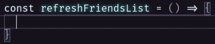
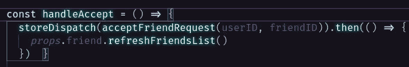
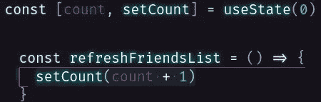
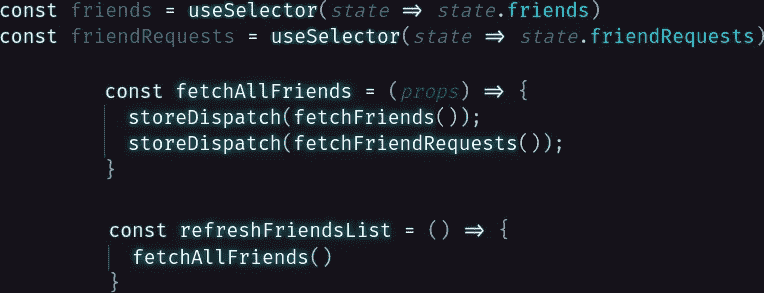
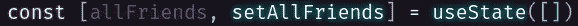
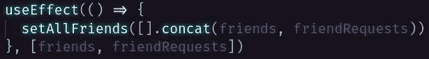
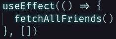

# 如何重新渲染功能性 React 组件

> 原文：<https://javascript.plainenglish.io/re-render-a-functional-react-component-1d64fa9a0c60?source=collection_archive---------6----------------------->

有很多原因你可能希望一个组件被重新渲染，但是没有多少方法可以实现这一点。React 在触发重新渲染时非常严格。我已经提到了为什么直接改变状态在 React 世界里是一个大禁忌，这是其中很大的一部分。

在 React 组件中，每当状态改变时，它都会运行`render()`方法。如果您要直接改变状态，React 将不会识别该更改，因此不会重新渲染。记住，我们谈论的是功能组件。所以，为了使用状态，你必须使用钩子(use state 和/或 useReducer)。如果你不熟悉钩子，看看这里的 React 文档[。](https://reactjs.org/docs/hooks-intro.html)

因此，假设您有一个好友列表，并且刚刚编写完允许用户接受好友请求的所有逻辑。现在，您需要重新呈现该列表，向用户显示包含他们的新朋友的更新版本。在这个例子中，我将使用 useState、useDispatch 和 useReducer 钩子。同样，如果你对这些不熟悉，请点击查看 React 文档[。](https://reactjs.org/docs/hooks-intro.html)

从哪里开始？让我们在好友列表组件中创建一个名为 refreshFriendsList 的回调函数。

好了，现在让我们把它传到我们需要的地方，当我们准备好重新渲染的时候调用它。

acceptFriendRequest 操作返回一个承诺，因此我们能够使用。然后在 storeDispatch (useDispatch hook)上确保在我们的数据库用新信息更新之前，我们没有调用 refreshFriendsList。回到朋友列表。

为了重新渲染，我们需要更新状态。所以，我们暂时只做一个计数器，在调用 refreshFriendsList 时递增值。

太棒了。现在，当后端完成数据库更新后，将调用 refreshFriendsList，count (useState hook)加 1，并重新呈现朋友列表组件。但是，什么都没有改变。那么，为了向用户呈现更新后的朋友列表，需要做些什么呢？

嗯，我认为我们首先需要向后端发出另一个调用来检索更新的朋友列表。然后，我们需要向用户提供更新的信息。

所以，让我们调用 fetchAllFriends 方法。这将从数据库中获取更新的信息，进而更新 friends 和 friendRequests 变量。这里，我使用 useSelector 钩子来订阅我的 Redux store，所有来自后端的信息都存储在这里。欲了解更多关于 Redux 的信息，请点击这里查看文档。

好东西，现在我们在我们的朋友列表组件中有了所有更新的信息。只有一个问题——它不能用更新的信息重新呈现。我们不再更新状态，因此不再重新呈现组件。让我们修理它！

因此，为了触发重新渲染，我们需要更新状态。我们可以使用我们之前构建的计数器，但是我认为不那么武断的东西会更合适。让我们创建一个组合了 friends 和 friendRequests 的状态变量，因为当 Redux 存储更新时，它们会自动更新。

最后要做的就是更新 allFriends。但是哪里是发生这种事情的好地方呢？我们可以把它放在 refreshFriendsList 函数中，但是在执行之前，我们必须等待 fetchAllFriends 返回它的有效载荷。而且一点都不能重复使用。我认为这非常适合使用效果挂钩。让我们放置一个 useEffect 钩子，将 allFriends 设置为一个数组，该数组包含 Friends 和 friendRequest 变量中的所有朋友。

请注意，我将一个数组作为第二个参数传递。这确保了它只在 friends 和/或 friendRequests 发生变化时运行。让我们放置另一个 useEffect 钩子，它在初始化时调用 fetchAllFrieds，并传递一个空数组作为第二个参数，这样它将只运行一次。

厉害！现在，当用户接受好友请求时，数据库被更新，我们获取更新的信息并更新 Redux 存储。当 Redux 存储被更新时，变量 friends 和 friendRequests 也被更新。这触发了我们的 useEffect 钩子，并通过 setAllFriends 更新状态，setall friends 触发了所有更新信息的重新呈现。

这就是重新呈现功能性 react 组件的真实示例。编码快乐！

## *延伸阅读*

 [## 比特博客

### 组件驱动软件的官方博客。围绕现代组件驱动的 web 开发的文章…

比特云](https://bit.cloud/blog/introducing-component-compare-easily-review-component-changes-l4qyxtoo) 

*更多内容请看*[***plain English . io***](https://plainenglish.io/)*。报名参加我们的* [***免费周报***](http://newsletter.plainenglish.io/) *。关注我们关于*[***Twitter***](https://twitter.com/inPlainEngHQ)[***LinkedIn***](https://www.linkedin.com/company/inplainenglish/)*[***YouTube***](https://www.youtube.com/channel/UCtipWUghju290NWcn8jhyAw)***，以及****[***不和***](https://discord.gg/GtDtUAvyhW) *对成长黑客感兴趣？检查* [***电路***](https://circuit.ooo/) ***。*****