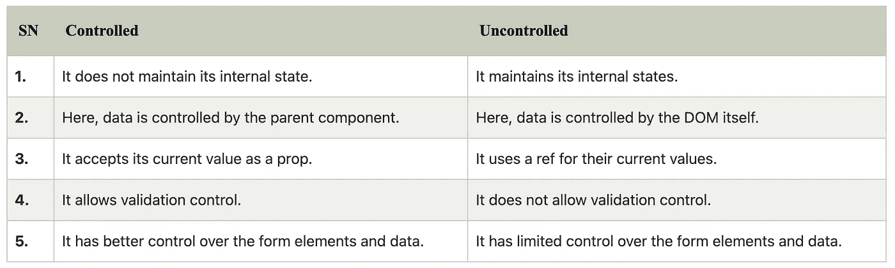

# 反应:关于组件的一切

> 原文：<https://javascript.plainenglish.io/react-all-about-components-35650a02ff50?source=collection_archive---------2----------------------->

## 哑分量、智能分量、纯分量、高阶分量、受控和非受控分量

一个**组件**是 React 的核心构建块之一。换句话说，我们可以说，您将在 React 中开发的每个应用程序都将由称为组件的部分组成。组件使得构建 ui 的任务更加容易。

> "组件可以让你把用户界面分割成独立的、可重用的部分，并且独立地考虑每一部分."


Four components

在这里，我们可以看到一个 UI 被分解成多个单独的部分，称为组件，独立地处理它们，并将它们合并到一个父组件中，这将是您的最终 UI。

现在，让我们研究一下 React 中不同类型的组件:

# 哑/无状态/表示组件

**🦄哑组件关注的是事物的外观。**

*   哑组件也被称为“表示性”组件，因为它们唯一的职责是**向 DOM** 呈现一些东西。一旦完成，组件就完成了。
*   在这个组件中没有任何逻辑，因此它被称为哑组件。因为哑组件**只关注表示(UI 组件)，**是最理想的**可重用组件。**
*   这个组件通常只是 Javascript 函数，并且只有一个 render()方法。它也没有任何状态或生命周期挂钩。但是，它仍然可以通过 props 接收来自父母的一些数据和功能。

**哑元件的共同特征:**

1.  **关注 UI:** 几乎所有的基本 UI 组件都应该被认为是哑组件。示例包括加载器、模态、按钮、输入等。
2.  **接受道具:**哑组件接受道具以允许它们是动态的和可重用的。例如，您可以从父组件发送 props 中的一个按钮的标题，以允许它有一个唯一的名称。

*   **不需要 app 依赖:**除了 UI 包，像`Reactstrap`一样，哑组件不需要依赖。
*   **很少包含状态:**哑组件拥有状态的唯一实例是用于操作 UI 本身，而不是应用程序数据。哑组件可能具有状态的一些例子是按钮组、选项卡、开关和其他不影响数据的 UI 元素，只影响 UI。

让我们看一下我们的登录表单示例。几乎每个组件都可以是可重用的哑组件，包括容器、标题、输入和按钮。


Highlighted Dumb Component

# 智能/有状态/容器组件

🤓**智能组件关注事物如何工作。**

*   另一方面，智能组件(或容器组件)有不同的职责。因为他们肩负着保持聪明的重任，所以他们是跟踪状态并关心应用程序如何工作的人。使用容器设计模式，容器组件从表现组件中分离出来，每个组件处理自己的事情。容器组件完成繁重的工作，并将数据作为道具向下传递给表示组件。
*   容器组件模式是基于类的组件，具有 constructor()函数。我们通常在构造函数内部初始化状态，尽管你可以移除构造函数而仍然有一个状态。

**智能组件的共同特征包括:**

1.  **操纵数据:**智能组件可以获取、捕捉变化并传递应用数据。
2.  **调用 Redux、生命周期方法、API、库等:**这些组件被称为智能是有原因的！他们负责调用库和功能。
3.  **管理状态:**智能组件负责管理状态，知道什么时候重新渲染一个组件。
4.  **很少包含样式:**因为哑组件关注于样式，所以它允许智能组件关注于功能而没有杂乱的样式。

# 纯成分

*   纯组件是优化 React 应用程序的最重要的方法之一。
*   纯组件的使用大大提高了性能，因为它减少了应用程序中渲染操作的数量。

*   所以上面有一个非常简单的 **Welcome 纯组件**的例子。当您在您的父组件中使用它时，您会看到无论父组件何时重新渲染，欢迎组件都不会重新渲染
*   这是因为 PureComponent 改变了生命周期方法 **shouldComponentUpdate** ，并添加了一些逻辑来自动检查组件是否需要重新渲染。这使得 PureComponent 只有在检测到状态或属性的变化时才能调用 render 方法。

# 高阶分量

*   React 中的高阶组件是一种模式，用于**在组件之间共享公共功能，而无需重复代码。**高阶分量实际上不是分量，**它是函数**。特殊函数将组件作为参数，并返回一个组件。它将一个组件转换成另一个组件，并添加额外的数据或功能。简而言之:

```
const NewComponent = (BaseComponent) => {
  // ... create new component from old one and update
  return UpdatedComponent
}
```

*   React 生态系统中您可能熟悉的两个 HOC 实现是 Redux 的`**connect**`、React 路由器的`**withRouter**` **。**Redux 的`connect`函数用于让组件访问 Redux 存储中的全局状态，并将这些值作为道具传递给组件。`withRouter`函数将路由器信息和功能注入到组件中，使开发人员能够访问或更改路由。
*   高阶分量是以分量作为自变量并返回分量的函数。这意味着特设将始终具有类似于以下内容的形式:

*   `higherOrderComponent`是一个将名为`WrappedComponent`的组件作为参数的函数。我们创建了一个名为`HOC`的新组件，它从其`render`函数中返回`<WrappedComponent/>`。虽然在这个简单的例子中，这实际上没有增加任何功能，但是它描述了每个特设函数都将遵循的通用模式。我们可以如下调用特设:

```
const SimpleHOC = higherOrderComponent(MyComponent);
```

让我们看一个简单的例子来容易地理解这个概念是如何工作的。 **MyHOC** 是一个高阶函数，仅用于向 **MyComponent** 传递数据。该函数获取 **MyComponent** ，用 **newData** 对其进行增强，并返回将在屏幕上呈现的增强组件。

如果我们运行这个应用程序，我们会看到数据被传递给了 **MyComponent** 。


## 高阶元件考虑因素

*   特设应该是一个没有副作用的纯功能。它不应该做任何修改，而只是通过将原始组件包装在另一个组件中来组合它。
*   不要在组件的 render 方法中使用 HOC。在组件定义之外访问特设。
*   静态方法必须被复制才能访问它们。一个简单的方法是使用`hoist-non-react-statics`包。
*   引用不通过。

# 受控组件

*   一个受控组件被绑定到一个值，它的变化将通过使用**基于事件的回调**在代码中处理。这里，输入表单元素是由 react 本身而不是 DOM 处理的**。**在这里，可变状态保存在 state 属性中，并且只使用 setState()方法更新。组件内的状态充当由组件呈现的输入元素的*“真实的单一来源】*。
*   受控组件具有控制每次发生 **onChange** 事件时传递给它们的数据的功能。然后将这些数据保存到 state 中，并用 setState()方法进行更新。它使组件能够更好地控制表单元素和数据。

让我用一个简单的例子来解释一下:

该组件非常简单，但它证明了一点:React 负责控制何时以及如何基于`setState`方法的内部逻辑来呈现它。我们不需要担心其他任何事情。

这是编写组件的推荐方式(无论是使用类还是功能组件，只要确保它们是受控组件即可)，主要是因为框架的所有好处都适用于它们。您在 DOM 之上获得了一个抽象层，让您可以与元素进行反应和交互，而不必担心底层的 DOM API 方法。

# 非受控组件

*   它类似于传统的 HTML 表单输入。这里，**表单数据由 DOM 本身**处理。它保持自己的状态，并将在输入值改变时更新。
*   要编写一个不受控制的组件，不需要为每个状态更新编写一个事件处理程序，您可以使用 ref 从 DOM 中访问表单的值。

让我用一个简单的例子来解释一下:

上面的组件做的和前面的例子完全一样，当你，用户，在一个`input`框中输入时，它更新一个`p`元素的内容。没什么特别的，但是你可以看到为了达到同样的结果，我们不得不编写直接访问 DOM 的 API 的代码(例如，我们不得不直接设置目标元素的`innerHTML`属性)。如果你想做的事情需要更多的逻辑，这可能会变得更加复杂，但是你明白了。

> 在大多数情况下，我们建议使用[受控组件](https://reactjs.org/docs/forms.html#controlled-components)来实现表单。在受控组件中，表单数据由 React 组件处理。另一种方法是不受控制的组件，表单数据由 DOM 本身处理。

## 受控组件和非受控组件之间的差异表



## 什么时候应该使用受控组件，什么时候应该使用非受控组件？

基本上，这取决于你和你的用例，例如— **你可以在创建:**时使用受控组件

*   **表单验证**所以你总是需要在输入时知道输入的值，以检查它是否是一个有效的字符。
*   **除非所有字段都有有效数据，否则禁用提交按钮**
*   如果您有特定的格式，如信用卡输入

但是如果你不需要这些，并且认为不受控制对你来说会更简单，那就去做吧。

就是这样！

我希望你今天学到了新东西。感谢阅读！:)

## 进一步阅读

[](https://bit.cloud/blog/composable-link-component-that-works-in-any-react-meta-framework-l7i3qgmw) [## 可在任何 React 元框架中工作的可组合链接组件

### Bit 的链接组件是一个与运行环境无关的组件。您可以将此链接用于…

比特云](https://bit.cloud/blog/composable-link-component-that-works-in-any-react-meta-framework-l7i3qgmw) 

*更多内容看* [***说白了就是 io***](https://plainenglish.io/) *。报名参加我们的* [***免费周报***](http://newsletter.plainenglish.io/) *。关注我们关于* [***推特***](https://twitter.com/inPlainEngHQ) ， [***领英***](https://www.linkedin.com/company/inplainenglish/) *，*[***YouTube***](https://www.youtube.com/channel/UCtipWUghju290NWcn8jhyAw)*[***不和***](https://discord.gg/GtDtUAvyhW) *。对增长黑客感兴趣？检查* [***电路***](https://circuit.ooo/) *。**