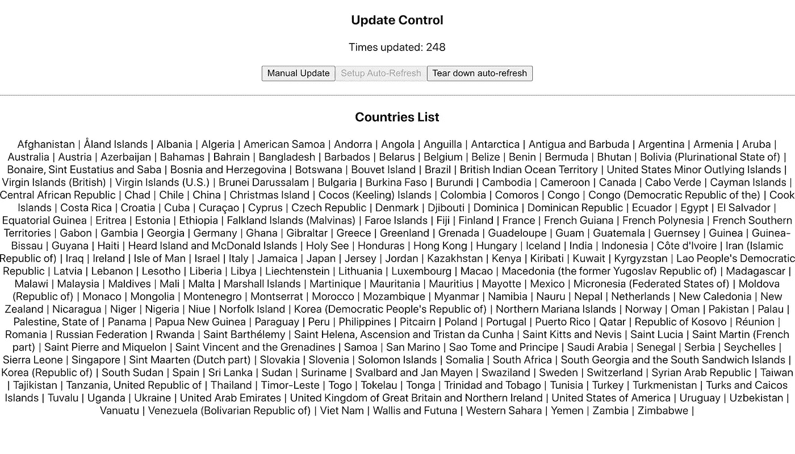

# React 和 MobX 状态树

> 原文：<https://javascript.plainenglish.io/react-and-mobx-state-tree-aa7d569395c2?source=collection_archive---------5----------------------->

## 用这个 Redux 的优秀替代品构建一个简单的应用程序


在过去的 6 年里，React 一直是我开发 web 界面的首选解决方案。它的概念很容易掌握，我也喜欢它允许我围绕它构建自己的堆栈，以构建我需要专门适应每个用例的前端接口。

然而，这种灵活性是有代价的——应用程序的每个方面都有太多的选择，不可能开始尝试所有的选择来找出最适合网站的技术。

# React 的状态管理解决方案

如今，前端 web 应用程序的行为更像桌面应用程序，而不是老式的学校应用程序。状态保存在浏览器上运行的代码内的变量中。随着 React 和 Angular 框架支持的单页面应用程序的出现，全局状态管理变得越来越重要。此外，前端应用程序变得越来越大，久而久之和行业继续前进。拥有用户偏好、站点范围内的选择和一个反应式的用户界面变得必不可少。很少有什么比状态管理的选择对您的项目有更大的影响。

在过去 5 年左右的时间里，Redux(2013 年开发)已经成为考虑状态管理系统时事实上的标准。它改变了 React 应用程序的开发方式(尽管它与框架无关)。它允许将 React 应用程序扩展到以前无法管理的水平，因为它的状态管理和 props 在前端应用程序的不同位置的组件之间传递非常复杂。

它的大规模采用已经变得如此广泛，以至于许多人不知道他们为什么要使用它，并且不良做法到处都是。以至于 Redux 的创建者正式发表了一篇博客文章，解释说 [Redux 不是万能药](https://medium.com/@dan_abramov/you-might-not-need-redux-be46360cf367)，你可能最终并不需要它。

…而且我不得不承认:我不会说我很喜欢 Redux。我仍然在许多项目中使用它——我喜欢它与 React 及其挂钩的集成方式。但是，还有其他选择，如:

*   [Mobx](https://mobx.js.org/README.html) 及其衍生产品 [MobX-state-tree](https://mobx-state-tree.js.org/)
*   [反冲](https://recoiljs.org/)
*   [秋田](https://hookstate.js.org/)
*   [Vanilla React 上下文 API](https://reactjs.org/docs/context.html)

我肯定我忘了一些东西。我也不会告诉你我已经全部用完了。但我广泛使用过 Mobx 和 Mobx-state tree，让我惊讶的是，它们并没有比现在更受欢迎。

## 为什么是 Mobx-state-tree？

MobX-state-tree 是一个基于 MobX 的自以为是的状态管理框架。实际上，这可能是所有备选方案中最固执己见的一个，不一定是坏的。

就个人而言，我使用 mobx-state-tree 主要是因为我想:

*   知道处理状态的代码在哪里——这对我来说非常重要，这让我对 Redux 非常恼火，因为状态代码被分割在 reducers、action creators 等之中。有了 MobX 状态树( **MST 从现在开始**)，你的代码简洁明了，在一个地方。
*   代码是可预测的和清晰的。使用 MST，您将永远不会考虑如何构建您的模型，或者如何构建您的模型来更新您的用户界面。MST 使用自己的数据类型，迫使您创建数据结构树。
*   它是强类型的。即使使用 Javascript，模型保存的数据也要进行类型检查。Typescript 集成也很容易。

## Mobx 和 Mobx 状态树的区别

*   MST 很固执己见。它迫使你以一种特殊的方式构建你的模型，并使用库的概念来使用它们。这是我更喜欢 MST 而不是普通 Mobx 的一个原因，但我明白这是个人偏好。
*   即使使用普通的 Javascript，MST 也会对模型的属性进行类型检查，而普通的 Mobx 则不会。这可能会有一点性能损失(尽管我没有任何具体的数据来支持这一点，也没有看到任何类似的指标)
*   MST 的设计围绕着一个包含子模型的集中模型。您在组件中使用这些子模型。在某种程度上，这更像是 Redux 的集中式存储方式。Mobx 没有任何这样的限制，您可以创建任意数量的存储，并在任意位置使用它们。

# 一个简单的应用

让我们构建一个简单的应用程序来完成这些事情:

*   使用 https://restcountries.eu/的[API 来检索可用国家的列表，并显示它们。这将给出如何使用 MST 执行异步操作的想法。](https://restcountries.eu/rest/v2/all)
*   每 60 秒刷新一次列表。这将允许我们检查如何使用可变变量。
*   该列表将通过按下按钮或设置时间间隔来手动刷新，这可以通过用户输入来无效。

为了构造我们的简单应用程序，我们将使用 Typescript。我们也不会投资任何时间来格式化/使我们的应用程序更漂亮。我们示例的唯一目的是展示 MST 在 React 应用程序中的用法。

让我们从设置存储的代码开始，该存储将保存所有的变量。

## 应用脚手架

我们将开始使用一个简单的 Create React App 脚手架应用程序，[设置为使用 typescript](https://create-react-app.dev/docs/adding-typescript/) ，

```
npx create-react-app my-app --template typescript# oryarn create react-app my-app --template typescript
```

然后，我们需要添加一些开发应用程序其余部分所需的组件:

```
npm install --save axios mobx-react-lite mobx mobx-state-tree
# or
yarn add axios mobx-react-lite mobx mobx-state-tree
```

## 设置商店

下面的模型将描述每个国家的项目。注意，RESTCountries 提供的完整 API 中有更多的变量，但是为了清楚起见，我决定不包括它们。

```
*interface Country* {
  name: *string*;
  alpha2Code: *string*;
  alpha3Code: *string*;
  callingCodes: *string*[];
  capital: *string*;
  region: *string*;
  population: *number*;
  area: *number*;
  gini: *number*;
  borders: *string*[];

  currencies: *Array*<{
    code: *string*;
    name: *string*;
    symbol: *string*;
  }>;
}
```

我们将创建两个 MST 商店，一个保存国家，另一个保存国家的商店(根商店)。一般来说，预计会将 MST 模型嵌入到其他模型中，并使用一个 RootStore，这就是我们在这里要做的事情(尽管对于这样一个小练习来说可能有点不必要)。

```
*const* CountryStore = types.model({
  countries: types.array(types.frozen<*Country*>()),
});

*export const* RootStore = types.model({
  countryStore: CountryStore,
});
```

我们在这里使用`types.frozen`,作为保存 API 响应的一种方式。`frozen`意在保存一个**可串行化**且**不可变**的值。对于这个例子，我们将这样对待它——因为我们不会改变响应的任何部分，但是响应确实是一个由普通值组成的 JSON 对象(因此是可序列化的)。

```
*export function initializeStore*() {
  _store = RootStore.create({
    countryStore: { countries: [] },
  });
  *return* _store;
}
```

我们打算将`RootStore`从应用程序的根元素传递给应用程序的所有其他元素。为此，我们将使用 React 的`Provider` API。

```
*const* RootStoreContext = *createContext*<*null* | *RootInstance*>(*null*);
*export const* Provider = RootStoreContext.Provider;
```

然后，我们将能够通过`useContext`将它注入任何我们想要使用的元素中。让我们编写一个方法来安全地检索它(检查存储是否已经正确初始化。

```
*export function useStore*(): *Instance*<*typeof* RootStore> {
  *const* store = *useContext*(RootStoreContext);
  *if* (store === *null*) {
    *throw new* Error("Store cannot be null, please add a context provider");
  }
  *return* store;
}
```

`store.ts`初始版本的完整代码如下:

我们现在希望初始化存储，并将其注入到我们的应用程序中，以便以后从任何组件中检索它。

在我们的`App.ts`里面:

```
*const* store = *initializeStore*();

*function App*() {
  *return* (
    <Provider *value*={store}>
      <div *className*="App">
        <CountriesList />
      </div>
    </Provider>
  );
}

*export default App*;
```

注意 CountriesList 在类中的用法。这是一个组件，它将显示国家/地区列表，并将咨询`Store`来完成此操作。

每个需要使用商店属性向 UI 填充数据的组件都需要是一个`observer`。为了使它成为一个观察器，我们需要从`mobx-react-lite`导入观察器的高阶组件。现在，我们可以使用我们在 store.ts 文件中创建的`useStore`方法来获取我们商店的实例。记住，存储是通过使用 React 的`Provider` API 传递给任何组件的。然后，我们可以正常地使用商店的属性，就好像它是任何其他可观察的对象一样。

您可能想知道我们在组件内部使用的这个`countryStore.refreshCountries()`是什么。这是一个检索数据的操作。稍后会有更多的介绍。

我们运行应用程序，现在可以看到一个空白页面。这是正确的，我们尚未检索到任何数据。

## 用数据填充我们的列表

我们现在需要做的是用从提要中检索到的数据填充我们的 CountriesStore。我们将使用 Axios 执行查询，并从`restcountries.eu`网站检索数据。还记得我们之前谈到的这个`countryStore.refreshCountries()`吗？是时候为它写一些代码了，这样我们就可以在我们的组件中使用它。

我们将需要执行一个异步操作来检索数据并将它们存储在我们的`CountriesStore`中。请记住，在 MST 中，不能从任何地方更改模型的属性。MST 固执己见的本质迫使我们从一个`actions`方法内部改变状态。`actions’` argument 是一个回调函数，它将一个参数传递给调用者(姑且称之为`self`)，调用者实际上是一个具有商店的**可变**属性的对象。所以我们可以在没有 MST 抱怨的情况下做`self.countries=…`。

此外，当我们需要处理一个异步操作时，我们需要在编写我们的操作时格外注意。Mobx 在文档中解释了原因。

[](https://mobx-state-tree.js.org/concepts/async-actions) [## 异步操作 MobX 状态树

### egghead.io 第 12 课:使用 egghead.io 上托管的流定义异步流程

mobx-state-tree.js.org](https://mobx-state-tree.js.org/concepts/async-actions) 

要点如下:如果您想对 MST 模型的属性进行修改，您有以下几种选择:

*   使用良好的旧承诺，并调用单独的操作来设置模型属性的新值。
*   使用发电机模拟`async-await`操作的使用。

我们将选择后者，因为这将保持代码简洁。除非有特殊的技术原因要遵循方法 1，否则我总是选择使用用`flow` HOC 包装的生成器函数

```
*export const* CountryStore = types
  .model({
    countries: types.array(types.frozen<*Country*>())
  })
  .actions((self) => {
    *const* refreshCountries = *flow*(*function** () {
      console.log("refreshing countries...")
      *const* response: *Country*[] = *yield* axios
        .get("https://restcountries.eu/rest/v2/all")
        .then((value) => value.data);

      self.countries = *cast*(response);
    });

    *return* { refreshCountries };
  });
```

注意`actions`内部的代码，注意`refreshCountries`是一个用`flow`高阶函数包装的生成器函数。另外，请注意`yield`的行为类似于`await`关键字并接受`Promise`，有效地允许我们在模型的动作中执行任何异步操作。

如果我们在浏览器中点击“刷新”,我们应该会看到列表已被填充。我们的组件绘制了一个由 REST API 异步检索的简单而难看的国家名称列表。


我们可以停在这里。然而，我还想介绍 MST 的另一个方面，因为它对我来说是一个不小的发现。

## 在商店中添加自动刷新

让我们在我们的小应用程序中添加一个特性和一个新部分，它将具有以下特性:

*   显示代表我们调用 REST API 刷新国家列表的次数的计数。
*   Allow 是设置和拆除一个计时器，它将每 X 秒自动刷新一次列表。

存储我们需要的数据的方法并不像听起来那么简单。我们需要存储一个`intervalId`，这样我们就可以使用`setInterval`来设置或取消它。我们不会把它和我们的其他财产放在一起，因为这不是一个可观察的价值。这是一个不稳定的值。MST 在文档中介绍了这个概念[。](https://mobx-state-tree.js.org/concepts/volatiles)

`actions`可以被链接，这是添加一些控制自己状态的动作和一些我们不希望其他人访问的私有值的完美方式。

首先，让我们给`CountryStore`添加一个新属性来测量我们的列表被刷新了多少次，以及自动刷新的计时器当前是否处于活动状态。

```
*export const* CountryStore = types
  .model({
    countries: types.array(types.frozen<*Country*>()),
    **timesRefreshed: types.number**,
    **autoRefreshActive: types.boolean**,
  }
```

然后，让我们添加另一个`actions`部分，将设置和拆除自动刷新。

注意`timeIntervalId`的用法。它保存了 Javascript 计时器的时间间隔 ID。我们选择让这个变量作为局部作用域存在于`actions`部分，因为它是不可见的，我们希望它是私有的。在 MST 术语中，这也称为“局部变量”。

我们还需要更新我们的`refreshCountries`方法，以便在每次刷新时递增`timesRefreshed`计数器。

```
*const* refreshCountries = *flow*(*function** () {
  *const* response: *Country*[] = *yield* axios
    .get("https://restcountries.eu/rest/v2/all")
    .then((value) => value.data);
  self.countries = *cast*(response);
  **self.timesRefreshed += 1;**
});
```

现在，让我们添加一个名为`ListRefreshControl`的新组件，它的职责是管理国家列表的刷新，并为此设置/拆除计时器。

最后，让我们更新我们的`App`组件来适应这个新组件。

## 让我们运行应用程序。

是时候运行应用程序了。在你的浏览器中访问`localhost:3000`，你会看到下图。



按下“手动更新”按钮将刷新国家列表，并增加页面顶部的“更新次数”计数器。如果您按下“设置自动刷新”按钮，它将被禁用，计时器将开始计时。该列表将每 10 秒自动更新一次。按下“拆除自动刷新”按钮将使计时器无效，自动刷新将停止。

## 完整商店. ts

为了方便起见，这里是 store.ts 文件的源代码，包含了**我们讲过的一切**。

# 结论

MobX-state-tree 是 Redux 的一个优秀的自以为是的替代方案，它提供了良好的类型脚本支持、Javascript 的类型检查、简洁性以及与 React 的良好集成。我发现自己越来越频繁地使用它，它帮助我大大减少了代码库的大小，同时仍然拥有开发全功能应用程序所需的所有功能。

我个人认为它甚至比普通的 mobx 更有吸引力，mobx 在构建代码库和存储变量方面的自由选择意味着没有普遍接受的方式来做所有这些事情。

我建议你自己尝试一下，看看它是否适合你的项目。

参考资料:

*   [Mobx](https://mobx.js.org/README.html)
*   [Mobx 状态树](https://mobx-state-tree.js.org/)
*   [还原](https://redux.js.org/)
*   你可能不需要 redux
*   [React 上下文 API](https://reactjs.org/docs/context.html)