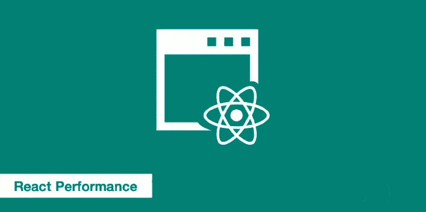
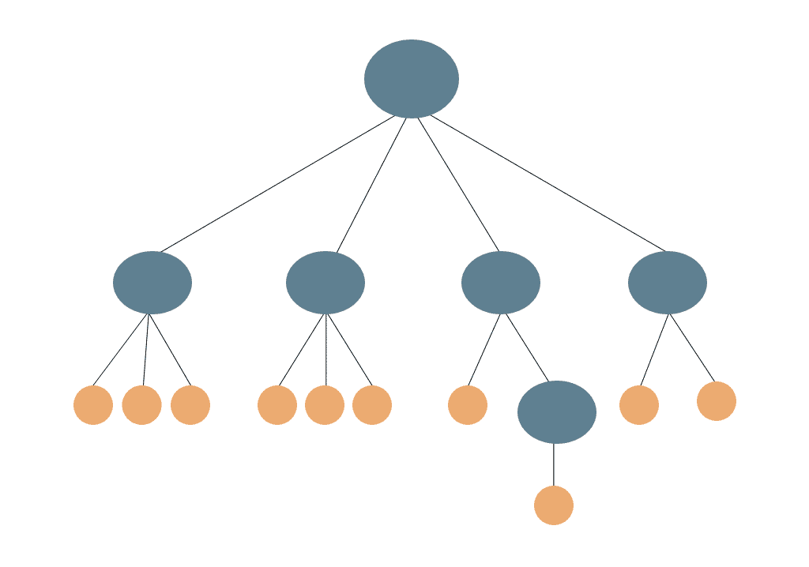
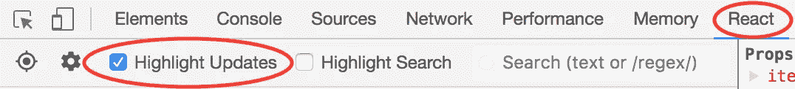
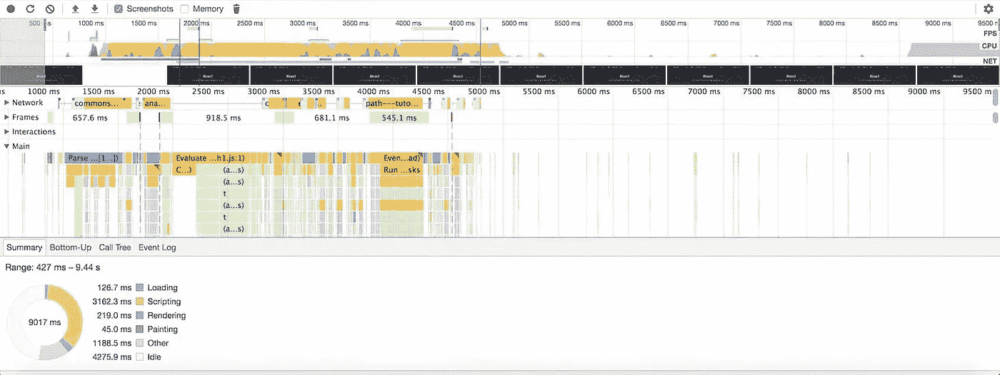

# React 应用性能优化:权威指南

> 原文：<https://javascript.plainenglish.io/react-app-performance-optimization-the-definitive-guide-9b658be3b6e4?source=collection_archive---------1----------------------->

## 提高 React 应用速度的技巧



# React 中的 UI 是如何渲染的？

在 React 中，您的 UI 是通过更新一个叫做 DOM(文档对象模型)的东西来呈现的。用基本的外行话来说，DOM 类似于对象和节点的树状结构。

然而，在 React 中，HTML 不是 DOM 的根节点。事实上，它只是 Javascript 原型链中的一个节点，因此它可以获得计算样式、属性或操作单个节点的函数。

简单来说，React 中的 DOM 是一个标准，它定义了如何获取、更新或操作 HTML 元素。

React DOM 知道如何呈现页面，但是跟踪每个正在更新的节点和组件就不那么智能了。

因此，假设您的 SPA(单页应用程序)上有一个 10 项的列表，当您的用户与 UI 交互时，您必须更新其中的一项。使用 DOM，您将最终更新所有组件，因为整个列表将被重新呈现。

这就是虚拟 DOM 概念发挥作用的地方。虚拟 DOM 是 HTML DOM 的本地副本。

让我们回到我们的列表示例，看看虚拟 DOM 将如何让 React 呈现 UI。

当用户与 UI 交互时，React 将以虚拟 DOM 的形式创建一个副本，并在将真实 DOM 与虚拟 DOM 进行比较后更新 UI。这样，需要更新的项目将在不影响其他项目的情况下进行更新。

# 虚拟 DOM 有什么不好？

在上一节中，您已经了解了虚拟 DOM 的优点。

现在，让我们熟悉一下虚拟 DOM 的缺点，它是 React 中许多性能问题的罪魁祸首。

React 利用了一个 **diff 算法**来最小化节点上的操作。然而，算法本身并不完美。

例如，让我们看看下面给出的 GIF，它类似于一个 react DOM 树。假设黄色节点的值已经改变，需要更新。



正如您在上面看到的，React 继续渲染整个子树，而不是渲染相关的组件。当这些不必要的渲染在 React 应用程序中闲置时，它们会耗尽不必要的 CPU 和内存资源，这对 React 应用程序来说是致命的。这就是为什么他们被称为**浪费渲染**。

谈到虚拟世界，Reactjs 中大约一半的性能相关问题源于:

*   **不更新 DOM 的组件**中的冗余处理
*   **Diff 算法** **不断更新不需要更新的叶节点**
*   **由于 Diff 算法更新组件，CPU 计算量很大**

# 加快反应速度的工具

## 1.你为什么更新

`[why-did-you-update](https://github.com/maicki/why-did-you-update)`函数**检测不必要的组件渲染**。具体来说，它指出了组件的 render 方法被调用的情况，即使没有发生任何变化。您可以通过简单的 npm 安装来设置它:

```
npm install --save why-did-you-update
```

接下来，在您的应用程序代码中包含以下代码片段:

```
import React from 'react'if (process.env.NODE_ENV !== 'production') {
    const {whyDidYouUpdate} = require('why-did-you-update')
    whyDidYouUpdate(React)
}
```

确保在您的最终版本中禁用这个特性，这样它就不会降低用户端的速度。

## 2.React 开发人员工具

Chrome 的 [React 开发者工具](https://chrome.google.com/webstore/detail/react-developer-tools/fmkadmapgofadopljbjfkapdkoienihi?hl=en)扩展可以突出显示组件更新，进一步帮助你**识别不必要的渲染周期**。安装完扩展后，通过选择 Chrome DevTools 中的 React 选项卡打开它，然后选中“高亮显示更新”框。



当您处理项目时，重新渲染组件现在应该以蓝色、绿色、黄色或红色高亮显示。较冷的颜色表示更新最不频繁的组件，而色谱中较暖的一侧表示更新更频繁。

因此，你应该会看到很多黄色和红色的 UI 元素，比如滑块。但是，如果单击一个按钮会让您看到红色，那么您可能正在进行一些不必要的渲染。

## 3.Chrome DevTools 性能时间表

如果您使用的是 **React 15.4.0 或更高版本**，那么可以利用 Chrome 的性能时间线来精确定位组件的安装、更新和卸载时间。



此外，您可以可视化组件的生命周期，并将它们相互比较。由于该功能依赖于用户定时 API，因此只能在 Chrome、Edge 和 Internet Explorer 中使用。

现在我们知道了 react 中的工具和故障性能的根本原因，让我们了解如何优化 React 应用程序的性能。

# 1.实现 shouldComponentUpdate 以防止不必要的呈现

移动应用程序中大多数与性能相关的问题往往通过实现较小的更改来解决，但这些更改足以使您的应用程序更快。

其中一个看起来很小但是能够为你的 React 应用提供足够可测量和可感知的性能提升的变化是 **shouldComponentUpdate 方法**。

顾名思义，shouldComponentUpdate 是一个 react 生命周期挂钩，使用它您可以指示 React to **避免重新呈现一个给定的组件，如果它的状态没有改变**。

React 开发者工具扩展有一个“高亮更新”选项，我们用它来发现导致渲染浪费的组件。

假设您有一个由许多具有复杂嵌套结构的组件组成的列表，并且列表中的一项发生了变化。你的应用程序从列表中呈现不必要的组件是对资源的浪费。通过实现 shouldComponentUpdate，您基本上可以告诉 React 忽略除了发生变化的组件之外的所有组件。

# 2.由于使用 PureComponent 进行不必要的渲染，提高了性能

如果使用 shouldComponentUpdate 没有获得任何性能提升，那么您也可以尝试使用**纯组件**，它是 React 组件类的更高性能版本。纯组件的使用大大提高了性能，因为它**减少了应用程序中渲染操作的数量**。

Pure component 与 React 中的 component 类完全相似，除了它**自动为您处理 shouldComponentUpdate 方法**之外。

# 3.通过代码分割进一步优化应用加载时间

如果你想让你的用户更快地加载网页，那么你只加载用户需要的代码是很有意义的。

尤其是在单页应用程序(SPA)的情况下，当您希望您的用户查看登录页面时，没有什么特别的理由要加载组成管理面板的代码。有道理，对吧？？

这就是代码分割发挥作用的地方。**对你的应用进行代码拆分可以帮助你“延迟加载”用户当前需要的东西，这可以极大地提高你的应用的性能。**

通过利用代码分割技术，将 Javascript 包分成三个不同的类别，Pinterest 将它们的包大小从 650KB 降低到 150KB。在 Pinterest 的案例中，代码拆分不仅减少了包的大小，还将应用程序的加载时间从 23 秒缩短到了 6.5 秒。

> 如果你正在使用 webpack，你可以通过使用[**CommonsChunkPlugin**](https://webpack.js.org/plugins/commons-chunk-plugin/)将你的代码分割成多个文件。
> 
> 如果您不喜欢使用 web-pack，那么您可以使用[**react loadable**](https://github.com/jamiebuilds/react-loadable)库来拆分您的捆绑代码，以便延迟加载。

# 4.用 SSR 反应性能

React 是构建单页面应用程序(SPA)的一个不可思议的框架。然而，由于它是一个客户端框架，我们在构建应用程序时可能会遇到以下性能问题:

*   糟糕的搜索引擎优化:由于 Javascript 相关的内容是在客户端呈现的，雅虎、百度和必应等搜索引擎将无法对它们进行索引，因为它们只能看到与负面搜索引擎优化相关的空白页面。
*   **应用加载时间慢:**应用初始加载时，浏览器中没有 JavaScript 的缓存。如果应用程序很大，最初加载应用程序所花费的时间也会很长。

[ **注意:** [谷歌机器人现在能够在某些情况下渲染 Javascript](https://webmasters.googleblog.com/2017/12/rendering-ajax-crawling-pages.html) 。也就是说，如果你不担心雅虎、必应、百度、duckduckgo 等其他搜索引擎的 SEO。，您的水疗中心不需要优化任何东西，也不会有问题]

然而，如果你真的关心谷歌以外的搜索引擎的搜索引擎优化，那么使用服务器端渲染并构建一个同构的 React 应用程序是很有意义的。

在服务器端呈现中，JavaScript 相关内容最初是从服务器呈现的。在初始渲染发生后，客户端脚本接管，它像普通 SPA 一样工作。

但是在 React 中实现 SSR 会带来很多代码复杂性，考虑到 Node.js 等优秀服务器的需求，设置它的成本是巨大的。

然而，如果你真的想提高你的应用程序的加载速度，那么你可以用 Next.js 实现 **SSR，这将节省你为 SSR 设置服务器的大量时间。**

# 5.通过延迟加载图像来缩短应用程序的加载时间

在前面的章节中，我谈到了只加载必要的代码，这大大提高了应用程序的加载速度。但是，图像呢？

图像是最重要的资源，你的用户可能永远不会看到，直到一个网页完全加载。由于以下原因，它们可能会降低 React 应用程序的性能:

*   **数据浪费:**加载图像不一定会导致数据的大量使用，考虑到你的用户不能正确地看到它们，这完全是一种浪费。
*   **设备资源和电池的不必要消耗:**从服务器下载图像后，浏览器必须对其进行解码，并将内容呈现到 UI，这需要大量消耗设备资源和电池。

为了缩短应用程序加载时间，一个经验法则是在需要的时候加载图片，而不是在应用程序页面加载的时候加载。这被称为**图像的延迟加载**。

Pinterest 在其渐进式网络应用程序中使用渐进式延迟加载技术来加载图像。

Pinterest 最初在页面加载时使用了占位符。图像在初始加载时看起来很模糊，但一旦页面完全加载，图像就会完全加载。

> React app 中图片的延迟加载可以通过使用 [**React Lazyload 库来实现。**](https://github.com/jasonslyvia/react-lazyload)

# 6.使用 React 虚拟化列表优化列表呈现

列表和网格视图是 React 应用程序中显示数据的常见模式。当 React 中有一个很大的列表(比如 1000 多个条目)时，应该在滚动时呈现元素，在快速向下滚动到 1000 个条目后，您的 UI 可能会有一点滞后。

这里，**虚拟渲染**开始发挥作用。它让你只渲染 30 个组件，而不是渲染所有的组件。或者 40 岁或者 10 岁。无论数量多少，在一天结束时，您将呈现组件的一个小的子集。这给了你一个很大的性能提升。

> [**React 虚拟化列表**](https://github.com/bvaughn/react-virtualized) 是一个考虑了虚拟渲染技术的库。每当你觉得你的 UI 由于大量的数据列表而滞后时，你可以使用 React 虚拟化列表来提高它的性能。

# 7.通过为组件使用正确的键来优化反应列表性能

React 使用**键属性**来决定哪些元素可以在下一个渲染阶段重用。这些键对于更新动态列表中的元素非常重要。

React 通过比较新元素的键和前一个元素的键来进行更新。在这个过程中，它还可能呈现具有新键的组件，并取消呈现具有不再使用的键的组件。

我发现大多数开发人员在呈现列表时错误地将项目的索引假定为键，这就是他们遇到性能问题的原因，例如:

*   列表中不必要的重新呈现
*   不必要的错误，可能会使用户界面在滚动时没有反应

使用列表中的关键属性有助于保持列表的一致性。顺便提一下，一定要记住您的键值**对于列表**中的每个组件都应该是唯一的。

从今以后，在 React 中实现 list 时要明智地使用 key={ }。

# 8.为基于 React 的 PWA 识别有问题的包

优化 React 应用包大小的第一步是识别生产构建中有问题的代码块。

如果您在 React 中使用 webpack 进行简单的捆绑，那么您可以使用 [Webpack 捆绑包分析器插件](https://www.npmjs.com/package/webpack-bundle-analyzer)来分析您的构建依赖关系。

在 Webpack bundle analyzer 插件的帮助下，Pinterest 能够识别出他们构建中的大量重复代码。他们将重复的代码从异步程序块转移到主程序块，这将所有延迟加载程序块的大小减少了 90 %。

下面提到了一些更优秀的 Webpack 插件，它们可能有助于您评估构建中有问题的代码块:

*   [压缩-网络包-插件](https://github.com/webpack/compression-webpack-plugin)
*   [丑陋的 js 插件](https://www.npmjs.com/package/uglifyjs-webpack-plugin)
*   [忽略插件](https://webpack.js.org/plugins/ignore-plugin/)

[ **注意:**在使用上述插件之前，请确保对它们进行评估，以便您可以提前了解使用情况]

# 9.更好的摇树

树抖动是**从包**中移除未使用的或死代码的过程。当使用像 Lodash 这样的实用程序库时，这一点尤其重要，因为您不需要导入库的所有特性。

术语“树摇动”来自于你的应用程序的心理模型和它作为树状结构的依赖关系。树中的每个节点代表一个为应用程序提供不同功能的依赖项。在现代应用中，这些依赖关系是通过[静态](https://developer.mozilla.org/en-US/docs/Web/JavaScript/Reference/Statements/import) `[import](https://developer.mozilla.org/en-US/docs/Web/JavaScript/Reference/Statements/import)` [语句](https://developer.mozilla.org/en-US/docs/Web/JavaScript/Reference/Statements/import)引入的，如下所示:

```
// Import all the array utilities!
import arrayUtils from "array-utils";
```

通过利用我们如何使用静态`import`语句来拉入 ES6 模块的特定部分，树抖动解决了大量[未使用的 JavaScript](https://developers.google.com/web/updates/2018/05/lighthouse#unused_javascript) :

```
// Import only some of the utilities!
import { unique, implode, explode } from "array-utils";
```

这个`import`例子和前一个例子的不同之处在于，它不是从`"array-utils"`模块导入*所有的东西*(这可能是很多东西！)，这个例子只导入它的特定部分。在开发版本中，这并不会真正改变什么，因为整个模块都会被导入。然而，在生产版本中，我们可以配置 webpack 从没有明确导入的 ES6 模块中“摆脱”`[export](https://developer.mozilla.org/en-US/docs/web/javascript/reference/statements/export)` [s](https://developer.mozilla.org/en-US/docs/web/javascript/reference/statements/export) ，使得生产版本更小。

# 10.预加载和预取**资源**

**预加载您有高置信度的资源将在当前页面上使用。预取可能用于跨多个导航边界的未来导航的资源。**

预加载是对浏览器的早期获取指令，以请求页面所需的资源*(关键脚本、网络字体、英雄图像)。指定`as`属性很重要——它有助于浏览器合理安排下载的优先级和时间。*

```
*<link rel="preload" href="comic-sans.woff2" as="font" />*
```

*`as`可以是你可以在浏览器中下载的任何东西:`style`用于样式表，`script`用于脚本，`font`用于字体，`fetch`用于通过`fetch()`或`XMLHttpRequest.`下载的资源*

*预取服务于一个稍微不同的用例——用户的未来导航(例如在视图或页面之间),其中获取的资源和请求需要跨导航保持。预取是一种通知浏览器可能被请求的资源并在需要之前获取它们的方式。*

*一旦加载了当前页面所需的资源，并且当浏览器处于空闲状态时，就会执行此操作。对于服务器端渲染的应用，Node.js 中支持 HTTP/2 Push API。*

```
*<link rel="prefetch" href="/style.css" as="style" />*
```

*指定`as`属性很重要——它有助于浏览器正确地安排下载的优先级和时间。如果页面 A 发起对页面 B 所需的关键资源的预取请求，则关键资源和导航请求可以并行完成。如果我们在这个用例中使用 preload，它会在页面 A 的 unload 中被立即取消。*

*在预加载和预取之间，我们得到为当前导航或未来导航加载关键资源的解决方案。*

# *11.使用记忆*

*记忆化是一个允许我们缓存递归/昂贵的函数调用的值的过程，以便下次用相同的参数调用函数时，返回缓存的值，而不必重新计算函数。*

*这确保了我们的应用程序运行得更快，因为我们通过返回一个已经存储在内存中的值来避免重新执行函数所花费的时间。*

## *为什么在 React 中使用记忆？*

*在 React 功能组件中，当组件中的道具改变时，默认情况下整个组件会重新渲染。换句话说，如果组件中的任何值更新，整个组件将重新呈现，包括其值/属性没有改变的函数/组件。
在 React 中记忆的方法:*

*   *是一个高阶组件，我们可以用它来包装那些我们不想重新渲染的组件，除非其中的道具发生了变化*

```
*const MyComponent = React.memo(function MyComponent(props) {
  /* render using props */
}); export function Movie({ title, releaseDate }) {
  return (
    <div>
      <div>Movie title: {title}</div>
      <div>Release date: {releaseDate}</div>
    </div>
  );
}

export const MemoizedMovie = React.memo(Movie);*
```

*   *`useMemo()`是一个 React 钩子，我们可以用它来包装组件中的函数。我们可以利用这一点来确保只有当其中一个依赖项发生变化时，才重新计算该函数中的值*

```
*const memoizedValue = React.useMemo(() => computeExpensiveValue(a, b), [a, b]);*
```

# *结论*

*微调 React 应用程序的关键可能在于确保组件只在绝对需要时更新。不言而喻，但是一定要把性能优化作为一个常规的优先事项，尤其是当你对你的应用程序进行重大修改的时候。不要忘记在做出改变之前和之后运行基准来跟踪你的进展。*

*我们已经介绍了大多数加速和优化 React 应用程序性能的技术。我希望你已经发现这是有用的。*

*感谢您的阅读:)*

## *进一步阅读*

*[](/5-tools-practices-to-help-you-develop-faster-in-react-b884c1b20fc2) [## 帮助您在 React 中更快开发的 5 种工具和实践

### React 工具、技巧和最佳实践将帮助您更快地构建应用

javascript.plainenglish.io](/5-tools-practices-to-help-you-develop-faster-in-react-b884c1b20fc2) 

*更多内容请看*[***plain English . io***](https://plainenglish.io/)*。报名参加我们的* [***免费周报***](http://newsletter.plainenglish.io/) *。关注我们关于*[***Twitter***](https://twitter.com/inPlainEngHQ)[***LinkedIn***](https://www.linkedin.com/company/inplainenglish/)*[***YouTube***](https://www.youtube.com/channel/UCtipWUghju290NWcn8jhyAw)*[***不和***](https://discord.gg/GtDtUAvyhW) *。****