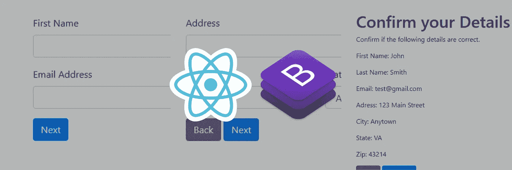
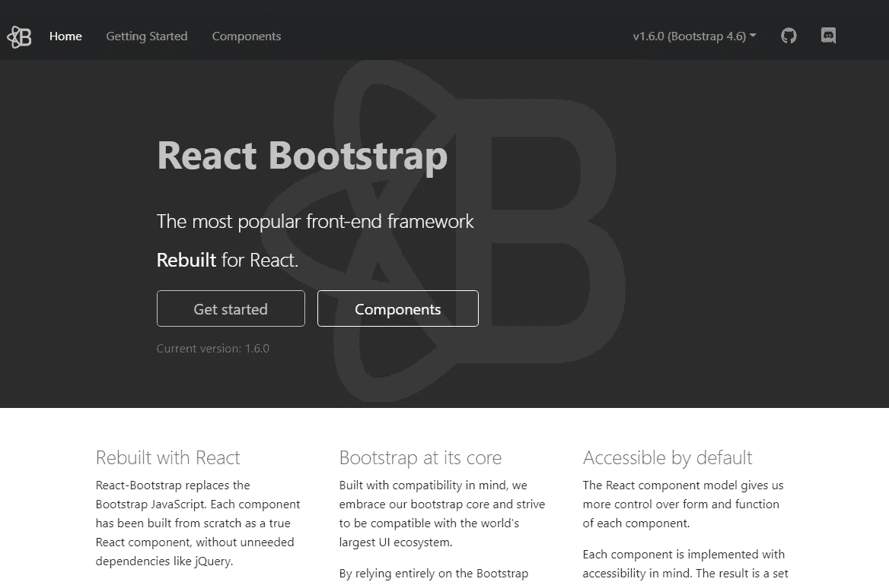
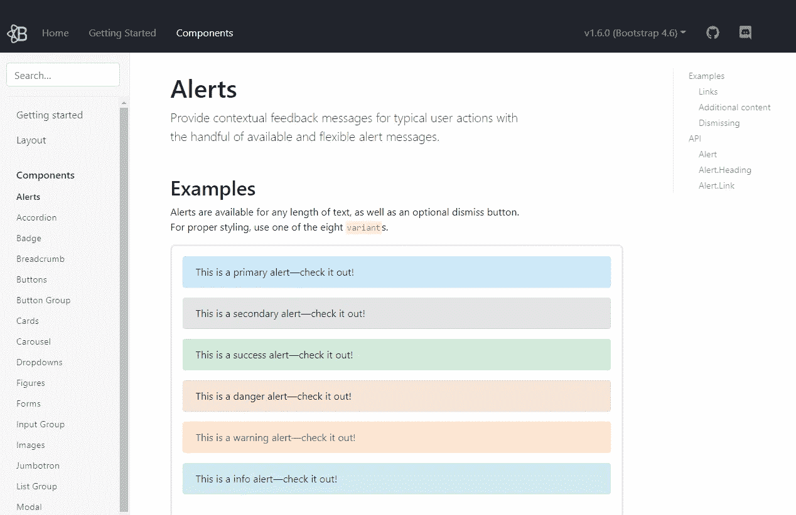
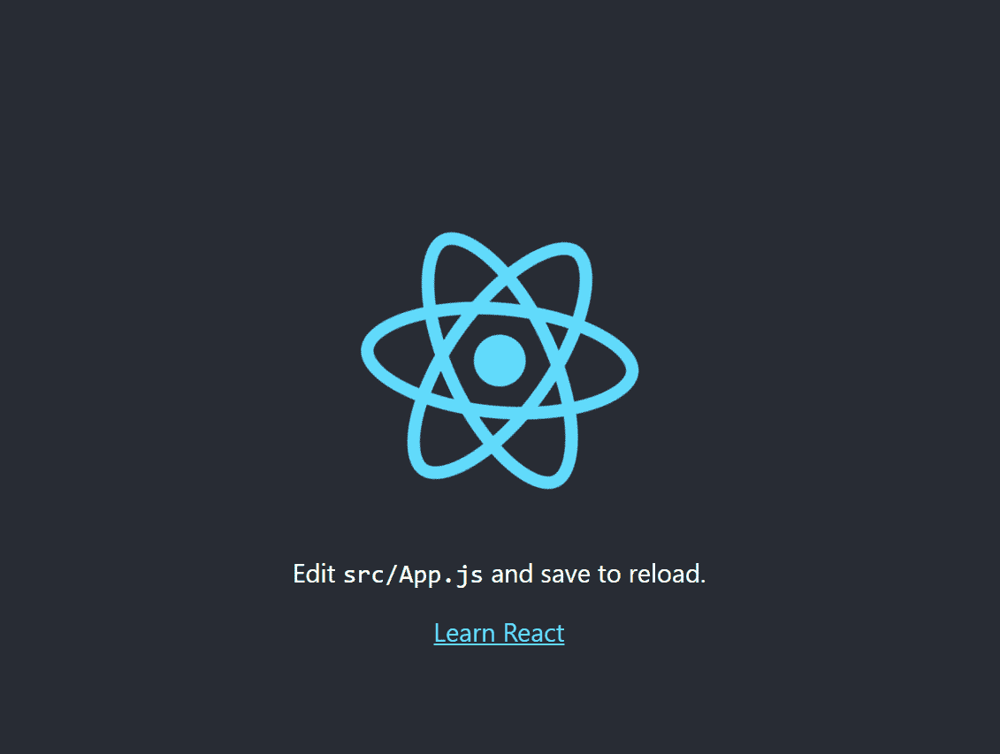
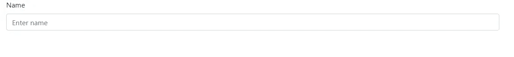
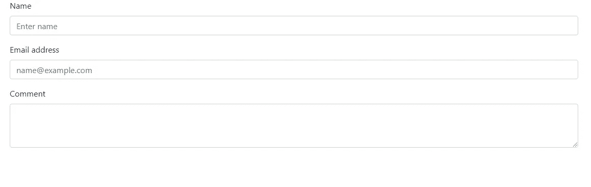
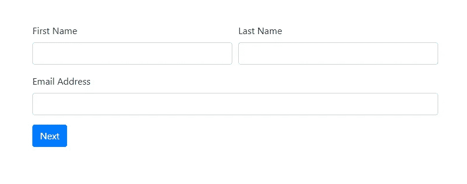
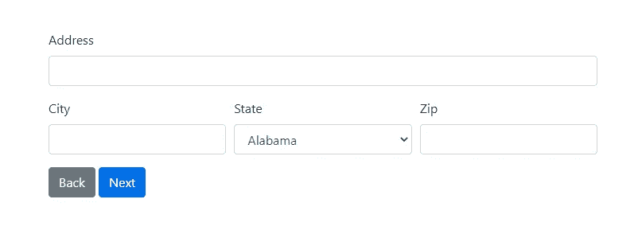
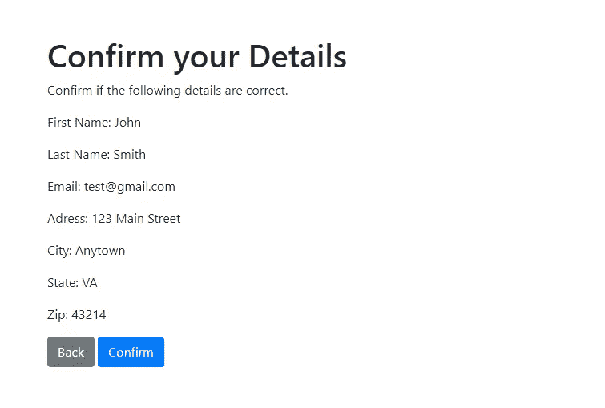

# 反应引导表单:简单和多步表单

> 原文：<https://javascript.plainenglish.io/react-bootstrap-forms-simple-and-multi-step-forms-c4baca54ada1?source=collection_archive---------20----------------------->



使用 Bootstrap 和 React 创建带有样式化输入字段的快速表单。

我将使用 React 中重新制作的 [React-Bootstrap](https://react-bootstrap.github.io/) 引导组件来创建表单。

在本教程中，我们将创建一个单页 React 引导表单和一个多步 React 引导表单。

# **什么是 React-Bootstrap？**



这个 React 包不需要 jQuery 和任何引导 JavaScript 文件。Bootstrap 4 的所有主要组件都是为 React 重建的，包括警报、模态和表单。



在项目中安装带有`yarn`或`npm`包的 React-Bootstrap。然后根据需要导入单个组件，而不是将整个库发送到客户端。

# **如何创建一个简单的 React 引导表单**

**创建一个 React 应用**

*Windows 命令提示符*

```
C:\Users\Owner\desktop\react> npx create-react-app react-form
```

首先创建一个 React 应用程序。

我喜欢用脸书的[创建-反应-应用](https://github.com/facebook/create-react-app)。开源存储库附带预配置的 webpack 和 Babel，在 macOS、Windows 和 Linux 上受支持。

`npx`是 npm 5.2+自带的包运行器。

我把我的应用命名为`react-form`。

请注意，创建 React 项目需要安装 Node.js 和 npm。如果你是 React 新手，可以查看 React 上的[初学者教程。](../../../blog/article/reactjs-beginners-tutorial)

**安装 React-Bootstrap**

*Windows 命令提示符*

```
C:\Users\Owner\desktop\react> cd react-form
C:\Users\Owner\desktop\react\react-form> npm install react-bootstrap bootstrap@4.6.0
```

创建 React 项目后，进入新的 app 目录，安装 [React-Bootstrap](https://react-bootstrap.github.io/getting-started/introduction) 。

**启动 React 开发服务器**

*Windows 命令提示符*

```
C:\Users\Owner\desktop\react\react-form> npm start
```

安装完成后，进入项目目录，然后输入命令`npm start`，运行开发服务器。

**浏览器中的 React app**



开发服务器会在新的浏览器窗口中自动打开。

**创建一个 SimpleForm.js 文件和组件**

*react-form > src >(新文件夹)组件>(新文件)SimpleForm.js*

```
import React, { Component } from 'react';

class SimpleForm extends Component {
  render() {
    return (
      <div className="SimpleForm">
        <p>Form</p>
      </div>
    );
  }

}

export default SimpleForm;
```

在文本编辑器中打开 *react-form* 目录。在 *src* 文件夹中新建一个名为 *components* 的文件夹。

然后在 *src >组件*中创建一个名为 *SimpleForm.js* 的新文件。

用基本的`render()`和`return()`方法创建一个名为`SimpleForm`的组件。

返回您想要的任何文本。我们只是在测试文件连接。

导出文件底部的`SimpleForm`组件。

尽管看起来没有必要，但创建特定于组件的文件是在 React 中编写可重用组件的一个好习惯。

**更新 App.js**

*react-form>src>app . js*

```
import 'bootstrap/dist/css/bootstrap.min.css';
import SimpleForm from "./components/SimpleForm";

function App() {
    return (
      <div>
        <SimpleForm />
      </div>
    );   
}

export default App;
```

通过从*组件> SimpleForm.js* 导入您的`SimpleForm`组件来更新 *App.js* 。

还有，文件顶部的`import 'bootstrap/dist/css/bootstrap.min.css'`。

然后调用`App`组件的`return()`中的组件。如果你看看你的浏览器窗口，它应该只是说“形式”。

**创建 React 引导表单**

*react-form > src >组件> SimpleForm.js*

```
import React, { Component } from 'react';
import Container from 'react-bootstrap/Container';
import Form from 'react-bootstrap/Form';

class SimpleForm extends Component {
  render() {
    return (
    <Container>
      <Form>
        <Form.Group controlId="formName">
            <Form.Label>Name</Form.Label>
            <Form.Control type="text" placeholder="Enter name" />
        </Form.Group>
      </Form>
    </Container>
    );
  }

}

export default SimpleForm;
```

返回到 *SimpleForm.js* 构建表单。

从文件顶部的`react-bootstrap/Form`和`Container`表单`react-bootstrap/Container`导入`Form`开始。

然后添加引导程序`<Container>`并嵌套`<Form>`。将`<Form.Group>`嵌套在`<Form>`中，为标签增加适当的引导间距和支撑。

添加`controlId`作为`<Form.Group` >的属性，以方便访问。

接下来，将`<Form.Label>`和`<Form.Control>`放入`<Form.Group>`中。



**完成 React 引导表**

*react-form > src >组件> SimpleForm.js*

```
import React, { Component } from 'react';
import Container from 'react-bootstrap/Container';
import Form from 'react-bootstrap/Form';

class SimpleForm extends Component {
  render() {
    return (
    <Container>
      <Form>
        <Form.Group controlId="form.Name">
            <Form.Label>Name</Form.Label>
            <Form.Control type="text" placeholder="Enter name" />
        </Form.Group>
        <Form.Group controlId="form.Email">
            <Form.Label>Email address</Form.Label>
            <Form.Control type="email" placeholder="name@example.com" />
        </Form.Group>
        <Form.Group controlId="form.Textarea">
            <Form.Label>Comment</Form.Label>
            <Form.Control as="textarea" rows={3} />
        </Form.Group>
      </Form>
    </Container>
    );
  }

}

export default SimpleForm;
```

这里有一个更完整的`SimpleForm`组件，要求输入姓名、电子邮件地址和评论。

关于 React-Bootstrap 可用的更多输入，请参考[文档](https://react-bootstrap.github.io/components/forms/)。



# **如何创建多步 React 引导表**

现在来看 React 引导多步表单。您可以选择创建一个不同的应用程序，但是对于本教程，我将使用上一节中相同的 React 应用程序。

这种多步表单基于[数字海洋反应+语义 UI 多步表单](https://www.digitalocean.com/community/tutorials/how-to-create-multistep-forms-with-react-and-semantic-ui)。

我们将制作一个包含用户详细信息、地址和确认页面的 3 步表单。

**创建一个 MultiStepForm.js 文件和组件**

*react-form > src >组件>(新文件)MultiStepForm.js*

```
import React, { Component } from 'react';

class MultiStepForm extends Component {
    state = {
        step: 1,
        firstName: '',
        lastName: '',
        email: '',
        address: '',
        city: '',
        state: '',
        zip:'',
    }

    render(){
        const { step, firstName, lastName, email, address, city, state, zip } = this.state;
        const inputValues = { firstName, lastName, email, address, city, state, zip };
    }
}

export default MultiStepForm;
```

首先在`state`中设置您想要收集的所有字段的默认值。我收集了`firstName`、`lastName`、`email`、`address`、`city`、`state`、`zip`。同样，将`step`设置为 1。

接下来添加`render()`方法，设置所有字段的状态。我们使用`this.state`来存储与`MultiStepForm`组件相关的值。

然后将所有表单字段分配给一个名为`inputValues`的常量。

**在 MultiStepForm.js 文件中添加 React Switch Case 语句**

*react-form > src >组件> MultiStepForm.js*

```
import React, { Component } from 'react';

class MultiStepForm extends Component {
    state = {
        step: 1,
        firstName: '',
        lastName: '',
        email: '',
        address: '',
        city: '',
        state: '',
        zip:'',
    }

    render(){
        const { step, firstName, lastName, email, address, city, state, zip } = this.state;
        const inputValues = { firstName, lastName, email, address, city, state, zip };
        switch(step) {
        case 1:
            return <UserDetails
                    inputValues={inputValues}
                    />
        case 2:
            return <AddressDetails
                    inputValues={inputValues}
                    />
        case 3:
            return <Confirmation
                    inputValues={inputValues}
                    />
        }
    }
}

export default MultiStepForm;
```

switch-case 语句是 if-else 条件的替代。在切换条件中传递`step`,然后为表单中的每个页面声明一个`case`,返回每个关联的组件。

将`inputValues`传入所有组件。

我们将编写并导入这些组件。但是首先，我们需要编写一些函数，让我们在不同的步骤之间进行转换，并处理输入值的变化。

**将 nextStep、prevStep 和 handleChange 函数添加到 MultiStepForm.js 文件**

*react-form > src >组件> MultiStepForm.js*

```
import React, { Component } from 'react';

class MultiStepForm extends Component {
    state = {
        step: 1,
        firstName: '',
        lastName: '',
        email: '',
        address: '',
        city: '',
        state: '',
        zip:'',
    }

    nextStep = () => {
        const { step } = this.state
        this.setState({
            step : step + 1
        })
    }

    prevStep = () => {
        const { step } = this.state
        this.setState({
            step : step - 1
        })
    }

    handleChange = (event) => {
        this.setState({[event.target.name]: event.target.value})
    }

    render(){
        const { step, firstName, lastName, email, address, city, state, zip } = this.state;
        const inputValues = { firstName, lastName, email, address, city, state, zip };
        switch(step) {
        case 1:
            return <UserDetails
                    nextStep={this.nextStep}
                    handleChange = {this.handleChange}
                    inputValues={inputValues}
                    />
        case 2:
            return <AddressDetails
                    nextStep={this.nextStep}
                    prevStep={this.prevStep}
                    handleChange = {this.handleChange}
                    inputValues={inputValues}
                    />
        case 3:
            return <Confirmation
                    nextStep={this.nextStep}
                    prevStep={this.prevStep}
                    inputValues={inputValues}
                    />
        }
    }
}

export default MultiStepForm;
```

箭头功能自动将箭头右边的`this`与左边的值绑定。

任何引用`this`(类组件中的上下文)的函数都必须绑定到类组件。除非使用箭头功能，否则绑定在`constructor()`组件中完成。

`this.setState`更新类组件中声明的变量的当前状态。

`nextStep`每次被调用时，在`step`值上加 1。`prevStep`每次调用时，从相同的步长值中减去 1。`handleChange`传入事件并根据目标的关联名称和值更新状态。记住，这些值和状态都是在`MultiStepForm`组件中处理的。

在组件中传递这些函数。`<UserDetails />`不需要`prevStep`功能，`<Confirmation />`不需要`handleChange`功能，因为它只显示更新的输入值。

**创建一个 UserDetails.js 文件和组件**

*react-form > src >组件>(新文件)UserDetails.js*

```
import React, { Component } from 'react';
import { Form, Button, Col, Container } from 'react-bootstrap';

class UserDetails extends Component{

    back  = (e) => {
        e.preventDefault();
        this.props.prevStep();
    }

    saveAndContinue = (e) => {
        e.preventDefault();
        this.props.nextStep();
    };

    render() {
        return( <Container>
                    <Form>
                        <Form.Row>
                            <Form.Group as={Col} controlId="formFirstName">
                                <Form.Label className="label">First Name</Form.Label>
                                <Form.Control
                                type="text"
                                defaultValue={this.props.inputValues.firstName}
                                name="firstName"
                                required
                                onChange={this.props.handleChange}
                                />
                            </Form.Group>

                            <Form.Group as={Col} controlId="formLastName">
                                <Form.Label className="label">Last Name</Form.Label>
                                <Form.Control
                                type="text"
                                defaultValue={this.props.inputValues.lastName}
                                name="lastName"
                                required
                                onChange={this.props.handleChange}
                                />
                            </Form.Group>
                        </Form.Row>

                        <Form.Group controlId="formEmail">
                            <Form.Label className="label">Email Address</Form.Label>
                            <Form.Control
                            type="email"
                            defaultValue={this.props.inputValues.email}
                            name="email"
                            required
                            onChange={this.props.handleChange}
                            />
                        </Form.Group>

                        <Button variant="primary" onClick={this.saveAndContinue}>Next</Button>
                    </Form>
                </Container>
        );
    }
}

export default UserDetails;
```

在 *src >组件*中创建一个名为 *UserDetails.js* 的新文件。

创建包含基本 React-Bootstrap 表单的`UserDetails`组件。确保每个`<Form.Control>`都有调用`this.handleChange`的`onClick`和一个`name`属性。

导出文件底部的`UserDetials`。

添加`back`和`saveAndContinue`箭头函数，防止默认事件，并分别调用`prevStep`和`nextStep`。

调用`back`和`saveAndContinue` `onClick`中的后退和前进按钮。

**创建一个 AddressDetails.js 文件和组件**

*react-form > src >组件>(新文件)AddressDetails.js*

```
import React, { Component } from 'react';
import { Form, Button, Col, Container } from 'react-bootstrap';

class AddressDetails extends Component{

    back  = (e) => {
        e.preventDefault();
        this.props.prevStep();
    }

    saveAndContinue = (e) => {
        e.preventDefault();
        this.props.nextStep();
    };

    render() {
        return( <Container>
                    <Form>
                        <Form.Group controlId="formAddress">
                            <Form.Label>Address</Form.Label>
                            <Form.Control
                                type="text"
                                defaultValue={this.props.inputValues.address}
                                name="address"
                                required
                                onChange={this.props.handleChange}
                            />
                        </Form.Group>

                        <Form.Row>
                            <Form.Group as={Col} controlId="formCity">
                                <Form.Label>City</Form.Label>
                                <Form.Control
                                type="text"
                                defaultValue={this.props.inputValues.city}
                                name="city"
                                required
                                onChange={this.props.handleChange}
                                />
                            </Form.Group>

                            <Form.Group as={Col} controlId="formState">
                                <Form.Label>State</Form.Label>
                                <Form.Control as="select" name="state" defaultValue={this.props.inputValues.state} onChange={this.props.handleChange}>
                                    <option value="AL">Alabama</option>
                                    <option value="AK">Alaska</option>
                                    <option value="AZ">Arizona</option>
                                    <option value="AR">Arkansas</option>
                                    <option value="CA">California</option>
                                    <option value="CO">Colorado</option>
                                    <option value="CT">Connecticut</option>
                                    <option value="DE">Delaware</option>
                                    <option value="DC">District Of Columbia</option>
                                    <option value="FL">Florida</option>
                                    <option value="GA">Georgia</option>
                                    <option value="HI">Hawaii</option>
                                    <option value="ID">Idaho</option>
                                    <option value="IL">Illinois</option>
                                    <option value="IN">Indiana</option>
                                    <option value="IA">Iowa</option>
                                    <option value="KS">Kansas</option>
                                    <option value="KY">Kentucky</option>
                                    <option value="LA">Louisiana</option>
                                    <option value="ME">Maine</option>
                                    <option value="MD">Maryland</option>
                                    <option value="MA">Massachusetts</option>
                                    <option value="MI">Michigan</option>
                                    <option value="MN">Minnesota</option>
                                    <option value="MS">Mississippi</option>
                                    <option value="MO">Missouri</option>
                                    <option value="MT">Montana</option>
                                    <option value="NE">Nebraska</option>
                                    <option value="NV">Nevada</option>
                                    <option value="NH">New Hampshire</option>
                                    <option value="NJ">New Jersey</option>
                                    <option value="NM">New Mexico</option>
                                    <option value="NY">New York</option>
                                    <option value="NC">North Carolina</option>
                                    <option value="ND">North Dakota</option>
                                    <option value="OH">Ohio</option>
                                    <option value="OK">Oklahoma</option>
                                    <option value="OR">Oregon</option>
                                    <option value="PA">Pennsylvania</option>
                                    <option value="RI">Rhode Island</option>
                                    <option value="SC">South Carolina</option>
                                    <option value="SD">South Dakota</option>
                                    <option value="TN">Tennessee</option>
                                    <option value="TX">Texas</option>
                                    <option value="UT">Utah</option>
                                    <option value="VT">Vermont</option>
                                    <option value="VA">Virginia</option>
                                    <option value="WA">Washington</option>
                                    <option value="WV">West Virginia</option>
                                    <option value="WI">Wisconsin</option>
                                    <option value="WY">Wyoming</option>
                                </Form.Control>
                            </Form.Group>

                            <Form.Group as={Col} controlId="formZip">
                                <Form.Label>Zip</Form.Label>
                                <Form.Control
                                type="text"
                                defaultValue={this.props.inputValues.zip}
                                name="zip"
                                required
                                onChange={this.props.handleChange}
                                />
                            </Form.Group>
                        </Form.Row>

                        <Button variant="secondary" onClick={this.back}>Back</Button>{' '}
                        <Button variant="primary" onClick={this.saveAndContinue}>Next</Button>
                    </Form>
                </Container>
        );
    }
}

export default AddressDetails;
```

创建一个 *AddressDetails.js* 文件，其功能类似于`UserDetails`组件。

**创建一个 Confirmation.js 文件和组件**

*react-form > src >组件>(新文件)Confirmation.js*

```
import React, { Component } from 'react';
import { Button, Container } from 'react-bootstrap';

class Confirmation extends Component{

    back  = (e) => {
        e.preventDefault();
        this.props.prevStep();
    }

    saveAndContinue = (e) => {
        e.preventDefault();
        this.props.nextStep();
    };

    render(){
        const {inputValues: { firstName, lastName, email, address, city, state, zip }} = this.props;

        return(
            <Container>
                <h1>Confirm your Details</h1>
                <p>Confirm if the following details are correct.</p>
                <p>First Name: {firstName}</p>
                <p>Last Name: {lastName}</p>
                <p>Email: {email}</p>
                <p>Adress: {address}</p>
                <p>City: {city}</p>
                <p>State: {state}</p>
                <p>Zip: {zip}</p>
                <Button variant="secondary" onClick={this.back}>Back</Button>{' '}
                <Button variant="primary">Confirm</Button>
            </Container>
        )
    }
}

export default Confirmation;
```

`Confirmation`组件的功能与之前的组件不同。它仅显示从先前步骤传入`MultiStepForm`的值。

**更新 MultiStepForm.js**

*react-form > src >组件> MultiStepForm.js*

```
import React, { Component } from 'react';
import UserDetails from "./UserDetails";
import AddressDetails from "./AddressDetails";
import Confirmation from "./Confirmation";

class MultiStepForm extends Component {
    state = {
        step: 1,
        firstName: '',
        lastName: '',
        email: '',
        address: '',
        city: '',
        state: '',
        zip:'',
    }

    nextStep = () => {
        const { step } = this.state
        this.setState({
            step : step + 1
        })
    }

    prevStep = () => {
        const { step } = this.state
        this.setState({
            step : step - 1
        })
    }

    handleChange = (event) => {
        this.setState({[event.target.name]: event.target.value})
    }

    render(){
        const { step, firstName, lastName, email, address, city, state, zip } = this.state;
        const inputValues = { firstName, lastName, email, address, city, state, zip };
        switch(step) {
        case 1:
            return <UserDetails
                    nextStep={this.nextStep}
                    handleChange = {this.handleChange}
                    inputValues={inputValues}
                    />
        case 2:
            return <AddressDetails
                    nextStep={this.nextStep}
                    prevStep={this.prevStep}
                    handleChange = {this.handleChange}
                    inputValues={inputValues}
                    />
        case 3:
            return <Confirmation
                    nextStep={this.nextStep}
                    prevStep={this.prevStep}
                    inputValues={inputValues}
                    />
        }
    }
}

export default MultiStepForm;
```

通过从*组件*目录导入您的`UserDetails`、`AddressDetails`和`Confirmation`组件来更新 *MultiStepForm.js* 。

**更新 App.js**

*react-form>src>app . js*

```
import 'bootstrap/dist/css/bootstrap.min.css';
import MultiStepForm from "./components/MultiStepForm";

function App() {
    return (
      <div>
        <MuliStepForm />
      </div>
    );   
}

export default App;
```

从正确的文件导入`MultiStepForm`，完成所有组件和文件的连接。



*原载于*[*https://www.ordinarycoders.com*](https://www.ordinarycoders.com/blog/article/react-bootstrap-forms)*。*

*更多内容请看*[*plain English . io*](http://plainenglish.io/)