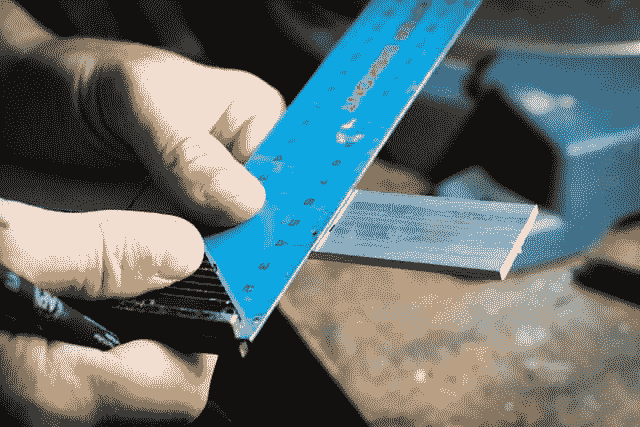

# 降价商品中的反应成分

> 原文：<https://javascript.plainenglish.io/react-componenets-in-markdown-articles-e4cbcbfc7f92?source=collection_archive---------19----------------------->

当我决定创建我的博客时，我选择了 Next.js 作为我选择的框架。作为后端，我使用存储在 git repo 中的 markdown 文件。

为了渲染我的文件，我使用了 [React Markdown](https://github.com/remarkjs/react-markdown) 。这是一个很棒的组件，无需任何配置就可以呈现 markdown 文件。

在一些帖子之后，我发现我需要一些自定义组件来渲染我的帖子。一个是图像，使它们可以在手机上缩放，第二个是代码片段的语法高亮。

React 有大量的组件可以帮助我们实现这两个目标。我决定使用[反应-缩放-平移-收缩](https://github.com/prc5/react-zoom-pan-pinch)进行图像缩放，使用[反应-语法-高亮](https://github.com/react-syntax-highlighter/react-syntax-highlighter)进行语法高亮。

好的。我有我的组件，而不是如何从我们的降价文件中呈现它们。幸运的是，React Markdown 覆盖了我们。它允许我们对一些标签进行自定义渲染。

我们可以这样做:

对于图像，我们必须挂钩到

标签，因为 ReactMarkdown 在段落中包装图像。所以用一个简单的 if 来决定段落的第一个孩子是否是一个图像。如果是这样，我们就把整个东西换掉。

对于代码，我们只是替换整个代码标签。

如果你喜欢这篇文章，你可以在推特上关注我。

*最初发表于*[*https://ppolivka.com*](https://ppolivka.com/posts/react-components-in-markdown-files)*。*

*更多内容看* [***说白了就是***](http://plainenglish.io/) ***。*** *报名参加我们的* [***免费每周简讯这里***](http://newsletter.plainenglish.io/) ***。***