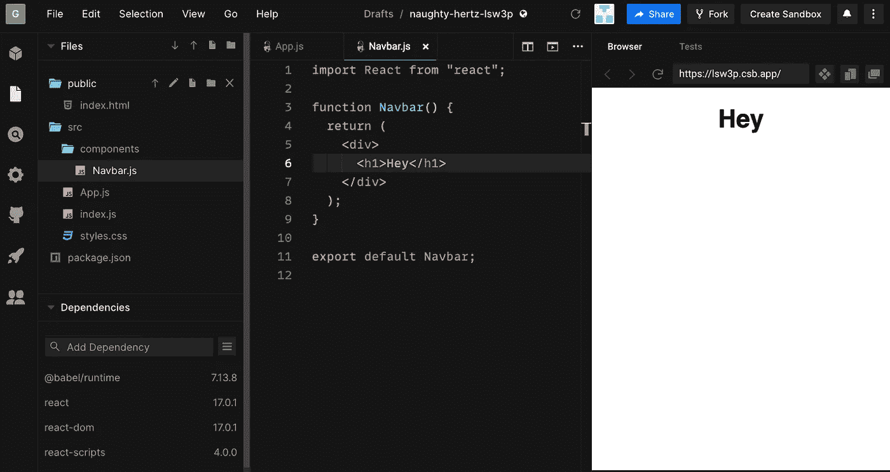

# 反应:组件、道具和状态

> 原文：<https://javascript.plainenglish.io/react-component-props-and-state-734d36d52610?source=collection_archive---------15----------------------->

## 编程反应和前端开发

## React 组件基础的详细说明，以及如何使用 props 和 state 来制作一个正常工作的应用程序。


根据 React 中组件的官方定义:

> 组件可以让你将用户界面分割成独立的、可重用的部分，并独立地考虑每一部分。

组件可以被视为整个网页的一部分。导航条，主要内容，页脚等，都可以转换成单独的组件。甚至组件的部分也可以进一步划分为组件。该组件的目的是让一个单元执行一个单独的任务，然后整个网页以一致的方式工作。如果没有组件，您可以使用 jQuery 来定位 DOM 中的特定元素。然而，越来越多的 web 开发人员选择像 React 这样的 UI 框架来执行前端任务。

# 基于类的组件与功能组件

您可以在 React 中使用类或函数编写组件。旧的代码库通常使用基于类的组件，现在有一批新的工程师将函数式编程作为比旧的 OOP(面向对象编程)风格更好的编码方式。

现在，你可能需要学习功能组件和基于类的组件，直到每个人都开始使用功能组件。然而，我们未来将主要关注功能组件，顺应潮流。

# 成分

## 功能成分

我们将从功能组件开始。在 src 文件夹中创建一个文件夹“components”。

在 components 文件夹中，创建一个文件并将其命名为 Navbar.js

第 1 行:我们正在导入 React(您的应用程序不导入它也可以运行良好，但是当我们使用基于类的组件时，我们需要导入 React)。

第 3 行:我们创建了一个 Navbar 功能组件。

第 4 行:无论我们在返回语句中放入什么，我们的函数都会输出。

第 5 行:我们放在 return 语句中的任何东西都必须在 1 个标签下，要么是 h1，p，要么是 div。然而，将 div 放在 h1 中并不是一个最佳实践，所以我们应该放一个 div 标签或者只是片段(<> >)。

第 6 行:这个 Navbar 功能组件只是返回 h1 中的 Navbar 语句。

第 11 行:我们正在导出 Navbar，这样我们可以在 App.js 中导入它。

应该是这样的。



Navbar.js

我们的功能组件已经可以使用了，我们可以将其导入到我们的 App.js 中

第 1 行:导入 Navbar。

第 2 行:导入 styles.css 文件。它现在是空白的。

第 4 行:创建 App 功能组件并在同一行中导出。

第 5 行:返回语句。

第 6 行:将所有内容包含在 div 标签中。

第 7 行:这是有趣的部分，我们将功能组件 Navbar 放入 return 语句中，我们也可以这样写:

```
<div className = "App"
   **<Navbar></Navbar>**
</div>
```

## 基于类的组件

你可以把一个[功能组件变成一个基于类的组件](https://reactjs.org/docs/state-and-lifecycle.html#converting-a-function-to-a-class)。

第 1 行:我们正在导入 React 和组件类。

第 3 行:我们的 Navbar ( N 是大写)，扩展了组件类。

第 4 行:调用了 render 方法

第 5 行:return 语句返回 h1 标签中的 Navbar。

代码笔链接:

第一部分结束

组件现在应该被清除了。现在我们应该转移到主要话题、道具和状态。

# 小道具

在理解 props 之前，我们应该知道 React 中的父、子和兄弟组件是什么，以及如何在它们之间移动数据。如果你能理解这一点，你就已经成功了一半以上。

React 中有三种处理数据的方法:

a.)使用 props 的父到子组件。

b.)在兄弟组件之间使用上下文 API，Redux

c.)使用回调的子到父

## 使用 props 的父到子组件

## 功能成分

你会在 React 里随处看到道具。如果你想成为一名更好的 React 开发者，这一部分值得你关注。Props 是将数据从应用程序的一部分传递到另一部分的方法。我们为什么这样做，可能有很多原因，首先，我们可能知道我们将从用户那里获得什么数据，如果你不知道你将获得什么数据，你将如何显示它。看下面的例子来理解我所说的:

```
export default PrintName(){
    **return <h1> Hi, {name} </h1>**
}
```

这是说明为什么道具很重要的经典例子。现在，我们不知道 name 参数是什么。要传递参数，PrintName()函数首先需要带一个参数。这个参数一定来自某个地方，对吗？

```
export default PrintName(props){
    **return <h1> Hi, {props.name} </h1>**
}//in App.js**<PrintName name = {name} />**
```

这叫传道具。现在你知道我们为什么要用道具了。每当你会困惑的时候，回到这个页面，看看我们为什么要使用道具，如果你是一个初学者，你需要学习很多次同样的东西，然后它才会印在你的潜意识里。

## ES6-破坏

你也可以通过新的析构方式使用道具:

```
export default PrintName({name}){
    **return <h1> Hi, {name} </h1>**
}//in App.js**<PrintName name = {name} />**
```

这里不需要写' props.name '，直接用{name}做自变量就可以了。

代码笔链接:

## 箭头功能组件中的传递道具

```
const **PrintName=({name})=>**(
   return <h1> Hi, {name} </h1>
)export default PrintName//in App.js**<PrintName name = {name} />**
```

> 提示:
> 
> 记住，如果你在 return 语句中使用 arrow 函数或者有多行，你需要一个大括号{}。

b .)和 c .)部分将在以后讨论，因为在讨论 b .)和 c .)之前，我们仍然没有涉及一些基础知识

## 基于类的组件

秀色可餐

第 1 行:导入 React

第 3 行:创建一个类 ShowSum

第 4 行:渲染方法

第 5 行:不带括号的 return 语句。如果有一条以上的线，我们必须将 JSX 放在括号内。在 p 标签中，我们通过“this”拉动我们的道具，然后将两个道具相加得到总和

App.js 看起来是这样的:

```
<div><ShowSum num1={5} num2={10} /></div>
```

代码笔链接:

第二部分结束

# 反应中的状态

道具和状态的区别在于，道具是我们在应用程序的不同部分之间发送的数据，而状态是组件的条件。按钮是开还是关，由状态管理，当按钮开还是关时显示什么是道具的责任。

## 处理基于类的组件中的状态

在本节中，我们将构建一个显示两个给定数字的和与差的应用程序。这看起来可能是一个简单的任务，但它会拉伸你的一些反应肌肉。

**Calculate.js**

第 1 行:创建计算类

第 2 行:调用构造函数，我们可以在构造函数内部直接分配 this.state。同样，我们也可以绑定我们的事件监听器。

第 3 行:调用超级方法

第 5 行:绑定句柄单击

第 6 行:绑定 handleDiffClick

第 7 行:在 state 对象中，我们给 showSum 一个 false 值。这个状态值可以通过 click 事件变成 true 和 false。

第 10 行:定义 handleSumClick 方法。这将使状态保持在错误值。

第 14 行:定义 handleDiffClick 方法。这将使状态保持在真实值。

第 18 行:在 render 方法中，我们将状态值存储在一个 const 变量中，通过条件呈现，我们可以在 SumButton 和 DiffButton 之间切换。

第 31 行:这个组件只返回一个 ShowCal 组件，它本身接受 showSum 属性(带有来自状态的 true 或 false 值)

简而言之，在政府的帮助下，我们在两个按钮之间切换。一个是显示数字的和，另一个是显示差。所以一次只有一个按钮可见，这是在 render 方法中实现的。通过使用 if-else，我们可以根据状态值显示任意一个按钮。

最后，我们将返回 ShowCal 组件，并将 showSum 作为道具传递。

**ShowCal.js**

第 3 行:状态值来自计算组件。

第 5 行:如果 showSum 为真，则显示 Diff 组件，否则显示 Sum

我们从 ShowCalc 组件向 Diff 和 Sum 传递属性。

**SumButton.js**

**DiffButton.js**

**Sum.js**

**Diff.js**

代码笔链接:

## 在基于功能的组件中处理状态

在功能组件中，我们使用钩子来管理状态。我们将会看到如何将之前的练习转换为显示函数部分中两个给定数字的和或差。

**Calculate.js**

第 1 行:创建一个功能组件计算就像我们在基于类的组件中做的那样。

第 4 行:在功能组件中，我们没有类，所以我们不使用“this”关键字。我们可以用钩子代替。我们创建了一个包含两个元素的数组，第一个是 showSum，它是一个布尔值，setShowSum 是一个函数。看看如果使用 console.log([showSum，setShowSum])会得到什么。

第 7，11 行:添加事件监听器。

第 15 行:条件渲染将根据条件(真或假)显示两个按钮中的任何一个，我们用 prop showSum 传递我们的 ShowCal 组件。该属性将根据其值(真或假)显示相关的 ShowCal 组件。

**ShowCalc.js**

第 1 行:ShowCal 是一个函数组件，从 Calculate 组件获得一个属性。此属性将用于显示 Sum 或 Diff 组件。

第 2 行:我们创建了一个变量 showSum，并给它分配了一个道具。

第 4，8 行:根据属性的值为真或假，有条件地呈现 Sum 或 Diff 组件。

**Sum.js**

**Diff.js**

代码笔链接:

在下一个教程中，我们将深入探讨钩子。

> 你可以在我的 YouTube 频道上找到更多关于编程的教程，Saran 科技，【https://www.youtube.com/channel/UCOHJCOprtOf4caI50lJlHSQ 