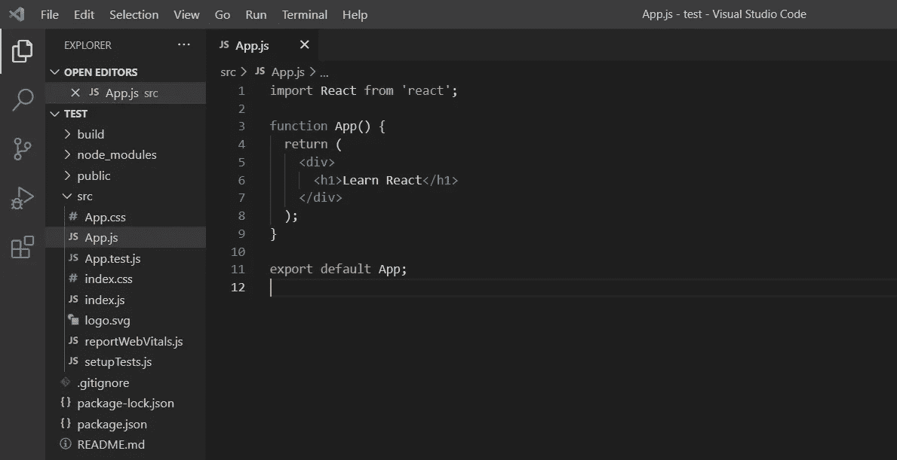
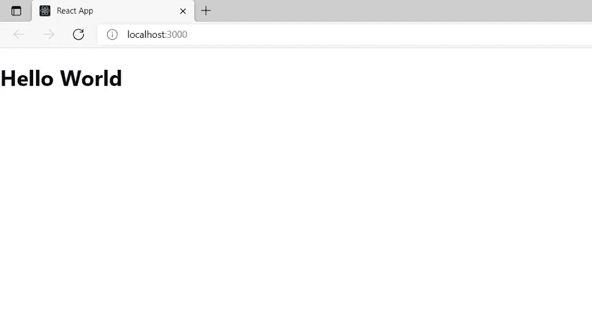

# React 组件和 JSX——初学者入门

> 原文：<https://javascript.plainenglish.io/react-components-and-jsx-an-introduction-for-beginners-3d492e804bc7?source=collection_archive---------18----------------------->

## 关于 React 中的组件和 JSX，您应该知道的一些事情


在我的[上一篇文章](/create-a-react-project-from-scratch-d7e6927944aa)中，我向您展示了创建一个简单 React 应用程序的步骤。今天，我将进一步讨论在 React 中创建组件和使用 JSX。

# 什么是组件？

> React 组件是任何 React 应用程序的基本组件。

换句话说，您创建的任何 React 应用程序都将使用称为组件的部分来构建。当应用程序和需求增长时，这些组件使开发人员的工作变得更加容易。

默认情况下，App 组件是为您创建的，它是作为功能组件实现的。

> 这意味着它只不过是一个带有 return 语句的 JavaScript 函数。



Authors Work

之后，您可以根据您的项目需求创建组件，并组织代码库。但是，首先，让我们看看如何创建一个新的组件。

## 如何创建新组件

与 Angular 不同，React 没有创建新组件的特定命令。相反，你需要做的只是创建一个新文件，相应地重命名它，然后开始编码。

> 但是，有两种类型的 React 组件可以创建为功能组件和类组件。

**类组件:**

当你创建一个类组件时，你必须从`*React.Component*` 扩展那个类，它将允许你的新组件继承 React 组件的所有功能。此外，在建立类组件时，需要以大写字母开始。

我们创建的任何类组件的输出都依赖于名为 **render()的方法的返回值。**一个类组件必须简单地实现 **render( )** 函数。

```
class Article extends React.Component {
    render() {
       return <h1> React Basics </h1>;
    }
}
```

**功能组件:**

功能组件是接受参数并输出 JSX 的函数。读取、调试和测试功能组件比类组件容易得多。

功能组件返回 HTML，其功能类似于类组件。

```
function Article() {
   return <h1> React Basics </h1>;
}
```

# 什么是 JSX？

JSX 是一种特定于 React 的类似 XML/HTML 的语法，它扩展了 ECMAScript，允许类似 XML/HTML 的文本和 JavaScript/React 代码共存。

> 对于 React 来说，使用 JSX 并不是强制性的，但是它使得处理 React 应用程序更加容易。

例如，让我们看看如何在有和没有 JSX 的情况下嵌入一个表达式。

**与 JSX:**

```
const element = <h1>Hello, Readers !!! </h1>;ReactDOM.render(
  element,
  document.getElementById('root')
);
```

**没有 JSX:**

```
const element = React.createElement('h1', {}, 'Hello Readers !!!');ReactDOM.render(
  element,
  document.getElementById('root')
);
```

正如你所看到的，使用 JSX 使事情变得更容易和干净。此外，您可以在 React 组件中使用 JSX 直接绑定表达式。

您需要使用花括号将表达式嵌入到 JSX 中，下面的代码显示了如何绑定一个简单的表达式。


Authors Work


Authors Work

我们还可以在 React 组件中构建一个具有多个属性的 JavaScript 对象，然后在 JSX 代码中利用这些属性的值:


Authors Work



Authors Work

> 此外，您可以直接调用 JSX 中的函数，将函数的返回值嵌入到 HTML 输出中。


Authors Work


Authors Work

本文到此为止。我将在下一篇文章中讨论更多关于 React 的内容。

感谢您的阅读！

*更多内容看*[***plain English . io***](http://plainenglish.io/)