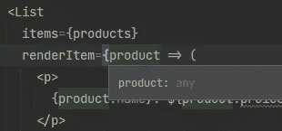
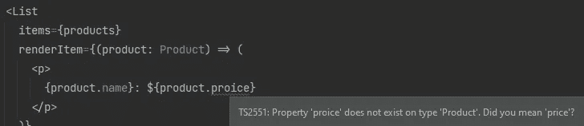
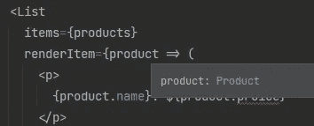
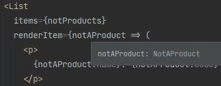
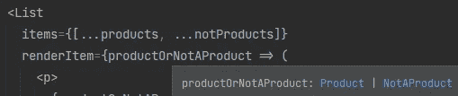

# 将组件作为类型脚本通用函数进行反应

> 原文：<https://javascript.plainenglish.io/react-components-as-typescript-generic-functions-8aa83afff597?source=collection_archive---------1----------------------->


假设您想要一个组件来呈现一个事物列表。你希望它是灵活的，能够渲染任何类型的东西，就像这样:

或者这个:

实现可能如下所示:

当然，问题是`renderItem`回调中变量的类型将是`any`。



所以它没能发现你发现的我的`proice`错别字，因为你是一个勤奋的代码读者。

我们可以*手动*告诉 TypeScript 传递给`renderItem`的对象是一个产品，并获得正确的类型:



但这意味着我们可怜的`<List>`消费者需要重新定义我们已经知道是真的东西。如果我们想要`sortItem`或`filterItem`或`validateItem`或`onItemClick`道具，我们会因为额外的打字而磨损键盘。

要是有更好的方法就好了…

# 输入类属

如果你是泛型的新手，那么这篇文章可能是一个不好的开始([这里是 docs](https://www.typescriptlang.org/docs/handbook/2/generics.html) )，但是因为你现在在这里，让你离开似乎很不礼貌，让我告诉你上面的代码的意思是:“嘿，TypeScript，这个组件的消费者将传递一组东西给`items` prop。我们不知道这些东西的类型是什么，但我们将把其中一个传递回`renderItem`函数”。

所以现在我们在回调中得到正确的类型，从我们传入的东西的类型推断出来:



甚至…



神奇。

# 限制提供的类型

这是一个好的开始，但是在我们的`<List>`中，我们对传入的项目类型一无所知。对于这个组件的消费者来说，这是非常好和灵活的，但是如果我们想要呈现一个实际的列表，并且每个列表项都需要一个键，这将是一个问题:

这将在`item.id`上给我们一个类型错误，因为我们已经说过`ItemType`可能是`any`，众所周知，任何人都没有 id。

我们通过为传递给这个组件的项目定义所需属性的基本集合来解决这个问题，这个位在`extends`的右边:

我们说“我不太了解被传入的项目，但我知道它们会有一个`id`属性”。

为了简洁起见，我内联了`{id: string}`，但是如果你有一个`BaseEntity`或者`BaseNode`类型，你可以在这里使用它。

值得注意的是，`{id: string}` *并不意味着*是一个具有`id`属性的普通对象(它可能是一个具有`id`属性的函数或数组)。同样，`{}`并不像你想的那样意味着“对象”:`123 extends {}`是真的。如果这还不够混乱的话:`123 extends Object`也是真的，而`123 extends object`是假的。

旁注:再一次，JavaScript 缺少一个词来描述你用花括号做的东西，它有键和值，不是数组也不是函数，这是很多混乱的来源。好消息是，在一般函数中，您通常不关心，您只需定义组件工作所需的最低要求。如果上面的`<List>`的消费者想要传入一个函数数组，并且每个函数都有一个`id`属性，那么这很奇怪，但是很好，因为 TypeScript 一直都知道`{id: string}`可以是一个函数。

# 推断嵌套类型

到目前为止很简单。但是如果我们不能很容易地推断出被传入的类型呢？在下面的`<Select>`中，我们聪明的人可以看到这一点，并知道所选 id 的类型将来自`Size` enum，但 TypeScript 没有机会。

如果您觉得不可思议，可以使用以下语法显式提供泛型变量类型:

但是当涉及到 React 组件和 TypeScript 泛型时，如果您放弃 DOM 并传入一组对象，您的生活将会简单得多。

这允许我们“看到”传入数据中的内容，并确定将调用什么类型的`onSelect`。

这个`<Select>`的内部看起来像…

对于`<List>`示例，TypeScript 从传入的对象类型中计算出了`ItemType`。有了这个`<Select>`我们可以更深入一层，从传入数组中对象的属性推断出类型。

(我将在这篇文章的其余部分使用这个`<Select>`例子，但不会通过处理`<optgroup>`元素来混淆视听。我希望你不介意。)

# 传递泛型类型变量

一般的“类型变量”(比如上面代码片段中的`IdType`)是奇怪的东西，在普通的 JavaScript 世界中没有明确的对等物。我认为他们有点像测试框架中的间谍，你可以通过他们来捕捉特定时间点上发生的事情。但是对于类型变量，你不是说“等着看这个方法用什么调用”，而是说“等着看这个槽里放什么样的数据”。

即使它们在概念上与函数参数有很大的不同，你仍然可以用相似的方式传递它们。

# 具有泛型的条件返回类型

如果在`props.onSelect`中返回的值的类型与作为 ID 传入的类型相同，这就太好了。但也可能不是。

例如，如果这个`<Select>`是可选的，并且允许用户不选择任何东西，我们可能希望组件发送`null`到`onSelect`。

所以我们想对 TypeScript 说:“当`required`是`true`时，传递给`onSelect`的值将与在`option` s 中传递的`id`的类型相同，但是如果`required`不是`true`也可能是`null`”。

下面是一个大概的实现。当`required`为假时，我们添加一个`<option>`来不选择任何东西。并具有`onChange`功能，当选择空选项时，该功能将从`null`传递到`onSelect`。

我创建了类型别名`Nullable`来表示逻辑“返回 ID 的类型将是传入 ID 的类型，如果 required 不为真，它也可以是`null`”。

注意，这在三个地方都有应用:定义当前所选内容的属性，传递给`onSelect`的参数类型，以及恼人的是，在组件中我们实际调用`onSelect`的地方。

这第三种用法标志着我们普通平稳航行的结束，因为我们绕过了淘气水的海角，毫无选择地漂进了北太平洋的波涛汹涌的地方。

# 条件泛型:棘手之处

当涉及到一般的 React 组件时，您可能会遇到两个问题。一个是泛型变量类型的怪癖，另一个是当 TypeScript 不能意识到某些复杂条件时发生的。

首先…在一个不使用泛型的函数中，TypeScript 非常擅长“缩小”传入值的类型:

我们可以安全地指定乘法，比如说`stringOrNumber * 4`，因为 TypeScript 通过演绎的力量知道`stringOrNumber` 必须是一个数字。

然而这段功能相同的代码并不工作:

你看，TypeScript 不能缩小泛型变量的类型。据我所知，原因是这样的:在第一个例子中，我们处理的是值的*类型，它必须是`string`或`number`。如果不是一个，那一定是另一个。在第二个例子中，我们正在处理类型变量*的*类型，该类型可以是`string`或`number`或`string | number`。*

我不完全明白这是否是设计出来的，或者会在未来的版本中修复，但关键是你不能缩小泛型变量的范围。这是问题一。

问题二:回到我们的`<Select>`组件，不能指望 TypeScript 真正理解当`required`为 falsey 时，我们有一些 JSX 将呈现一个额外的`<option>` DOM 元素，并且`<option>`元素的`value`属性将通过 React 传递给`<select>`元素上的`onChange`事件。

因此，TypeScript 无法知道我们将`null`传递给`props.onSelect`的唯一方式是`props.required`是否为真。由于这是无法推断的，我们必须向 TypeScript 保证我们的组件逻辑与我们在 prop 类型中做出的承诺是一致的。为此，我们使用`as`:

```
props.onSelect(selectedId as Nullable<IdType, RequiredType>);
```

## 条件泛型的另一种方法

如果你的组件和上面的一样简单，并且只有两个场景(需要或者不需要)，那么你也可以定义两组道具。换句话说，你是在对 TypeScript 说“这个组件可以在两种模式中的一种模式下运行…”。

这消除了`Nullable`类型别名，但意味着您必须调用类型收缩来允许 TypeScript 确信您正在将正确的类型传递给`props.onSelect`。或者用`@ts-ignore`。

一方面，这是一个改变复杂性的例子，所以你走哪条路并不重要。但另一方面，更好的是，请记住，TypeScript 在生产中消失了，所以使用这种有区别的联合方法，您会给应用程序在生产中的操作方式增加实际的复杂性，这种复杂性只是为了 TypeScript 的利益而存在。我认为这是一个禁忌，并建议你也这样做。

(您也可以使用函数重载，但是这将面临与 props 的区别联合相同的问题，并且语法很粗糙。)

嘿，我们到终点了吗？我想我们到终点了。

不，等等，我想到了一件更复杂的事情，你可能不需要知道…

# 将类型变量混合到现有类型中

如果不是将`id`和`name`传递给你的`<Select>`，而是镜像底层 HTML，允许消费者传递他们悸动的小心脏想要的任何`<option>`属性，会怎么样？

为此，我们想要扩展`<option>`组件/元素的属性，并使用它的`value`属性来计算出我们将传递给`onSelect`的是什么类型的东西。我们可以通过扩展`React.ComponentProps<'option'>`的泛型类型别名来实现:

现在，我们传入的选项对象可以直接传播到`<option>`元素上，我们可以放心，这些类型在当天晚上不会有问题。当使用这个组件时，我们可以向`<option>`传递任何有效的 HTML 属性，比如`disabled`。

附注:你可能想使用`Omit<>`或`Pick<>`而不是大规模公开所有属性，例如，如果你不打算在组件中遵守`selected`属性，就不允许传入它。

# 访问通用道具

最后一件事…

对于一个普通的 React 组件，如果你想得到它的道具类型，你可以写类似于`React.ComponentProps(typeof Select)`的东西。但是这不适用于通用组件，因为在很多地方你会得到类型`unknown`。这是有意义的，因为在不知道你打算传递什么样的数据的情况下，一个“通用”组件没有*有用的类型。*

因此，您需要显式导出您的道具并传递通用变量，可能如下所示:

请注意，我们可以只将 props 的类型变量定义为`type SelectProps<IdType, RequiredType> = …`而没有`extends`，因为我们实际上并不依赖类型变量在这个类型别名中扩展任何特定的内容。但是因为我们要导出它，并且希望它是正确的，所以我们做了一点重复，定义了`extends string`和`extends boolean`。

好了，现在我们完成了。嘿，谢谢你的阅读，你很棒。这是一张戴眼镜的狗的照片。你知道吗，当狗戴眼镜时，它们会把胳膊放在耳朵下面。我也没有！


Photo by [Cookie the Pom](https://unsplash.com/@cookiethepom?utm_source=unsplash&utm_medium=referral&utm_content=creditCopyText) on [Unsplash](https://unsplash.com/s/photos/laptop?utm_source=unsplash&utm_medium=referral&utm_content=creditCopyText)

*更多内容尽在*[***plain English . io***](https://plainenglish.io/)