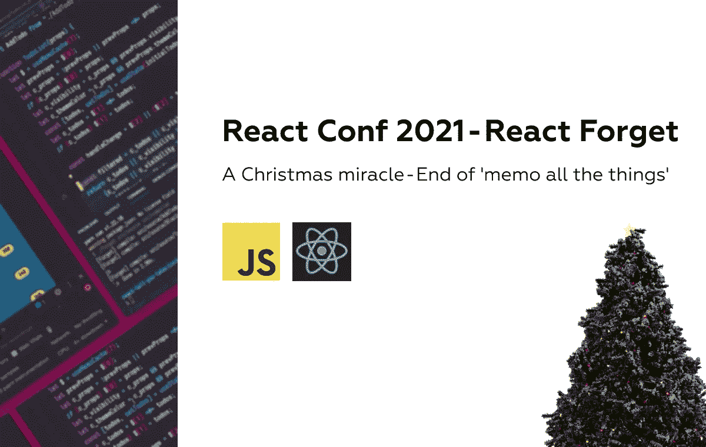
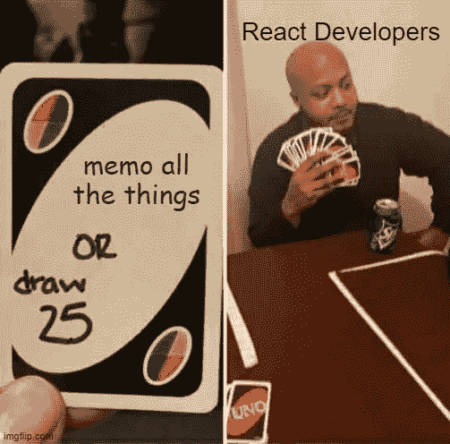
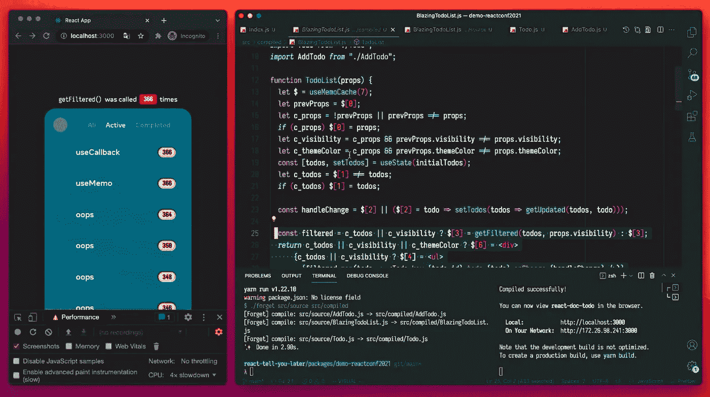

# 反应会议 2021 —反应忘记

> 原文：<https://javascript.plainenglish.io/react-conf-2021-react-forget-310ef73e9a70?source=collection_archive---------4----------------------->

# 圣诞奇迹——《所有事情的备忘录》的结尾

所有喜欢 React 的人都有过讨厌它的优化过程的不幸时刻。这里，我不是在讨论代码分割或服务器呈现，而是在组件级使用内存化和 useCallback。

UX/DX Struggle

这些都是很棒的特性，但是无论何时可能发生重新渲染，都需要付出很多没有回报的关注，我们作为开发人员真的不喜欢自己优化代码。

在[会议期间。2021](https://www.youtube.com/channel/UC1hOCRBN2mnXgN5reSoO3pQ) 几周前，React 团队发布了一个“易被遗忘”但功能强大的功能/工具，名为 React Forget(这个名字本身就是一个双关语)。简而言之，这是一个编译器，它通过检测`React.useMemo`或`React.useCallback`的需求并注入与这些结构行为相似的代码来进一步优化组件的重新呈现。

根据丹·阿布拉莫夫的说法，**这可以消除使用** `React.memo()` **以及**的需要。这是因为编译器显然不仅会记住`useMemo()`结果的计算，还会记住由组件返回的结果 *React 元素对象。*

Compiled code in React Forget sneak peek video

通常，编写一个优化的 UX 应用程序的内存化使用是强制性的，增加了开发人员的精神负担，因此，创建了一个相当次优的 DX。

许多人担心这种变化会导致新开发人员对运行时和背后的机制了解得更少，因为通过多层编译和编译隐藏复杂性通常会导致不可预见或难以调试的错误，但随着它获得更多的关注，这将会更好。

[先睹为快的视频](https://www.youtube.com/watch?v=lGEMwh32soc&t=2s)中的演讲者表示，他们计划在 2022 年进行内部试用，并报告其效果如何，如果成功，将对其进行开源。

我强烈推荐观看原始视频，因为它展示了使用 React Forget 的更深入和实际的体验。

*我希望你喜欢 React Forget and don ' t****Forget****这篇文章👏！*

*更多内容请看*[***plain English . io***](http://plainenglish.io/)*。报名参加我们的* [***免费周报***](http://newsletter.plainenglish.io/) *。在我们的* [***社区***](https://discord.gg/GtDtUAvyhW) *获得独家获得写作机会和建议。*