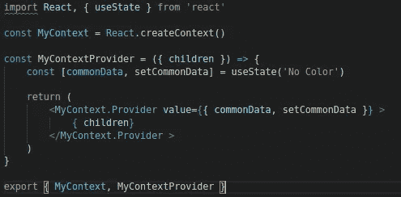
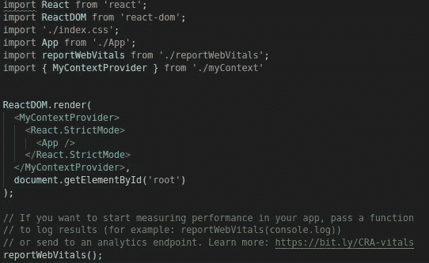
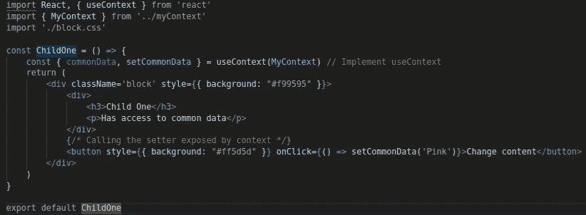
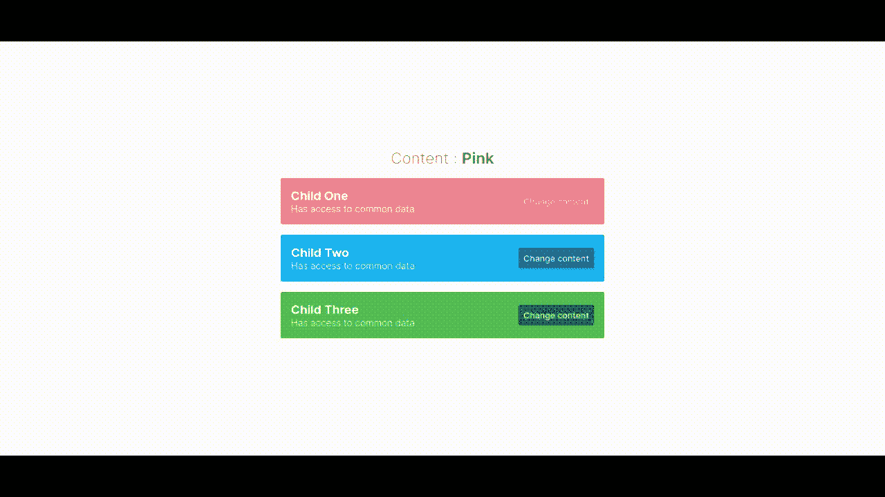

# React 上下文 API 快速指南

> 原文：<https://javascript.plainenglish.io/react-context-api-a-quick-guide-2065c040ae3d?source=collection_archive---------15----------------------->

## 如何实现 React 应用程序的状态管理

关于这个话题，我就不多介绍了。我相信您已经阅读了许多关于如何为 React 应用程序实现状态管理的详细博客，并且您只是想要一个快速切题的解决方案。

我将使用 React 自己的上下文 API 向您展示这一点。

虽然这不是唯一的实现方式，但这正是我的实现方式，它帮助我高效地扩展我的应用程序。

基本上，这是一个 3 步流程:

1.  **创建**一个上下文文件。
2.  **提供**这个上下文给一个组件，根或者其他(基于你的用例)。
3.  **消费**这个语境的内容

# 1.创建上下文文件

您的上下文文件将有 3 个关键元素。

1.  **上下文**本身。
2.  一个**包装器**，它将包含**上下文提供者**。
3.  上下文提供者的**值**。

我在下面附上了一个非常基本的上下文实现。

myContext.js

在上面的截图中，我们首先使用 React 提供的方法创建一个上下文，名为 **React.createContext()。**然后我们创建一个组件， **MyContextProvider** ，它将作为一个包装器组件。这个包装器组件简单地返回上下文提供者，在这个例子中是 **MyContext.Provider.** 这个提供者保存将被这个包装器组件内的所有组件共享的值。这听起来可能有点复杂，但在下一步之后，它将开始变得有意义。

# 2.提供背景

一旦创建了上下文文件，就差不多完成了。通常情况下，您将上下文暴露给将使用其内容的组件。如果上下文中的内容将被整个应用程序使用，那么您可以用提供者包装您的应用程序组件。如果只有一组特定的组件可以访问它，那么对它进行全局公开是没有意义的。在我们的例子中，我们将全局公开它。

index.js

MyContextProvider 包装了根应用程序，就像这样，我们的整个应用程序现在可以访问上下文提供的数据。

# 3.消费上下文内容

最后一步是消费上下文内容。我将分享在 Child One 上使用上下文内容的实现。子 2 和子 3 将有类似的实现。

childOne.js

我们简单地使用 react 提供的 **useContext** hook，并在导出的上下文中传递( **MyContext** )。这将为我们提供我们在第一步中从上下文文件中公开的值对象。然后，我们可以简单地使用对象析构，将内容存储在单独的变量中，然后在需要时使用它们。由上下文公开的 setter，setCommonData 也在上面的例子中使用。

就是这样！在我们的应用程序中，我们已经公开了状态和设置器{ **commonData，setCommonData}。**所以所有的子组件都可以改变这个由上下文提供的全局可访问的**公共数据**。如果沿着树向下添加了额外的子组件，并且您公开了内容，就像我们在 childOne、childTwo 和 childThree 的情况下所做的那样，我们将能够类似地访问它们，而不会出现任何问题。整洁！

Application demo

你可以在这里找到这个例子[的 GitHub repo。同样也可以查看 React 的官方文档，](https://github.com/AkileshAro/context-demo)[这里](https://reactjs.org/docs/context.html)。我也经常在 youtube 上发布编程内容，所以一定要去看看，[这里](https://t.co/IO2spWubW9?amp=1)。干杯！