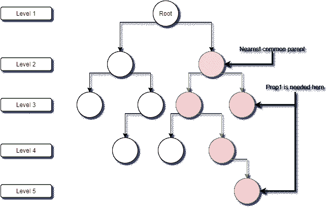

# 反应上下文:你真的需要它吗？这将帮助你决定！

> 原文：<https://javascript.plainenglish.io/react-context-do-you-really-need-it-this-will-help-you-decide-bcbdae589f70?source=collection_archive---------15----------------------->

## 如何创建一个反应上下文

Photo by [Caspar Camille Rubin](https://unsplash.com/@casparrubin?utm_source=medium&utm_medium=referral) on [Unsplash](https://unsplash.com?utm_source=medium&utm_medium=referral)

> 创建一个无 bug 的 React App 的核心是通过状态和道具有效地管理数据。

在很多情况下，我们需要在组件树中的不同组件之间共享数据。例如，下拉列表中的用户选择或 API 调用中的数据。在这种情况下，首先，您需要找到最近的公共父组件，并将状态提升到该父组件。这叫做[提升状态上升](https://reactjs.org/docs/lifting-state-up.html)。然后，您需要将这种状态传递给需要它作为道具的组件。该数据通过源组件和目的组件之间的每个中间组件。

这种情况一直持续到组件的深度为 2 或 3。除此之外，随着应用程序规模的扩大，维护和调试成为真正的挑战，这可能导致代码难以阅读，并且在规模扩大时变得脆弱。这种道具的深传叫做‘道具钻’。

 [## 支柱钻井

### 这篇文章的目的不仅仅是帮助你理解什么是道具训练(有些人也称之为“穿线”)…

kentcdodds.com](https://kentcdodds.com/blog/prop-drilling) 

Prop Drilling

避免钻柱的解决方案之一是[上下文 API](https://reactjs.org/docs/context.html) 。在组件之间共享状态的简单明了的方法。本文的目标是分享一个简单的上下文 API 框架。这个框架可以根据需要进一步增强。最好用功能组件创建上下文。所以我们会关注这一点。

# 创建上下文的步骤:

1.  创建上下文文件。
2.  用上下文提供者包围上下文状态的消费者。
3.  然后，您可以在包装在上下文提供程序中的任何组件中使用这个上下文状态。

代码中使用了 TypeScript。它可以很容易地转换成 JavaScript。现在让我们开始吧。

# **1。创建上下文文件。**

用 createContext 钩子创建一个上下文。然后创建一个提供者组件，该组件返回一个带有共享属性的上下文提供者组件。该组件包含可以作为 props 传递给提供者的状态。这里的图书列表是静态的，但是我们可以使用 useEffect 钩子并与 API 交互来获取图书列表。

# **2。用上下文提供者包围上下文状态的消费者**

这里，您需要用上下文提供者包装消费者组件。

# **3。在消费者组件中使用上下文**

是的，现在您可以通过使用 useContext 钩子来使用上下文状态，该钩子将上下文作为一个参数。干得好！

# **结论**

[这里是工作代码沙盒链接！](https://codesandbox.io/s/simple-context-api-jz7pv?file=/src/BookContext.tsx)

何时使用上下文:**避免深支柱钻孔。**

您不必将上下文提供者包装在整个组件树中。识别消费者并用上下文提供者包装他们。

提供者也可以单独包装。这里有一个例子:

现在，去创造你需要的环境吧！祝你好运！

感谢你的阅读！

参考资料:

如果你需要 React context 的视频指南，你会发现这个播放列表很有帮助:
[React Context & Hooks 教程](https://youtube.com/playlist?list=PL4cUxeGkcC9hNokByJilPg5g9m2APUePI)

[我找到的更多相关资料](https://dmitripavlutin.com/react-context-and-usecontext/)

*更多内容请看*[***plain English . io***](http://plainenglish.io/)