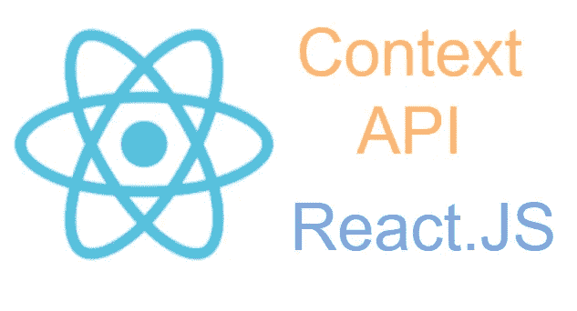

# 反应上下文—简化

> 原文：<https://javascript.plainenglish.io/react-context-simplified-86e1e8ce2d73?source=collection_archive---------4----------------------->



React 组件可以存储一组被称为**状态**的可观察属性。React 可以根据状态值决定如何呈现自己。有时，通过在组件树中向下传递状态，在多个组件之间共享状态是很重要的。当组件树太深，应用程序变得更大时，使用 props 通过所有这些组件传递状态会造成混乱。

**上下文**旨在解决这个问题。它将所有状态存储在一个中心位置，并在组件之间共享状态，而不必通过组件树向下传递它们。React **上下文** API 在一个地方管理应用程序的状态。它还使所有组件都可以访问该状态。

# 问题

为了总结 react 上下文 API，我将创建一个应用程序，并向您展示如何向它添加上下文。

我将只使用 react 创建一个 todo 列表应用程序。对于后端，我不会创建任何东西。我会利用 [**{JSON}占位符**](https://jsonplaceholder.typicode.com/) 。

## 要求

本教程要求读者提供简单的反应概念。

## 项目设置

使用 bellow 命令创建 react.js 应用程序。

```
npx create-react-app react-context-demo
```

## 删除不必要的文件和代码

删除`src`文件夹中除`App.js`和`index.js`以外的所有文件。

# 启用反应上下文

要在 react 应用程序中启用上下文，我们需要遵循以下步骤:

*   创建上下文
*   使用减速器
*   提供背景
*   使用上下文

## 创建上下文

React.js 提供`createContext()`钩子。这个钩子接收一个参数作为初始状态，并返回一个上下文。在我们的例子中，我们创建了一个上下文，并将包含一个空列表`todos`的初始状态传递给它。

*   在`src`文件夹中创建一个名为`TodoContext.js`的文件，并添加以下代码。

```
import React, { createContext } from 'react';
const initialState = {
   todos: []
};
export const TodosContext = createContext(initialState);
```

## 使用减速器

Reducer 是一个接收两个参数`state`和`action`并返回一个普通 JavaScript `object`的函数。通常动作有两个变量`type`和`payload`。

*   在`src`文件夹中创建一个名为`TodoReducer.js`的文件。

```
import React, { useReducer }  from 'react';
function todosReducer(state, action) {
   switch(action.type) {
      case "FETCH_TODOS":
         return {
            ...state,
            todos: action.payload,
         };
      case "CREATE_TODO":
         return {
            ...state,
            todos: [...state.todos, action.payload],
         };
      default:
         return state;
   }
}
```

*   后来我们用这个减速器用`useReducer`挂钩。它返回具有两个值的元组:

1.  State:它是应用程序的状态。它需要传递给提供者。
2.  调度:需要调度 reducer 动作。

```
const [**state**, **dispatch**] = ***useReducer***(todoReducer, initialState);
```

## 提供背景

上下文是使用`createContext`挂钩创建的，在我们的例子`TodoContext`中，上下文提供者`TodoContext.Provider`提供了上下文。

*   我们必须与提供商一起包装整个应用程序。因此，我们创建了一个返回带有子代的`TodoContext.Provider`的组件。
*   在名为`TodoContextProvider`的`TodoContext.js`文件中创建一个 reaction 组件(一个 JavaScript 函数)。
*   **减速箱动作**也在`TodoContextProvider`部件内部定义。他们称**分派**的方法来源于`useReducer`挂钩。

```
// Create Provider
export function TodoContextProvider({ children }) {
  // Use reducer
  const [state, dispatch] = useReducer(todoReducer, initialState);

  // Define reducer actions
  function fetchTodos(todos) {
    dispatch({
      type: "FETCH_TODOS",
      payload: todos,
    });
  }

  function saveTodo(todo) {
    dispatch({
      type: "SAVE_TODO",
      payload: todo,
    });
  } return (
    <TodoContext.Provider
      value={{
        todos: state.todos,
        fetchTodos,
        saveTodo,
      }}
    >
    {children}
    </TodoContext.Provider>
  );
}
```

*   在我们的`index.js`文件中，用`TodoContextProvider`包裹`App`部件。

```
<TodoContextProvider>
  <App />
</TodoContextProvider>
```

## 使用上下文

有多种方法可以在组件内部使用上下文并获取状态或更新状态。

*   获取状态的示例。

```
import React, { useContext, useEffect } from "react";
import { TodoContext } from "../TodoContext";export default function ListTodos() {
  const { todos } = useContext(TodoContext);
  return (
    <div className="col-8">
      <table className="table table-hover">
        <thead>
          <tr>
            <th>#</th>
            <th>Title</th>
            <th>Completed</th>
            <th></th>
          </tr>
        </thead>
      <tbody>
      {todos.map((todo, index) => (
        <tr key={index}>
          <td>{index + 1}</td>
          <td>{todo.title}</td>
          <td 
            className={todo.completed
              ? "text-primary"
              : "text-warning"}
          >
            {todo.completed ? "completed" : "uncompleted"}
          </td>
        </tr>
      ))}
      </tbody>
    </table>
  </div>);
}
```

*   更新状态的示例。

```
import React, { useContext, useState } from 'react';function CreateTodo() {
   const { createTodo } = useContext(TodoContext);
   const [title, setTitle] = useState(''); function handleClick() {
      createTodo({
         title
      });
   } return (
      <>
         <input
            type="text"
            onChange={e => setTitle(e.target.name)}
         />
         <button onClick={handleClick}>Save</button>
      </>
   );
}
```

# 结论

当在内部 reactor 应用程序中使用时，React Context 是一个强大的工具。它简化了检索状态或更新状态，而不需要向下传递组件层次结构的支柱。更重要的是，反应上下文将 UI 与状态分开。

你可以找到打开这个[仓库](https://github.com/bewarusman/react-context)获得更完整的例子。

我想听听是否有任何误解或错误。