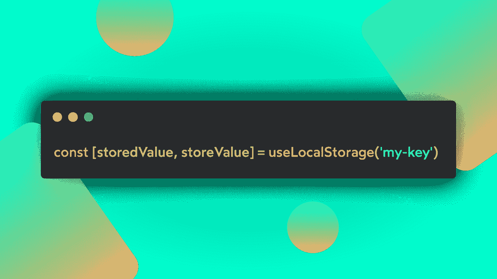

# React 自定义钩子#1: useLocalStorage

> 原文：<https://javascript.plainenglish.io/react-custom-hooks-1-uselocalstorage-746fda23c3f8?source=collection_archive---------12----------------------->

## REACT HOOKS 食谱

## 使用 React 在 localStorage 上创建简单的持久化数据，以保存用户首选项。

在我开始创建自己的设计系统 [**mountain-ui**](https://www.npmjs.com/search?q=%40mountain-ui) 之后，我认为我在职业生涯中迄今为止所学到的东西以及我在实现中所应用的东西可能会对其他希望更好地学习如何充分利用 React API 的开发人员有所帮助。

所以，我开始了一个新的系列文章，我们将一起看看我是如何创建一些我每天都在使用的定制钩子的。有时我会修改现有的解决方案，其他的我会根据自己的需求从头开始创建。

## 使用本地存储挂钩的原因

我不止一次发现自己需要跨用户会话持久化一条信息，比如页面的选定字体大小，或者用户的黑暗模式偏好。

对我来说，让 localStorage 与 React 状态同步是必须的。

当钩子随 React 16.8 出现时，许多开发人员开始使用它们，创建能够与浏览器 API 交互的自定义钩子，并创建更好的开发人员体验。

那时我发现了这个钩子的第一个实现，随着时间的推移，它一直在不断迭代，以始终为开发人员的需求提供更好的支持。

在 [**mountain-ui**](https://github.com/tonyghiani/mountain-ui) 中，我正在为个人发展和我的 [**个人网站**](https://marcoghiani.com/) 构建库，我创建了一个包，我将在其中定义我们将在本系列中看到的所有挂钩，可以随意使用它，如果您愿意，也可以投稿。

## 幕后是怎么运作的？

这个自定义挂钩为开发人员提供了与本地存储交互的基本功能:

*   在客户端设备的本地存储中存储一个键/值对。
*   将存储的值与反应状态同步，以便在设置新值时重新呈现组件。
*   它还负责 SSR，避免在构建时或服务器端调用钩子时出错。

Photo by [Tatiana Rodriguez](https://unsplash.com/@tata186?utm_source=medium&utm_medium=referral) on [Unsplash](https://unsplash.com?utm_source=medium&utm_medium=referral)

## 编码时间

现在让我们一起检查一下这个钩子的实现，我们会一步一步地看到当我们在一个组件内部调用钩子时会发生什么！

这是一段很长的代码。但是让我们从头开始理解它的作用:

*   首先，它为实现导入了一个实用程序，您可以在 [**mountain-ui 存储库**](https://github.com/tonyghiani/mountain-ui) **中找到的函数`hasWindow`。**
*   在初始导入之后，我们开始声明钩子函数。它需要两个参数，第一个是强制的，是用于将值存储到 localStorage 中的**键**。第二个是可选的，是与*键*参数相关联的要保存的 **initialValue** 。
*   实现的第一步是定义一个函数`loadStoredValue`，该函数允许从 localStorage 中检索用*键*参数保存的值。它还控制是否使用`hasWindow`函数在服务器中调用钩子，防止在下面几行中访问窗口对象时出错。
*   一旦我们定义了`loadStoredValue` init 函数，我们就创建一个新的 React 状态来保存存储的值。这个状态对于保持 localStorage 值和 UI 的同步是必不可少的，这样一旦存储了新值，使用这个钩子的组件就可以重新呈现。
*   既然已经创建了一个状态，下一步就是定义一个 updater 函数，它能够将新值存储到 localStorage 中，并更新以前创建的状态。
*   最后，在将钩子调用的结果作为`[storedValue, setValue]`返回之前，我们应用了一个应该只在挂载上运行的副作用，以从 localStorage 恢复值，并将其与 React 状态同步。

## 挂钩用法

正如我之前指出的，这个定制钩子有很多用途，这取决于你的需求。您可以使用这个钩子来创建其他自定义实现，并将更多的逻辑提取到可重用的钩子中！

## 结论

我们已经结束了第一个 React Hooks 的故事，我希望它能有所帮助，我希望听到你的任何疑问，你可以直接在 [**Twitter**](https://twitter.com/tonyghiani) 上 ping 我，或者在这里评论帖子！

您还可以在以下页面找到更多关于我正在使用的资源的信息:

*   [**Mountain-ui**](https://github.com/tonyghiani/mountain-ui)
*   [**我的个人页面**](https://marcoghiani.com/)

感谢您花时间阅读，下一篇文章再见！🚀

*更多内容请看*[***plain English . io***](http://plainenglish.io/)