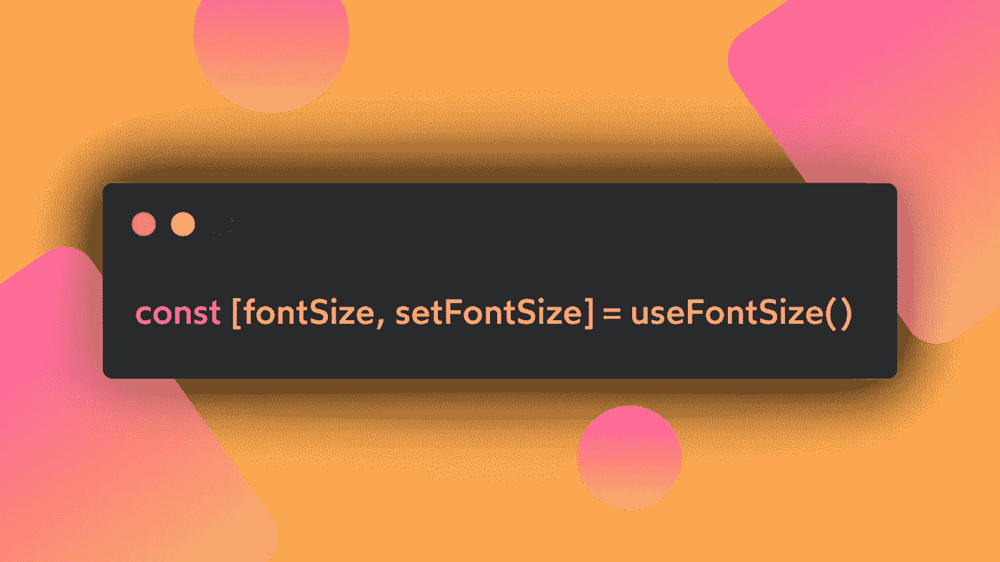

# React 自定义钩子#2: useFontSize

> 原文：<https://javascript.plainenglish.io/react-custom-hooks-2-usefontsize-3f636d0ecb88?source=collection_archive---------13----------------------->

## REACT HOOKS 食谱

## 设置并使用一个全局 CSS 变量来改变页面的基本字体大小。

继第一篇关于 React 定制钩子的文章之后，今天我们将看到如何在我们的应用中简化和重用另一个逻辑，一点一点地增强我们作为 React 开发人员的技能。我说的是 **useFontSize** 自定义钩子，我们一起来看看它为什么这么有用！

## 为什么需要一个 useFontSize 钩子？

我在智能手机上使用 Medium 应用程序，在阅读时浏览应用程序的选项，我遇到了一个非常好的功能:Medium 让你能够调整应用程序的字体大小，以帮助你阅读更好的帖子内容。

这在许多平台中是一个非常常见的特性，但是我从来没有想过要实现它，即使是出于学习的目的。

所以，为了实现我的 [**个人页面**](https://marcoghiani.com/) 上的功能，我想出了这个允许我控制 CSS 变量的自定义钩子。这样，我就可以在我的文本组件中使用这个变量，并获得一个完整的字体大小调整特性，而无需呈现所有的文本组件(将来可能会有一篇新文章)😁).

在查看它的实现之前，我更愿意向您展示结果，您可以在我的 [**页面**](https://marcoghiani.com/) **上看到结果。**

## 它是如何工作的？

这种定制挂钩具有一些特性:

*   在文档元素中设置一个 CSS 变量。变量名可以自定义。
*   将保存的值存储在 localStorage 中，这样我们的用户就不需要在每次重新加载页面时更改字体大小。
*   钩子是同构的，这意味着它也可以进行服务器端渲染。

钩子接受一些可选参数来定制它的功能，比如存储字体大小的 **localStorage 键**、CSS 变量名和 SSR 情况下的 **initialSize** 。

## 实施

下面是代码实现！我知道这是一段很长的代码，但大部分是我留下的注释，以澄清它的作用，所以让我们阅读代码，让我们一起检查幕后发生了什么！🚀

现在让我们一步一步地看看发生了什么:

*   首先，它导入了实现所必需的工具和钩子，你可以在 [**mountain-ui 仓库**](https://github.com/tonyghiani/mountain-ui) **中找到它们。**
*   下一步是定义一个接口来描述 3 个接受的选项: **storageKey、initialSize** 和 **variableName。**如果你没有使用 typescript，你可以跳过这一步。
*   是时候声明一些实用程序来从 DOM 中的`<html>`节点设置和检索字体大小变量了。两个函数 **applyPropToDocument** 和**getdocumenprop**分别完成这些操作。
*   我们终于准备好开始声明自定义钩子了！我们将从 *options* 对象中析构先前定义的参数，在使用钩子时没有传递它们的情况下分配默认值。
*   在实现之初，钩子调用了另一个自定义钩子，useLocalStorage 实用程序，你可以在 [**我之前关于这个钩子的帖子**](https://marcoghiani.com/blog/react-custom-hooks-uselocalstorage) 中深入阅读。正如您在代码注释中看到的，它创建了一个连接到 localStorage 的 React 状态，因此它可以满足我们之前看到的需求。
*   由于我们将使用 [**useReducer 钩子**](https://marcoghiani.com/blog/how-to-use-react-reducer-effectively) 来实现，因此有必要定义 **init** 函数，该函数将在钩子第一次被调用时处理各种细节。检查钩子是否在客户端运行，否则返回默认值。2 *。*如果字体大小已经存储在 localStorage 中，将其设置为 CSS 变量。
    3。将存储的值作为状态值返回。
*   返回 useReducer 结果之前的最后一步显然是定义必要的逻辑来更新 font-size 值，并将其存储到 localStorage 中，并将更改通知组件。所有这些逻辑都包含在**减速器**的功能中。

## 如何使用 useFontSize 钩子？

在要点的最后，你会发现一个如何使用定制钩子的基本例子，但是这不应该限制你如何让用户与你的页面交互的想象力！在我的网站上，我通过一个滑块来实现互动！

## 结论

我们已经结束了第二个 React Hooks 的故事，我希望它能有所帮助，我希望听到你的任何疑问，你可以直接在 [**Twitter**](https://twitter.com/tonyghiani) 上 ping 我，或者在这里评论帖子！

您还可以在以下页面找到更多关于我正在使用的资源的信息:

*   [**山-ui**](https://github.com/tonyghiani/mountain-ui)
*   [**我的个人页面**](https://marcoghiani.com/)

在这里你也可以找到这个系列以前的帖子！

 [## React 自定义钩子#1: useLocalStorage

### 使用 React 在 localStorage 上创建简单的持久化数据，以保存用户首选项。图片由马可在我开始后…

marcoghiani.com](https://marcoghiani.com/blog/react-custom-hooks-uselocalstorage) 

感谢您花时间阅读，下一篇文章再见！🚀

*更多内容请看*[***plain English . io***](http://plainenglish.io/)