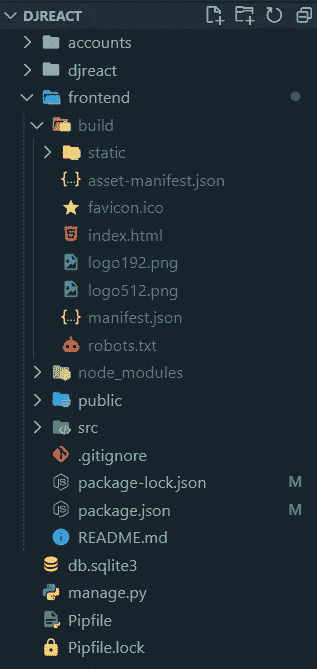
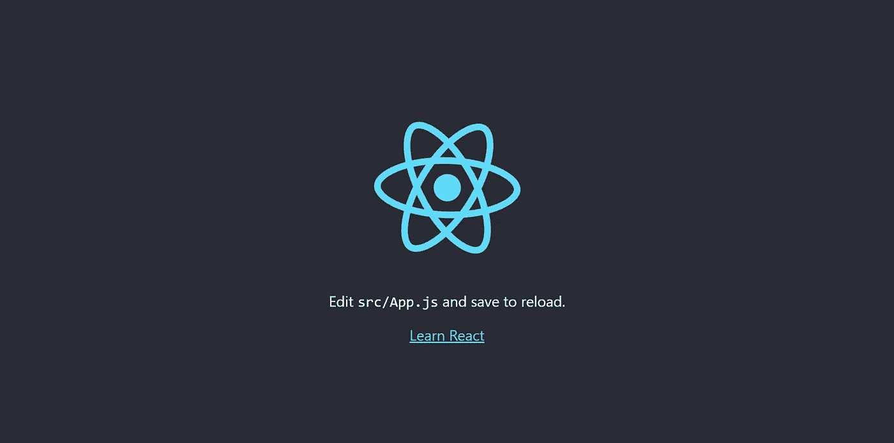
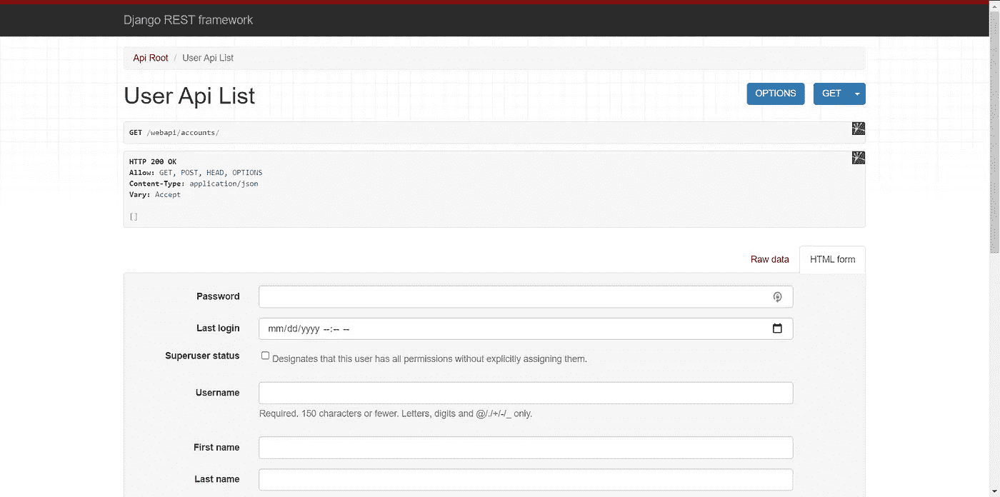

# 与 Django 集成 React:最好的全栈 Web 集成

> 原文：<https://javascript.plainenglish.io/react-django-full-stack-the-best-web-integration-e9d92af43b96?source=collection_archive---------0----------------------->


source: codingforentrepreneurs

# 介绍

**React** 和 **Django** 是目前最流行的两个框架(当我这么说的时候，我指的是这两个框架),它们被许多流行网站(包括媒体本身)大量用于制作。

现在，如果你已经来到这里，那么这意味着你知道这些框架是如何工作的。如果没有，那么马上停止阅读这篇文章。

那么我们开始吧，集成 React 和 Django 的方法有很多。虽然没有"*官方"*的方式来做到这一点。这是我的方法，我个人认为可以算作最佳实践。

> 在这一个中，我们将分别处理 React 和 Django，最后，为了制作，我们可以运行`*npm run build*`(以便将整个 React 应用程序捆绑到单个文件夹中)，然后可以提供给 Django 进行渲染。

听起来像个计划？😇

好了，不用设置，创建一个新文件夹“DJREACT”。
*(假设你已经安装了 Python 和 Node.js】*



Directory structure

# React 前端设置

创建一个新文件夹`frontend`，运行`npx create-react-app frontend`(你可以稍后在 *package.json* 文件中编辑这个名字)

我们还需要 Axios 来处理我们稍后将在后端创建的 API

```
npm install axios
```

打开 **package.json** 并添加这个

```
{
  "name": "djreact",
  ...
  "proxy": "http://localhost:8000",
  "homepage": "/dist",
  ...
}
```

*>第一行→* **名称**:重命名项目(没有任何区别)

*>第二行→* **代理**:这将有助于**隧道 API 请求**到 [http://localhost:8000](http://localhost:8000/) ，Django 应用程序将在那里处理这些请求，因此我们可以在 React 中像这样简化请求的编写:

```
axios.get("/webapi/accounts/")
```

而不是这个:

```
axios.get("http://localhost:8000/webapi/accounts/")
```

*>第三行→* **主页**:这样在 *build* 文件夹中捆绑的 react 项目中的所有静态文件都可以匹配 Django 的 URLPATTERN(必须与 Django 中`settings.py`的 STATIC_URL 变量相同)

*现在使用`*[*Axios*](https://www.npmjs.com/package/axios)*`( NPM 包)，通过 API 端点与 Django 后端通信*

以下是如何使用 Axios 的一个片段:

```
handleSubmit = item => {
    this.toggle();
    if (item.id) {
    axios
        .put(`http://localhost:8000/webapi/accounts/${item.id}/`, item)
        .then(res => this.refreshList());
    return;
    }
    axios
      .post("http://localhost:8000/webapi/accounts/", item)
      .then(res => this.refreshList());
};handleDelete = item => {
    axios
        .delete(`http://localhost:8000/webapi/accounts/${item.id}`)
        .then(res => this.refreshList());
};
```

运行`npm start`来运行应用程序，它应该工作。

## 修复 Django 的 CSRF 令牌验证冲突

Django 提供的**内置 CSRF 保护**对于**保护您的服务器免受恶意网站**攻击非常有用，这些网站可以利用您的访客浏览器来攻击您。然而，当使用现代 JavaScript 库时，你需要以不同的方式处理 CSRF。

在前端编辑`**src/App.js**`

```
import axios from 'axios';axios.defaults.xsrfCookieName = 'csrftoken'
axios.defaults.xsrfHeaderName = 'X-CSRFToken'
```

*我知道，我把 Axios 的大部分留给你，因为这很容易做到。* [*链接教程*](https://www.youtube.com/watch?v=6LyagkoRWYA)

## 输出



# Django 后端设置

> Django 的唯一目的是创建一个 API，React 可以使用它与数据库进行通信。

## 为 Python 创建虚拟环境(可选)

在“DJREACT”中打开命令行外壳并运行`$ pip install pipenv`

`$ pipenv shell`(这将创建一个虚拟环境)

这一步是可选的，尽管建议使用虚拟 Env，因为将来您可能会将代码推到某个地方。

## Django 实际安装

我推荐你首先阅读 [Django Rest 框架文档](https://www.django-rest-framework.org/tutorial/1-serialization/)

```
$ pipenv install django djangorestframework djangorestframework-simplejwt django-cors-headers
$ django-admin startproject djreact .
$ python manage.py startapp accounts$ python manage.py migrate
$ python manage.py createsuperuser --username admin
  Email: ......
  Password: ........
```

在 djreact (main)中编辑`**settings.py**`

这些设置看起来很重要。尤其是 DRF 认证，它为整个应用程序配置 API 权限，但您也可以为每个视图手动设置。

但是请记住，这些是**而不是**生产设置，在某些情况下，您必须更改一些变量。

```
ALLOWED_HOSTS = ['localhost', 'localhost:3000']CORS_ORIGIN_WHITELIST = [
    'http://localhost:3000',
]INSTALLED_APPS = [
    ...
    # Third party apps
    'rest_framework',
    'corsheaders',

    # My apps
    'accounts.apps.AccountsConfig',
]# [DRF Authentication Scheme](https://www.django-rest-framework.org/api-guide/authentication/#setting-the-authentication-scheme) <- you can click here :)# set permission according to your requirements
REST_FRAMEWORK = {
    'DEFAULT_AUTHENTICATION_CLASSES’: [
        'rest_framework_simplejwt.authentication.JWTAuthentication’,
    ],
    'DEFAULT_PERMISSION_CLASSES’: [
        'rest_framework.permissions.DjangoModelPermissions’,
        'rest_framework.permissions.IsAdminUser'
    ]
}MIDDLEWARE = [
    ...,
    'corsheaders.middleware.CorsMiddleware',
    ...,
]TEMPLATES = [
    {
        'BACKEND': 'django.template.backends.django.DjangoTemplates',
        'DIRS': [ BASE_DIR / 'frontend' ],
        ...
        },
    },
]...STATIC_URL = '/dist/'# Extra places for collectstatic to find static files.
STATIC_ROOT = BASE_DIR / 'staticfiles'STATICFILES_DIRS = [
    BASE_DIR / 'frontend/build',
]
```

现在运行这些命令来确保所有的表都被创建了。

```
$ python manage.py makemigrations
$ python manage.py migrate
```

## 英寸/帐户文件夹

Django REST 框架中的序列化器**负责将对象转换成 javascript 和前端框架能够理解的数据类型**。

在账户中创建`**serializers.py**`

```
from rest_framework import serializers
from django.contrib.auth.models import Userclass UserSerializer(serializers.ModelSerializer):
    class Meta:
        model = User
        fields = '__all__'
```

你已经知道什么是视图了，对吗？没有吗？？那你在这里做什么？

在账户中编辑`**views.py**`

```
from rest_framework import viewsetsfrom django.contrib.auth.models import User
from .serializers import UserSerializer
# To make password encryption
from django.contrib.auth.hashers import make_password# API view for django.contrib.auth.models.User
class UserViewSet(viewsets.ModelViewSet):
    queryset = User.objects.all()
    serializer_class = UserSerializer# it takes recent instance from serialzer and uses `make_password` to encrypt
    def perform_create(self, serializer):
    # Hash password but passwords are not required
    if ('password' in self.request.data):
        password = make_password(self.request.data['password'])
        serializer.save(password=password)
    else:
        serializer.save()def perform_update(self, serializer):
    # Hash password but passwords are not required
    if ('password' in self.request.data):
        password = make_password(self.request.data['password'])
        serializer.save(password=password)
    else:
        serializer.save()
```

在账户中编辑`**urls.py**`

```
from django.urls import path, includefrom rest_framework.routers import DefaultRouterfrom . import views# *Registering* Rest-API routes for Accounts
router = DefaultRouter()
router.register(r'user', views.UserViewSet, 'user')urlpatterns = [
    path('', include(router.urls), name='accounts_api'),
]
```

## 英寸/djreact(主)项目文件夹

在 djreact (main)中创建`**views.py**`

```
from django.shortcuts import renderdef index(request):
    return render(request, 'build/index.html')
```

***注意:*** *您可以在开发中将“build”改为“public”，为此您需要将* `*webpack.config.js*` *和* `*.babelrc*` *配置为将所有 src 代码转换到一个 js 文件中。*

*阅读更多关于*[*webpack*](https://gist.github.com/mr-vaibh/4d59310e5179689f2c4b206d3f19d7fa)*和* [*巴别塔*](https://gist.github.com/mr-vaibh/4aee23f15bca778ed479c668eead3926)

在 djreact (main)中编辑`**urls.py**`

最后，所有的 URL(来自其他应用程序)都包含在这个主 URL 中
注意，我们还为 rest_framework 使用了“auth ”,从这里我们可以授权用户使用我们的 webapi。

```
from django.contrib import admin
from django.urls import path, include# Static files
from . import settings
from django.conf.urls.static import static
# DRF Simple JWT library
from rest_framework_simplejwt.views import TokenObtainPairView, TokenRefreshView, TokenVerifyViewfrom . import viewsurlpatterns = [
    path('admin/', admin.site.urls),
    path('', views.index),

    # For REST login
    path('auth/', include('rest_framework.urls'), name='rest_login'),
    # For accessing Token to authenticate
    path('get-auth-token/', TokenObtainPairView.as_view(), name='get_auth_token'),
    path('refresh-auth-token/', TokenRefreshView.as_view(), name='refresh_auth_token'),
    path('verify-auth-token/', TokenVerifyView.as_view(), name='verify_auth_token'),

    # API for other apps
    path('webapi/accounts/', include('accounts.urls'), name='webapi_accounts'),] + static(settings.STATIC_URL, document_root=settings.STATIC_ROOT)
```

## 输出



# 部署

只需运行`npm build`，它就会将一个优化的 React 应用程序捆绑到构建文件夹中。

现在你只需要运行`python manage.py runserver`来运行整个应用程序。

> 现在从技术上讲，你只是在使用一个 Django 应用程序。但是谁知道你在 React JS 里面创造了你的全前端。😎

要完全部署到服务器(这在 Heroku 中是最容易的)，请查看 [Heroku Django 应用程序部署](https://devcenter.heroku.com/categories/working-with-django)。

但是我建议不要仅仅依赖 Heroku，试着学习它背后的概念，不要只是复制粘贴命令。

*更多内容请看*[***plain English . io***](https://plainenglish.io/)*。报名参加我们的* [***免费周报***](http://newsletter.plainenglish.io/) *。关注我们*[***Twitter***](https://twitter.com/inPlainEngHQ)*和*[***LinkedIn***](https://www.linkedin.com/company/inplainenglish/)*。加入我们的* [***社区不和谐***](https://discord.gg/GtDtUAvyhW) *。*


source: codingforentrepreneurs

# 介绍

**React** 和 **Django** 是目前最流行的两个框架(当我这么说的时候，我的意思是说),在很多热门网站(包括 Medium 本身)的制作中大量使用。

现在，如果您已经来到这里，那么这意味着您知道这些框架是如何简单地工作的。如果没有，请立即停止阅读。

让我们开始吧，有很多方法可以集成 React 和 Django。虽然当然没有“*官方“*方式来做这件事。这是我的方法，我个人认为可以算作最佳实践之一。

> 在本例中，我们将分别处理 reactor 和 Django，最后，为了制作，我们可以运行`*npm run build*`(以便将整个 reactor 应用程序捆绑到一个文件夹中)，然后可以将它提供给 Django 进行渲染。

听起来像是个计划？😇

好的，没有设置，创建一个新的文件夹“DJREACT”。
*(假设您已经安装了 Python 和 Node.js】*


Directory structure

# 反应前端设置

创建一个新文件夹`frontend`，并运行`npx create-react-app frontend`(您可以稍后在 *package.json* 文件中编辑该名称)

我们还需要 Axios 与我们稍后将在后端创建的 API 一起工作

```
npm install axios
```

打开**包，json** 并添加

```
{
  "name": "djreact",
  ...
  "proxy": "http://localhost:8000",
  "homepage": "/dist",
  ...
}
```

*>第 1 行****名称**:项目更名(没什么区别)

*>第 2 行****代理**:这将有助于在**隧道 API 请求**到[的 http://localhost:8000](http://localhost:8000/) 中，Django 应用程序将处理它们，所以我们可以在 React:

```
axios.get("/webapi/accounts/")
```

而不是这样:

```
axios.get("http://localhost:8000/webapi/accounts/")
```

*>第 3 行;* **首页**:使 *build* 文件夹中捆绑的所有静态文件都能匹配姜戈的 URLPATTERN(必须与姜戈的`settings.py`的 STATIC_URL 变量相同)

*现在使用`*[*Axios*](https://www.npmjs.com/package/axios)(NPM 包)通过 API 端点与 Django 后端通信

下面是一个关于如何使用 xios 的片段:

```
handleSubmit = item => {
    this.toggle();
    if (item.id) {
    axios
        .put(`http://localhost:8000/webapi/accounts/${item.id}/`, item)
        .then(res => this.refreshList());
    return;
    }
    axios
      .post("http://localhost:8000/webapi/accounts/", item)
      .then(res => this.refreshList());
};handleDelete = item => {
    axios
        .delete(`http://localhost:8000/webapi/accounts/${item.id}`)
        .then(res => this.refreshList());
};
```

运行`npm start`来运行应用程序，它应该会工作。

## 修复姜戈的 CSRF 令牌验证冲突

姜戈提供的**内置 CSRF 保护**对**保护您的服务器免受恶意网站**的攻击非常有用，恶意网站可以利用您的浏览器攻击您。然而，当使用现代的 JavaScript 库时，您将需要以不同的方式处理 CSRF。

在前端编辑`**src/App.js**`

```
import axios from 'axios';axios.defaults.xsrfCookieName = 'csrftoken'
axios.defaults.xsrfHeaderName = 'X-CSRFToken'
```

*我知道，我把 Axios 的大部分留给你，因为这很容易做到。* [*链接到教程*](https://www.youtube.com/watch?v=6LyagkoRWYA)

## 输出


# Django 后端设置

> Django 的唯一目的是创建一个 API，React 可以使用它与数据库进行通信。

## 为 Python 创建虚拟环境(可选)

在“DJREACT”中打开命令行外壳并运行`$ pip install pipenv`

`$ pipenv shell`(这将创建一个虚拟环境)

这一步是可选的，尽管建议使用虚拟 Env，因为将来您可能会将代码推到某个地方。

## Django 实际安装

我推荐你首先阅读 [Django Rest 框架文档](https://www.django-rest-framework.org/tutorial/1-serialization/)

```
$ pipenv install django djangorestframework djangorestframework-simplejwt django-cors-headers
$ django-admin startproject djreact .
$ python manage.py startapp accounts$ python manage.py migrate
$ python manage.py createsuperuser --username admin
  Email: ......
  Password: ........
```

在 djreact (main)中编辑`**settings.py**`

这些设置看起来很重要。尤其是 DRF 认证，它为整个应用程序配置 API 权限，但您也可以为每个视图手动设置。

但是请记住，这些是**而不是**生产设置，在某些情况下，您必须更改一些变量。

```
ALLOWED_HOSTS = ['localhost', 'localhost:3000']CORS_ORIGIN_WHITELIST = [
    'http://localhost:3000',
]INSTALLED_APPS = [
    ...
    # Third party apps
    'rest_framework',
    'corsheaders',

    # My apps
    'accounts.apps.AccountsConfig',
]# [DRF Authentication Scheme](https://www.django-rest-framework.org/api-guide/authentication/#setting-the-authentication-scheme) <- you can click here :)# set permission according to your requirements
REST_FRAMEWORK = {
    'DEFAULT_AUTHENTICATION_CLASSES’: [
        'rest_framework_simplejwt.authentication.JWTAuthentication’,
    ],
    'DEFAULT_PERMISSION_CLASSES’: [
        'rest_framework.permissions.DjangoModelPermissions’,
        'rest_framework.permissions.IsAdminUser'
    ]
}MIDDLEWARE = [
    ...,
    'corsheaders.middleware.CorsMiddleware',
    ...,
]TEMPLATES = [
    {
        'BACKEND': 'django.template.backends.django.DjangoTemplates',
        'DIRS': [ BASE_DIR / 'frontend' ],
        ...
        },
    },
]...STATIC_URL = '/dist/'# Extra places for collectstatic to find static files.
STATIC_ROOT = BASE_DIR / 'staticfiles'STATICFILES_DIRS = [
    BASE_DIR / 'frontend/build',
]
```

现在运行这些命令来确保所有的表都被创建了。

```
$ python manage.py makemigrations
$ python manage.py migrate
```

## 英寸/帐户文件夹

Django REST 框架中的序列化器**负责将对象转换成 javascript 和前端框架能够理解的数据类型**。

在账户中创建`**serializers.py**`

```
from rest_framework import serializers
from django.contrib.auth.models import Userclass UserSerializer(serializers.ModelSerializer):
    class Meta:
        model = User
        fields = '__all__'
```

你已经知道什么是视图了，对吗？没有吗？？那你在这里做什么？

在账户中编辑`**views.py**`

```
from rest_framework import viewsetsfrom django.contrib.auth.models import User
from .serializers import UserSerializer
# To make password encryption
from django.contrib.auth.hashers import make_password# API view for django.contrib.auth.models.User
class UserViewSet(viewsets.ModelViewSet):
    queryset = User.objects.all()
    serializer_class = UserSerializer # it takes recent instance from serialzer and uses `make_password` to encrypt
    def perform_create(self, serializer):
    # Hash password but passwords are not required
    if ('password' in self.request.data):
        password = make_password(self.request.data['password'])
        serializer.save(password=password)
    else:
        serializer.save()def perform_update(self, serializer):
    # Hash password but passwords are not required
    if ('password' in self.request.data):
        password = make_password(self.request.data['password'])
        serializer.save(password=password)
    else:
        serializer.save()
```

在账户中编辑`**urls.py**`

```
from django.urls import path, includefrom rest_framework.routers import DefaultRouterfrom . import views# *Registering* Rest-API routes for Accounts
router = DefaultRouter()
router.register(r'user', views.UserViewSet, 'user')urlpatterns = [
    path('', include(router.urls), name='accounts_api'),
]
```

## 英寸/djreact(主)项目文件夹

在 djreact (main)中创建`**views.py**`

```
from django.shortcuts import renderdef index(request):
    return render(request, 'build/index.html')
```

***注意:*** *你可以在开发中把“构建”改为“公共”，为此你需要把* `*webpack.config.js*` *和* `*.babelrc*` *配置成把所有的 src 代码转换成一个 js 文件。*

*阅读更多关于* [*webpack*](https://gist.github.com/mr-vaibh/4d59310e5179689f2c4b206d3f19d7fa) *和* [*巴别塔*](https://gist.github.com/mr-vaibh/4aee23f15bca778ed479c668eead3926)

在 djreact (main)中编辑`**urls.py**`

最后，所有的 URL(来自其他应用程序)都包含在这个主 URL 中
注意，我们还为 rest_framework 使用了“auth ”,从这里我们可以授权用户使用我们的 webapi。

```
from django.contrib import admin
from django.urls import path, include# Static files
from . import settings
from django.conf.urls.static import static
# DRF Simple JWT library
from rest_framework_simplejwt.views import TokenObtainPairView, TokenRefreshView, TokenVerifyViewfrom . import viewsurlpatterns = [
    path('admin/', admin.site.urls),
    path('', views.index),

    # For REST login
    path('auth/', include('rest_framework.urls'), name='rest_login'),
    # For accessing Token to authenticate
    path('get-auth-token/', TokenObtainPairView.as_view(), name='get_auth_token'),
    path('refresh-auth-token/', TokenRefreshView.as_view(), name='refresh_auth_token'),
    path('verify-auth-token/', TokenVerifyView.as_view(), name='verify_auth_token'),

    # API for other apps
    path('webapi/accounts/', include('accounts.urls'), name='webapi_accounts'),] + static(settings.STATIC_URL, document_root=settings.STATIC_ROOT)
```

## 输出


# 部署

只需运行`npm build`，它就会将一个优化的 React 应用程序捆绑到构建文件夹中。

现在你只需要运行`python manage.py runserver`来运行整个应用程序。

> 现在从技术上讲，你只是在使用一个 Django 应用程序。但是谁知道你在 React JS 里面创造了你的全前端。😎

要完全部署到服务器(这在 Heroku 中是最容易的)，请查看 [Heroku Django 应用程序部署](https://devcenter.heroku.com/categories/working-with-django)。

但是我建议不要仅仅依赖 Heroku，试着学习它背后的概念，不要只是复制粘贴命令。

*更多内容看* [***说白了。报名参加我们的***](https://plainenglish.io/) **[***免费每周简讯***](http://newsletter.plainenglish.io/) *。关注我们* [***推特***](https://twitter.com/inPlainEngHQ) *和*[***LinkedIn***](https://www.linkedin.com/company/inplainenglish/)*。加入我们的* [***社区不和谐***](https://discord.gg/GtDtUAvyhW) *。***