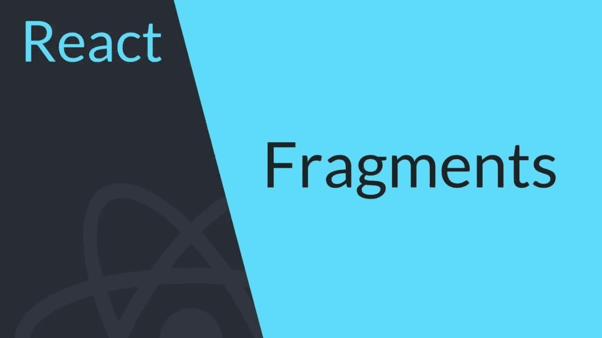

# 反应片段:什么和为什么

> 原文：<https://javascript.plainenglish.io/react-fragments-what-and-why-bee7afa1e0ff?source=collection_archive---------18----------------------->



React 片段是 React 16.2 中发布的一个特性。它们已经存在了一段时间，但相对来说使用较少。让我们来探讨一下这个特性存在的原因。

# 什么是反应碎片？

React 片段是 React 的一个语法补充，它允许包装或分组多个 HTML 元素，而不需要任何额外的 DOM 节点。当一个 React 组件需要返回多个元素时，我们通常会遇到这种情况。

传统的方法是将它们包装在 div 元素中，因为 React 组件只能返回一个元素。这种行为会导致无用的额外标记，还会增加 div 层，使 DOM 树变得沉重。

在单个组件中呈现 3 个子组件的传统解决方案是:

```
const App = () => {
  return (
    <div>
      <ChildA />
      <ChildB />
      <ChildC />
    </div>
  );
}
```

对于片段，这可以是:

```
const App = () => {
  return (
    <React.Fragment>
      <ChildA />
      <ChildB />
      <ChildC />
    </React.Fragment>
  );
}
```

**注意:**反应过来。片段也可以用空标签代替，如< > < / >。

```
const App = () => {
  return (
    <>
      <ChildA />
      <ChildB />
      <ChildC />
    </>
  );
}
```

# 为什么反应碎片？

片段有 3 个典型的用例。

# 1.返回元素组

这是片段的典型用例。如上所述，使用片段避免了额外的 div 容器，这些容器会使 DOM 变得沉重，并且在设计样式时经常会引起问题。

# 2.条件渲染

片段使得有条件地呈现元素组变得更加容易，而不需要任何额外的标记。

```
const Login = ({isLoggedIn, name}) => {
    {isLoggedIn ? (
        <>
          <h3>Welcome {name}</h3>
          <p>
            You are logged in!
          </p>
        </>
      ) : (
        <>
          <h3>Login</h3>
              <input type="text" id="username" />
              <input type="password" id="password" />
              <input type="submit" value="Login" />
        </>
      )}
}
```

# 3.使用键控片段渲染数组

碎片可以有关键道具！这是另一个强大的功能，有时非常方便。但是这不能和空标签一起使用。

这在呈现列表时很有帮助，例如:

```
const Glossary = ({items}) => {
  return (
    <>
      {items.map(item => (
        // Without the `key`, React will fire a key warning
        <React.Fragment key={item.id}>
          <dt>{item.term}</dt>
          <dd>{item.description}</dd>
        </React.Fragment>
      ))}
    </>
  );
}
```

# 优势

*   React 片段速度更快，内存消耗更少(DOM 节点更少)。这在具有深树结构的应用程序中很有帮助。
*   由于没有创建额外的 div，样式有时会更容易。有时一些库依赖于父子关系，中间的 div 会导致布局问题。
*   DOM 更容易检查，因为它不那么杂乱。

这就是关于 React fragments 的所有信息！

*原载于 2021 年 7 月 16 日*[*【https://www.wisdomgeek.com】*](https://www.wisdomgeek.com/development/web-development/react/react-fragments-what-and-why/)*。*

*更多内容请看*[*plain English . io*](http://plainenglish.io/)*。报名参加我们的* [*免费每周简讯*](http://newsletter.plainenglish.io/) *。在我们的* [*社区不和谐*](https://discord.gg/GtDtUAvyhW) *获取独家写作机会和建议。*