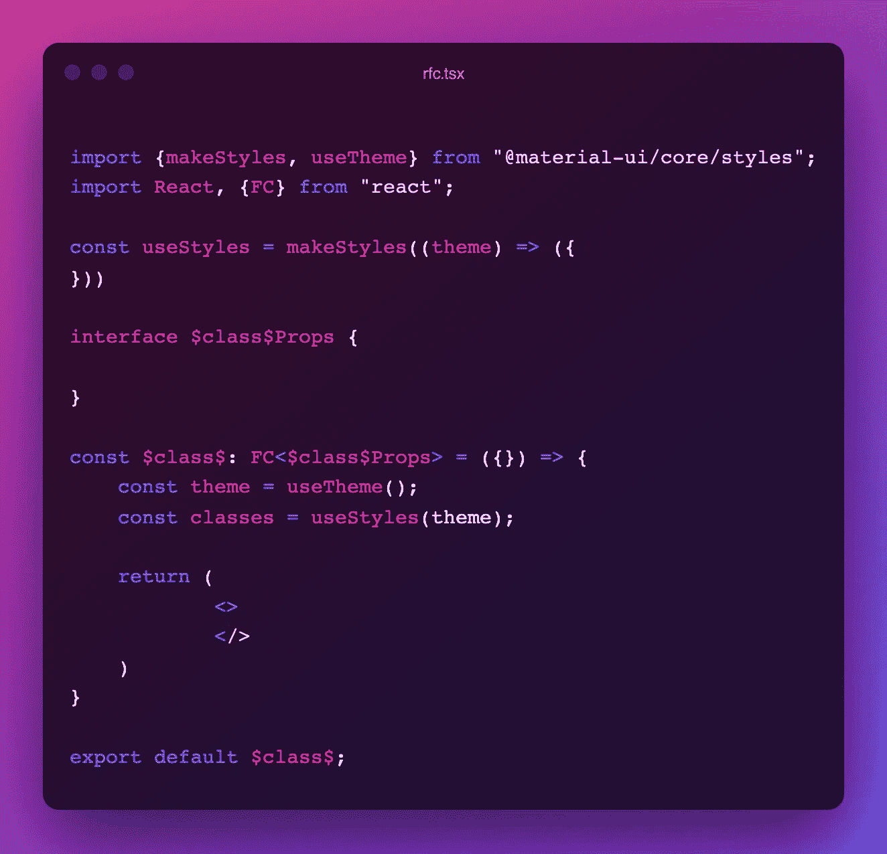
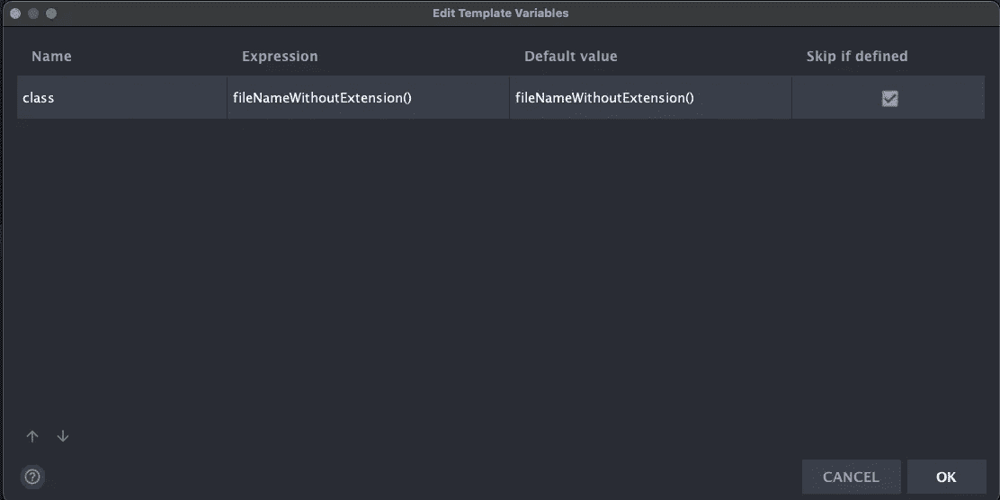

# 反应功能组件样式变得简单

> 原文：<https://javascript.plainenglish.io/react-functional-component-styling-made-easy-9f9e5f703a89?source=collection_archive---------6----------------------->

React Functional Component In One Line

样板代码是一场噩梦。好了，我已经说了。对于每个开发人员来说，围绕组件运行并挑选正确的样板代码是巨大的时间浪费。，而且有了打字稿——这几乎是双倍的努力。

不再有了！

我给你介绍一下，我的`*react-functional-component-includes-styling-global-ready, ver.8*` 片段，或者简称——**rfcisgr 8**！

你猜怎么着也许就`**rfc**`就可以了。

有了这个强大的代码片段，您将能够快速创建风格化的 react 功能组件！

让我们开门见山吧——下面是一个例子:

rfc! Boom! 💥

## 它的作用

*   根据文件名，生成一个空白的类型化的 react 函数组件 const 并导出。
*   创建一个空的`MyComponentProps`接口供组件使用。
*   使用提供的 MUI 主题创建一个空的`makeStyles`对象。
*   初始化一个`classes`变量来轻松地设计组件的布局。

这是诀窍——只需创建一个新的实时模板，并将以下代码粘贴到“模板文本”中。

Paste this inside “Template Text”

和$class 的定义(在编辑变量下):

After clicking Edit Variables, add this definition for $class

就是这样！你都准备好了。

黑客快乐！