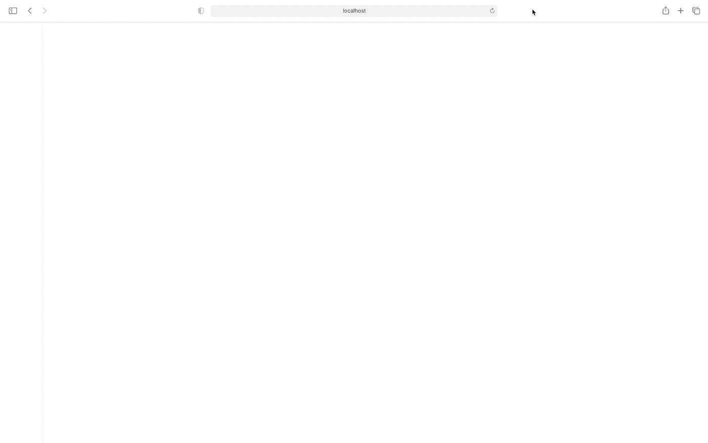
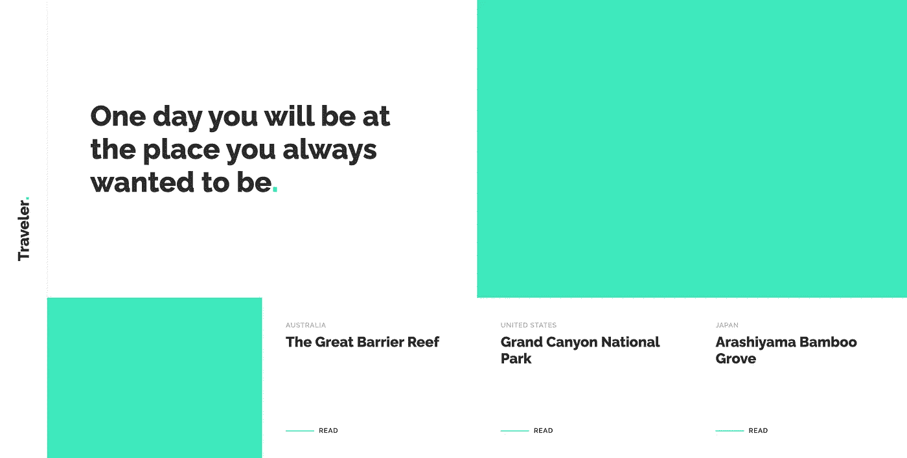
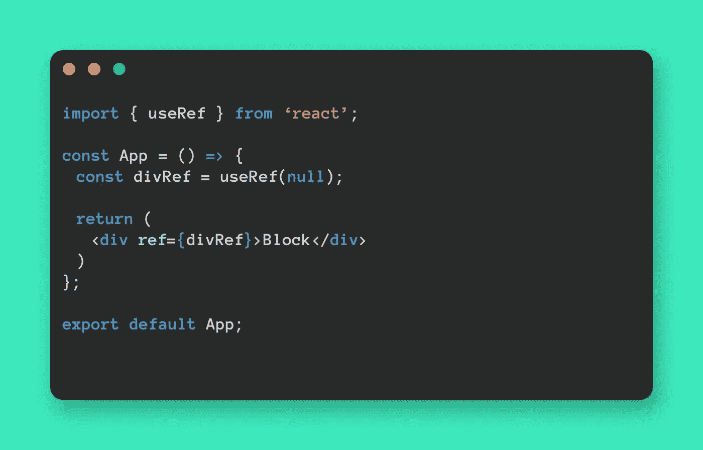

# React + GSAP:建设获奖网站的完美组合🏆

> 原文：<https://javascript.plainenglish.io/react-gsap-the-perfect-combo-for-an-award-winning-website-3d44bded4420?source=collection_archive---------4----------------------->

## 用 React 和 GSAP 让你的项目看起来惊艳，给你的访客留下深刻印象。


Photo by [Roma Kaiuk](https://unsplash.com/@roma_kaiuk?utm_source=unsplash&utm_medium=referral&utm_content=creditCopyText) on [Unsplash](https://unsplash.com/s/photos/motion-capture?utm_source=unsplash&utm_medium=referral&utm_content=creditCopyText)

作为一名*前端 web 开发人员*，我每天定期做的一件事就是让**跟上新的潮流**，还有什么地方比 [Awwwards](https://www.awwwards.com/) 更好，不会错过任何东西呢？

如果你从未去过 awwwards.com，我强烈建议你现在就去看看🌍世界将向你敞开大门！

话虽如此，但无可争议的是，**复杂的动画绝对是一种趋势**和 [**绿袜子**](https://greensock.com/gsap/) (朋友的 *GSAP* )是**允许你用解除武装的简单性**创造它们的工具。

在本文中，我将通过为一个旅游博客创建一个*主页，带您了解将 GSAP 集成到 React 应用程序中的**基础知识。这是我们将要建造的东西的预览图:***



让我们开始吧，好吗？💪🏼

# **设置项目**

如果你想跟随，你可以**下载** [启动文件](https://www.dropbox.com/s/4dumqmditx8cvo2/gsap_react-starter_files.zip?dl=0)，否则，*可以随意试验你的代码*。

我假设你对[的*基本知识*反应](https://reactjs.org/)和 [GSAP](https://greensock.com/gsap/) 有所了解，如果你还没有，以下是一些很棒的入门指南:

*   [React 团队简介](https://reactjs.org/tutorial/tutorial.html)
*   [GSAP 网站上的学习中心](https://greensock.com/learning/)

一旦**下载了项目**并且**解压了 zip 文件**，在代码编辑器中打开项目。首先，通过在终端运行`yarn`来安装纱线卷装。

现在所有的包都安装好了，在终端中运行`yarn start`来启动 React 开发服务器，在您的浏览器中，您应该会看到:



在*启动文件*中，你会发现一个**基本反应项目**，没什么太花哨的。

让我们快速浏览一下**文件夹结构**和**主文件的范围是什么**:

*   我们的布局有些 JSX，
*   在`src/styles/app.scss`中包含了所有必要的样式，
*   `src/json/articles.js`包含一个常量，带有一些虚拟文章的对象数组，导入并渲染在 src/App.js 中，
*   `src/utils/animations.js`和`src/utils/helpers.js`是空的，我们以后会需要它们。

太好了，*我们已经准备好继续阅读这篇文章中关于🧃的精彩部分了！*

# 用 useRef 钩子将 DOM 节点保存在常量中

在主页上，我们将动画制作*标题*、*引用*、*两个图片、*和*文章卡片*。

为此，我们必须首先**将每个元素的 DOM 节点**保存在一个常量中:这是可能的，因为`useRef`钩子返回了一个**可变 ref 对象**，其`.current`属性被初始化为传递的参数(`initialValue`)。返回的对象**将持续组件**的整个生命周期。



## 1.导入 useRef 挂钩

打开`App.js`并在文件顶部导入`useRef`挂钩:

```
import { useRef } from 'react'; 
```

## 2.创建常量

在 App 函数中，为每个将被动画化的元素创建一个常量，并将所有元素的值设置为`useRef`，并将`initialValue`设置为`null`:

**物品卡片**需要特别注意，因为**属性** `.current` **的值必须是一个数组**。

这可以通过**将** `.current` **设置为空数组** `[]`来轻松实现，接下来我将向您展示如何将 DOM 节点添加到刚刚创建的数组中。

```
const articlesRef = useRef(null);
articlesRef.current = []; 
```

## 3.传递 ref 标签对象以作出反应

要传递 ref **标签对象**来作出反应，请使用`<div ref={myRef}>`，以便在 DOM 节点发生变化时，`.current`属性将与该节点相对应。

对于文章列表，**创建一个可重用的函数**，帮助将 DOM 节点添加到数组中**。打开`helpers.js`并通过以下代码:**

在`App.js`中，导入您刚刚创建的函数。

它期望作为参数**的 DOM 节点**和**的 ref 常量**，并且应该在文章数组的映射中调用**，如下所示:**

# 🕺🏼是时候采取一些行动了

下面的步骤将使*网站变得栩栩如生*。🌺

## 1.创建补间动画

在`animations.js`中，为每个区块创建一个[补间](https://greensock.com/docs/v3/GSAP/Tween)或[时间线](https://greensock.com/docs/v3/GSAP/Timeline)，随意定制它们。

记得**将 GSAP 导入到文档**中。😉

```
import gsap from 'gsap';
```

**为我们想要制作动画**的每个元素**创建一个** `ref` **会给我们的代码**增加很多噪声，这可以通过使用 GSAP 的选择器实用程序`gsap.utils.selector` **来避免，就像我在`ImageAnimation`中所做的那样，轻松地选择后代元素**。

我们的动画已经准备好摇滚了！🎉

## 2.轮到 useEffectLayout 了

在`App.js`中，导入`useEffectLayout`钩子，还有你刚刚创建的动画，不要忘记导入 GSAP，你将使用它来创建一个最终的时间线来处理所有单个动画的时间。

```
import { useRef, useLayoutEffect } from 'react';
import { articlesAnimation, h1Animation, h2Animation, imageAnimation } from './utils/animations';
import gsap from 'gsap'; 
```

最后，**初始化动画**:

…然后**就这样**！🏆

# 🎓结论

GSAP 和 React 会让你的项目**看起来惊艳**和**给你的访客留下深刻印象**！✨

我真心希望这篇文章能帮助你开始了解 GSAP 并做出反应。

这只是一个**初学者指南**，如果你有任何*疑问*或*问题*，欢迎**留下评论**，让我知道**你是否想阅读关于这两种技术**的更高级的内容。

# 🔗有用的链接

*   **GitHub 资源库:**[https://github.com/GiuliaMalaroda/GreenSock-GSAP-in-React](https://github.com/GiuliaMalaroda/GreenSock-GSAP-in-React)
*   **现场版:**【https://gsap-in-react.vercel.app/】T2

*更多内容尽在*[***plain English . io***](http://plainenglish.io)