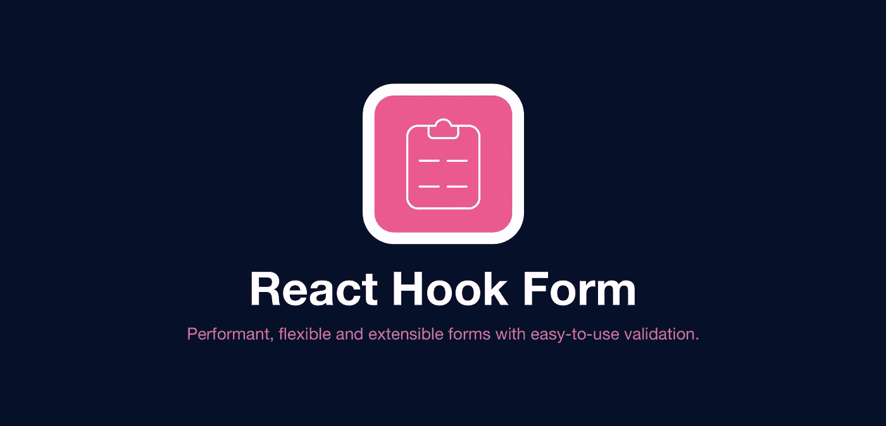

# React Hook 表单教程示例

> 原文：<https://javascript.plainenglish.io/react-hook-form-tutorial-with-examples-34ac9aea3e55?source=collection_archive---------4----------------------->

你正在寻找一个易于使用的具有许多功能的表单包吗？那么这个教程就是给你的！



## 表单的重要性

到目前为止，在我参与的许多项目中，我不得不使用表单模块来收集用户的输入，一个表单可以有许多标准。🙂

这些数据可以用于注册、登录、数据收集、用户设置以及更多用例。对于开发人员来说，这是一个非常重要的责任。

由于扩展和需求，每个表单的定制验证和提交处理程序可能非常复杂。

完成本教程后，您可以开始使用 React Hook 表单库并创建带有验证的定制表单。

## 反应挂钩形式

React Hook 表单使表单更容易使用。与自定义创建的表单相比，开发人员可以用更少的代码行实现表单。它有很好的性能，并且很容易用来实现自定义表单。

React 钩子表单使用`ref`代替组件状态。这减少了重新渲染并提供了更好的性能。

可以在这里访问[官方 React 钩子形态库](https://react-hook-form.com/)。

*   包(react-hook-form@7.17.1)大小为 8.2 kb 你可以在这里查看[](https://bundlephobia.com/package/react-hook-form@7.17.1)
*   **不依赖于其他库**
*   **拥有强大的类型脚本支持**

**要在现有应用程序中安装 React Hook 表单:**

```
npm install react-hook-form
```

**如果你想在 Next.js 中使用 react-hook-form，你可以看看我关于用 Next.js 开始开发的另一个故事。**

**[](https://melih193.medium.com/next-js-start-web-development-with-next-js-create-next-app-4042ca071dcb) [## Next.js —使用 Next.js & create-next-app 开始 web 开发

### 使用 Next.js 在几秒钟内开始开发

melih193.medium.com](https://melih193.medium.com/next-js-start-web-development-with-next-js-create-next-app-4042ca071dcb) 

## 如何使用 React 钩子表单

让我们用 TypeScript 创建一个简单的带有自定义验证的 React 钩子表单

首先，我们从`react-hook-form`进口了`useForm`。

将我们的输入类型创建为:

```
type Inputs = {  
  example: string,  
  exampleRequired: string,
};
```

然后我们得到`useForm`的道具如下

```
const { register, handleSubmit, watch, formState: { errors } } = useForm<Inputs>();
```

**Register** 方法用于通过输入字段的**名称**和**属性
*注:**注册时，输入名称必须**唯一。**

```
<input {...register("inputName")} />{/* register your input into the hook */}      
<input defaultValue="test" {...register("example")} /> {/* include validation with required or other standard HTML validation rules */}      
<input {...register("exampleRequired", { required: true })} />
```

**HandleSubmit** 方法用于表单 **onSubmit** 事件

**观察**方法用于观察特定输入者的姓名

```
// watch input value by passing the name of it
console.log(watch("example"))
```

每当`example`输入改变时，它将观察变化并记录数值。

**FormState** 用于从登记的输入中获取误差。

您可以查看下面的 CodeSandbox URL 来演示我们到目前为止所做的工作。

## 确认

我们可以在 React Hook 表单中使用如下几种验证:

*   需要
*   部
*   最大
*   最小长度
*   maxLength
*   模式
*   使生效

下面是验证用法的另一个例子:

可以查看 React Hook 表单提供的 [**其他例子**](https://github.com/react-hook-form/react-hook-form/tree/master/examples) 。

## 结论

如您所见，我们已经使用 React Hook 表单创建了第一个表单。它非常容易集成，我们可以在几秒钟内开始使用。它有很好的开发者支持，在我看来让开发更容易。

React 钩子表单也可以很好地与状态管理库如 **Redux** 和 React 主题库如 Material-UI 配合使用。

如果你打算在 React Native 中使用 React Hook 表单，它们也有很好的支持。

仅此而已！

*如果你觉得这篇文章很有帮助，你* [***可以通过使用我的推荐链接注册一个***](https://medium.com/@melihyumak) **[***中级会员来访问类似的***](https://melihyumak.medium.com/membership) *。***

***跟我上*** [**推特**](https://twitter.com/hadnazzar)


Subscribe for more on [Youtube](https://www.youtube.com/c/TechnologyandSoftware?sub_confirmation=1)

# 编码快乐！

梅利赫

*更多内容请看*[***plain English . io***](http://plainenglish.io/)**