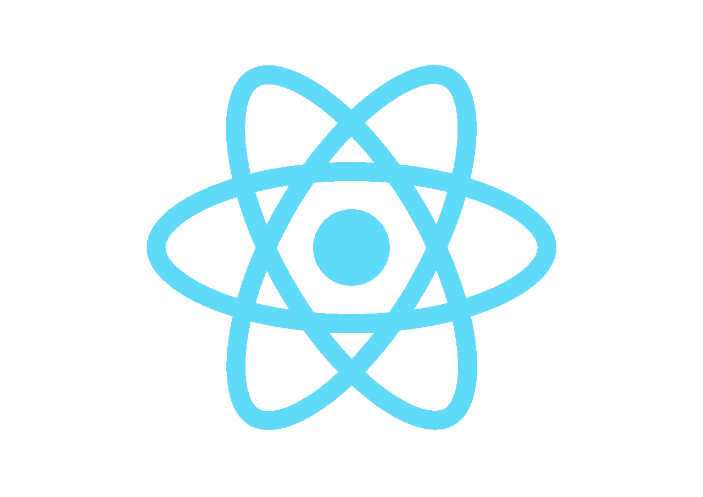

# React 挂钩:使用回调

> 原文：<https://javascript.plainenglish.io/react-hook-usecallback-82efba1ab4a9?source=collection_archive---------9----------------------->

如果你还不熟悉 useState 和 useEffect 挂钩，我强烈推荐你去看看。它们是最常用的钩子，本质上是 React now 管理(过去被认为是“无状态的”)功能组件中的状态的方式。

在最近的一次采访中，我被要求将我的一个类组件重构为一个功能组件。当我开始构建功能组件，用 useState 挂钩设置状态，并将 componentDidMount 改为 useEffect 挂钩时，我遇到了一个新问题。如何防止我的 useEffect 过度重渲染？



根据 useCallback 挂钩的 [React 文档，挂钩本身:](https://reactjs.org/docs/hooks-reference.html#usecallback)

*"返回一个*[](https://en.wikipedia.org/wiki/Memoization)**回调。**

**传递一个内联回调和一个依赖数组。* `*useCallback*` *将返回回调的记忆版本，仅当其中一个依赖关系发生变化时才会发生变化。这在向依赖引用相等的优化子组件传递回调以防止不必要的渲染时很有用(例如* `*shouldComponentUpdate*` *)。”**

```
*const memoizedCallback = useCallback(
  () => {
    doSomething(a, b);
  },
  [a, b],
);*
```

*所以本质上，这为我们提供了一种防止不必要的重新渲染的方法。*

*在我的例子中，我正在重写一个组件，该组件获取歌曲数据并将其分配给该组件的状态。*

*我的初始类组件在挂载时获取一个数据列表，并将歌曲列表设置为“歌曲”的组件状态。这看起来像:*

```
*export default class MySongs extends Component { state = {
       songs: []
  } componentDidMount() {
        fetch(songsURL)
          .then((*response*) *=>* *response*.json())
          .then((*songs*) *=>* this.setState({ songs: *songs* })); } render(){
     return(...)
  }
}*
```

*现在，作为一个功能组件，我们将使用 useEffect 钩子来模仿上面的 componentDidMount()函数，然而，React docs 声明*"传递给* `*useEffect*` *的函数将在渲染提交到屏幕后运行。将效果视为从 React 的纯功能世界进入命令世界的出口。默认情况下，效果会在每次完成渲染后运行，但您可以选择仅在某些值* *发生变化时启动它们* [*。”*](https://reactjs.org/docs/hooks-reference.html#conditionally-firing-an-effect)*

*最后一句引用了依赖数组，它可以作为第二个参数传递给 useEffect 钩子。当依赖数组中的值发生变化时，将再次调用 useEffect。*

****那么让我给你展示一下我从哪里开始，以及*** [***使用回调***](https://reactjs.org/docs/hooks-reference.html#usecallback) ***来解决问题的地方。****

*当我开始将它改写成一个功能组件时，我想到了这里:*

```
*export default *function* MySongs() {
   *const* [songs, setSongs] = useState([]); *const* fetchSongs = () *=>* {
      fetch(songsURL)
        .then((*response*) *=>* *response*.json())
        .then((*songs*) *=>* setSongs(*songs*));
    } useEffect(() => {
      fetchSongs()
   }, [])...*
```

*正如你在这里看到的，在我的 useEffect 钩子中，我包含了一个空的依赖数组来避免无数次的重渲染。虽然这确实可以防止重新渲染，但 React 会抛出错误:*

**“React Hook use effect 缺少依赖项:“fetchSongs”。要么包含它，要么删除依赖数组 react-hooks/exhaustive-deps”。**

*这意味着 fetchSongs 是我们的 useEffect 钩子中的一个必需的依赖项，但是如果你把它包含在依赖数组中，我们就会陷入一个重复的重新渲染循环。*

*修复出奇的简单:**在我们的 fetchSongs 函数上使用 Callback！***

*在这里，您将看到与上面基本相同的代码，但是现在在我们的 useEffect 中利用了所需的依赖关系，并且在我们的 fetchSongs 函数上实现了 useCallback 钩子以防止重新呈现。*

```
*export default *function* MySongs() {
   *const* [songs, setSongs] = useState([]); *const* fetchSongs = **useCallback(()** *=>* {
      fetch(songsURL)
        .then((*response*) *=>* *response*.json())
        .then((*songs*) *=>* setSongs(*songs*));
    }, [setSongs])useEffect(() => {
      fetchSongs()
   }, [fetchSongs])...*
```

*现在，我们的 useEffect 挂钩可以正常工作了，这样我们的功能组件就可以在挂载时获取歌曲数据，而不会过多地重新呈现或抛出错误。*

*谢谢收听，我们很快会再见的。*

****干杯！****

**更多内容请看*[*plain English . io*](http://plainenglish.io/)*