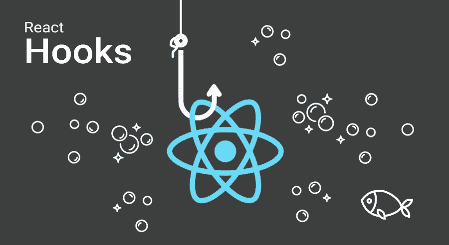

# React Hooks —您需要知道的一切

> 原文：<https://javascript.plainenglish.io/react-hooks-all-that-you-need-to-ever-know-d197109e99da?source=collection_archive---------4----------------------->

当我开始将我们以前的产品从使用类过渡到使用功能组件和钩子时，我面临了一些挑战，花了一些时间来理解它的细微差别。

下面是 react 中钩子世界的一个快速浏览，以及在开始使用钩子之前你需要知道的一些基本知识。

我已经尝试了积累所有最常用的钩子，以及如何在一个地方构建定制钩子，这样你就不必搜索多个地方来知道在什么场景中使用哪个钩子。



> **什么时候使用功能组件和类？**

如果你的组件除了接受一些道具和渲染之外没有更多的功能，就选择功能性。你可以把这些看作是纯粹的函数，因为在给定相同的道具的情况下，它们的渲染和行为总是相同的。还有，他们不关心生命周期方法，也没有自己的内部状态。

因为它们是轻量级的，所以将这些简单的组件编写为功能组件是非常标准的。

如果你的组件需要更多的功能，比如保持状态，那就用类来代替。

> **不同类型的反应钩**

1.  **使用状态()**

在类组件中，您必须在类内部创建一个构造函数，并在那里定义状态变量。然后使用 setState 方法来设置它的值。

```
constructor(props) {

   super(props);

   this.state = {

     count: 1

   };
```

然后你会称之为

```
this.setState({

     count: count + 1

   });
```

现在，如果使用 useState 钩子，可以显著减少代码行。首先，你不需要任何构造函数。可以直接定义为
`const [count, setCount] = useState(1);`

**useState()**方法返回一对状态变量的当前值和一个函数，在它的帮助下我们可以更新这个值。

这里计数是状态变量。setCount 是您用来设置该变量的值的方法，1 是您将其初始化为的默认值。

当你想设置这个状态变量的值时，可以直接调用
`setCount(count + 1);`

**2。useEffect()**

Effects 挂钩 **useEffect** ，增加了从函数组件执行副作用的能力(比如从 API 获取数据、设置订阅以及手动更改 React 组件中的 DOM)。

它的作用与 React 类中的**componentid mount**、**componentid update**和**componentid unmount**相同。

使用 *useEffect* 钩子，它告诉 React 组件在渲染后需要做一些事情。React 会记住你传递的函数，在 DOM 操作后调用它。

```
// defining  state variable

 const [book, setBookProperties] = useState({ name: "Alchemist", author: "Paulo Coelho" });
```

> **使用 useEffect 作为组件安装**

```
useEffect(() => {
   console.log("calling useEffect when book is changed");
   setName({ name: "Hippie", author: "Paulo Coelho" });

 }, []);
```

在上面的例子中， *useEffect* 被用作类组件中的 *componentDidMount* 方法。当我们将第二个参数作为空参数传递时，我们明确提到在组件加载时只调用 useEffect 方法一次。即使值发生变化，它也不会再次触发。

> **使用效果作为组件更新**

```
useEffect(() => {
   console.log("calling useEffect when book is changed");
   setName({ name: "Hippie", author: "Paulo Coelho" });

 }, [book]);
```

在上面的例子中， *useEffect* 被用作类组件中的 *componentDidUpdate* 方法。当我们传递第二个参数时，我们明确地提到每当传递的第二个参数的值改变时调用 useEffect 方法。所以在这种情况下，只要属性书发生变化，就会调用 useEffect

> **使用 useEffect 作为组件将卸载**

```
useEffect(() => { setName({ name: "Hippie", author: "Paulo Coelho" });return () => { console.log("Cleaning up...") };
 }, [book]);
```

在上面的例子中， *useEffect* 被用作类组件中的 *componentWillUnmount* 方法。当我们从 useEffect 方法返回时，这段代码将在组件即将被卸载时被触发。所以我们可以在这里添加清理代码。

> **useEffect** 可以不返回任何内容，也可以返回一个在两种情况下执行的函数
> 
> -在 useEffect 下次运行之前
> 
> -当组件卸载时。

**3。useContext()**

```
const value = useContext(MyContext);
```

这可以用来在父组件中设置一个上下文值，而不必将值传递给每个子组件，我们可以很容易地从上下文中获取值。

```
const themes = {
  light: {
    foreground: "#000000",
    background: "#eeeeee"
  },
  dark: {
    foreground: "#ffffff",
    background: "#222222"
  }
};

const ThemeContext = React.createContext(themes.light);

function App() {
  return (
    <ThemeContext.Provider value={themes.dark}>
      <Toolbar />
    </ThemeContext.Provider>
  );
}

function Toolbar(props) {
  return (
    <div>
      <ThemedButton />
    </div>
  );
}

function ThemedButton() {
  const theme = useContext(ThemeContext);  return (    <button style={{ background: theme.background, color: theme.foreground }}>      I am styled by theme context!    </button>  );
}
```

当组件上方最近的`<MyContext.Provider>`更新时，这个钩子将触发一个重新呈现器，把最新的上下文`value`传递给那个`MyContext`提供者。即使祖先使用了`[React.memo](https://reactjs.org/docs/react-api.html#reactmemo)`或`[shouldComponentUpdate](https://reactjs.org/docs/react-component.html#shouldcomponentupdate)`，使用`useContext`重新呈现仍然会从组件本身开始。[ [链接](https://reactjs.org/docs/hooks-reference.html#usecontext)

**4。useReducer()**

```
const [state, dispatch] = useReducer(reducer, initialArg, init);
```

这和 Redux 很像。它接受一个类型为`(state, action) => newState`的缩减器，并通过一个`dispatch`方法返回当前状态。

当您的复杂状态逻辑涉及多个子值或者下一个状态依赖于前一个状态时，`useReducer`通常比`useState`更好。`useReducer`还允许你优化触发深度更新的组件的性能，因为[你可以向下传递](https://reactjs.org/docs/hooks-faq.html#how-to-avoid-passing-callbacks-down) `[dispatch](https://reactjs.org/docs/hooks-faq.html#how-to-avoid-passing-callbacks-down)` [而不是回调](https://reactjs.org/docs/hooks-faq.html#how-to-avoid-passing-callbacks-down)。[ [链接](https://reactjs.org/docs/hooks-reference.html#usereducer)

```
function init(initialCount) {  return {count: initialCount};}
function reducer(state, action) {
  switch (action.type) {
    case 'increment':
      return {count: state.count + 1};
    case 'decrement':
      return {count: state.count - 1};
    case 'reset':      
      return init(action.payload);    
    default:
      throw new Error();
  }
}

function Counter({initialCount}) {
  const [state, dispatch] = useReducer(reducer, initialCount, init);  return (
    <>
      Count: {state.count}
      <button
        onClick={() => dispatch({type: 'reset', payload: initialCount})}> Reset </button>
      <button onClick={() => dispatch({type: 'decrement'})}>-</button>
      <button onClick={() => dispatch({type: 'increment'})}>+</button>
    </>
  );
}
```

**5。使用 Dispatch()**

这可以在 react-redux 应用程序中使用。

```
const dispatch = useDispatch()
```

这个钩子从 Redux 存储中返回对`dispatch`函数的引用。您可以根据需要使用它来调度操作。如果你已经有一个 redux 应用程序，这是调度动作最简单的方法。【[链接](https://react-redux.js.org/api/hooks)

```
import React from 'react'
import { useDispatch } from 'react-redux'export const CounterComponent = ({ value }) => {
  const dispatch = useDispatch()return (
    <div>
      <span>{value}</span>
      <button onClick={() => dispatch({ type: 'increment-counter' })}>
        Increment counter
      </button>
    </div>
  )
})
```

> 【useDispatch()和 useReducer()的区别
> 
> 这两者都提供了一个`dispatch`功能来将动作分派给 redux 存储，但是`useReducer`不**也不**更新 redux 存储。`useReducer`是一个常规的 react 钩子，允许组件以函数的方式应用本地状态更新，类似于 Redux 使用的模式，Redux 是一个非常常见的*全局*应用程序状态管理库。把`useReducer`看成 Redux 的组件状态版本，也就是 app 状态。
> 
> `useDispatch`是由`react-redux`提供的一个钩子，它消耗一个 redux 上下文(包含存储/状态)，类似于`connect`高阶组件在包装一个组件时提供的功能。[ [链接](https://stackoverflow.com/a/60984143/629908)

6.useStore()

```
const dispatch = useStore()
```

这个钩子返回一个对传递给`<Provider>`组件的相同 Redux 存储的引用。[ [链接](https://react-redux.js.org/api/hooks#usestore)

> 这个钩子应该不会经常使用。首选`useSelector()`。

```
import React from 'react'
import { useStore } from 'react-redux' 
export const CounterComponent = ({ value }) => {  
    const store = useStore()   
    return <div> { store.getState() } </div>
}
```

7 .使用选择器()

允许您访问功能组件中的冗余状态值。

```
const result: any = useSelector(selector: Function, equalityFn?: Function)
```

选择器在概念上大致相当于 `[connect](https://react-redux.js.org/using-react-redux/connect-mapstate)`的`[mapStateToProps](https://react-redux.js.org/using-react-redux/connect-mapstate)` [自变量。将以整个 Redux 存储状态作为唯一参数来调用选择器。每当函数组件呈现时，选择器都将运行(除非它的引用自组件的前一次呈现以来没有改变，以便钩子可以在不重新运行选择器的情况下返回缓存的结果)。`useSelector()`还将订阅 Redux store，并在调度操作时运行您的选择器。[](https://react-redux.js.org/using-react-redux/connect-mapstate) [链接](https://react-redux.js.org/api/hooks)

```
const favoriteBooks = useSelector( 
(state) => state.bookData.favoriteBooks )
```

> **区别选择器传递给** `**useSelector()**` **和** `**mapState**` **功能**
> 
> -选择器可以返回任何值作为结果，而不仅仅是一个对象。选择器的返回值将作为`useSelector()`钩子的返回值。
> 
> -当调度一个动作时，`useSelector()`将对先前的选择器结果值和当前结果值进行参考比较。如果它们不同，组件将被强制重新渲染。如果它们相同，组件将不会重新呈现。
> 
> -选择器功能没有*而不是*接收到一个`ownProps`参数。然而，道具可以通过关闭或使用 curried 选择器来使用。
> 
> `- useSelector()`默认使用严格的`===`引用相等检查，而不是浅层相等(在 connect 中使用)。
> 
> **注意**—您可以在一个功能组件中多次调用`useSelector()`。对`useSelector()`的每次调用都会创建一个对 Redux store 的单独订阅。由于 React Redux v7 中使用的 React 更新批处理行为，导致同一个组件中的多个`useSelector()`返回新值的调度操作应该只导致一次重新渲染。

**8。useMemo()**

```
const memoizedValue = useMemo(() => computeExpensiveValue(a, b), [a, b]);
```

传递一个“创建”函数和一组依赖项。`useMemo`仅当其中一个依赖关系发生变化时，才会重新计算记忆值。这种优化有助于避免每次渲染时进行昂贵的计算。

> **注意** —记住传递给`useMemo`的函数在渲染时运行。不要做任何渲染时通常不会做的事情。

**9。useCallback()**

```
const memoizedCallback = useCallback(
  () => {
    doSomething(a, b);
  },
  [a, b],
);
```

传递内联回调和依赖项数组。`useCallback`将返回回调的记忆化版本，只有当其中一个依赖关系改变时，该版本才会改变。这在向依赖引用相等的优化子组件传递回调以防止不必要的渲染时很有用(例如`shouldComponentUpdate`)。

`useCallback(fn, deps)`相当于`useMemo(() => fn, deps)`。

**10。定制挂钩**

使用自定义钩子，你可以删除冗余的代码逻辑。此外，您可以继续在自定义挂钩中使用其他挂钩函数，如 useState()或 useSelector()等，这样可以使这些方法更具可扩展性。

**自定义钩子是一个 JavaScript 函数，名字以“** `**use**` **”开头，可以调用其他钩子。**

例如

创建一个自定义挂钩来切换布尔值

```
const useToggle = (initialState = false) => {      
   const [state, setState] = useState(initialState);        
   const toggle = useCallback(() => setState(state => !state), []);        return [state, toggle]}
```

现在，当你想使用这个钩子的时候，你可以像下面一样简单地使用它

```
const [isTextChanged, setIsTextChanged] = useToggle();
```

> 一些非常酷的预烤鱼钩和好的读物

[https://usehooks.com/](https://usehooks.com/)

[https://blog . bitsrc . io/writing-your-own-custom-hooks-4 fbcf 77 e 112 e](https://blog.bitsrc.io/writing-your-own-custom-hooks-4fbcf77e112e)

[](https://www.freecodecamp.org/news/how-to-create-react-hooks/) [## 如何构建自己的 React 钩子:一步一步的指南

### 自定义 React 挂钩是一个重要的工具，可以让您向 React 应用程序添加特殊的、独特的功能。在…

www.freecodecamp.org](https://www.freecodecamp.org/news/how-to-create-react-hooks/) 

*更多内容看*[***plain English . io***](http://plainenglish.io/)