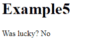

# React 钩子去神秘化

> 原文：<https://javascript.plainenglish.io/react-hooks-demystified-2a8370076b82?source=collection_archive---------15----------------------->


Photo by [Christopher Gower](https://unsplash.com/@cgower?utm_source=medium&utm_medium=referral) on [Unsplash](https://unsplash.com?utm_source=medium&utm_medium=referral)

React Hooks 确实很酷，但这不是魔法的问题。这篇文章将介绍一些基础知识，希望能让一些事情变得更清楚。

# 到底什么是钩子？

解释一下，和已知的东西比较要简单得多。因此，一个典型的组件返回 JSX，如下例所示:

```
import React from 'react';const Comp1 = (): JSX.Element => {
  ** return <h1>The time is {new Date().toISOString()}</h1>;**
};export default Comp1;
```

那么 hooks 呢？他们返回变量和函数而不是 JSX。

> 组件返回 JSX，钩子返回(一个或多个)函数、变量或对象。

好吧，看起来很容易。但是为什么不使用模块呢？类似于:

```
export function Sum(number1: number, number2: number): number { 
  return number1 + number2;
};
```

因为模块不能与 React“交互”；钩子是用来访问 React 特性的，比如`useState`。请在文章的最后阅读更多相关内容。

现在，让我们深入一些例子。

# 挂钩示例—使用计数器

考虑下面的代码。它返回一个数字和一个函数(名为“increment”)。

```
import React from 'react';const useCounter = (): [number, () => void] => { const [number, setNumber] = React.useState(0); function increment() {
        setNumber(randomNumber => randomNumber + 1);
     } **   return [number, increment];**};export default useCounter;
```

使用它的完整代码是:

```
import React from 'react';
**import useCounter from './usecounter';**function Hook1Example() { **// Grab the number and the increment-function
  const [number, inc] = useCounter();**return <>
    Number: **{number}**
    <button **onClick={inc}**>Increment</button>
  </>}export default Hook1Example;
```

在他们最简单的例子中，钩子基本上就是这样。

# 挂钩示例— useIsWeekEnd

从钩子返回的参数数量可以是任意的，参数返回的方式也可以改变。让我们用例子来展示一下:

## 作为一个数组:

…在这种情况下，作为一个数字和一个函数。

```
import React from 'react';const useCounter = ()**: [number, () => void]** => { const [number, setNumber] = React.useState(0); function increment() {
        setNumber(randomNumber => randomNumber + 1);
    } **return [number, increment];**};export default useCounter;
```

## 作为单一项目:

…在这种情况下，一个布尔值:

```
import React from 'react';const useIsWeekend = ()**: boolean** => { const [isWeekEnd, setIsWeekEnd] = React.useState<boolean>(false); React.useEffect(() => {
      setIsWeekEnd([6, 0].includes(new Date().getDay()))
   }, []); ** return isWeekEnd;**};export default useIsWeekend;
```

## 作为一个对象:

…非常适合解构:)

```
import React from 'react';const useCalculator = (): **{ result: number; Add: (i: number) => void; Set: (i: number) => void; }** => {const [result, setResult] = React.useState(0); function Add(i: number) {
        setResult(result => result + i);
    } function Set(i: number) {
        setResult(result);
    } **  return { result, Add, Set }**};export default useCalculator;
```

组件:

```
import React from 'react';
import useCalculator from './usecalculator';function Hook2() { **const { result, Add, Set } = useCalculator()** return <>
      Result: {result}<br />
      <button onClick={() => Add(1)}>Increment</button>
      <button onClick={() => Add(-1)}>Decrement</button>
      <button onClick={() => Set(0)}>Reset</button>
      </>}export default Hook2;
```

# 挂钩示例— useIsLucky

与组件一样，挂钩可能会触发重新呈现。考虑下面的例子:

```
import React from 'react';const useIsLucky = (userID: string): [boolean | undefined] => { const [isLucky, setIsLucky] = React.useState<boolean | undefined>(undefined); React.useEffect(() => { **// Fake a call to the API where the user
         // is checked if they're lucky
        setTimeout(() => {
            setIsLucky(Math.random() > 0.5)
        }, 1000);**}, [userID]); return [isLucky];};export default useIsLucky;
```

组件:

```
import React from 'react';
import useIsLucky from './useislucky';function Example5() { **const [result] = useIsLucky("Tomas");** if (result !== undefined)
    return <>Was lucky? {result ? "Yes" : "No"}</>
  else
    return <>Loading..</>}export default Example5;
```



# 函数 vs 钩子！

好了，钩子的基本知识已经讲过了。但在放手之前，还有一件事需要了解:

> 什么时候应该使用钩子，什么时候应该使用普通模块(例如 ts-带代码的文件)？

嗯，归结为 React 的依赖性。考虑下面的代码，其中找不到 React 的依赖项。好吧，它是*命名为* useSumHook，但实际上，它不是一个钩子。

```
const useSumHook = (number1: number, number2: number): number => {
   return number1+number2;
};export default useSumHook;
```

就我个人而言，我会将这个函数存储在. ts 文件中，如下所示:

```
export function Sum(number1: number, number2: number): number { 
  return number1 + number2;
};
```

然后将其用作:

```
import { Sum } from './misc';
```

## Git 回购

它不漂亮，但很有用。[https://github.com/tomnil/hooksexample](https://github.com/tomnil/hooksexample)

# 享受:)

*更多内容请看*[***plain English . io***](http://plainenglish.io/)