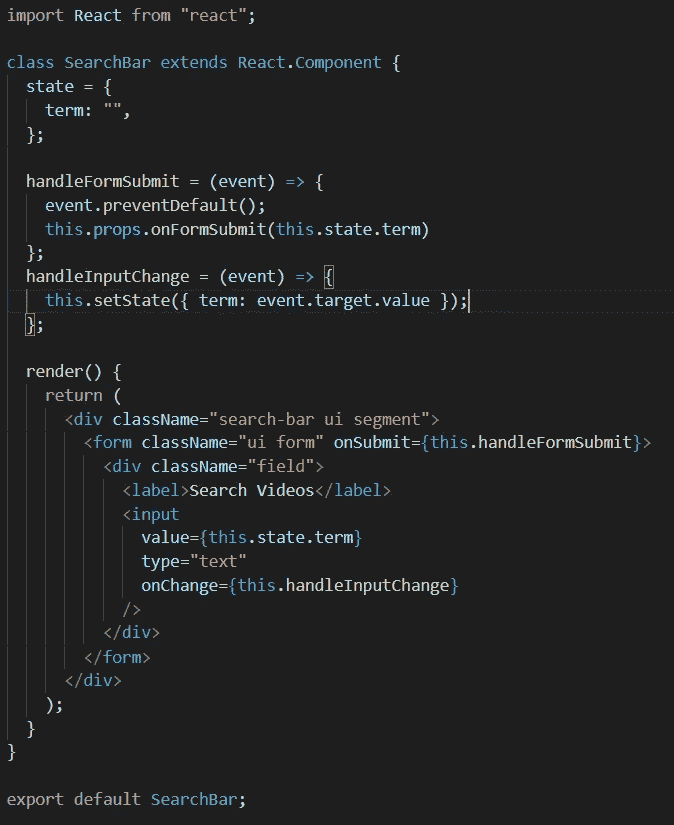
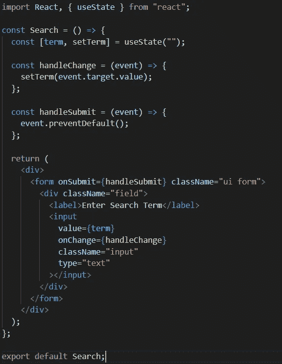
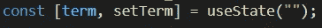

# 反应钩子:比你想象的容易

> 原文：<https://javascript.plainenglish.io/react-hooks-easier-than-you-think-b48d9d2b6080?source=collection_archive---------20----------------------->

Photo by [Ferenc Almasi](https://unsplash.com/@flowforfrank?utm_source=medium&utm_medium=referral) on [Unsplash](https://unsplash.com?utm_source=medium&utm_medium=referral)

有时候学习新的东西会让人不知所措并且很乏味。然而，对于*反应钩子*来说，情况并非如此。如果你从来没有花时间学习过*钩子*并且你主要使用*基于类的* d 组件，那么是时候尝试一下了。

当我第一次学习 *React* 时，我只使用了*基于类的*组件，因为这是我所学的，也是我最熟悉的。然而，虽然知道如何利用基于*类的*组件很好，但是它们已经“过时”了。该行业正在并将继续使用基于功能的组件。

*钩子*被创建为一种在函数内部使用*类*生命周期方法和*状态*的方式。这基本上消除了对基于*类的*组件的需求。

**演示这一点最简单的方法是查看基于*类的*组件**中的*状态*

需要考虑的四个要点是:

*   *状态*由`state: {}`初始化。
*   *类*中目标函数和变量的`This`关键字。
*   箭头功能的必要性，以避免基于*类的*组件中`this`关键字的错误。
*   `setState()`对于*状态*的任何变化。

**现在让我们看看一个基于*功能的*组件，并找出语法差异**:

你应该立即注意到的第一件事是没有*类*。

紧接着的第二件事是我们初始化*状态*的方式:

让我们用简单的术语对此进行分解:

*   `term`是你的*状态*在任何给定时刻当前所处的状态。不是写`this.state.term`，而是写`term`。
*   `setTerm`本质上是`setState`，除了有一个更加定制的名字。它的工作原理完全一样，你可以选择它的名字。
*   `useState`是钩子。目的是初始化*状态*中的某个键应该等于什么。因为我们使用了一个字符串，所以我们初始化了一个空字符串。

乍看之下， *React Hooks* 似乎有点让人不知所措，但它的目的是让代码看起来更干净、更简洁。我给了你一个钩子的例子，所以你可以得到语法和结构的要点。还有其他的*钩*像`useEffect`、`useReducer`、`useRef`等。希望你能把它作为未来学习努力的参考工具！

*更多内容请看*[***plain English . io***](http://plainenglish.io/)