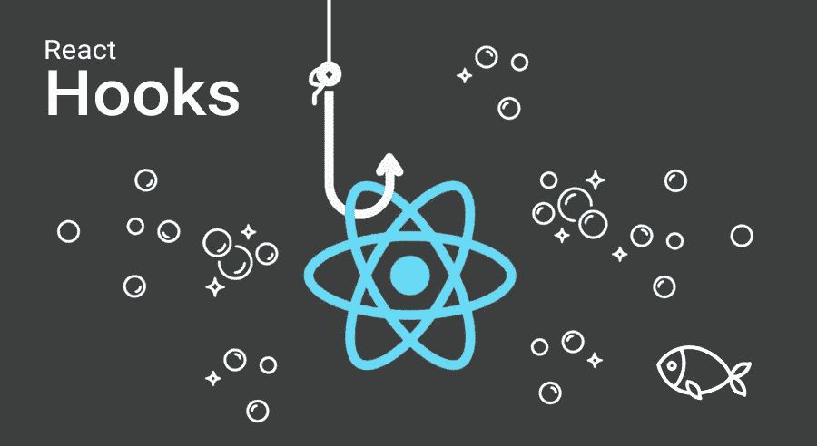
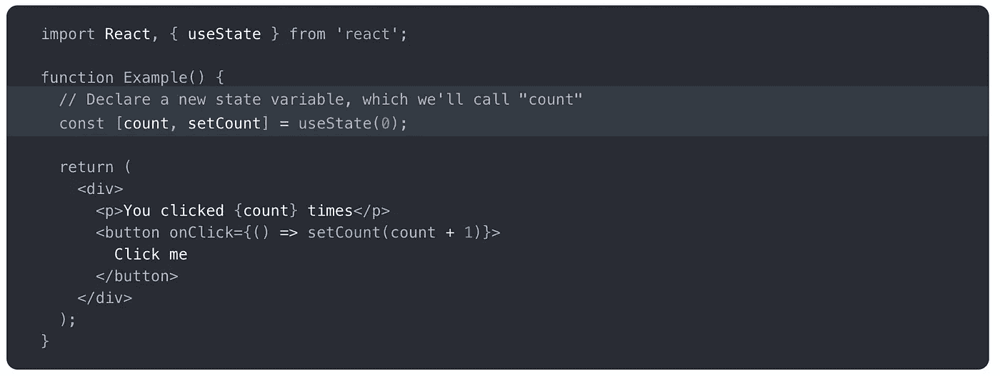
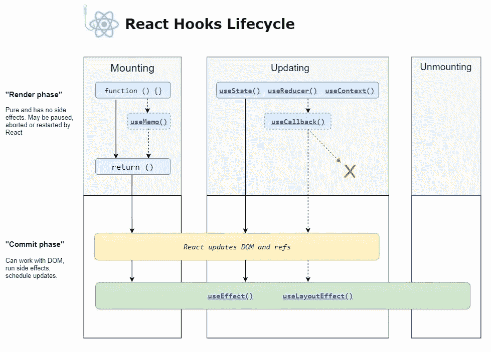
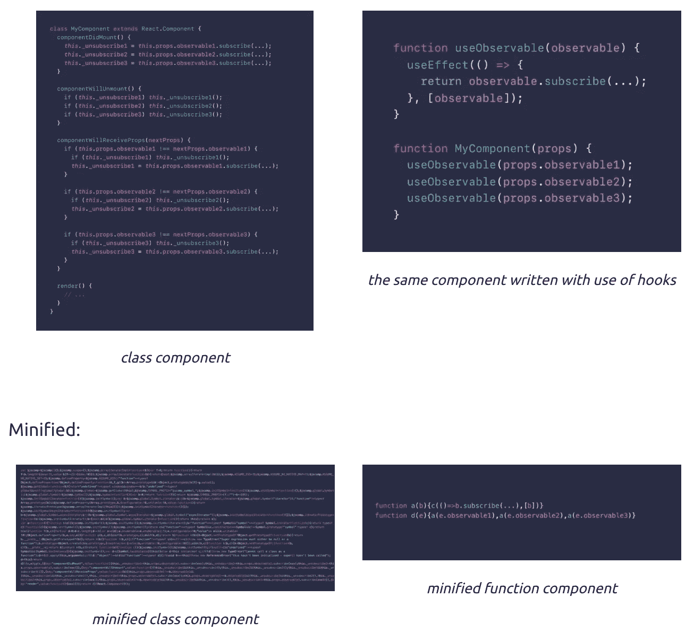

# React Hooks:完全指南

> 原文：<https://javascript.plainenglish.io/react-hooks-the-complete-guide-5c176ca825f6?source=collection_archive---------0----------------------->

## 什么是 React 挂钩，React 面临的挑战，挂钩 API 参考，React 挂钩的优势



# 什么是 React 钩子？

React Hooks 随着 React v16.8 投入生产，它完全改变了我们思考和使用 React 的方式。React Hooks 使我们能够使用函数方法而不是面向对象(类)的方法来构建组件。

> " React 挂钩让你不用写类就可以使用状态和其他 React 特性."— React 文档

React 钩子允许我们获取无状态的功能组件，并对它们应用状态和生命周期方法。因此，这就使得类组件变得多余。然而，类组件仍然可以使用，因为 16.8 是向后兼容的，但是钩子不能在类组件内部使用。

下面的示例呈现了一个计数器。当您单击该按钮时，它会增加该值。



这里，`useState`是一个*钩子。*我们在函数组件内部调用它，给它添加一些本地状态。React 将在重新渲染之间保持这种状态。

但是在我们讨论 React 钩子实际上是什么之前，理解 React 当前面临的挑战以及钩子如何帮助我们解决这些挑战是非常重要的。

# React 中的挑战

## 挑战 1 —难以在不同组件之间重用有状态逻辑

*   为了理解钩子，我们需要退一步考虑代码重用。今天，在 React 应用程序中有很多方法可以重用逻辑。我们可以编写简单的函数，调用它们来计算一些东西。我们也可以编写组件(组件本身可以是函数或类)。组件功能更强大，但是要渲染一些 UI。这使得它们不便于共享非可视化逻辑。这就是我们如何结束复杂的模式，如**渲染道具**和**高阶组件**。但是这些模式要求您在使用组件时重构组件，这可能很麻烦，并且使代码更难理解。如果您在 React DevTools 中查看一个典型的 React 应用程序，您可能会发现一个由提供者、消费者、高阶组件、渲染道具和其他抽象层包围的组件“包装地狱”。如果只有一种通用的重用代码的方式而不是这么多，反应不是更简单吗？
*   函数似乎是代码重用的完美机制。在功能之间移动逻辑最省力。然而，函数内部不能有局部反应状态。如果不重组代码或引入 Observables 这样的抽象，就无法从类组件中提取出“观察窗口大小并更新状态”或“随时间动画化一个值”这样的行为。这两种方法都伤害了我们喜欢的 React 的简单性。
*   使用钩子，你可以从一个组件中提取有状态的逻辑，这样它就可以被独立地测试和重用。**钩子允许你在不改变组件层次的情况下重用有状态逻辑。**这使得在许多组件之间或者与社区共享钩子变得容易。

## 挑战 2—复杂的组件更难理解

*   我们在 React 中看到的另一个挑战是复杂的组件变得难以理解。每种生命周期方法通常都包含一些不相关的逻辑。因此，相互关联的代码被这些生命周期方法分割开来，而完全不相关的代码最终被组合在一个方法中，这使得引入 bug 和不一致性变得太容易了。
*   在许多情况下，也不可能将这些组件分解成更小的组件，因为有状态逻辑无处不在，这使得测试它们变得很困难。
*   **React Hooks 允许您根据相关的部分将一个组件拆分成更小的功能(例如设置订阅或获取数据)**，而不是根据生命周期方法强制拆分。因此，我们可以根据逻辑和它们所属的生命周期方法来分离应用程序关注点。

## 挑战 3——类混淆了人和机器。

*   除了使代码重用和代码组织更加困难之外，我们还发现类可能是学习 React 的一大障碍。你必须了解`this`在 JavaScript 中的工作方式，这与它在大多数语言中的工作方式有很大不同。你必须记住绑定事件处理程序。如果没有不稳定的语法建议，代码会非常冗长。人们可以很好地理解道具、状态和自顶向下的数据流，但仍然与类斗争。
*   另一方面，机器确实会混淆函数和类。例如，缩小器/取消器很难处理类。
*   此外，根据文档，React 团队一直在试验提前编译和拥有组件折叠等特性，但已经意识到类组件可能会鼓励无意的模式，使这些优化退回到更慢的路径。

# 钩子 API 参考



# 状态挂钩—使用状态()

在 React 的早期版本中，功能组件没有状态。现在，从 React 16.8 开始，通过使用 **useState()** 方法，功能组件也可以在钩子的帮助下拥有状态。

下面是在功能组件中声明状态变量的语法

```
const [state, setState] = useState(initialState);
```

返回一个有状态的值和一个更新它的函数。在初始呈现期间，返回的状态(`state`)与作为第一个参数传递的值(`initialState`)相同。

`setState`函数用于更新状态。它接受一个新的状态值，并对组件的重新呈现进行排队。我们可以从组件中的任何地方调用这个函数来更新值。该函数与在类组件中使用 **this.setState()** 方法相同，只是它没有将新旧状态合并在一起。

```
setState(newState);
```

在随后的重新渲染过程中，`useState`返回的第一个值将始终是应用更新后的最新状态。

## 声明多个状态变量

我们可以在一个组件中多次使用 React 钩子。

```
function declaringMultipleStateWithHooks () { // Declare multiple state variables
  const [name, setName] = useState('Ayush');
  const [mobile, setMobile] = useState(8888999989);
  const [address, setAddress] = useState({ 
               street: '#1234, 14th Main Road, 7th Cross Road,           
               city: 'Bangalore', country: 'India'
  });// ...... (other code of component)}
```

更新功能组件中的状态变量。

```
handleName = () => {
  setName('Ayush Verma')
}
```

**功能更新—** 如果新状态是使用之前的状态计算出来的，您可以将一个功能传递给`setState`。该函数将接收以前的值，并返回更新后的值。下面是一个使用两种形式的`setState`的计数器组件的例子:

```
function Counter({initialCount}) {
  const [count, setCount] = useState(initialCount);
  return (
    <>
      Count: {count}
      <button onClick={() => setCount(initialCount)}>Reset</button>
      <button onClick={() => setCount(prevCount => prevCount - 1)}>
       - </button>
      <button onClick={() => setCount(prevCount => prevCount + 1)}>
       + </button>
    </>
  );
}
```

“+”和“-”按钮使用函数形式，因为更新的值是基于以前的值。但是“Reset”按钮使用的是标准形式，因为它总是将计数设置回初始值。

**惰性初始状态—**`initialState`参数是初始渲染时使用的状态。在后续渲染中，它将被忽略。如果初始状态是开销很大的计算的结果，您可以提供一个函数，该函数将仅在初始渲染时执行:

```
const [state, setState] = useState(() => {
  const initialState = someExpensiveComputation(props);
  return initialState;
});
```

**退出状态更新—** 如果将状态挂钩更新为与当前状态相同的值，React 将退出，而不渲染子对象或触发效果。(React 使用`Object.is`比较算法。)

# 效果挂钩— useEffect()

在 React 组件中从 API 获取数据、设置订阅和手动更改 DOM 等操作被称为“**副作用**”或简称为效果，因为它们会影响其他组件，并且不能在渲染前完成。

效果挂钩 **useEffect** ，增加了从功能组件执行副作用的能力。

它与 React 类中的**componentid mount**、**componentid update**和**componentid unmount**的作用相同。效果是在组件内部声明的，因此它们可以访问其属性和状态。就像使用`useState`一样，你可以在一个组件中使用多个效果。

**`**useEffect**`**是做什么的？**通过使用这个钩子，你告诉 React 你的组件需要在渲染后做一些事情。React 将记住您传递的函数(我们称之为“效果”)，并在执行 DOM 更新后调用它。**

****`**useEffect**`**是否每次渲染后都运行？**是的！默认情况下，它会在第一次渲染*和每次更新*后运行。不要从“安装”和“更新”的角度考虑，你可能会发现“渲染后”产生效果更容易。React 保证 DOM 在运行效果时已经更新。每次我们重新渲染的时候，我们都会安排一个不同的*效果，替换之前的那个。*****

## ******使用 useEffect 作为类生命周期方法:******

****1)默认情况下，useEffect 在每次成功渲染后运行。现在，useEffect 方法的行为类似于 **componentDidUpdate** 方法。我们可以把何时调用 effect 作为条件。我们可以将一个数组作为第二个参数传递给 useEffect。这个数组告诉 React，只要数组中的字段发生变化，就调用 useEffect。****

****只有当 name 的值改变时，它才会调用 effect。****

****2)我们还可以通过将一个空数组作为第二个参数传递给 useEffect，使 useEffect 的行为类似于 **componentDidMount** 。****

****如果你传递一个空数组(`[]`)，效果里面的道具和状态都会有初始值。虽然通过`[]`作为第二个参数更接近熟悉的`componentDidMount`和`componentWillUnmount`心智模型，但通常有更好的解决方案来避免过于频繁地重新运行效果。另外，不要忘记 React 将运行`useEffect`推迟到浏览器绘制完成之后，所以做额外的工作不是问题。****

****3)我们也可以使用 Effect 来像 **componentWillUnmount** 方法一样工作。****

****清除功能在组件从 UI 中移除之前运行，以防止内存泄漏。此外，如果一个组件渲染多次(通常都是这样)，在执行下一个效果之前会清理掉前一个效果。****

## ****效果的时间****

****与`componentDidMount`和`componentDidUpdate`不同，在延迟事件期间，传递给`useEffect`的函数在布局和绘制之后触发**。这使得它适用于许多常见的副作用，如设置订阅和事件处理程序，因为大多数类型的工作不应该阻止浏览器更新屏幕。******

****然而，并不是所有的影响都可以推迟。例如，用户可见的 DOM 突变必须在下一次绘制之前同步触发，这样用户就不会感觉到视觉上的不一致。(这种区别在概念上类似于被动和主动事件侦听器。)对于这些类型的效果，React 提供了一个名为`useLayoutEffect`的附加钩子。它和`useEffect`有着相同的签名，唯一不同的是何时开火。****

****虽然`useEffect`被推迟到浏览器完成绘制之后，但它肯定会在任何新的渲染之前触发。React 将总是在开始新的更新之前刷新以前的渲染效果。****

# ****useRef()****

****`useRef`钩子是一个返回可变 ref 对象的函数，该对象的`.current`属性用传递的参数(`initialValue`)初始化。返回的对象将在组件的整个生存期内保持不变。****

```
**const refContainer = useRef(initialValue);**
```

****下面几节将解释`useRef`的两个主要用途:保存一个可变变量和访问 DOM 节点或 React 元素。****

## ****可变值****

****`useRef(initialValue)`是一个内置的 React 钩子，它接受一个参数作为初始值，并返回一个*引用*(又名 *ref* )。引用是具有特殊属性`current`的对象。****

```
**import { useRef } from 'react';function MyComponent() {
  const reference = useRef(initialValue);
  const someHandler = () => {

    // Access reference value:
    const value = reference.current;
    // Update reference value:
    reference.current = newValue;  

  }; // ...
}**
```

****`reference.current`访问参考值，`reference.current = newValue`更新参考值。很简单。****

****关于推荐人，有两条规则需要记住:****

1.  ****在组件重新渲染之间，引用的值是*持久化的*(保持不变)；****
2.  ****更新引用*不会触发组件重新渲染*。****

****现在，让我们看看如何在实践中使用`useRef()`。****

*******用例:记录按钮点击次数*** 组件`LogButtonClicks`使用一个引用来存储按钮的点击次数:****

```
**import { useRef } from 'react';function LogButtonClicks() { const countRef = useRef(0);  
  const handle = () => {
    countRef.current++;    
    console.log(`Clicked ${countRef.current} times`);
  }; console.log('I rendered!'); return <button onClick={handle}>Click me</button>;
}**
```

****`const countRef = useRef(0)`创建一个用`0`初始化的引用`countRef`。点击按钮，调用`handle`功能，参考值递增:`countRef.current++`。参考值被记录到控制台。****

****更新参考值`countRef.current++`不会触发组件重新渲染。这可以从以下事实得到证明:在初始渲染时，`'I rendered!'`只被记录到控制台一次，当引用被更新时，不会发生重新渲染。****

****现在一个合理的问题:引用和状态的主要区别是什么？****

******引用和状态差异—** 让我们重用上一节中的组件`LogButtonClicks`，但是这次使用`useState()`钩子来计算按钮点击的次数:****

```
**import { useState } from 'react';function LogButtonClicks() {
  const [count, setCount] = useState(0);  
  const handle = () => {
    const updatedCount = count + 1;
    console.log(`Clicked ${updatedCount} times`);
    setCount(updatedCount);  
 }; console.log('I rendered!'); return <button onClick={handle}>Click me</button>;
}**
```

****每次单击，您都会在控制台中看到消息`'I rendered!'`——这意味着每次更新状态时，组件都会重新呈现。****

****因此，引用和状态之间的两个主要区别是:****

1.  ****更新引用不会触发重新渲染，而更新状态会使组件重新渲染；****
2.  ****参考更新是同步的(更新的参考值马上可用)，而状态更新是异步的(状态变量在重新渲染后更新)。****

****从更高的角度来看，引用存储副作用的基础结构数据，而状态存储直接呈现在屏幕上的信息。****

*******用例:实现一个秒表*** 你可以在里面存储一个引用基础设施数据的副作用。例如，你可以存储引用指针:定时器 id，套接字 id，等等。****

****组件`Stopwatch`使用`setInterval(callback, time)`定时器功能来增加秒表的每秒计数。定时器 id 被存储在参考`timerIdRef`中:****

****`startHandler()`函数，当点击*启动*按钮时调用，启动定时器并将定时器 id 保存在引用`timerIdRef.current = setInterval(...)`中。****

****要停止秒表，用户点击*停止*按钮。*停止*按钮处理器`stopHandler()`从参考中获取计时器 id 并停止计时器`clearInterval(timerIdRef.current)`。****

****此外，如果组件在秒表激活的情况下卸载，那么`useEffect()`的清除功能也会停止计时器。****

****在秒表示例中，引用用于存储基础设施数据——活动计时器 id。****

## ****访问 DOM 元素****

****`useRef()`钩子的另一个有用的应用是访问 DOM 元素。这分 3 步进行:****

1.  ****定义访问元素`const elementRef = useRef()`的引用；****
2.  ****将引用赋给元素的`ref`属性:`<div ref={elementRef}></div>`；****
3.  ****挂载后，`elementRef.current`指向 DOM 元素。****

```
**import { useRef, useEffect } from 'react';function AccessingElement() {
  const elementRef = useRef(); useEffect(() => {
    const divElement = elementRef.current; 
    console.log(divElement); 
     // logs <div>I'm an element</div>
  }, []); return (
    <div ref={elementRef}> I'm an element </div>
  );
}**
```

*******用例:聚焦一个输入*** 例如，当组件挂载时，你需要访问 DOM 元素来聚焦输入字段。****

****为了让它工作，你需要创建一个对输入的引用，将引用分配给标签的`ref`属性，并在挂载后调用元素上的特殊方法`element.focus()`。****

****下面是`<InputFocus>`组件的一个可能实现:****

```
**import { useRef, useEffect } from 'react';function InputFocus() {
  const inputRef = useRef(); useEffect(() => {
    inputRef.current.focus();  
  }, []); return (
    <input 
      ref={inputRef} 
      type="text" 
    />
  );
}**
```

****`const inputRef = useRef()`创建一个引用来保存输入元素。****

****然后将`inputRef`赋给输入字段`<input ref={inputRef} type="text" />`的`ref`属性。****

****安装后，将`inputRef.current`设置为输入元件。现在您可以通过编程将焦点设置到输入:`inputRef.current.focus()`。****

******Ref 在初始渲染时为空** 在初始渲染时，应该保存 DOM 元素的引用为空:****

```
**import { useRef, useEffect } from 'react';function InputFocus() {
  const inputRef = useRef(); useEffect(() => {
    // Logs `HTMLInputElement` 
    console.log(inputRef.current);
    inputRef.current.focus();
  }, []); // Logs `undefined` during initial rendering
  console.log(inputRef.current);
  return <input ref={inputRef} type="text" />;
}**
```

****在初始渲染期间，React 仍然决定组件的输出，所以还没有创建 DOM 结构。这就是为什么在初始渲染时`inputRef.current`计算为`undefined`。****

****`useEffect(callback, [])`当输入元素已经在 DOM 中创建时，hook 在挂载后立即调用回调。****

****`useEffect(callback, [])`的`callback`函数是访问`inputRef.current`的正确位置，因为它保证了 DOM 的构造。****

## ****更新引用限制****

****功能组件的功能范围应该计算输出或者调用钩子。****

****这就是为什么更新引用(以及更新状态)不应该在组件函数的直接作用域内执行。****

****必须在`useEffect()`回调或处理程序(事件处理程序、定时器处理程序等)内部更新引用。****

```
**import { useRef, useEffect } from 'react';function MyComponent({ prop }) {
  const myRef = useRef(0); useEffect(() => {
    myRef.current++;   // Good!
    setTimeout(() => {
      myRef.current++; // Good!    
    }, 1000);
  }, []); const handler = () => {
    myRef.current++;  // Good!  
  }; myRef.current++;    // Bad!
  if (prop) {
    myRef.current++;  // Bad!  
  } return <button onClick={handler}>My button</button>
}**
```

****`useRef`钩子让我们在功能组件内部创建可变变量。使用`useRef`挂钩时，有三个要点你应该牢记在心:****

*   ****使用`useRef`创建的 ref 只有在组件已经安装并保存了整个生命周期后才会被创建。****
*   ****Refs 可用于访问 DOM 节点或 React 元素，以及存储可变变量(就像类组件中的实例变量一样)。****
*   ****更新 ref 是一个副作用，所以应该只在`useEffect`(或`useLayoutEffect`)或事件处理程序中完成。****

# ****useContext()****

****React 的 useContext 钩子使得在整个应用中传递数据变得容易，而不需要手动地沿着树向下传递属性。`useContext()`方法是钻透组件树的替代方法，它创建一个内部全局状态来传递数据。****

****它构成了 React 的上下文 API 的一部分(其他部分是提供者和消费者组件，我们将在下面看到示例)。当您的数据很简单或者您的应用程序很小时，Context 可以成为 Redux 的一个很好的简单替代方案。****

****大多数 React 挂钩都赋予了功能组件以前没有的功能。挂钩有点不同:它只是让事情变得更好。****

## ****使用情境与消费者:首先，艰难的方式****

****对于`Consumer`组件，使用上下文 API 的典型方式如下所示:****

****首先，我们创建一个新的上下文，并将其存储在`NumberContext`中。这是一个具有两个属性的对象:`Provider`和`Consumer`。他们是匹配的一对，他们生来就知道如何相互交流(但不知道如何与其他环境交流)。****

****然后，我们用一些内容渲染`NumberContext.Provider`，并传递一个`value`道具给它。它将使该值对其所有后代及其后代可用。整个子树将能够使用消费者(或 useContext)来读出值。****

****最后，我们读取`Display`组件中消费者的值。****

******析构上下文是可选的—** 在创建时析构上下文是很常见的，就像这样:****

```
**const { Provider, Consumer } = React.createContext();**
```

****我们在这里没有这样做，而是显式地访问属性为`NumberContext.Provider`和`NumberContext.Consumer`，但是我想向您展示一下，以防您在附近看到它。****

******消费者添加额外的嵌套—** 看看我们如何读取`Display`组件中的`value`:我们必须将我们的内容包装在`NumberContext.Consumer`中，并使用 render props 模式——传递一个函数作为子函数——来检索值并显示它。****

****这工作得很好，并且“渲染道具”可以是传递动态数据的一个很好的模式，但是它确实引入了一些额外的嵌套和认知开销(特别是如果您不习惯的话)，并且它看起来有点奇怪。****

## ****useContext 允许您在没有消费者的情况下“使用”上下文****

****让我们用`useContext`钩子重写`Display`组件:****

```
**// import useContext (or we could write React.useContext)
import React, { useContext } from 'react';// ...function Display() {
  const value = useContext(NumberContext);
  return <div>The answer is {value}.</div>;
}**
```

****调用`useContext`，传入从`React.createContext`得到的上下文对象，弹出值。这就是全部了！更容易阅读，对吗？****

****唯一需要注意的是，您必须将整个*上下文对象传递给`useContext`——而不仅仅是消费者！*****

******嵌套消费者 vs. useContext —** 您可能会遇到这样的情况，您的组件需要从*多个*父上下文中接收数据，从而产生如下代码:****

```
**function HeaderBar() {
  return (
    <CurrentUser.Consumer>
      {user =>
        <Notifications.Consumer>
          {notifications =>
            <header>
              Welcome back, {user.name}!
              You have {notifications.length} notifications.
            </header>
          }
        </Notifications.Consumer>
      }
    </CurrentUser.Consumer>
  );
}**
```

****仅仅为了接收两个值，就需要进行大量的嵌套。下面是使用`useContext`时的样子:****

```
**function HeaderBar() {
  const user = useContext(CurrentUser);
  const notifications = useContext(Notifications); return (
    <header>
      Welcome back, {user.name}!
      You have {notifications.length} notifications.
    </header>
  );
}**
```

*****更容易阅读。*****

# ****useCallback()****

****`useCallback`钩子有一个主要的和特殊的功能:避免代码中不必要的重新渲染，使你的应用程序更快更有效。****

```
**useCallback(() => {
 myCallbackFunction()
}, [dependencies]);**
```

****传递内联回调和依赖项数组。`useCallback`将返回回调的记忆化版本，该版本仅在其中一个依赖关系发生变化时才会发生变化。这在向依赖引用相等的优化子组件传递回调以防止不必要的渲染时很有用(例如`shouldComponentUpdate`)。****

****您还可以传递一个空的依赖项数组。这将只执行该函数一次。如果没有传递数组，那么每次调用都会返回一个新值。****

```
**useCallback(() => {
 myCallbackFunction()
}, []);**
```

****当您有一个子组件经常重新呈现，并且您向它传递了一个回调时，这个钩子很有用:****

```
**import React, { useState, useCallback } from 'react'

const Counter = () => {
  const [count, setCount] = useState(0)
  const [otherCounter, setOtherCounter] = useState(0)

  const increment = () => {
    setCount(count + 1)
  }
  const decrement = () => {
    setCount(count - 1)
  }
  const incrementOtherCounter = () => {
    setOtherCounter(otherCounter + 1)
  }

  return (
    <>
      Count: {count}
      <button onClick={increment}>+</button>
      <button onClick={decrement}>-</button>
      <button onClick={incrementOtherCounter}>incrementOtherCounter</button>
    </>
  )
}

ReactDOM.render(<Counter />, document.getElementById('app'))**
```

****这里的问题是，每当计数器被更新时，所有 3 个函数都被再次重新创建。****

****您可以通过实例化一个集合数据结构并向其中添加每个函数来实现这一点。为什么设置？因为它只存储唯一的元素，在我们的例子中，这意味着不同的(唯一实例化的)函数。****

```
**import React, { useState, useCallback } from 'react'

const functionsCounter = new Set()

const Counter = () => {
  const [count, setCount] = useState(0)
  const [otherCounter, setOtherCounter] = useState(0)

  const increment = () => {
    setCount(count + 1)
  }
  const decrement = () => {
    setCount(count - 1)
  }
  const incrementOtherCounter = () => {
    setOtherCounter(otherCounter + 1)
  }

  functionsCounter.add(increment)
  functionsCounter.add(decrement)
  functionsCounter.add(incrementOtherCounter)

  console.log(functionsCounter.size); return (
    <>
      Count: {count}
      <button onClick={increment}>+</button>
      <button onClick={decrement}>-</button>
      <button onClick={incrementOtherCounter}>incrementOtherCounter</button>
    </>
  )
}

ReactDOM.render(<Counter />, document.getElementById('app'))**
```

****相反应该发生的是，如果你增加一个计数器，所有与该计数器相关的函数都应该被重新实例化。****

****如果另一个状态值不变，则不应该触摸它。****

****现在，在大多数情况下，这不是一个大问题，除非你传递许多不同的函数，都在改变不相关的数据，这被证明是你的应用程序性能的一大成本。****

****如果这是一个问题，你可以使用`useCallback`。****

****这是我们的做法。而不是:****

```
**const increment = (() => {
  setCount(count + 1)
})
const decrement = (() => {
  setCount(count - 1)
})
const incrementOtherCounter = (() => {
  setOtherCounter(otherCounter + 1)
})**
```

****你把所有的电话都包起来:****

```
**const increment = useCallback(() => {
  setCount(count + 1)
}, [count])
const decrement = useCallback(() => {
  setCount(count - 1)
}, [count])
const incrementOtherCounter = useCallback(() => {
  setOtherCounter(otherCounter + 1)
}, [otherCounter])**
```

****确保将该数组作为第二个参数添加到带有所需状态的`useCallback()`。****

****现在，如果您尝试单击其中一个计数器，只有与更改的状态相关的函数将被重新实例化。****

## ****useCallback 不记忆函数结果****

****值得注意的是，应用`useCallback`不会记住函数调用的*结果*。相反，它记忆了函数对象本身。****

****请考虑以下情况:****

```
**function ParentComponent() {
    const onHandleClick = useCallback(() => {
        const special = calculatePi();
    }); return (
        <SubComponent
            handleClick={onHandleClick}
        />
    );
}**
```

****在这个例子中，每次`<SubComponent>`通过它的`handleClick` prop 触发`onHandleClick`回调时(大概很贵！)`calculatePi()`就会被触发。箭头函数的结果不被记忆，只有*引用*。****

****如果我们想避免在每个`handleClick`上重新计算圆周率，我们最好通过`useMemo()`直接记住`calculatePi`:****

```
**const memoizedPi = useMemo( calculatePii() );**
```

# ****使用备忘录()****

*   ****useMemo 是 react 的函数组件中使用的一个钩子，它返回一个被记忆的值。在计算机科学中，记忆化是一个常用的概念，当我们下次返回缓存的结果时，不需要用给定的参数重新计算函数。****
*   ****记忆函数能记住一组给定输入的输出结果。例如，如果有一个函数将两个数字相加，我们第一次给定参数 1 和 2，该函数将把这两个数字相加并返回 3，但是如果相同的输入再次出现，我们将返回缓存的值，即 3，并且不再使用 add 函数进行计算。在 react 中，我们也使用这个概念，只要在 React 组件中，状态和属性没有改变组件，组件没有重新呈现，它就显示相同的输出。useMemo 挂钩用于提高 React 应用程序的性能。****

****`useMemo()`是一个内置的 React 钩子，它接受两个参数——一个计算结果的函数`compute`和一个`depedencies`数组:****

```
**const memoizedResult = useMemo(compute, dependencies);**
```

****初始渲染时，`useMemo(compute, dependencies)`调用`compute`，记忆计算结果，并返回给组件。****

****如果在下一次渲染过程中依赖关系没有改变，那么`useMemo()` *不会调用* `compute`而是返回记忆值。****

****但是，如果在重新渲染期间依赖关系发生变化，那么`useMemo()` *调用* `compute`，记忆新值，并将其返回。****

****这就是`useMemo()`钩子的精髓。****

****如果您的计算回调使用属性或状态值，那么请确保将这些值指示为依赖项:****

```
**const memoizedResult = useMemo(() => {
  return expensiveFunction(propA, propB);
}, [propA, propB]);**
```

****现在让我们看看`useMemo()`在一个例子中是如何工作的。****

****组件`<CalculateFactorial />`计算输入字段中引入的数字的阶乘。****

****下面是`<CalculateFactorial />`组件的一个可能实现:****

****每次更改输入值时，都会计算阶乘`factorialOf(n)`并将`'factorialOf(n) called!'`记录到控制台。****

****另一方面，每次点击*重新渲染*按钮，`inc`状态值都会更新。更新`inc`状态值触发`<CalculateFactorial />`重新渲染。但是，第二个影响是，在重新渲染期间，阶乘再次被重新计算— `'factorialOf(n) called!'`被记录到控制台。****

****当组件重新渲染时，如何记忆阶乘计算？欢迎`useMemo()`上钩！****

****通过使用`useMemo(() => factorialOf(number), [number])`代替简单的`factorialOf(number)`，React 实现了阶乘计算。****

****让我们改进`<CalculateFactorial />`并记住阶乘计算:****

****每次更改数值时，`'factorialOf(n) called!'`会被记录到控制台。这是意料之中的。****

****然而，如果你点击*重新渲染*按钮，`'factorialOf(n) called!'`不会被记录到控制台，因为`useMemo(() => factorialOf(number), [number])`返回记忆化阶乘计算。****

## ****useMemo()与 useCallback()****

****`useMemo` hook 与 useCallback 非常相似，不同的是`useCallback`返回一个内存化的回调函数，而`useMemo`返回一个内存化的值，这是函数调用的结果。用例也是不同的。`useCallback`用于传递给子组件的回调。****

****`useCallback(fn, deps)`相当于`useMemo(() => fn, deps)`。****

****与`useMemo()`相比，`useCallback()`是一个更专门的钩子，用于记忆回调:****

```
**import { useCallback } from 'react';function MyComponent({ prop }) {
  const callback = () => {
    return 'Result';
  };
  const memoizedCallback = useCallback(callback, [prop]);  
  return <ChildComponent callback={memoizedCallback} />;
}**
```

****在上面的例子中，只要`prop`的依赖关系相同，`useCallback(() => {...}, [prop])`就会返回相同的函数实例。****

****你可以用同样的方式用`useMemo()`来记忆回调:****

```
**import { useMemo } from 'react';function MyComponent({ prop }) {
  const callback = () => {
    return 'Result';
  };
  const memoizedCallback = useMemo(() => callback, [prop]);  
  return <ChildComponent callback={memoizedCallback} />;
}**
```

******小心使用记忆-** 虽然`useMemo()`可以提高组件的性能，但您必须确保在使用和不使用挂钩的情况下分析组件。只有在那之后才能做出记忆是否值得的结论。当内存化使用不当时，可能会损害性能。****

# ****useReducer()****

*   ****`useReducer`用于存储和更新状态，就像`useState`钩子一样。它接受一个`reducer`函数作为第一个参数，初始状态作为第二个参数。****
*   ****`useReducer`返回一个保存当前状态值的数组和一个`dispatch`函数，您可以向其传递一个动作并在以后调用。这类似于 Redux 使用的模式，但有一些不同。例如，`useReducer`功能与特定的减速器紧密耦合。我们只将动作对象分派给 reducer，而在 Redux 中，dispatch 函数将动作对象发送给存储。在分派时，组件不需要知道将处理动作的缩减器。****

```
**const [state, dispatch] = useReducer(reducer, initialArg, init);**
```

****下面是来自`useState`部分的反例，改写后使用了减速器:****

```
**const initialState = {count: 0};function reducer(state, action) {
  switch (action.type) {
    case 'increment':
      return {count: state.count + 1};
    case 'decrement':
      return {count: state.count - 1};
    default:
      throw new Error();
  }
}function Counter() {
  const [state, dispatch] = useReducer(reducer, initialState);
  return (
    <>
      Count: {state.count}
      <button onClick={() => dispatch({type: 'decrement'})}>-</button>
      <button onClick={() => dispatch({type: 'increment'})}>+</button>
    </>
  );
}**
```

******指定初始状态-** 有两种不同的方式来初始化`useReducer`状态。您可以根据使用情况选择其中之一。最简单的方法是将初始状态作为第二个参数传递:****

```
**const [state, dispatch] = useReducer(
    reducer,
    {count: initialCount}  
);**
```

******惰性初始化-** 你也可以惰性地创建初始状态。为此，您可以传递一个`init`函数作为第三个参数。初始状态将被设置为`init(initialArg)`。****

****它允许您提取逻辑来计算减速器外部的初始状态。这对于稍后响应动作时重置状态也很方便:****

```
**function init(initialCount) {  return {count: initialCount};}
function reducer(state, action) {
  switch (action.type) {
    case 'increment':
      return {count: state.count + 1};
    case 'decrement':
      return {count: state.count - 1};
    case 'reset':      return init(action.payload);    default:
      throw new Error();
  }
}function Counter({initialCount}) {
  const [state, dispatch] = useReducer(reducer, initialCount, init);  return (
    <>
      Count: {state.count}
      <button
        onClick={() => dispatch({type: 'reset', payload: initialCount})}>        Reset
      </button>
      <button onClick={() => dispatch({type: 'decrement'})}>-</button>
      <button onClick={() => dispatch({type: 'increment'})}>+</button>
    </>
  );
}**
```

******退出调度** —如果你从一个 Reducer 钩子返回与当前状态相同的值，React 将退出而不渲染子对象或触发效果。(React 使用`Object.is`比较算法。)****

## ****useState 与 useReducer****

****虽然`useState`是管理简单状态转换的基本钩子，而`useReducer`是管理更复杂状态逻辑的附加钩子，但是值得注意的是`useState`在内部使用了`useReducer`。这意味着你可以用`useReducer`做任何你可以用`useState`做的事情。****

****然而，这两个挂钩之间有一些主要的区别。`useReducer`允许您避免通过组件的不同级别传递回调，而是允许您传递一个提供的`dispatch`函数，这反过来将提高触发深度更新的组件的性能。****

****这并不意味着在每次渲染时会重新调用`useState`更新函数。它的意思是，当你有一个复杂的逻辑来更新状态时，你根本不会直接使用 setter 来更新状态；相反，您将编写一个复杂的函数，该函数将调用具有更新状态的 setter。****

****因此，建议使用`useReducer`，它返回一个在重新渲染之间不会改变的`dispatch`方法，并且您可以在 reducers 中拥有操作逻辑。****

****同样值得注意的是，在`useState`中，调用状态更新器函数来更新状态，但是在`useReducer`中，调用的是`dispatch`函数，并且至少有一个类型的动作被传递给它。****

# ****useImperativeHandle()****

****`useImperativeHandle`允许您使用`ref`将值和函数从**子**组件传递回**父**。从那里，**父**可以自己使用它，也可以将它传递给另一个**子**。****

```
**useImperativeHandle(ref, createHandle, [deps])**
```

****请注意，您只能将 ref 作为道具传递给在`forwardRef`中包装其组件的子组件。****

****在上面的代码中，我们初始化了**父**中的`ref`，然后将它作为道具传递给两个**子**。两个孩子都将返回值包装在`forwardRef`中，这样他们就可以接受一个 ref 作为道具。注意，`forwardRef`接受的第一个参数是常规的`props`，第二个参数是`ref`。****

****现在， **ChildOne** 有了自己的内部状态，用`useState`钩子来管理，它有一个`updateCount`方法来递增`count`。****

****然后它通过使用`useImperativeHandle`钩子使`count`值对父对象可用，钩子将`ref`作为一个参数，并返回一个带有`count`变量的对象。****

******父**现在可以访问`count`，并将其作为道具传递给**子二**，当点击时，会将`ref.current.count`记录到控制台。****

****因此，在这里你可以看到一个将值或方法传递回**父**然后传递到另一个**子**的工作示例。还要注意，因为我们使用了`useRef`，所以在**父**中没有重新渲染。****

# ****useLayoutEffect()****

****`useLayoutEffect`在之后**渲染**生命周期已经完成，并且就在 **使用效果**执行之前*触发*。这对于同步重新呈现 DOM 以及从 DOM 中读取布局非常有用。但是为了防止阻塞页面加载，我们应该总是使用 useEffect 钩子。它的语法与`useEffect`相同。******

```
**import React, { useLayoutEffect, useState } from 'react';

const App = () => {
   const [name, setName] = useState('Ayush');

   useLayoutEffect(() => {
      if (name === 'Ayush') {
         setName('Akash');
      }
   }, [name]); return <div> {name} has email id of ayush@medium.com </div>;
};
export default App;**
```

****更具体地说，就在 DOM 有机会绘制 之前`useLayoutEffect`被触发 ***。如果您想执行以下任何操作，这是运行功能的好地方:*******

*   ****管理焦点****
*   ****管理文本选择****
*   ****触发动画****
*   ****与第三方 DOM 库集成****

****React 文档建议您首先尝试使用`useEffect`，如果您仍然遇到 UI 问题，那么使用`useLayoutEffect`。****

****如果你使用的是像 [Next.js](https://nextjs.org/) 这样的框架，需要注意的是:因为 Next 在**服务器**上生成 HTML，当它看到`useLayoutEffect`时会感到不安并发出警告，因为它实际上应该只在**客户端**上运行。****

> *****警告:useLayoutEffect 在服务器上不起作用，因为它的效果不能被编码成服务器渲染器的输出格式。这将导致初始的非水合 UI 和预期的 UI 之间的不匹配。为了避免这种情况，useLayoutEffect 只应在专门在客户端呈现的组件中使用。*****

****有一个非常简单的方法可以解决这个问题——你需要确保`useLayoutEffect`只在**客户端**上运行。以下是实现这一目标的一些技巧:****

```
**if (typeof window !== "undefined")
  useLayoutEffect(() => console.log("I only run on the Client!")**
```

****或者，您也可以使用:****

```
**if (browser.process)
  useLayoutEffect(() => console.log("I only run on the Client!")**
```

******一个特例-** 另一个你可能想要使用`useLayoutEffect`而不是`useEffect`的情况是，如果你正在更新一个值(比如一个`ref`)，并且你想要在任何其他代码运行之前确保它是最新的。例如:****

```
**const ref = React.useRef()React.useEffect(() => {
  ref.current = 'some value'
})*// then, later in another hook or something*React.useLayoutEffect(() => {
  console.log(ref.current) 
  *// <-- this logs an old value because this runs first!* })**
```

****所以在这种情况下，解决方案是`useLayoutEffect`。****

# ****useDebugValue()****

****这个钩子为定制钩子提供了定制标签，从而使调试过程更加容易和高效。它仅在 React 开发人员工具打开时调用。****

```
**useDebugValue(value)**
```

****`useDebugValue`可用于在 React DevTools 中显示自定义挂钩的标签。****

```
**function useCustomHook(val) {
   const [value, setValue] = useState(null);
   useDebugValue(value ? Not Empty : Empty);
   return value;
}**
```

****它将在 React 开发者工具中的 **useCustomHook** 旁边显示标签。例如，如果值状态为“空”，则标签的值为“空”。****

******延迟格式化调试值-** 在某些情况下，格式化显示值可能是一项开销很大的操作。这也是不必要的，除非一个钩子被真正检查。****

****因此，`useDebugValue`接受一个格式化函数作为可选的第二个参数。只有当钩子被检查时，这个函数才会被调用。它接收调试值作为参数，并且应该返回格式化的显示值。****

****例如，返回一个`Date`值的自定义钩子可以通过传递下面的格式化程序来避免不必要的调用`toDateString`函数:****

```
**useDebugValue(date, date => date.toDateString());**
```

# ****钩子的两个重要规则****

****在我们创建自己的钩子之前，让我们回顾一下我们必须始终遵循的一些主要规则。****

1.  ****只在组件的顶层调用钩子。不要从循环、条件或嵌套函数中调用钩子。****

*   ****相反，在任何早期返回之前，总是在 React 函数的顶层使用钩子。通过遵循这条规则，您可以确保每次组件呈现时都以相同的顺序调用钩子。这使得 React 能够正确地保存多个`useState`和`useEffect`调用之间的钩子状态。****

****2.仅从 React 功能组件调用挂钩。不要从普通的 JavaScript 函数中调用钩子。****

*   ****钩子可以调用其他的钩子，比如自定义钩子。****

****通过遵循这些规则，您可以确保组件中的所有有状态逻辑从其源代码中清晰可见。****

# ******定制挂钩******

****定制钩子是钩子设计的自然结果，而不是 React 特性。****

****我必须以“ `**use**` **”开头来命名我的定制钩子吗？**请便。这个惯例非常重要。没有它，我们就不能自动检查钩子规则的违反情况，因为我们不能判断某个函数是否包含对钩子的调用。****

******使用相同钩子的两个组件共享状态吗？**不可以，自定义钩子是一种重用*有状态逻辑*的机制(比如设置订阅，记住当前值)，但是每次使用自定义钩子，里面的所有状态和效果都是完全隔离的。****

******自定义钩子如何获得隔离状态？**每一个*调用*到一个钩子就会得到隔离状态。****

****定制钩子提供了共享逻辑的灵活性，这在以前的 React 组件中是不可能的。你可以编写自定义的钩子来覆盖各种各样的用例，比如表单处理、动画、声明性订阅、定时器，可能还有很多我们没有考虑到的。****

# ****React 挂钩的优势****

*   ****钩子**更容易使用和测试** ( **，因为它们是从 React 组件**中分离出来的函数)并使代码看起来更整洁，**更容易阅读** — **相关的逻辑可以紧密耦合在一个定制的钩子**中。****
*   ****钩子很容易使代码更具可重用性/可组合性(而且**它们不像 HOCs 那样在 DOM 中创建另一个元素**)——使用 HOCs，我们将不相关的状态逻辑分离到不同的函数中，并将它们作为道具注入到主组件中，尽管使用钩子，我们可以像 HOCs 一样解决这个问题，但没有包装器地狱。****
*   ****我们可以定义几个独立的生命周期方法，而不是把所有的都放在一个方法中(这样你就可以轻松地拆分`componentDidMount`逻辑)。****
*   ****钩子**将会让**在未来的 React 优化中工作得更好**(比如提前编译和组件折叠)——组件折叠可能在未来成为可能，这意味着在编译时消除死代码(下载更少的 JS 代码，执行更少)******
*   ****即使是现在，JavaScript 中函数的缩小也比 JavaScript 类的缩小好得多。例如，缩小 JS 类的方法名是不可能的，因为每个方法都可以是私有的或公共的，所以我们不知道它何时在类外被使用。下载、处理和执行更少的代码对最终用户有积极的影响。检查比较:****

********

# ****结论****

****React 钩子的引入引起了巨大的轰动。它的浪潮已经超越了 React 社区，进入了 JavaScript 世界。这是因为钩子是一个新概念，可以让整个 JavaScript 生态系统受益。事实上，Vue.js 团队最近发布了类似的东西，叫做[复合 API](https://composition-api.vuejs.org/) 。****

****还有人说 React Hooks 和 Context API 会把 Redux 从状态管理的宝座上拉下来。显然，钩子使得编码变得更加简单，并且改变了我们编写新代码的方式。****

****我希望你今天学到了新东西。感谢阅读！:)****

*****更多内容请看*[***plain English . io***](http://plainenglish.io)****