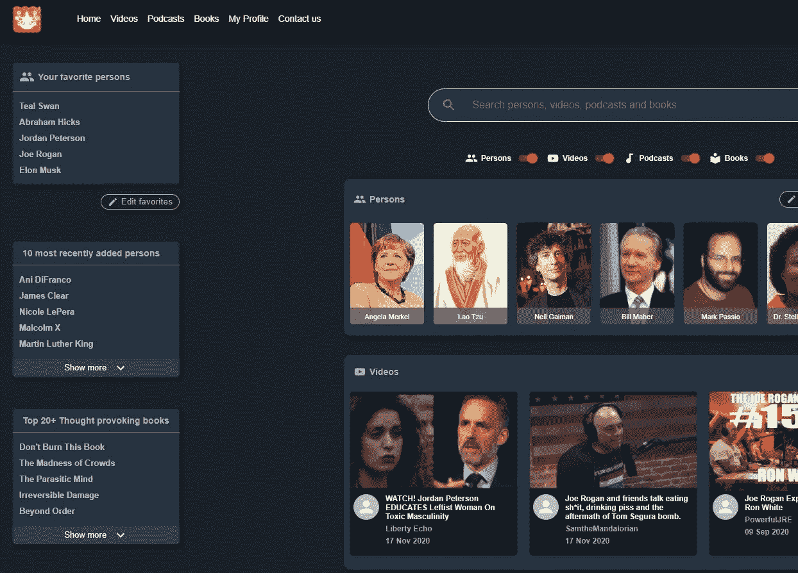

# React 图像加载优化技术

> 原文：<https://javascript.plainenglish.io/react-image-loading-optimization-techniques-b885427bde44?source=collection_archive---------10----------------------->

## 第 2 部分:预加载，IntersectionObserver，淡入过渡，用指针事件阻止图像下载等等…

## 第 1 部分概述

[第 1 部分](/image-loading-in-react-js-preloading-lazy-loading-intersectionobserver-fade-in-transitions-722c24f4d5fb)以创建 PreloadImage 组件的基本设置结束。到目前为止，该组件具有设置一个**‘占位符’**的功能，该功能将在图像加载失败时设置。除此之外，还有一个**‘lazy’**属性，它可以被设置为实例化一个组件的交集观察器，该观察器跟踪组件何时进入视口附近，并因此开始从网络加载图像。不设置 lazy 属性将调用`setPreloader()`函数，该函数将在组件挂载后立即预加载图像。



Persons and Videos list on the Metacules.com Home Screen

如果你在[metacules.com](https://metacules.com)网站的主屏幕上查看人员名单，你会发现一个大约 250-300 人的名单。
如果您正在编写代码来呈现包含图像的卡片，看起来像下面的代码，您将会遇到一些问题:

```
{persons && persons.map(person =>
  <div className="personCard>
    <PreloadImage src={person.imageUrl}>
  </div>
)}
```

如果你有一个 300 人的卡片列表，你将渲染 300 个 div，这些 div 都是从网上下载图片的。可以想象，这显然对性能没有好处。

提高性能的一种方法是，当用户进入屏幕时，只加载在视窗中可见的图像，并将其他图像的加载设置为 **lazy。**
假设你一次只能看到 8 张图片(过于简单),你的代码应该是这样的:

```
{persons && persons.map((person, index) =>
  <div className="personCard>
    <PreloadImage lazy={index > 8} src={person.imageUrl}>
  </div>
)}
```

然后，当您进入视图之外的所有其他组件的屏幕时，将使用交叉点观察器 api 来确定何时开始加载图像。

上面的代码仍然有点问题…因为这里有一个很大的性能问题。所以如果你还没有看到它，你一定要继续读下去；)

但是让我们先来看看我想要实现的一些东西，以完成图像加载包装。

所以我还想实现另外两件事:

1.  当图像加载并设置在用户界面上时，我不想有一个“硬”加载，而是一个平滑的淡入过渡。
2.  我注意到的一件事是，在手机上，如果我长时间触摸图片，它会弹出一个窗口，就像你右击图片时弹出的窗口一样。我不想这样，因为这不是我的应用程序 UI 功能的一部分。

# 图像加载器包装组件的完整实现

我的图像加载器包装器的最终实现应该是这样的:

```
class PreloadImage extends React.Component {

    constructor(props) {
        super(props);
        this.state = {
            loaded: false,
            src: null,
            placeholder: this.props.placeholder || null,
        };
    }

    componentDidMount() {
        if (this.props.lazy && 'IntersectionObserver' in window) {
            this.setObserver();
        } else {
            this.setPreloader();
        }
    }

    setObserver() {
        this.observer = new IntersectionObserver((entries) => {
            entries.forEach((entry) => {
                if (entry.isIntersecting) {
                    this.setPreloader();
                    this.observer.disconnect();
                }
            });
        });

        this.observer.observe(this.el);
    }

    setPreloader() {
        this.preloader = new Image();

        this.preloader.onload = () => {
            this.setState({
                loaded: true,
                src: this.props.src
            });
        };
        this.preloader.onerror = () => {
            this.setState({
                loaded: true,
                src: this.state.placeholder
            });
        };

        this.preloader.src = this.props.src;
    }

    componentWillUnmount() {
        if (this.observer) this.observer.disconnect();
        if (this.preloader) this.preloader.onload = null;
    }

    render() {
        return (
            <div ref={(el) => this.el = el} className= 
                     {this.props.wrapperClassName}>
                 this.el = el}
                     onError={(e) => {
                         e.target.src = this.state.placeholder;
                     }}
                     className={this.props.className}
                     style={{**pointerEvents**: "none",
                         **opacity**: this.state.loaded ? 1 : 0,
                         **transition**: "opacity 300ms cubic- bezier(0.215, 0.61, 0.355, 1)",
                     }}
                     alt=""/>
            </div>
        );
    }
}

export default PreloadImage;
```

因此，与第 1 部分的实现相比，有一些更新。

```
**pointerEvents**: "none"
```

这阻止了 web 上的用户通过右键单击保存图像的功能。在手机上(更重要的是 UX 智慧),它可以防止用户长时间触摸图像表面时出现不必要的对话框。

```
**opacity**: this.state.loaded ? 1 : 0,                         **transition**: "opacity 300ms cubic-bezier(0.215, 0.61, 0.355, 1)",
```

这将在不透明度设置为 0 的卸载状态和不透明度设置为 1 的加载状态之间添加 300 毫秒的渐变过渡。

到目前为止，加载图像的包装类的完整实现。

这已经让您走了很长一段路。不幸的是，如上所述，当在大的可滚动列表中完成时，这不足以获得良好的图像加载性能。

如何解决这个问题，我将在第 3 部分讨论。

# 第 3 部分

在下一部分中，我们将深入研究我需要考虑的事情，以确保视口外部的组件(包含这些图像)不会被预先渲染，从而降低性能。

为此，我将介绍 react-window(用于水平滚动)和 react-laziload(用于垂直滚动)的用法

链接至[第 3 部分](https://rik-van-velzen.medium.com/scroll-rendering-performance-react-image-loading-optimization-techniques-17350d8f04a8)

请跟我来，了解未来帖子的最新情况。

如果你有任何额外的东西要添加，改进，或者如果你想给我们的项目发送一些爱或支持，你可以购买我的咖啡或帮助基金筹集我们创建的元规则——审查的解毒剂——平台通过

*   [https://www.buymeacoffee.com/l5LnQfk](https://www.buymeacoffee.com/l5LnQfk)
*   [https://fundrazr.com/f1ldl3](https://fundrazr.com/f1ldl3)

*Rik van Velzen 是 metacules 的创始人，他是一名资深(Android)移动开发人员，目前是使用 reactor/NodeJs 的元模块平台的开发人员。
您可以在社交媒体上关注我们:*

*-*-[https://twitter.com/VelzenRik](https://twitter.com/VelzenRik)-
-*推特*:[https://twitter.com/metacules](https://twitter.com/metacules)-*脸书*:[https://www.facebook.com/Metaculescom-100856938688500](https://www.facebook.com/Metaculescom-100856938688500)


metacules.com 登陆页面截图

## 来源:

*   [https://level up . git connected . com/interface-observer-API-in-JavaScript-f 2430 a 159 fa 7](https://levelup.gitconnected.com/what-is-so-special-about-intersection-observer-api-in-javascript-f2430a159fa7)
*   [https://JavaScript . plain English . io/image-loading-in-react-js-preloading-lazy-loading-intersection observer-fade-in-transitions-722 c24 F4 D5 FB](/image-loading-in-react-js-preloading-lazy-loading-intersectionobserver-fade-in-transitions-722c24f4d5fb)
*   https://react-window.now.sh/#/examples/list/fixed-size
*   【https://www.npmjs.com/package/react-window 
*   https://metacules.com~创造审查的解药
*   [https://fundrazr.com/f1ldl3](https://fundrazr.com/f1ldl3)