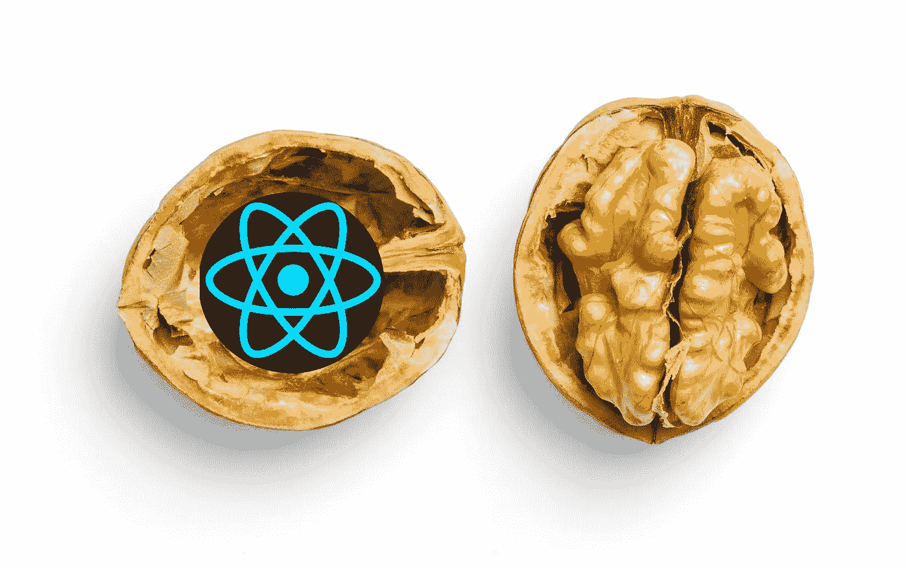
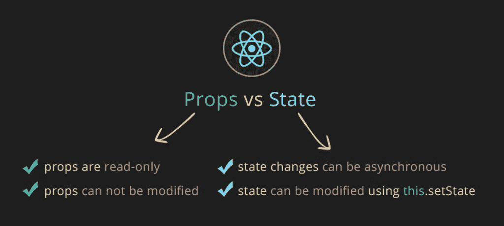

# 一言以蔽之

> 原文：<https://javascript.plainenglish.io/react-in-a-nutshell-e494041d78eb?source=collection_archive---------8----------------------->

Photo by [Mockup Graphics](https://unsplash.com/@mockupgraphics?utm_source=unsplash&utm_medium=referral&utm_content=creditCopyText) on [Unsplash](https://unsplash.com/s/photos/nutshell?utm_source=unsplash&utm_medium=referral&utm_content=creditCopyText) and edited by the author

## 让我们浏览一下介绍性的东西

所以我们现在都知道 React 是由脸书开发的，并于 2017 年 9 月首次发布到野外。

它是一个 JavaScript 库，而不是真正的框架。这是因为它没有提供构建成熟应用程序所需的一切。您需要熟悉一些第三方库，例如，如果您需要构建一个表单，可以使用像 [Formik](https://formik.org/docs/tutorial) 这样的库，或者使用 [Axios](https://axios-http.com/) 来替代 Fetch API。

React 是**声明式**，基本意思是我们告诉 React 我们想要什么，React 让它发生。我们不需要指定**它应该如何呈现我们想要的特定 UI 元素。我们不需要管理何时插入或删除 HTML 元素，或者如何修改页面上当前的元素，我们只需要说，我想要一个文本字段，并且它必须是只读的。React 然后处理剩下的事情。**

React 是**基于组件的**。这意味着我们可以构建自己的组件来封装它们自己的状态。这些组件可以用作构建复杂 ui 的构件。构建组件是保持应用程序模块化并确保通用代码可重用性的好方法。

React 也很百搭。可以使用 React Native 创建移动应用程序，执行服务器端渲染(如果对您的应用程序有意义)以及开发渐进式 web 应用程序。如果您对服务器端渲染(SSR) [感兴趣，请参阅本文](https://www.freecodecamp.org/news/server-side-rendering-your-react-app-in-three-simple-steps-7a82b95db82e/)。

## JSX

那么什么是 JSX 呢？JSX 是 JavaScript 的模板语言，它只是普通的旧 JavaScript 的扩展。建议将 JSX 与 React 一起使用，因为 React 接受了呈现逻辑与 UI 逻辑内在耦合的事实。例如，当单击某个按钮时，其他一些组件应该会变得可见。JSX 为我们提供了一种在描述用户界面的标记中嵌入 JavaScript 逻辑的简洁方法。这里有一个例子:

Basic JSX example

在上面的例子中，当组件被渲染时，变量 *name* 的值将被插入到变量的位置。您还可以将任何有效的 JavaScript 表达式放在花括号内，表达式的结果将被嵌入到语句中。JSX 还可以用于条件呈现，例如，如果用户没有登录，则呈现一个按钮，否则显示一个问候。请参见下面的示例。

Conditional rendering with JSX

## 虚拟世界

虚拟 DOM 是 React 用来在内存中表示用户界面的一种模式。它本质上是 UI 的虚拟副本，保存在内存中，并通过 ReactDOM 等库与真实的 DOM 保持同步。这个同步过程被称为协调。这就是 React 使用差分算法来确定自上次渲染以来必须渲染到屏幕上的元素发生了什么变化的地方。这也是 React 在渲染时效率很高的原因之一，因为当发生变化时，它不仅仅是重新渲染整个页面。相反，当发生变化时， *render* 方法将返回一个期望的 React 元素树。React 然后将该树与先前的树(当前页面)进行比较，然后确定需要对页面进行的一组更改。然后，它将应用必要的更改来实现所需的结构。

## 组件的剖析

现在我们来看看组件。在 React 中，组件基本上是接受一组任意参数的 JavaScript 函数，称为**道具**。组件也总是有一个 **return** 语句，该语句返回应该显示在屏幕上的 React 元素的层次结构。组件也可以写成 ES6 类，但是，更好的方法是把它们写成功能组件。

组件的 return 语句返回的元素应该总是只有一个包含其他子元素的父元素。这显示在下面的组件中。这个组件没有状态，所以被称为无状态组件。

如果我们想将上面的 *Book* 组件呈现为另一个组件的一部分，它将被实例化如下:

React 应用程序通常有一个名为 *App* 的根组件，它是应用程序组件层次结构中的顶级组件。

**状态 vs 道具**

组件还可以有一个内部状态，用于控制呈现哪些数据和控件。这些被称为有状态组件。

状态和道具不一样。状态可以被认为类似于内部函数变量。它们保存数据并影响“拥有”它们的功能/组件的行为。只能通过调用 *setState()* 方法来修改状态，而不能直接在对象上设置值。当状态更新时，变化异步发生**。这是一件要永远记在心里的事情，因为它肯定会在某个时候绊倒你。**

**另一方面，Props 是只读的，可以认为它类似于传递给函数的参数。**

****

**[https://i.stack.imgur.com/](https://i.stack.imgur.com/wqvF2.png)**

****向我们的组件添加状态****

**随着时间的推移，向组件添加状态的方法有很多种。如果使用类组件，state 可以作为名为 *state* 的变量添加，它存储一个 JavaScript 对象。然而，首选的方法是使用 *useState* 钩子。在本文中，我不打算详细介绍所有可用的挂钩。如果你想了解更多，你可以阅读《T4》。**

**本质上， *useState* 钩子允许你为你需要的每个状态设置不同的变量，并为你提供一个特定的方法(在幕后调用 setState)来更新那个状态。这比以前的方法更好，以前的方法必须调用 setState(*{ updatedStateObject })*，并且必须将使用您想要更改的特定属性更新的对象传递给 *setState* 函数。让我们给 Book 组件添加一些状态。**

**在上面的例子中，我们使用 *useState* 钩子添加了一个名为 *hasBeenRead* 的状态变量。第二个参数 *setHasBeenRead* ，是用于更新状态变量的函数。 *useState(false)* 中值为 *false* 的参数是分配给状态变量的默认值。然后在 return 语句中，我们使用基于 *hasBeenRead* 状态变量的值的条件渲染。如果值为 *true* ，我们显示文本，*我读过这本书*，否则我们不显示任何内容。**

****提升状态上升****

**通常情况下，应用程序层次结构中的多个组件需要相同的状态来呈现。在这种情况下，最佳实践是将状态提升到需要它的组件的最低公共祖先。然后，可以将所需的状态作为道具传递给相应的组件。这确保了我们对于特定的信息只有一个真实的来源。要更详细地了解这个话题，我推荐阅读[这个](https://reactjs.org/docs/lifting-state-up.html)。**

**我希望这已经让您很好地了解了 React 的关键要素。我建议您浏览下面列出的官方文档，因为有很多内容我无法在一篇文章中涵盖。**

**感谢阅读！**

## **参考**

**https://reactjs.org/docs/introducing-jsx.html JSX**

**React 文档:[https://reactjs.org/](https://reactjs.org/)**

***更多内容看*[***plain English . io***](http://plainenglish.io/)**