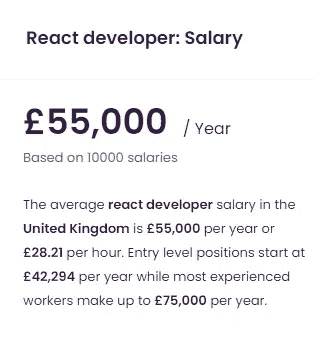

# 反应仍然是王道

> 原文：<https://javascript.plainenglish.io/react-is-still-the-king-7e70f9db8288?source=collection_archive---------11----------------------->

React 会长久保持王者地位吗？


By [Pixabay](https://www.pexels.com/@pixabay) on [Pexels](https://www.pexels.com/photo/battle-black-blur-board-game-260024/)

```
· [Story Time](#3cb4)
· [Why was it made in the first place?](#e336)
· [Features of React](#ffee)
· [It’s used everywhere](#a551)
· [Why is it so popular?](#c17a)
· [Simplicity](#eb6d)
· [Performance](#6d57)
· [Reusability](#41b3)
· [Salary](#21e9)
· [Will it remain the king for long?](#d49a)
· [The sad truth](#b024)
· [Conclusion](#e36e)
```

# 故事时间

当开始从事 web 开发时，在学习了 HTML 和 CSS 等基础知识之后，开发人员很可能会学习 JavaScript，在此之后，我们会接触到我们的第一个框架/库，对于我们大多数人来说，这将是 React。

根据前端开发者调查统计[这里](https://2020.stateofjs.com/en-US/technologies/front-end-frameworks/)，80%的开发者使用 React。这是一个相当大的比例，意味着 5 个开发人员中，几乎有 4 个肯定会使用 React。

在这篇文章中，我们将讨论 React 成为国王的所有原因，并且很可能在很长一段时间内成为国王。

# 当初为什么要做？

React 是由一位在脸书工作的名叫**乔丹·沃克**的软件工程师创建的。React 的创建是为了让开发人员可以使用不断变化的数据创建大规模的 web 应用程序，而无需重新加载页面。因此，React 的主要目的是快速、可伸缩且易于实现。

# React 的特性

我们只是浏览一下一些主要特性

*   简单易学
*   快的
*   基于组件的
*   可以在服务器端使用 [Next.js](https://nextjs.org/) 进行渲染
*   可用于使用 [React-native](https://reactnative.dev/) 创建移动应用
*   称为 **JSX** 的特殊语法，混合了 HTML 和 JavaScript

# 到处都在用

即使你在整个开发者之旅中从未使用过 React，我保证你使用过一个用 React 构建的应用。比如脸书、网飞和 Instagram。使用 React 开发应用程序的顶级公司不胜枚举。这就引出了我们的下一个问题。

# 为什么这么受欢迎？

自从世界被引入来做出反应，它已经变得非常适应周围快速发展的技术。试想:一个已经学会使用 React 的开发者不仅可以开发现代网络应用，还可以开发在 iOS 和 Android 上都能运行的移动应用。开发人员甚至可以使用 [Jamstack](https://jamstack.org/what-is-jamstack/) 在网站上工作。

# 简单

有了定义良好的生命周期方法和基于组件的方法，React 很容易学习。有了 React 的庞大开发者社区。如果你在开发应用程序时遇到任何问题，有 99%的可能性是有人以前遇到过这个问题，找到了解决方案并发布到网上。Youtube 上有成千上万个针对 React 初学者和高级用户的视频。

另外，虽然简单易学并不意味着容易掌握。

学习 React 的一些先决条件:

*   理解 HTML 和 CSS
*   JavaScript 的基础知识
*   基本编程概念

# 表演

React 受欢迎的另一个可能的原因是它改进的性能。React 使用[虚拟 DOM](https://reactjs.org/docs/faq-internals.html) ，这将比较组件以前的状态，并只更新真实 DOM 中有状态变化的项目，而不是像大多数传统 web 应用程序那样每次都更新所有组件。

# 复用性

问任何一个 React 开发者，他们都会告诉你组件是构建任何 React 应用的基础。一个应用程序可以使用多个组件，每个组件都有自己的逻辑和功能。一个可重用组件的例子是一个按钮，你可以创建一个 Button.js 组件，它有两个道具，一个 onClick 方法和一个标签。然后，您可以在 web 应用程序的多个部分中使用这个按钮组件。

一次创作，随处使用。另外，如果你决定改变主按钮的颜色，你只需要改变一行代码。这对开发人员来说是非常有益的，因为它可以大大减少开发时间。

# 薪水

随着 React 变得越来越流行，公司开始采用这种开发工具。这反过来又导致了全球对 React 开发者的更高需求。

美国 React 开发人员的平均工资约为 92，000 美元。


React developer salary in the US

英国 React 开发人员的平均工资



React developer salary in the UK

# 它会长久保持王者地位吗？

尽管 React 提供了所有的特性和好处，但并不是每个人都喜欢它。另一个 JavaScript 框架 Vue.js 越来越受欢迎。与 Vue.js 相比，你更有可能看到用 React 构建的 web 应用程序，但它肯定会在开发人员社区中增长。

React 是当今构建现代 web 应用程序的一个经过深思熟虑的、良好且一致的解决方案。React 还没有过时的可能**。**

# **令人悲伤的事实**

**即使 React 受到所有人的喜爱，但就像以前的很多框架一样，React 肯定有一天会过时。技术和编程的世界在不断发展，在不久的将来，一种新的更快、更干净的构建 web 应用程序的方法可能会出现。**

**话虽如此，作为开发人员，学习 React 仍然是一项非常好的投资。你可以学习一种创建可重用代码的模式，因此不会重复你自己(保持它[干燥](https://en.wikipedia.org/wiki/Don%27t_repeat_yourself#:~:text=Don't%20repeat%20yourself%20(DRY,data%20normalization%20to%20avoid%20redundancy.))，你可以应用到其他编程语言。**

# **结论**

**我们了解了是什么让 React 成为今天的王者，以及为什么它在开发者和顶级公司中如此受欢迎。即使 React 有一天会消失，学习和掌握它仍然是一项巨大的投资。**

**[](/axios-vs-fetch-aeaec89023b3) [## Axios 与 Fetch:哪个更好？

### 探索 Axios 和 Fetch 之间的差异，并最终找出哪个更好。

javascript.plainenglish.io](/axios-vs-fetch-aeaec89023b3) [](/how-to-create-a-simple-web-server-using-node-js-2021-5c3e89833128) [## 如何使用 Node.js 创建一个简单的 Web 服务器

### 使用 Node.js 创建 web 服务器——2021 年的简单教程。

javascript.plainenglish.io](/how-to-create-a-simple-web-server-using-node-js-2021-5c3e89833128) [](https://medium.com/geekculture/3-jobs-to-consider-when-starting-to-code-75cae0d19b57) [## 开始编码时要考虑的 3 项工作

### 编码技能需求量很大，尤其是在疫情时期。

medium.com](https://medium.com/geekculture/3-jobs-to-consider-when-starting-to-code-75cae0d19b57) 

*更多内容看*[***plain English . io***](http://plainenglish.io/)**