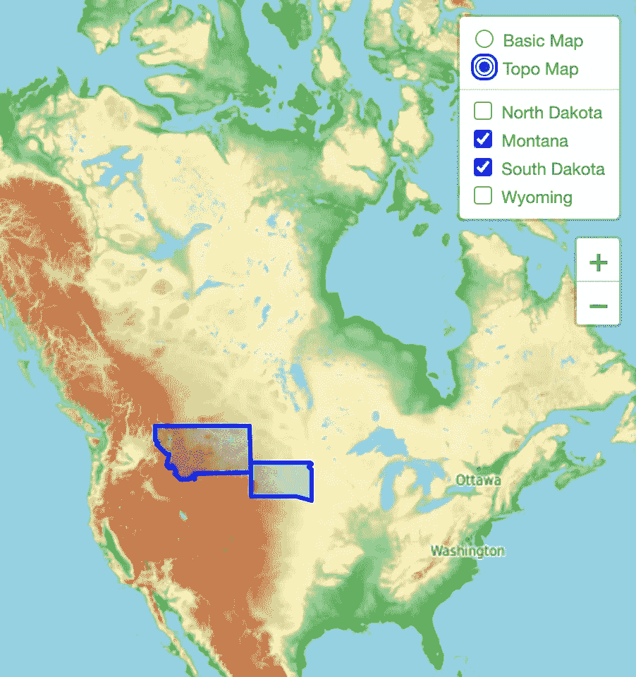

# react-活页 v3:创建地图应用程序

> 原文：<https://javascript.plainenglish.io/react-leaflet-v3-creating-a-mapping-application-d5477f19bdeb?source=collection_archive---------5----------------------->

Thanks for the view, NASA!

如果你读过我的文章“[在 React 项目中使用 fleet . js:构建一个地图应用](https://medium.com/@jharriswebdev/using-leaflet-js-in-a-react-project-build-a-mapping-application-f97aeef25c33)”，那么你就会知道我们可以在 React 项目中创建一个全功能的传单地图，而不需要使用[React-fleet](https://react-leaflet.js.org/)绑定。如果你没看过，那就去看看吧！

下面是我们创建的传单组件的代码:

这工作得很好，但是我们的代码不是很有反应性，因为我们用 vanilla 传单操作 DOM，并把所有东西渲染到一个“map”div 中。让我们来看看如何用 React-Leaflet 创建一个合适的开源 React 地图应用程序。

# 一些需要记住的事情

重要的是要记住，反应传单不是取代传单。它只是提供了一种方法来创建传单层作为 React 组件，而不是像我们在 vanilla-Leaflet/React 应用程序中使用的那样使用`useRef` / `useEffect`设置。这意味着我们的 React-小叶组件的行为可能与标准 React 组件不同。来自[React-传单文档](https://react-leaflet.js.org/docs/start-introduction):

## DOM 渲染

> React 不会将小叶层渲染到 DOM，这种渲染是由小叶本身完成的。React 在渲染`[MapContainer](https://react-leaflet.js.org/docs/api-map#mapcontainer)` [组件](https://react-leaflet.js.org/docs/api-map#mapcontainer)[UI 层组件](https://react-leaflet.js.org/docs/api-components#ui-layers)的内容时，只渲染一个`
`元素。

还记得我们如何在[普通传单贴图](/using-leaflet-js-in-a-react-project-6b23c30ed464)中将所有东西渲染到一个 div 中吗？React-Leaflet 也在幕后做着同样的事情。

## 组件属性

> 当组件第一次呈现时，传递给组件的属性用于创建相关的小叶实例，并且在默认情况下应该被视为不可变的。
> 
> 在第一次渲染时，所有这些属性都应该被活页支持，但是当它们改变时不会在 UI 中更新，除非它们被明确地记录为可变的。
> 
> 可变属性变化通过引用进行比较(除非另有说明)，并通过调用小叶元素实例上的相关方法来应用。

同样，这与我们的香草传单地图非常相似。小叶元素只有在组件第一次安装时才被实例化，就像我们使用`useEffect`钩子一样，然后使用 refs 修改。

## 反应上下文

> React Leaflet 使用 [React 的上下文 API](https://reactjs.org/docs/context.html) 使一些 Leaflet elements 实例对需要它的子元素可用。
> 
> 每个传单地图实例都有自己的 React 上下文，由`[MapContainer](https://react-leaflet.js.org/docs/api-map#mapcontainer)` [组件](https://react-leaflet.js.org/docs/api-map#mapcontainer)创建。React 小叶提供的其他组件和钩子只能作为一个`MapContainer`的后代。

React-Leaflet 使用上下文 API 使它的实例和状态对它的所有子节点可用。一旦我们开始处理地图事件，您将会看到一个这样的例子。

# 入门指南

为了使设置更容易，我有一个[启动器供你在 Stack Blitz](https://stackblitz.com/edit/react-leaflet-medium-demo-starter) 上使用。如果您喜欢在本地机器上继续操作，请查看文档的[安装部分。**记得安装传单和 React-传单！**另请注意，我们将在本演示中使用来自](https://react-leaflet.js.org/docs/start-installation) [Material-UI](https://material-ui.com/) 的一些样式和组件。你也可以克隆这个 [GitHub repo 的成品代码](https://github.com/jharris711/react-leaflet-medium-demo-final)。

在`public/index.html`中，我们可以粘贴传单的 CSS 和 Javascript 文件的 CDN 链接:

## index.html

现在，我们可以设置我们的`MapContainer`和地图平铺层。`MapContainer`创建小叶图实例，并通过[上下文 API](https://reactjs.org/docs/context.html) 与其所有子实例共享该实例。就我们的目的而言，我们现在只是将`center`、`zoom`、`style`、`zoomControl`道具传递给`MapContainer`而已，但是你可以在中查看这个[道具列表以备后用。我们将把地图的中心放在美国(`[37.0902, -95.7129]`)上，将`zoom`设置为`3`，将`zoomControl`设置为`false`，因为我们将一点一点地添加一个。`style`支柱也需要设定高度和宽度。](https://react-leaflet.js.org/docs/api-map#mapcontainer)

在`src/map`中我们可以创建一个名为`Map.jsx`的新文件，然后将其导入到我们的`App.js`文件中:

## Map.jsx

## App.jsx

现在，您的屏幕上应该有一个空地图，如下所示:

Excited yet?

# 添加控件

现在我们已经启动并运行了地图，让我们添加一个`Z[oomControl](https://react-leaflet.js.org/docs/api-components#zoomcontrol)`和一个`L[ayersControl](https://react-leaflet.js.org/docs/api-components#layerscontrol)`。

`ZoomControl`超级简单。我们需要导入`ZoomControl`组件，并将其放在`TileLayer`组件的正下方。我们还想传递一个`position`道具给它，值`'topright'`:

## Map.jsx

`LayersControl`有点不同。我们可以导入这个组件，并将其放在我们刚刚设置的`ZoomControl`的正上方。然后，我们使用`LayersControl.BaseLayers`和`LayersControl.Overlay`将我们的图层添加到控件中。稍后我们将使用`LayersControl.Overlay`组件来切换图层，如标记和圆圈，但现在，我们将把`TileLayer`组件放在`LayersControl.BaseLayers`组件内。让我们也添加第二个地图平铺选项，这样我们就可以实际使用我们的层控制。前往[传单提供者](https://leaflet-extras.github.io/leaflet-providers/preview/)演示，选择第二个要使用的图块，然后像这样设置您的代码:

## Map.jsx

Sweet controls, bro.

关于这方面的进一步阅读，[查看这篇关于如何使用 React-Leaflet 核心 API](/how-to-create-a-react-leaflet-control-component-with-leaflet-routing-machine-8eef98259f20) 创建定制控件组件的文章。

# 访问映射实例和事件监听器

回想一下这篇文章的部分的**要记住的事情。我们了解到`MapContainer`使小叶地图实例对其子节点可用，而访问该状态的挂钩仅对其子节点可用。正因为如此，将`MapContainer`逻辑从层逻辑中分离出来对我们是有好处的。在`src/map`中，让我们创建一个名为`Layers.jsx`的新文件，并将我们的`LayersControl`组件复制/粘贴到这里:**

## Layers.jsx

## Map.jsx

传单地图实例有许多方法可用于[获取](https://leafletjs.com/reference-1.7.1.html#map-methods-for-getting-map-state)和[设置](https://leafletjs.com/reference-1.7.1.html#map-methods-for-modifying-map-state)其状态。为了使用这些方法，React-leafle 为我们提供了`[useMap](https://react-leaflet.js.org/docs/api-map#usemap)` [钩子](https://react-leaflet.js.org/docs/api-map#usemap)。假设我们想要得到地图的初始边界和缩放级别。我们将调用组件顶部的`useMap`，并将其赋给一个变量，比如说`map`，然后每当我们想要使用活页贴图方法时，就引用该变量:

## Layers.jsx

然而，如果我们想在每次边界和缩放级别改变时获取它们，我们可以使用`[useMapEvents](https://react-leaflet.js.org/docs/api-map#usemapevents)` [钩子](https://react-leaflet.js.org/docs/api-map#usemapevents)。我们以与`useMap`挂钩相同的方式导入它，但是我们将把[传单地图事件处理程序](https://leafletjs.com/reference-1.7.1.html#map-event)附加到地图实例，如下所示:

## Layers.jsx

# 使用 GeoJSON 显示数据

在构建地图应用程序的过程中，很有可能会以 geoJSON 格式获取和显示数据。如果您不熟悉 geoJSON 格式，请从这里的 开始 [**。我们的地图目前以美国为中心，所以我们将使用怀俄明州、蒙大拿州和南达科他州的地理数据。我已经在`src/data`中为每个状态设置了包含 geoJSON 的文件。**](https://sumit-arora.medium.com/what-is-geojson-geojson-basics-visualize-geojson-open-geojson-using-qgis-open-geojson-3432039e336d#:~:text=The%20GeoJSON%20is%20a%20format,JavaScript%20Object%20Notation%20(JSON).&text=And%20GeoJSON%20basically%20uses%20this,properties%2C%20and%20their%20spatial%20extents.)

为了显示 geoJSON，我们将使用`[GeoJSON](https://react-leaflet.js.org/docs/api-components#geojson)` [反作用-小叶层组件](https://react-leaflet.js.org/docs/api-components#geojson)。我们将数据导入到`Layers.jsx`中，将数据放入一个处于状态的数组中，然后使用`.map()`迭代该数组并返回`GeoJSON`层。当迭代数据时，我们需要传递在每组 geoJSON 的`features`数组中找到的`geometry`属性，它给`GeoJSON`层提供要创建的层的类型和坐标。我们还需要为每个 GeoJSON 层提供一个唯一的密钥，所以我们将使用在每个`features`数组的`properties`中找到的`display_name`。如果您想改变`GeoJSON`图层的样式，可以将[选项对象传递给](https://leafletjs.com/reference-1.7.1.html#path)`[pathOptions](https://leafletjs.com/reference-1.7.1.html#path)``LayersControl`[道具](https://leafletjs.com/reference-1.7.1.html#path)。以下是所有这些将会是什么样子:

## Layers.jsx

Those are some good lookin’ states, right there.

# 向图层控件添加覆盖

为了给我们的`LayersControl`添加基础图层，我们对每个要添加到地图中的基础图层使用`LayersControl.BaseLayer`。这是一个非常相似的过程，以添加所需的覆盖。代替`LayersControl.BaseLayer`，我们将在`LayersControl.Overlay`中包装我们的图层，提供一个`name`并将`checked`设置为等于`true`，这样图层默认出现在地图上:

## Layers.jsx

Montana & South Dakota: A Love Story

# 使用图层组添加标记和弹出窗口

比方说，我们想通过显示一些与 geoJSON 一起使用的标记来为地图的 UI 添加更多内容。创建点标记非常简单。我们只需导入 [React-Leaflet 的](https://react-leaflet.js.org/docs/api-components#marker) `[Marker](https://react-leaflet.js.org/docs/api-components#marker)` [层组件](https://react-leaflet.js.org/docs/api-components#marker)，用`Geojson`层组件包装它，并将我们将使用 [Leaflet 的](https://leafletjs.com/reference-1.7.1.html#latlng) `[LatLng](https://leafletjs.com/reference-1.7.1.html#latlng)` [方法](https://leafletjs.com/reference-1.7.1.html#latlng)创建的一个 latLng 对象传递给它的`position` prop。我们还将导入`[Popup](https://react-leaflet.js.org/docs/api-components#popup)` [图层组件](https://react-leaflet.js.org/docs/api-components#popup)，添加一些文本，并用`Marker`组件将其包装。我们也可以使用像 [Material UI](https://material-ui.com/) 这样的库来给我们的弹出窗口添加一些额外的样式。现在，我们将只使用材质 UI `Typography`和`Divider`组件:

## Layers.jsx

Montana is super cool, I swear.

注意到什么奇怪的事情了吗，特别是关于`LayersControl`？每个名字都出现了两次。这是因为`LayersControl`为同名的边框和点标记添加了切换，这是我们不希望发生的。要解决这个问题，我们只需告诉`LayersControl`说`GeoJson`和`Marker`组件是`LayerGroup`的一部分。只需导入 [React-Leaflet](https://react-leaflet.js.org/docs/api-components#layergroup) `[LayerGroup](https://react-leaflet.js.org/docs/api-components#layergroup)` [组件](https://react-leaflet.js.org/docs/api-components#layergroup)，并将其作为`GeoJSON`和`Marker`的包装器:

## Layers.jsx

I heard Kanye lives around here somewhere…

# 层事件处理程序

有时我们想要修改地图上的元素，比如用`onmouseover`事件改变`GeoJSON`的`fillOpacity`，然后再改变`onmouseout`。为了增加这个功能，我们将使用`GeoJSON`的`eventHandlers`属性:

## Layers.jsx

# 包裹

好了，我们现在有了一个用 React-Leaflet 版本 3 构建的工作地图应用程序！下面是我们代码的最终版本( [GitHub](https://github.com/jharris711/react-leaflet-medium-demo-final) ):

## Layers.jsx

## Map.jsx

我鼓励你通读这些文档，因为你可以用这个包做很多很酷的事情。

在你练习使用 React-Leaflet 公共 API 提供的所有钩子和组件之后，去看看文档的[核心 API 部分。核心 API 允许您创建自定义传单组件，并扩展第三方传单插件以与 React-Leaflet 一起工作。](https://react-leaflet.js.org/docs/core-introduction)

为了帮助你理解核心 API 是如何工作的， [**看看我写的这篇文章**](/creating-an-ellipse-in-react-leaflet-72e2c5beff03) 向你展示如何用[传单创建一个定制的椭圆组件。椭圆](https://github.com/jdfergason/Leaflet.Ellipse#leafletellipse)。你也可以[看看这篇文章，这篇文章](https://jharriswebdev.medium.com/how-to-create-a-react-leaflet-control-component-with-leaflet-routing-machine-8eef98259f20)向你展示了如何用传单-路由-机器创建定制的控制组件。

如果你喜欢这篇文章，请留下你的掌声，并关注我的文章。也可以在 [LinkedIn](https://www.linkedin.com/in/joshsharris/) 上联系我。感谢阅读！

[*更多内容尽在 plainenglish.io*](http://plainenglish.io/)