# react 2021 年学习路线图

> 原文：<https://javascript.plainenglish.io/react-learning-roadmap-for-2021-a1c0f7456186?source=collection_archive---------0----------------------->

## 学习的路线图 React 我希望我知道

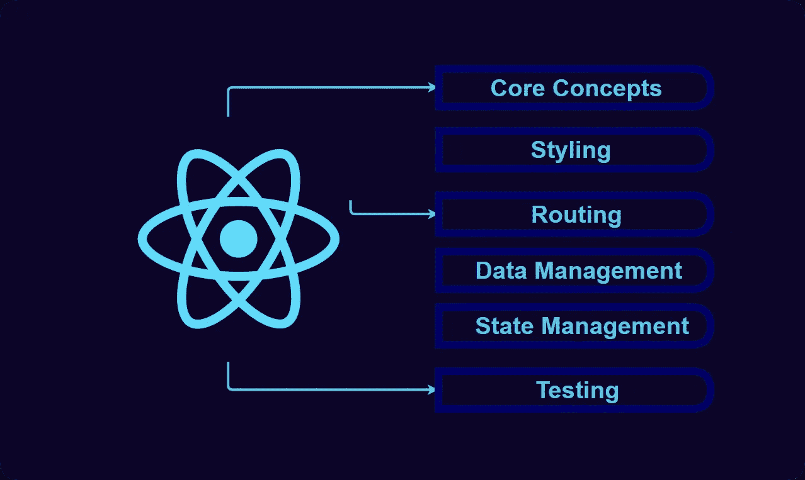

# 1.入门指南

## React 需要了解的 JavaScript

将 **React** 与其他框架相比，React 最大的优点是你在使用它时的暴露程度，因为它没有模板 DSL ***(JSX 编译成可感知的 JavaScript)*** ，组件 **API** 总是随着 React 挂钩的加入而变得更简单，并且该框架在核心 UI 元素之外提供了很少的抽象

## 1.模板文字

模板文字用反斜杠 **(` `)** 字符括起来，而不是双引号或单引号。

它们可以包含占位符，由美元符号和花括号 **(${})表示，占位符中的表达式和反斜线之间的文本被传递给函数。**

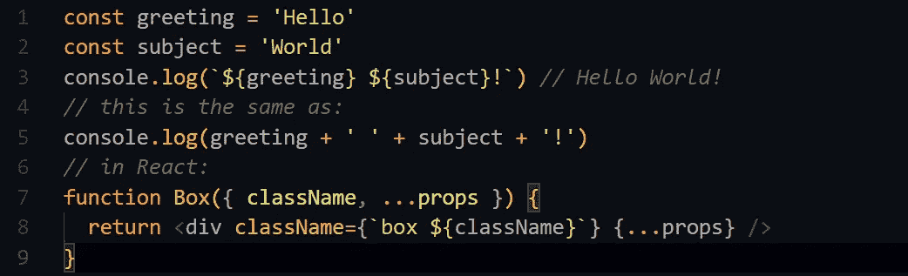

## 2.速记属性名

构建 **React** 应用程序很常见，其中一个对象是描述 ***对象*** 初始化的表达式，它由用于描述 ***对象*** 的属性组成。

对象属性的值可以包含原始数据类型或其他对象。

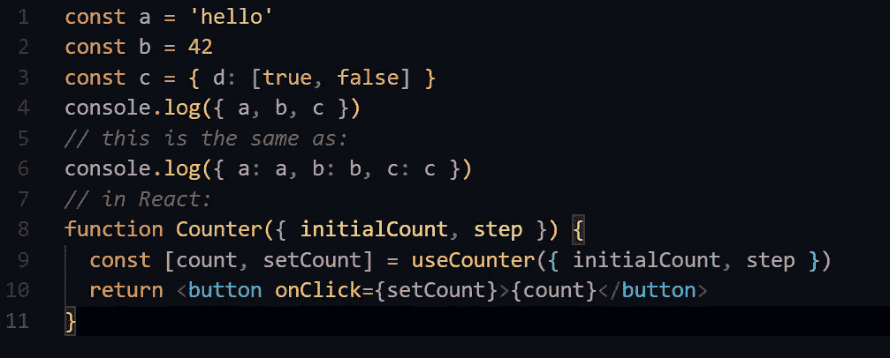

## 3.箭头功能

箭头函数是在 **JavaScript** 中编写函数的另一种方式。但是它们确实有一些不同，在 React 中，如果我们在我们的项目中使用钩子而不是类，我们不必担心，因为*。*

*箭头函数允许更简洁的匿名函数和隐式返回，所以你绝对想使用它们。*

*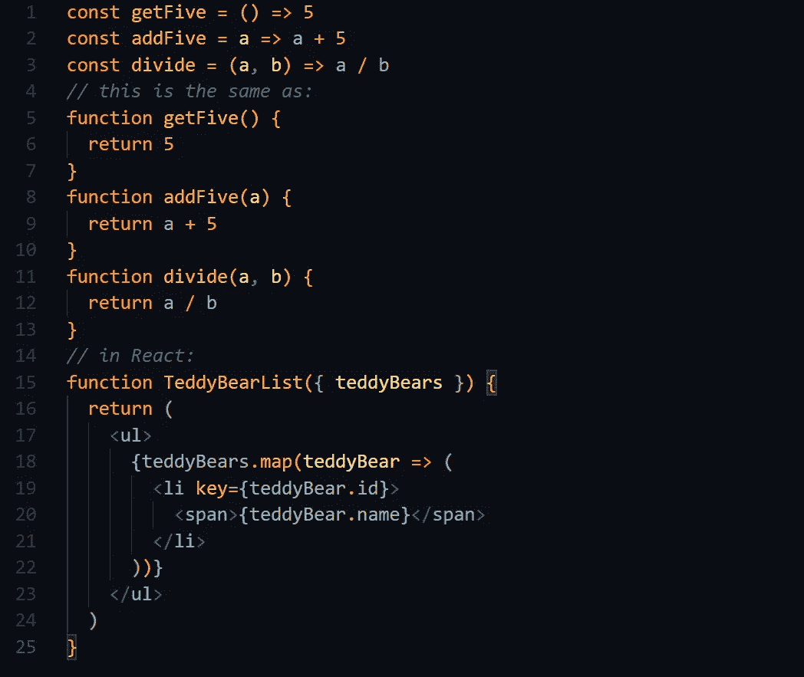*

## *4.解构*

*JS 最喜欢的特性之一，可以析构对象和数组。*

*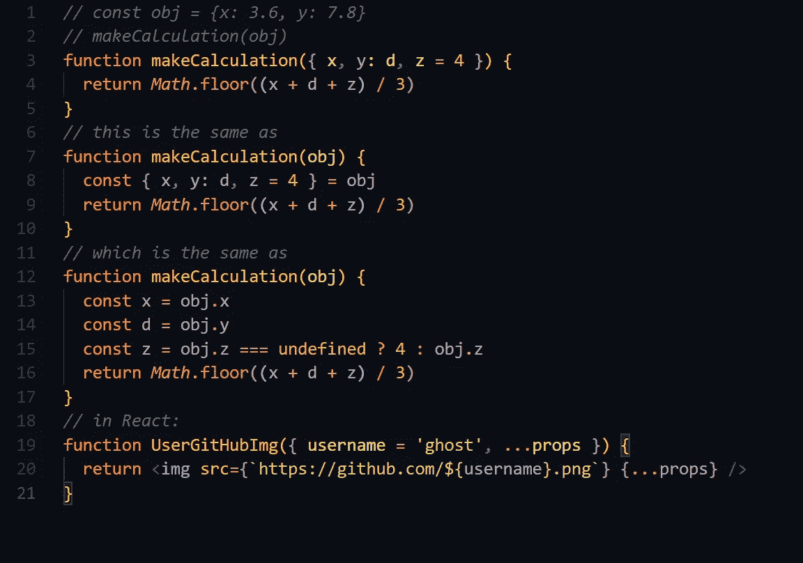*

## *5.参数默认值*

*在 **JS** 中，函数参数默认为未定义，设置一个不同的值通常是有用的，这就是默认参数的用处。*

*设置默认值的一般策略是测试函数体中的参数值，如果没有定义，就给它们赋值。*

*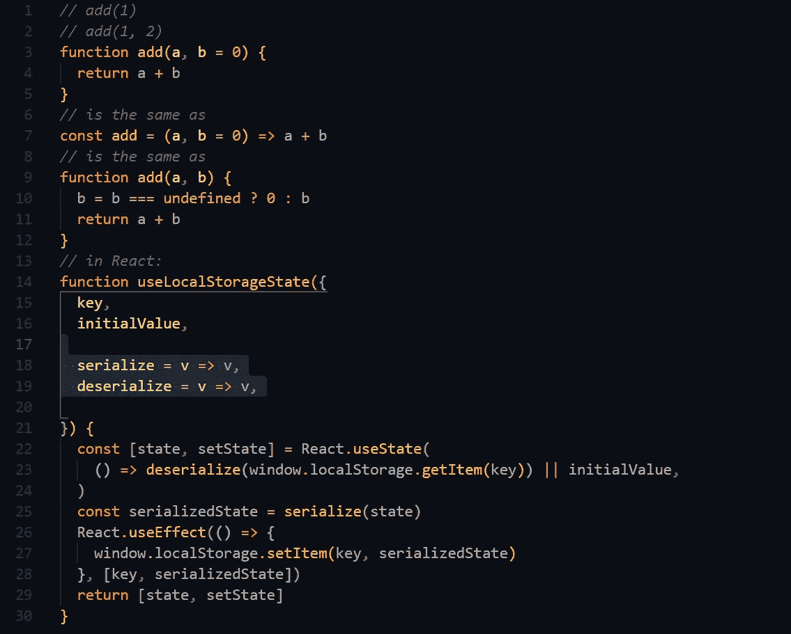*

## *6.剩余/扩展运算符*

*yntax 是一种集合语法，它对值的集合进行操作。在制作复杂的应用程序时，你会一直用到它。我强烈建议你仔细阅读这个概念，因为它总是让你的工作变得容易。*

*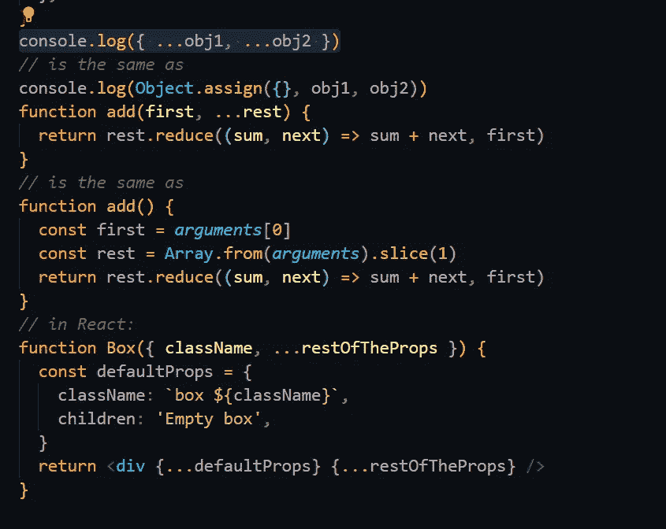*

## *7.ESModules*

*使用现代工具构建应用程序总是需要您了解语法是如何工作的，因为任何规模很小的应用程序都可能需要使用模块来进行代码重用和组织。*

## *8.三元运算符/条件运算符*

*该运算符将为您节省大量时间，在 **JSX** 中，它是唯一一个接受三个操作数的 JS 运算符:*

1.  *一个条件后跟一个问题**(？)**。*
2.  *然后用一个**冒号(:)表示条件为真时要执行的表达式。***
3.  *最后，如果条件为**false**，则执行表达式。*

*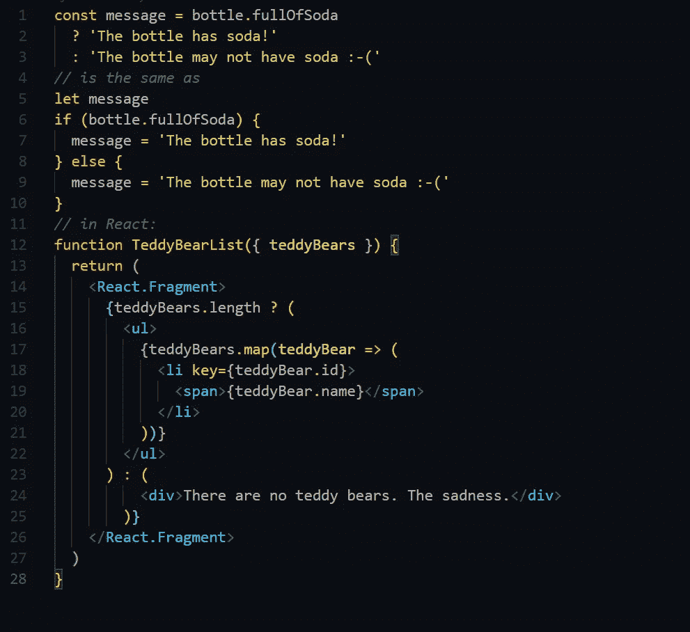*

## *9.数组方法*

*我一直在使用数组方法，你可能会用到下面这些最常用的方法。*

1.  *发现*
2.  *一些*
3.  *每个*
4.  *包含*
5.  *地图*
6.  *过滤器*
7.  *减少*

*例如:*

*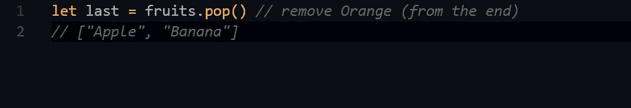*

## *10.Nulish 合并算子*

*这可以用逻辑**或(||)** 操作符来构造，如果左操作数是任何 falsy 值，而不仅仅是 null 或 undefined，则返回右边的操作数。*

*如果您使用 **||** 为另一个变量提供一些默认值，如果您考虑任何**false 值，您可能会遇到一些错误。***

*如果该值为 null 或未定义，那么您希望返回到某个默认值:*

*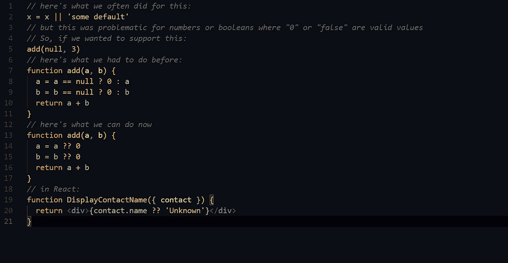*

## *11.可选链接*

*也被称为**‘猫王操作符’**允许你安全地访问属性和调用可能不存在的函数。*

*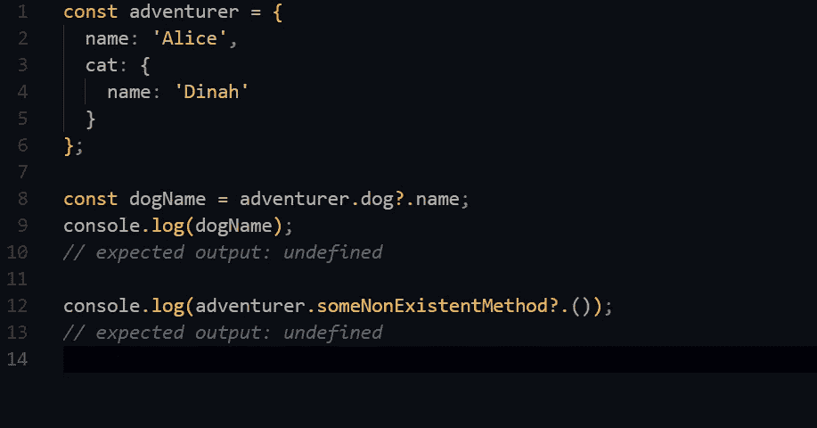*

## *12.承诺和异步/等待*

*承诺在 **JS** 生态系统中无处不在，承诺帮助你管理异步代码，并且从任何**DOM API**以及第三方库返回。*

# *2.核心组件*

*   *JSX*
*   *MDX*
*   *组件和道具*
*   *状态和生命周期*
*   *调和与虚拟 DOM*
*   *处理事件*
*   *参考文献*
*   *碎片*

## *1.JSX (JavaScript XML)*

*让我们考虑一个变量:*

```
***const element = <h1>Hello, world!</h1>;***
```

*我们简单地称这个标签语法为 **JSX** 它既不是一个 **HTML** 也不是一个字符串。*

**那么为什么 JSX 在谈到* ***如此重要的学问时会有什么反应呢？****

*当我们处理大量包含各自属性的独立组件时，这些组件被称为 **props，JSX** 支持 React 应用程序的开发，总体来说 React 不需要使用 JSX，但人们发现它很有帮助，因为在 JavaScript 代码中处理 UI 元素时，它允许 React 显示更多有用的错误和警告消息。*

*此外，JSX 还有很多其他优势，例如，JSX 可以防止注入攻击，因为默认情况下 React DOM 在渲染之前会对嵌入在 JSX 中的任何值进行转义。*

## *2.MDX*

*一种可创作的格式，允许你在你的减价文件中写下 **JSX** 。您还可以导入交互式图表或警报等组件，并将它们嵌入到您的内容中。使用 ***MDX*** 一直是一个优势，因为 **MDX 中没有运行时，所有编译都发生在构建阶段。***

## *3.React 组件和道具*

*有了新版的 **JavaScript，**我们可以使用类定义带有属性的对象， **React** 让我们使用这个语法来创建我们称之为 ***的组件。****

*您需要练习两种类型的组件:*

1.  ****类组件****
2.  ****功能组件****

*我已经用例子简单解释了两者的区别(打开 [**链接**](https://medium.com/javascript-in-plain-english/understanding-the-difference-between-function-class-components-in-react-35279a119d29) 进一步阅读 React 组件)。*

## ***4。道具***

*React props 就像 JavaScript 中的函数参数和 HTML 中的属性一样。为了在组件中发送属性，我们使用了与 HTML 属性相同的语法。*

*例如:*

*我们向**用户名**元素添加一个名称。*

```
***const myelement = <Car brand="Ford" />;***
```

*并且组件将参数作为 prop 对象接收。如果我们运行下面的代码:*

*它返回， ***我是福特。****

*所以我们只是从外部将属性传递给一个组件*

```
***import React from 'react';
import ReactDOM from 'react-dom';** 
class Car extends React.Component {
  render() {
    return <h2>I am a {this.props.brand}!</h2>
  }
}

const myelement = <Car brand="Ford" />;

ReactDOM.render(myelement, document.getElementById('root'));*
```

## *5.状态和生命周期*

*React 组件有一个内置的**状态**对象，状态对象是你存储属于组件的属性值的地方。因此，每当**状态**改变时，**组件就会重新呈现。***

*关于状态还有很多更深层次的概念要讨论，但我们将只讨论外部部分。*

> *只有 3 种状态，本地，养育，远程。*

*   ***本地***

*本地状态管理发生在组件本身内部，这通常也是通过类组件中的 **useState** 、 **useReducer** 和 **this.state** 来完成的。例如，看看计数器组件:*

*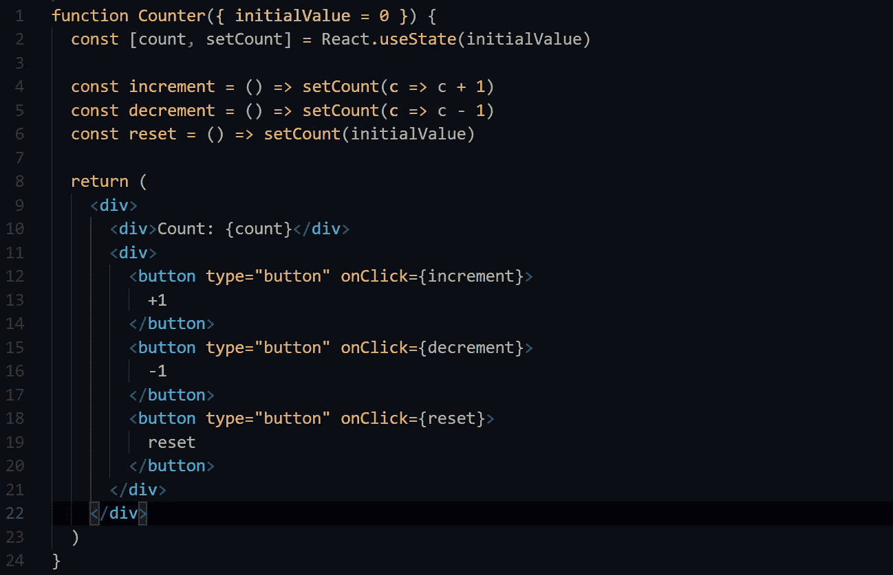*

***Local State***

*   ***肠胃外***

*当数据及其 ***更新器*** 作为道具从组件树中的某个更高位置传入时，状态管理发生。*

*在上面的例子中，如果我们使用父状态，那么将数据和更新函数移动到父控制组件，并将它们作为 **props** 传递到受控制的子组件，这将非常简单。*

*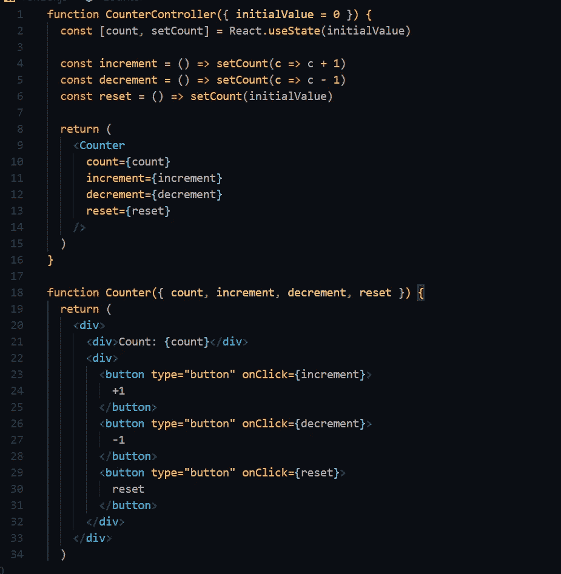*

*   ***远程***

*当我们在组件的祖先之外存储和更新数据时，就会发生远程状态管理。我们在 **Redux** 或 **React 上下文 API 中非常常用这些方法。***

*这个概念的基本部分是更新程序与消费组件有一段距离，需要一些工作来向消费者提供数据。*

## *6.生命周期*

*当我们在 React 组件中将生命周期定义为出生、成长和死亡时，我们也遵循这个周期:*

***T1。创建(挂载在 DOM 上)***

****。*** 成长(更新)*

****。*死亡(从 DOM 中卸载)***

*生命周期可以分为四个部分:*

*   *初始化*
*   *增加*
*   *更新*
*   *卸载*

## *7.调和与虚拟 DOM*

*Rect 提供了一个声明性的 API，这样我们就不必担心每次更新时会发生什么变化，这使得编写应用程序变得更加容易。当组件状态改变时，React 必须计算是否有必要更新 DOM。*

## ***8。了解虚拟 DOM***

*在 React 中，对于每个 DOM 对象，都有一个对应的**‘虚拟 DOM’**对象，它是一个 DOM 对象的表示。*

*虚拟 DOM 对象与真实 DOM 对象具有相同的属性，尽管它缺乏真实对象直接改变屏幕内容的能力。*

*当您尝试在 React 中更新 DOM 时，会发生以下情况:*

1.  *整个虚拟 DOM 得到更新。*
2.  *反应出哪些物体发生了变化。*
3.  *在真实的 DOM 上，只有更改过的对象才会得到更新。*
4.  *真实 DOM 上的改变导致屏幕改变。*

## *9.处理事件*

*React 可以基于用户事件执行操作。React 有和 HTML 一样的事件:点击，改变，鼠标悬停。*

1.  *React 事件使用**驼峰式**符号而不是**小写**命名。*
2.  *我们传递一个函数作为事件处理器，而不是一个字符串。*

*我们需要在 React 应用程序中处理这些事件，以使它们随时响应。*

*例如，让我们用 **onclick** 事件来检测用户何时点击组件中的特定区域:*

*在 HTML 中。*

```
*<button **onclick**="activateLasers()">
  Activate Lasers
</button>*
```

*在反应。*

```
*<button **onClick**={activateLasers}>  Activate Lasers
</button>*
```

## *10.参考文献*

*Refs 是 React 提供的一个函数，用于访问我们自己创建的 DOM 元素和 React 元素。它们主要用于当我们想改变一个子组件的值而不使用道具和其他东西的时候。*

****例如:****

*无参考文献*

*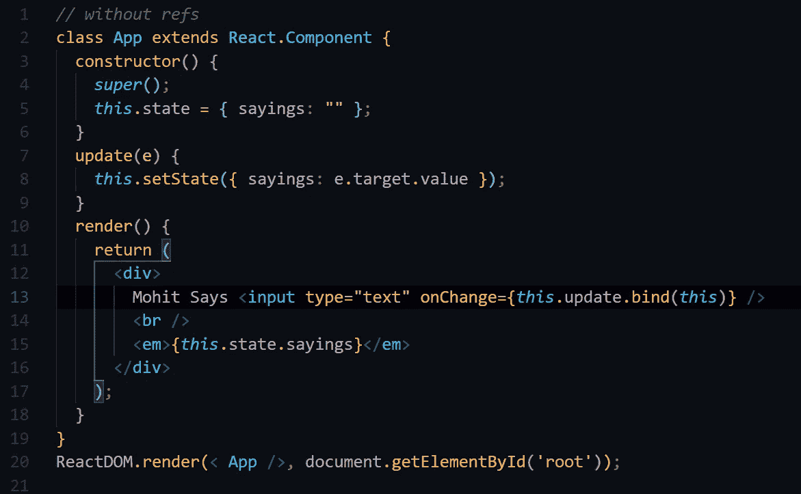*

*使用引用*

*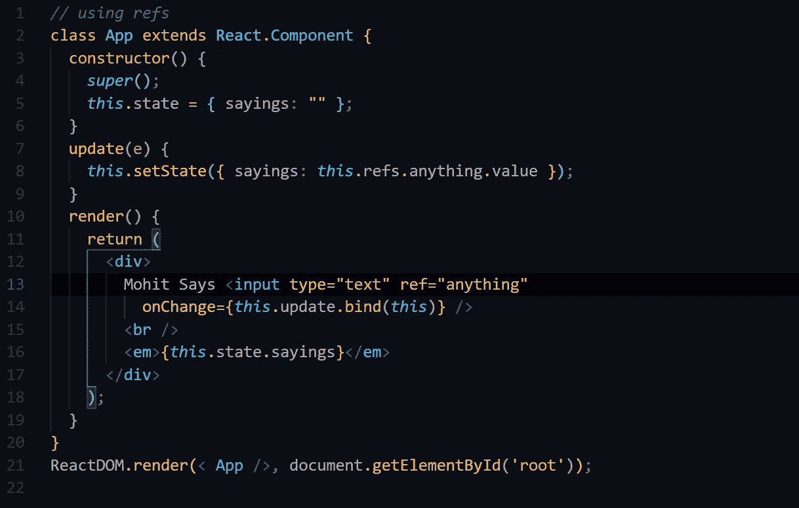*

*何时使用参考文献。*

*   *使用第三方库时。*
*   *在动画中。*

*何时不使用参考文献。*

*   *因为它们没有实例。*
*   *可以公开完成的事情。*

## *11.碎片*

*在 React 中，当你必须在一个组件中渲染多个组件时，你会大量使用 fragment。*

> *一个组件只能返回一个元素。*

*例如:*

*我们使用 **React.fragment** 将类组件名称中的 **h1 & p1** 呈现为 **BlogPostExcerpt***

*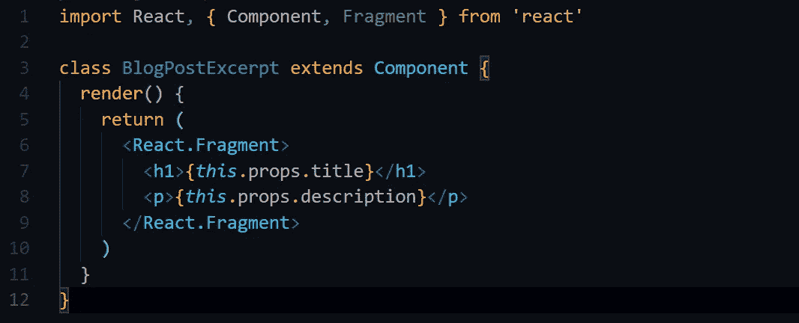*

# *3.式样*

## *1.React 中的 CSS*

*CSS-in-JS 不是一个特定的东西，它是一种设计应用程序风格的技术。在 **CSS-in-JS 兴起之前，**使用 CSS 最广泛的方式是使用 CSS 模块，它们基本上只是。css 文件，你把你所有的 **CSS** 代码，如类名，id，动画等，并且每次它被导入到特定模块的名字和动画，默认情况下是本地组件范围。*

*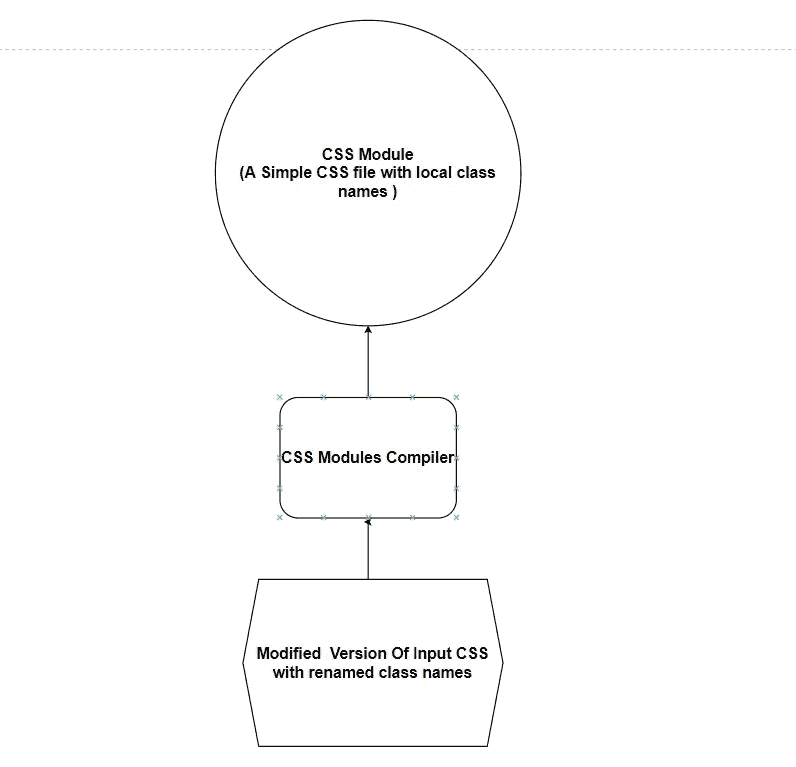*

## *2.CSS-In-JS*

***CSS-in-JS** 不同于内联样式，因为我们仍然用 JS 编写所有的 CSS，但是我们没有将它传递给 style 属性，而是将这些样式和一个实际的 CSS 字符串注入到 DOM 的< style >标签中。*

*例如:*

*如果您正在使用内联样式，您需要做的就是创建一个 JS 对象并传递样式化元素的选项。*

```
***const styles = {
      background: "#FE0000",
      color: "#FFFFFF"
    };***
```

*然后在您的元素中，我们传递:*

```
***<div style={styles}>
     <h1>CSS-in-JS</h1>
    </div>***
```

*通过使用内嵌样式，我们有一些限制，因为我们不能使用**伪选择器、媒体查询、关键帧等。***

*但 CSS-in-JS 不同于内联样式，通过将所有 CSS 放在 JS 中并使用 CSS-in-JS，我们可以有单独的文件夹来以更好的方式组织您的样式，并有不同 React 组件的文件，消除了我们在单个 ***中的所有混乱。css 文件。****

***例如:***

*您必须首先使用您选择的软件包管理器安装样式化的组件。*

```
*yarn add styled-components*
```

*然后将其导入 React 组件:*

```
*import styled from "styled-components";*
```

*要开始使用它，您只需创建一个对象模板文字，*

```
***const StyledButton = styled.button`
      width: 120px;
      height: 42px;
      background: #FE0000;
      color: #FFFFFF;
    `;***
```

*要使用我们刚刚创建的这个组件，您必须将它作为我们创建的按钮来传递。*

```
***import React from "react";
    import styled from "styled-components";

    const StyledButton = styled.button`
      width: 120px;
      height: 42px;
      background: #FE0000;
      color: #FFFFFF;
    `;

    const Button = () => (
      <StyledButton>
        My Styled Button
      </StyledButton>
    );

    export default Button;***
```

## *3.动画*

1.  ***Popmotion***

*它是一个底层的功能性 JS 运动库，允许开发者在 JS 环境中(**浏览器，节点**)动画到任何渲染目标 **(CSS，SVG，Thee，JS，canvas 等)。***

*要安装:*

```
*npm install popmotion --save* 
```

***2。反应动作***

*React Motion 是 React 的一个动画库，它使得创建和实现逼真的动画变得很容易(**你可以创建真正自然的、基于物理的动画)。***

```
*npx create-react-app intro-react-motion*
```

***3。反作用弹簧***

*React Spring 是另一个伟大的动画库，用于构建基于物理的动画，支持 React 中大多数 UI 相关的动画，它是两个世界中最好的，它是两个现有 React 动画库之间的桥梁，即: **React Motion & Animated。***

***4。反应过渡组***

*这不是一个像 **React-Motion、**那样的动画库，它公开了用于定义进入和现有过渡的简单组件。它公开转换阶段，管理类和组元素，并以有用的方式操作 DOM。*

# *4.状态管理*

## *1.Redux*

*Redux 是一个针对 **JavaScript** 应用的可预测状态容器，你可以编写行为一致并在不同环境**(客户端、服务器和本机)**下运行的应用。你可以把 Redux 和 React 一起使用，并且有一个很大的插件生态系统。*

## *2.MobX*

*React 应用程序的另一个很棒的状态管理库，所有对数据的更改和使用都在运行时被跟踪，构建一个依赖关系树来捕获依赖于状态的计算。 **MobX** 允许你在任何 UI 框架之外管理你的应用程序状态，这使得你的代码可移植且易于测试。*

## *3.未说明的*

*如果你已经习惯了 React，Unstated 非常简单易懂，它建立在现有的 React 概念之上，如 **setState、类结构、上下文和通用模式，如 render props** 。*

## *4.RxJS*

*一个通过使用可观察序列来编写异步和基于事件的程序的库。RxJS 能够使用我们的函数生成值，这意味着您的代码不容易出错。*

# *5.数据管理*

## *1.REST APIs*

*在构建 React 应用程序时，你会经常用到 REST API，REST 代表'**具象状态转移【T11'，这是开发人员在创建 API 时遵循的一套规则。其中一条规则规定，当我们链接到一个特定的 URL 时，我们应该能够获得一段数据。***

## *2.GraphQL*

*由脸书在 2012 年开发，因为该团队需要一个足够强大的数据获取 API 来描述整个脸书。 **GraphQL** 已被证明对于构建现代移动和网络应用间接有效，为开发人员提供了灵活丰富的数据提取技术。*

*它甚至可以部署在一个名为 ***GraphiQL*** 的 IDE 中。作为 REST 的替代方案，GraphiQL 允许开发人员构造一个请求，在一个 **API** 调用中从多个数据源提取数据。*

# *6.后端开发*

## *节点. js*

*React 应用程序的后端有很多选择，但是由于使用 **Node.js** 已经成为 React 开发人员的第二天性，建议学习 **Node.js** 。它是托管和运行 React 应用程序的 web 服务器的最方便的平台。*

*   *使用 NPM **(节点包管理器)**，节点与 NPM 注册中心一起工作，通过 NPM CLI 安装任何包。*
*   *另外， **Node** 将一个 React 应用程序捆绑到一个文件中，以便使用 webpack 和其他几个节点模块进行编译。*
*   *开发者可以直接在 Node.js 环境中执行 **React.js** 代码。*
*   ***React DOM** 具有专门设计用于 Node.js 的组件，减少了代码行，使得服务器端呈现相对容易*

## *为什么 React 和 Node.js 是一个完美的组合:*

*   ***高服务器负载:**当您的 web 应用程序需要处理多个请求和绘制服务器负载平衡时，使用 Node.js 和 React 是有意义的。*
*   ***JSON API:**用 Node.js 为你的应用构建**JSON API**是非常高效的，因为 React.js 中的代码重用性高，代码共享简单*
*   ***MERN 栈:** Node.js 也可以和 React with MERN (MongoDB，Express，React & Node)栈一起使用。*

# *8.内容管理系统*

## *网络 CMS*

*为您的 **Git** 工作流提供一个伟大的开源内容管理系统，为您提供一个非常友好的 **UI** 和直观的工作流。您可以将它与任何静态站点生成器一起使用，以便更快、更灵活地创建文件夹和 web 项目。*

*   ***快速&基于 Web 的 UI:** 在实时预览和拖放媒体中提供富文本编辑。*
*   ***完全可扩展:**你可以创建定制风格的预览、UI 小部件和编辑器插件。*
*   ***安装简单:**你只需要在你的网站上添加两个文件，并通过将这些文件包含在你的构建过程中或者链接到我们的 ***CDN(内容交付网络)来连接后端。****

# *8.福米克*

*在 React 应用程序中创建表单对你来说是一件痛苦的事情，不使用 Formik，你仍然可以用 React 中的状态管理创建你自己的表单，但是当你不得不在表单中添加更多的特性**(验证)**，并且在 React 应用程序中创建多个表单变得非常困难的时候，这就变成了一个非常痛苦的过程。但是使用 formik，您可以轻松地创建各种具有非常灵活选项的表单。*

*   *Formik 负责处理重复和烦人的事情，并跟踪表单字段中的**值和**错误。因此，您将花费更少的时间编写状态和变更处理程序，并将更多的时间集中在项目上。*

# *10.服务器端渲染*

## *Next.js*

*这是一个非常棒的创建 web 应用程序的工具，最著名的是服务器端渲染，你也可以为不同的平台创建强大的 web 应用程序。*

*如果你已经熟悉 CSS、JavaScript 和一点 React，切换到 Next.js 对你来说会很容易。*

*   ***生态系统兼容性:**兼容 JavaScript、Node、React。*
*   ***自动代码分割:**代码中的每个导入都被捆绑在一起，并与每个页面一起提供，这意味着所有不必要的代码都不会加载到页面上。*
*   ***Styled-JSX:** 允许你直接在 JS 代码里面写 CSS。*

## *狂欢*

*SSR **(服务器端渲染)**的另一个很好的替代工具，将 SSR 所需的所有复杂配置抽象为一个依赖项，为我们提供了 ***create-react-app*** 的最佳体验，并将所有关于框架、路由和数据获取的应用架构决策留给了我们。它不仅适用于 React，还适用于 Reason、Elm、Vue 和 Angular。*

*   ***熟悉度:**了解 ES6 JavaScript 将永远是一个优势，与 create-react-app 相同的 CSS 设置使其非常容易工作。*
*   ***热重装:** Razzel 提供了热模块重装，这样无论何时我们做任何改变，客户端和服务器都会更新。*

# *14.按指定路线发送*

## *反应路由器*

**路由是保持浏览器 URL 与页面上呈现的内容同步的过程。React 路由器以声明方式处理路由，这允许我们控制应用程序中的数据流。**

*React-路由器的一些主要组件:*

*   ***BrowserRouter:** 一个路由器实现，它使用 HTML 历史 API ( **pushState、replaceState 和 popState** 事件)来保持 UI 与 URL 同步。*
*   ***Route:** 当其路径与当前 URL 匹配时，有条件地显示呈现一些 UI 的组件。*
*   ***Link:**Link 组件用于创建不同路线的链接，并实现应用程序周围的导航(工作方式类似于 ***HTML 锚标签*** )。*
*   ***开关:**用于只渲染与位置匹配的第一条路线，而不是渲染所有匹配的路线。*

# *16.测试*

## *玩笑*

*一个由脸书开发的 JavaScript 测试框架，当我们向代码单元提供输入并将输出与预期输出匹配时，它主要用于单元测试。*

> ***笑话特色:***

*   ***零配置:**开始编写测试并部署它们需要一个接近于零的配置，然而，也可以向测试提供一个配置文件。*
*   ***快照:**当快照与保存的快照匹配时，它还能够启用快照测试，并检查匹配功能。*
*   *此外，Jest 并行运行以提高运行时间*

## *酶*

*Enzyme 服务于不同的目的，而不仅仅是一个测试库，它使测试 React 组件更容易，并与任何完整的测试库集成，包括 **Jest** 。如果你使用 React 来制作 web 应用，那么结合使用 Enzyme 和 Jest 来自动测试 UI 是非常有意义的。*

# *18.部署*

## *网络生活*

*其中一个最好的网络开发平台是众所周知的，以最佳方式倍增你的生产力。通过将现代 web 解耦的 web 元素从本地开发过程统一到高级逻辑，它提供了一种令人惊叹的方式来确保更高性能、可伸缩、安全的网站和应用程序。*

*   ***无服务器功能:**当我们构建静态网站并且不想处理后端服务时，我们可以使用第三方 **BaaS** 解决方案，使用 **Netlify** 时，我们不必担心创建后端，因为它允许为后端解决方案集成无服务器功能。*
*   ***表单:**当我们需要从用户那里获取信息时，创建表单是最简单的方法。*
*   ***对比测试:**它帮助我们部署两个不同的网站版本，以便我们能够以更有效的方式跟踪哪个对业务更好。*