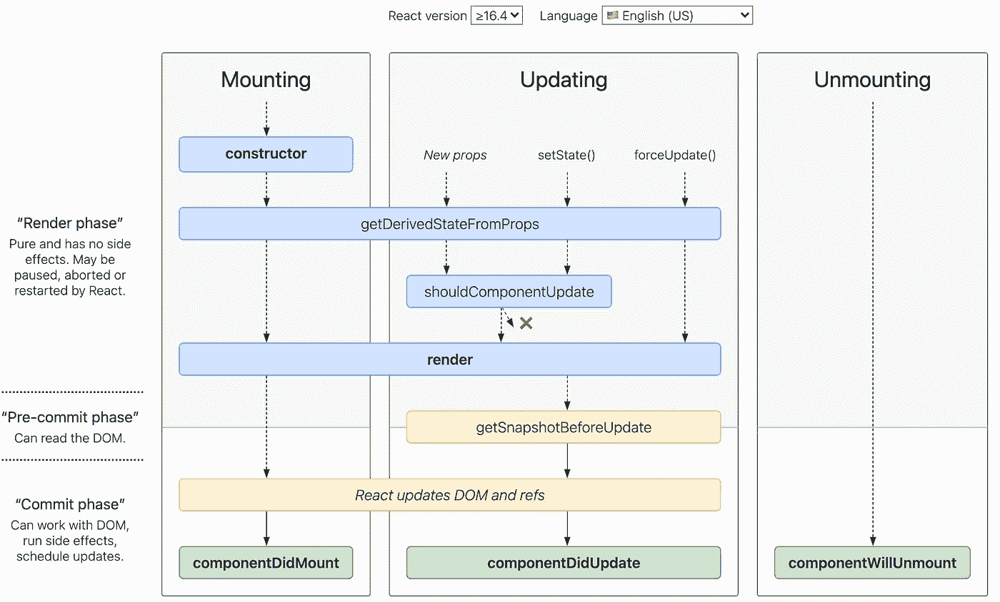
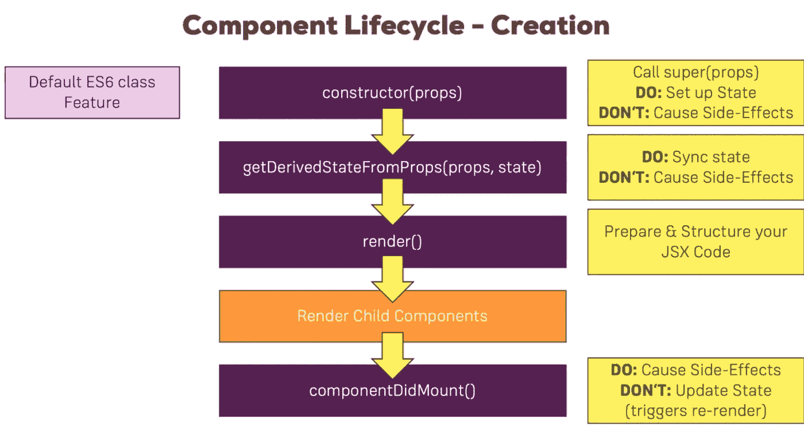
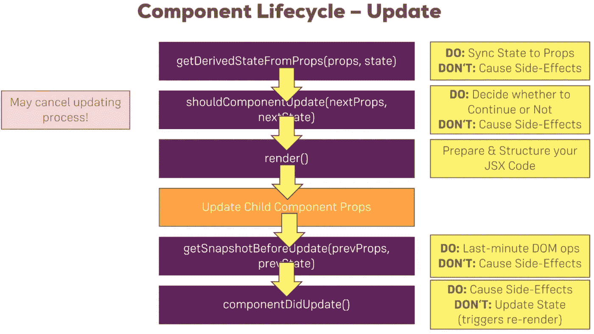

# React 类生命周期方法的深入探讨

> 原文：<https://javascript.plainenglish.io/react-lifecycle-methods-a-deep-dive-f97c4553c5c2?source=collection_archive---------6----------------------->

## 安装、更新、卸载和错误处理阶段方法

# 什么是 React 生命周期方法？

> 你可以把 React 生命周期方法看作是从 React 组件诞生到死亡的一系列事件。

React 中的每个组件都经历一个事件生命周期。我喜欢把它们想象成经历出生、成长和死亡的循环。

*   **安装—** 您的组件的诞生。这是将*组件插入 DOM* 的阶段。
*   **更新** —你的组件的成长。这是*组件的状态和属性可以改变*的阶段，导致使用更新的状态/属性重新渲染组件的过程
*   **卸载** —组件死亡。这是组件生命周期的最后一个阶段，在这个阶段，它被从 DOM 中*移除。*

现在我们已经了解了一系列生命周期事件，让我们进一步了解它们是如何工作的。

# 组件生命周期

每个组件都有几个“生命周期方法”，您可以覆盖这些方法，以便在流程中的特定时间运行代码。**你可以用** [**这张生命周期图**](https://projects.wojtekmaj.pl/react-lifecycle-methods-diagram/) **作为备忘单。**在下表中，常用的生命周期方法标记为**粗体**。其余的用于相对罕见的用例。



# 增加

当一个组件的实例被创建并插入到 DOM 中时，这些方法按以下顺序被调用:

*   `**constructor()**`
*   `static getDerivedStateFromProps()`
*   `**render()**`
*   `**componentDidMount()**`

> **注意:**这些方法被认为是遗留的，你应该[在新代码中避免它们](https://reactjs.org/blog/2018/03/27/update-on-async-rendering.html):`UNSAFE_componentWillMount().`

# 1.构造函数()

```
constructor(props)
```

React 组件的构造函数在挂载之前被调用。当实现一个`React.Component`子类的构造函数时，你应该在任何其他语句之前调用`super(props)`。否则，`this.props`将在构造函数中未定义，这可能会导致 bug。

通常，在 React 中，构造函数只用于两个目的:

*   通过向`this.state`分配一个对象来初始化本地状态。
*   将事件处理程序方法绑定到实例。

你**不应该在`constructor()`中调用**T0。相反，如果你的组件需要使用一个本地状态，**在构造函数中直接将初始状态赋值给** `**this.state**`:

```
constructor(props) {
  super(props);
  // Don't call this.setState() here!
  this.state = { counter: 0 };
  this.handleClick = this.handleClick.bind(this);
}
```

**如果不初始化状态，也不绑定方法，就不需要为 React 组件实现构造函数。**

构造函数是唯一应该直接赋值`this.state`的地方。在所有其他方法中，您需要使用`this.setState()`来代替。

避免在构造函数中引入任何副作用或订阅。对于那些用例，用`componentDidMount()`代替。

**注意:避免复制道具进入状态！这是一个常见的错误:**

```
constructor(props) {
 super(props);
 // Don't do this!
 this.state = { color: props.color };
}
```

问题是它既没必要(你可以直接用`this.props.color`代替)，又会产生 bug(对`color`道具的更新不会反映在状态中)。**仅当您有意忽略适当更新时，才使用此模式。**

**构造函数最常见的用例:**设置状态、创建引用和方法绑定。

# 2.静态 getDerivedStateFromProps()

```
static getDerivedStateFromProps(props, state)
```

`getDerivedStateFromProps`在调用 render 方法之前被调用，无论是初始挂载还是后续更新。这种方法存在于[罕见的用例](https://reactjs.org/blog/2018/06/07/you-probably-dont-need-derived-state.html#when-to-use-derived-state)，其中状态依赖于道具随时间的变化。

这是一个*静态*函数，它不能访问“ *this* ”。*getDerivedStateFromProps()*返回一个对象来更新*状态*以响应*属性*的变化。如果状态没有变化，它可以返回一个空值。

```
static getDerivedStateFromProps(props, state) {
    if (props.currentRow !== state.lastRow) {
      return {
        isScrollingDown: props.currentRow > state.lastRow,
        lastRow: props.currentRow,
      };
    }
    // Return null to indicate no change to state.
    return null;
  }
```

这种方法可能派上用场的一个用例是一个<transition>组件，它比较它的上一个和下一个子组件，以决定哪些子组件要动画进出。</transition>

请记住，这个生命周期方法在每次渲染时都会在**上触发，不管原因是什么。这与`UNSAFE_componentWillReceiveProps`形成对比，后者仅在父对象导致重新渲染时触发，而不是作为局部`setState`的结果。**

派生状态会导致冗长的代码，并使您的组件难以理解。确保您熟悉更简单的替代方案:

*   如果您需要**执行副作用**(例如，数据获取或动画)来响应道具的变化，请使用`componentDidUpdate`生命周期。
*   如果您希望**仅在属性改变时重新计算一些数据**，请使用记忆辅助程序。

派生状态用于确保仅当输入改变时才重新计算`render`中使用的昂贵值。这种技术被称为[记忆](https://en.wikipedia.org/wiki/Memoization)。使用派生状态进行记忆并不一定是坏的，但通常不是最好的解决方案。管理派生状态存在固有的复杂性，并且这种复杂性随着每个附加属性而增加。例如，如果我们向组件状态添加第二个派生字段，那么我们的实现将需要分别跟踪对这两个字段的更改。

让我们看一个组件的例子，它接受一个属性——一个条目列表——并呈现与用户输入的搜索查询相匹配的条目。我们可以使用派生状态来存储过滤列表:

```
class Example extends Component {
  state = {
    filterText: "",
  }; // *******************************************************
  // NOTE: this example is NOT the recommended approach.
  // See the examples below for our recommendations instead.
  // ******************************************************* static getDerivedStateFromProps(props, state) {
    // Re-run the filter whenever the list array or filter text change.
    // Note we need to store prevPropsList and prevFilterText to detect changes.
    if (
      props.list !== state.prevPropsList ||
      state.prevFilterText !== state.filterText
    ) {
      return {
        prevPropsList: props.list,
        prevFilterText: state.filterText,
        filteredList: props.list.filter(item =>     item.text.includes(state.filterText))
      };
    }
    return null;
  } handleChange = event => {
    this.setState({ filterText: event.target.value });
  }; render() {
    return (
      <Fragment>
        <input onChange={this.handleChange} value={this.state.filterText} />
        <ul>{this.state.filteredList.map(item => <li key={item.id}>{item.text}</li>)}</ul>
      </Fragment>
    );
  }
}
```

这种实现避免了不必要的重新计算`filteredList`。但是它比需要的更复杂，因为它必须分别跟踪和检测属性和状态的变化，以便正确地更新过滤列表。我们可以添加一个记忆助手来避免不必要的重新过滤列表:

```
import memoize from "memoize-one";class Example extends Component {
  // State only needs to hold the current filter text value:
  state = { filterText: "" }; // Re-run the filter whenever the list array or filter text changes:
  filter = memoize(
    (list, filterText) => list.filter(item => item.text.includes(filterText))
  ); handleChange = event => {
    this.setState({ filterText: event.target.value });
  }; render() {
    // Calculate the latest filtered list. If these arguments haven't changed
    // since the last render, `memoize-one` will reuse the last return value.
    const filteredList = this.filter(this.props.list, this.state.filterText); return (
      <Fragment>
        <input onChange={this.handleChange} value={this.state.filterText} />
        <ul>{filteredList.map(item => <li key={item.id}>{item.text}</li>)}</ul>
      </Fragment>
    );
  }
}
```

这要简单得多，执行起来和派生状态版本一样好！

使用记忆化时，请记住几个约束:

1.  在大多数情况下，你会希望**将内存化的函数附加到组件实例**。这可以防止组件的多个实例重置彼此的记忆键。
2.  通常情况下，为了防止随着时间的推移出现内存泄漏，您会希望使用一个具有有限缓存大小的内存化助手。(在上面的例子中，我们使用了`memoize-one`,因为它只缓存最近的参数和结果。)
3.  如果每次父组件渲染时都重新创建`props.list`,那么本节中显示的所有实现都将不起作用。但是在大多数情况下，这种设置是合适的。

*   如果你想在道具改变时**“重置”某个状态**，考虑用`key`替代使一个组件完全受控或完全不受控。

**完全受控的组件—** 避免上述问题的一种方法是从我们的组件中完全移除状态。如果邮箱地址只是作为道具存在，那么我们就不用担心和 state 冲突了。我们甚至可以将`EmailInput`转换成重量更轻的功能组件:

```
function EmailInput(props) {
  return <input onChange={props.onChange} value={props.email} />;
}
```

这种方法简化了组件的实现，但是如果我们仍然想存储一个草稿值，父表单组件现在需要手动完成。

**带有** `**key**` **的完全不受控制的组件—** 另一种选择是我们的组件完全拥有“草稿”电子邮件状态。在这种情况下，我们的组件仍然可以接受一个用于初始*值的属性，但是它会忽略对该属性的后续更改:*

```
class EmailInput extends Component {
  state = { email: this.props.defaultEmail }; handleChange = event => {
    this.setState({ email: event.target.value });
  }; render() {
    return <input onChange={this.handleChange} value={this.state.email} />;
  }
}
```

为了在移动到不同的项目时重置该值，我们可以使用名为`key`的特殊 React 属性。当一个`key`改变时，React 将*创建*一个新的组件实例，而不是*更新*当前的组件实例。键通常用于动态列表，但在这里也很有用。在我们的例子中，我们可以使用用户 ID 在任何时候选择新用户时重新创建电子邮件输入:

```
<EmailInput
  defaultEmail={this.props.user.email}
  key={this.props.user.id}
/>
```

每次 ID 改变时，`EmailInput`将被重新创建，其状态将被重置为最新的`defaultEmail`值。

**getDerivedStateFromProps(挂载期间)最常见的用例:**返回基于初始属性的状态对象。

# 3.渲染()

```
render()
```

`render()`方法是类组件中唯一需要的方法。

当被调用时，它应该检查`this.props`和`this.state`并返回以下类型之一:

*   **反应元素。**通常通过 [JSX](https://reactjs.org/docs/introducing-jsx.html) 创建。例如，`<div />`和`<MyComponent />`是 React 元素，分别指示 React 呈现一个 DOM 节点或另一个用户定义的组件。下面是 React 中一个简单的 *render()* 的例子。

```
class Hello extends Component{
   render(){
      return <div>Hello {this.props.name}</div>
   }
}
```

*   **数组和片段。**让你从渲染中返回多个元素。

```
class Hello extends Component{
 render() {
    return (
      <React.Fragment>
        <ChildA />
        <ChildB />
        <ChildC />
      </React.Fragment>
    );
  }
}
```

*   **门户**。允许您将子对象呈现到不同的 DOM 子树中。

```
class Hello extends Component{
 render() {
    return ReactDOM.createPortal(
        this.props.children,
        domNode  
    );
 } 
}// React does *not* create a new div. It renders the children into `domNode`.
// `domNode` is any valid DOM node, regardless of its location in the DOM.
```

*   **字符串和数字。这些在 DOM 中呈现为文本节点。**
*   **布尔人或** `**null**`。不渲染任何内容。(主要是为了支持`return test && <Child />`模式，其中`test`是布尔型的。)

```
class Hello extends Component {
  render() {
    return null;
  }
}
```

`render()`函数应该是纯的，这意味着它不修改组件状态，每次调用它都返回相同的结果，并且它不直接与浏览器交互。这意味着你不能在一个 *render()中 *setState()* 。*

**渲染最常见的用例:**返回组件 JSX。

# 4.componentDidMount()

```
componentDidMount()
```

现在您的组件已经被挂载并准备好了，这就是下一个 React 生命周期方法***componentDidMount()***开始发挥作用的时候了。如果需要从远程端点加载数据，这是启动 API 调用的好地方。

与 *render()* 方法不同，*componentidmount()*允许使用 *setState()* 。不要在这里直接调用 *setState()* ，除非是在你发送一个 HTTP 请求之后的一个 promise 的 then 块中。但是**不要在这里同步调用*setState()***。因此，您肯定可以设置一些将来执行的代码，然后更新状态。

在这里直接调用*setState()**将会更新状态并导致另一次渲染，但这将发生在浏览器更新 UI 之前。这是为了确保用户不会看到双重呈现的任何 UI 更新。*

> **您可以在*componentidmount()*中修改组件状态，但要小心使用。**

***注意:**建议您谨慎使用此模式，因为它可能会导致性能问题。最佳实践是确保在*构造函数()中分配您的状态。【React 允许在这个生命周期方法中使用 *setState()* 的原因是为了特殊情况，比如工具提示、模态和类似的概念，当你需要在渲染依赖于它的位置的东西之前测量一个 DOM 节点时。**

```
*componentDidMount() {
    fetch(`[https://api.mydomain.com/](https://api.mydomain.com/)`)
      .then(res => res.json())
      .then(json => this.setState({ data: json }));
}async componentDidMount() {
    const response = await fetch(`[https://api.mydomain.com/](https://api.mydomain.com/)`);
    const json = await response.json();
    this.setState({ data: json });
}*
```

***componentidmount 最常见的用例:**启动 AJAX 调用为组件加载数据。另外，如果你需要**初始化任何依赖于 DOM 的东西，**你可以在这里完成(比如初始化像 D3 这样的第三方库)。最后但同样重要的是，您可以**在 componentDidMount 中添加事件监听器**。*

# *5.UNSAFE_componentWillMount()*

```
*UNSAFE_componentWillMount()*
```

> **注:
> 这个生命周期之前被命名为* `*componentWillMount*` *。该名称将一直使用到版本 17。使用*`[*rename-unsafe-lifecycles*](https://github.com/reactjs/react-codemod#rename-unsafe-lifecycles)`[*codemod*](https://github.com/reactjs/react-codemod#rename-unsafe-lifecycles)*来自动更新你的组件。**

*在挂载发生之前调用`UNSAFE_componentWillMount()`。它在`render()`之前被调用，因此在这个方法中同步调用`setState()`不会触发额外的渲染。一般情况下，我们建议使用`constructor()`代替初始化状态。*

*对于我们来说,`componentWillMount()`是一个处理配置、更新状态以及为第一次渲染做准备的机会。至此，道具和初始状态定义完毕。我们可以安全地查询`this.props`和`this.state`，确切地知道它们是当前值。这意味着我们可以开始根据正确的值进行计算或处理。*

```
*componentWillMount() {
    let mode;
    if (this.props.age > 70) {
      mode = 'old';
    } else if (this.props.age < 18) {
      mode = 'young';
    } else {
      mode = 'middle';
    }
    this.setState({ mode });
  }*
```

*在上面的例子中，我们调用`this.setState()`并在渲染前更新我们的当前状态。如果我们需要在`props`中传递的计算的状态值，这就是我们应该做逻辑的地方。*

*避免在这种方法中引入任何副作用或订阅。对于那些用例，使用`componentDidMount()`代替。*

*例外情况是任何只能在运行时完成的设置——即连接到外部 API。例如，如果你的应用程序使用 Firebase，当你的应用程序第一次挂载时，你需要设置它。*

*但关键是，这样的配置应该在你的应用程序的最高层组件(根组件)完成。这意味着 99%的组件可能不应该使用 componentWillMount。*

*这是在服务器渲染上调用的唯一生命周期方法。*

***最常见的用例:**你的根组件中的 App 配置**，**注册到一个 Flux store 之类的全局事件。如果您的组件需要响应全局本机 UI 事件，比如`window`调整大小或焦点改变，这是一个很好的地方*

**

*这里的副作用指的是发送 HTTP 请求或在本地存储中存储一些东西或向 Google Analytics 发送分析。*

# *更新*

*属性或状态的更改可能会导致更新。当组件被重新渲染时，按以下顺序调用这些方法:*

*   *`static getDerivedStateFromProps()`*
*   *`shouldComponentUpdate()`*
*   *`**render()**`*
*   *`getSnapshotBeforeUpdate()`*
*   *`**componentDidUpdate()**`*

> **注意:
> 这些方法被认为是遗留的，你应该* [*在新代码中避免使用*](https://reactjs.org/blog/2018/03/27/update-on-async-rendering.html)*:*`UNSAFE_componentWillUpdate()`*和* `UNSAFE_componentWillReceiveProps()`*

# *1.shouldComponentUpdate()*

```
*shouldComponentUpdate(nextProps, nextState)*
```

*当您不想让 React 呈现您状态或适当的更改时，这个生命周期有时会很方便。默认行为是在每次状态改变时重新渲染，在大多数情况下，您应该依赖默认行为。*

*   *当接收到新的属性或状态时，在渲染之前调用`shouldComponentUpdate()`。默认为`true`。初始渲染或使用`forceUpdate()`时不调用该方法。*
*   *该方法仅作为**性能优化而存在。不要依靠它来“阻止”渲染，因为这会导致错误。**考虑用内置的** `[**PureComponent**](https://reactjs.org/docs/react-api.html#reactpurecomponent)`代替手写`shouldComponentUpdate()`。执行道具和状态的浅层比较，减少你跳过必要更新的机会。***
*   *如果你确信你想要手写，你可以比较`this.props`和`nextProps`以及`this.state`和`nextState`并返回`false`来告诉 React 可以跳过更新。注意，当*的*状态改变时，返回`false`不会阻止子组件重新渲染。*

*我们不建议进行深度相等检查或在`shouldComponentUpdate()`中使用`JSON.stringify()`。这是非常低效的，并且会损害性能。*

*目前，如果`shouldComponentUpdate()`返回`false`，那么`UNSAFE_componentWillUpdate()`、`render()`、`componentDidUpdate()`将不会被调用。将来，React 可能会将`shouldComponentUpdate()`视为一个提示，而不是一个严格的指令，返回`false`仍然可能导致组件的重新呈现。*

```
*shouldComponentUpdate(nextProps, nextState) {
 return this.props.title !== nextProps.title || 
        this.state.input !== nextState.input 
}*
```

*如上例所示，这个生命周期应该总是返回一个布尔值给问题，“ ***我应该重新渲染我的组件吗？*** ”。*

***最常见的用例:**精确控制组件何时重新渲染。*

# *2.getSnapShotBeforeUpdate()*

```
*getSnapshotBeforeUpdate(prevProps, prevState)*
```

*   *`getSnapshotBeforeUpdate()`在最近渲染的输出提交到 DOM 之前被调用。它使您的组件能够在 DOM 发生潜在变化之前捕获一些信息(例如滚动位置)。这个生命周期方法返回的任何值都将作为参数传递给`componentDidUpdate()`。*
*   *这种用例并不常见，但它可能出现在像聊天线程这样需要以特殊方式处理滚动位置的用户界面中。*
*   *应该返回一个快照值(或`null`)。*

*例如:*

```
*class ScrollingList extends React.Component {
  constructor(props) {
    super(props);
    this.listRef = React.createRef();
  } getSnapshotBeforeUpdate(prevProps, prevState) {
    // Are we adding new items to the list?
    // Capture the scroll position so we can adjust scroll later.
    if (prevProps.list.length < this.props.list.length) {
      const list = this.listRef.current;
      return list.scrollHeight - list.scrollTop;
    }
    return null;
  } componentDidUpdate(prevProps, prevState, snapshot) {
    // If we have a snapshot value, we've just added new items.
    // Adjust scroll so these new items don't push the old ones out of view.
    // (snapshot here is the value returned from getSnapshotBeforeUpdate)
    if (snapshot !== null) {
      const list = this.listRef.current;
      list.scrollTop = list.scrollHeight - snapshot;
    }
  } render() {
    return (
      <div ref={this.listRef}>{/* ...contents... */}</div>
    );
  }
}*
```

*在上面的例子中，读取`getSnapshotBeforeUpdate`中的`scrollHeight`属性很重要，因为在“呈现”阶段生命周期(如`render`)和“提交”阶段生命周期(如`getSnapshotBeforeUpdate`和`componentDidUpdate`)之间可能会有延迟。*

*请记住，这种方法也应该很少使用或根本不使用。*

*当*getSnapshotBeforeUpdate()*可用时，在异步渲染期间调整窗口大小是一个很好的用例。*

***最常见的用例:**查看当前 DOM 的一些属性，并将该值传递给`componentDidUpdate`。*

# *3.componentDidUpdate()*

```
*componentDidUpdate(prevProps, prevState, snapshot)*
```

*   *更新发生后立即调用`componentDidUpdate()`。初始呈现时不调用此方法。*
*   *当组件被更新时，利用这个机会对 DOM 进行操作。这也是一个进行网络请求的好地方，只要你将当前的属性与以前的属性进行比较(例如，如果属性没有改变，网络请求可能是不必要的)。*

```
*componentDidUpdate(prevProps) {
  // Typical usage (don't forget to compare props):
  if (this.props.userID !== prevProps.userID) {
    this.fetchData(this.props.userID);
  }
}*
```

*你**可以在`componentDidUpdate()`中立即调用**`**setState()**`**，但是要注意**必须像上面的例子一样用条件**包起来，否则会导致无限循环。同样，不要在这里直接调用 *setState()* ,除非是在发送 HTTP 请求后的承诺的 then 块中。这是一些异步任务的结果，但是**不要在这里同步调用*setState()***。如果被调用，它还会导致额外的重新呈现，这虽然对用户不可见，但会影响组件性能。如果你试图把一些状态“镜像”到一个来自上面的道具，考虑直接使用道具。***

***如果您的组件实现了`getSnapshotBeforeUpdate()`生命周期(这种情况很少见)，它返回的值将作为第三个“快照”参数传递给`componentDidUpdate()`。否则，该参数将未定义。***

> ****注意:* `*componentDidUpdate()*` *如果* `*shouldComponentUpdate()*` *返回 false 则不会调用。****

*****最常见的用例:**更新 DOM 以响应属性或状态变化，更新第三方 UI 库，如 D3，以传递新数据。***

# ***4.UNSAFE _ componentWillReceiveProps()***

```
***UNSAFE_componentWillReceiveProps(nextProps)***
```

> ****注意:这个生命周期之前被命名为* `*componentWillReceiveProps*` *。该名称将一直使用到版本 17。使用* `*rename-unsafe-lifecycles*` *codemod 自动更新您的组件。****

*   ***`UNSAFE_componentWillReceiveProps()`在安装的组件接收新的属性之前被调用。如果您需要更新状态以响应适当的更改(例如，重置它)，您可以比较`this.props`和`nextProps`，并在此方法中使用`this.setState()`执行状态转换。***
*   ***请注意，如果父组件导致您的组件重新呈现，即使 props 没有更改，也会调用此方法。如果您只想处理更改，请确保比较当前值和下一个值。***
*   ***React 在挂载时不会用初始道具调用`UNSAFE_componentWillReceiveProps()`。只有当组件的一些属性可能更新时，它才调用这个方法。呼叫`this.setState()`一般不会触发`UNSAFE_componentWillReceiveProps()`。***

```
***componentWillReceiveProps(nextProps){
   if(this.props.id !== nextProps.id){
      this.setState({
         id: nextProps.id,
         pastId: this.props.id
      })
   }
}***
```

*****最常见的用例:**作用于特定的道具变化来触发状态转换，即如果你有一个状态是由多个道具计算出来的，你可以在这里进行计算。***

# ***5.UNSAFE_componentWillUpdate()***

```
***UNSAFE_componentWillUpdate(nextProps, nextState)***
```

> ****注意:这个生命周期以前被命名为* `*componentWillUpdate*` *。该名称将一直使用到版本 17。使用* `*rename-unsafe-lifecycles*` *codemod 来自动更新你的组件。****

*   ***当接收到新的道具或状态时，在渲染之前调用`UNSAFE_componentWillUpdate()`。利用这一机会，在更新发生之前做好准备。初始呈现时不调用此方法。***
*   ***注意这里不能调用`this.setState()`；在`UNSAFE_componentWillUpdate()`返回之前，您也不应该做任何会触发 React 组件更新的事情(例如，调度 Redux 动作)。***

***通常这种方法可以用`componentDidUpdate()`代替。如果您用这种方法从 DOM 中读取(例如，保存一个滚动位置)，您可以将该逻辑移到`getSnapshotBeforeUpdate()`。***

> ****注意:* `*UNSAFE_componentWillUpdate()*` *如果* `*shouldComponentUpdate()*` *返回 false，则不会调用。****

```
***// dispatching an action based on state change
componentWillUpdate(nextProps, nextState) {
  if (nextState.open == true && this.state.open == false) {
    this.props.onWillOpen();
  }
}***
```

*****最常见的用例:**代替 componentWillReceiveProps 用在也有 shouldComponentUpdate(但不能访问以前的 Props)的组件上，根据状态变化设置变量，调度事件/动作，启动动画。***

******

# ***卸载***

***当组件从 DOM 中移除时，调用此方法:***

*   ***`**componentWillUnmount()**`***

```
***componentWillUnmount()***
```

***`componentWillUnmount()`在组件被卸载和销毁之前立即被调用。在该方法中执行任何必要的清理，例如使计时器失效、清除存储器中的任何缓存、取消网络请求或清理在`componentDidMount()`中创建的任何订阅。***

***你**不应该调用`componentWillUnmount()`中的** `**setState()**`，因为组件永远不会被重新渲染。一旦组件实例被卸载，它将永远不会被再次装载。***

```
***componentWillUnmount() {
  clearInterval(this.interval);
}componentWillUnmount() {
 window.removeEventListener('resize', this.resizeListener)
}***
```

# ***错误处理***

***当呈现过程中、生命周期方法中或任何子组件的构造函数中出现错误时，将调用这些方法。***

*   ***`static getDerivedStateFromError()`***
*   ***`componentDidCatch()`***

***错误边界是 React 组件，它捕捉子组件树中任何地方的 JavaScript 错误，记录这些错误，并显示一个回退 UI，而不是崩溃的组件树。错误边界在渲染期间、在生命周期方法中以及在它们下面的整个树的构造函数中捕捉错误。***

***如果一个类组件定义了生命周期方法`static getDerivedStateFromError()`或`componentDidCatch()`中的一个(或两个),它就会成为一个错误边界。通过更新这些生命周期的状态，您可以在下面的树中捕获未处理的 JavaScript 错误，并显示回退 UI。***

***仅使用错误边界从意外异常中恢复；**不要试图用它们来控制流程。*****

> ****注意:错误边界只捕捉树中* *下* ***组件中的错误。错误边界不能捕捉自身内部的错误。******

# ***静态 getDerivedStateFromError()***

```
***static getDerivedStateFromError(error)***
```

***这个生命周期是在子代组件抛出错误后调用的。它接收作为参数抛出的错误，并应该返回值以更新状态。***

```
***class ErrorBoundary extends React.Component {
  constructor(props) {
    super(props);
    this.state = { hasError: false };
  }
  static getDerivedStateFromError(error) {    
     // Update state so the next render will show the fallback UI.  
     return { hasError: true };  
  }
  render() {
    if (this.state.hasError) {      
        // You can render any custom fallback UI      
        return <h1>Something went wrong.</h1>;    
    }
    return this.props.children;
  }
}***
```

> ****注意:* `*getDerivedStateFromError()*` *是在“渲染”阶段调用的，所以不允许有副作用。对于那些用例，用* `*componentDidCatch()*` *代替。****

# ***componentDidCatch()***

```
***componentDidCatch(error, info)***
```

***这个生命周期是在子代组件抛出错误后调用的。它接收两个参数:***

1.  ***`error` -抛出的错误。***
2.  ***`info` -带有`componentStack`键的对象，包含关于哪个组件抛出错误的[信息。](https://reactjs.org/docs/error-boundaries.html#component-stack-traces)***

***`componentDidCatch()`是在“提交”阶段调用的，所以副作用是允许的。它应该用于记录错误:***

```
***class ErrorBoundary extends React.Component {
  constructor(props) {
    super(props);
    this.state = { hasError: false };
  } static getDerivedStateFromError(error) {
    // Update state so the next render will show the fallback UI.
    return { hasError: true };
  } componentDidCatch(error, info) {       
     // Example "componentStack":    
     // in ComponentThatThrows (created by App)    
     // in ErrorBoundary (created by App)    
     // in div (created by App)    
     //  in App       
     logComponentStackToMyService(info.componentStack);  
  } render() {
    if (this.state.hasError) {
      // You can render any custom fallback UI
      return <h1>Something went wrong.</h1>;
    } return this.props.children;
  }
}***
```

***React 的生产和开发版本在处理错误的方式上略有不同。***

***在开发过程中，错误会上升到`window`，这意味着任何`window.onerror`或`window.addEventListener('error', callback)`都会拦截被`componentDidCatch()`捕获的错误。***

***相反，在生产中，错误不会冒泡，这意味着任何祖先错误处理程序将只接收没有被`componentDidCatch()`显式捕获的错误。***

> ****注意:如果出现错误，您可以通过调用* `*setState*` *使用* `*componentDidCatch()*` *呈现回退 UI，但在未来的版本中将不再支持这种做法。改用* `*static getDerivedStateFromError()*` *处理回退渲染。****

# ***结论***

***我们已经介绍了 React 组件的生命周期由三个阶段组成:安装、更新和卸载。***

***此外，您还了解了 React 在每个阶段调用一组特定的生命周期方法。您可以根据您想要实现的用例来使用它们。***

***感谢阅读！***

****更多内容请看*[***plain English . io***](http://plainenglish.io)***