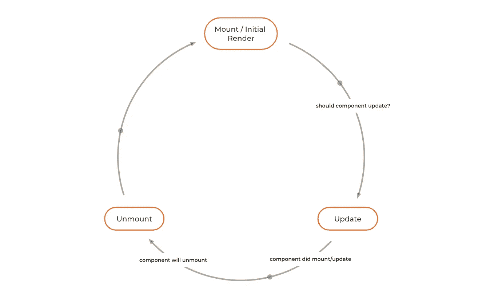

# 在功能组件中反应生命周期方法

> 原文：<https://javascript.plainenglish.io/react-lifecycle-methods-in-functional-components-db72e038bd2a?source=collection_archive---------0----------------------->

## 让我们理解 React 生命周期方法如何与功能组件一起工作。



React Component Life cycle

# React 组件的生命周期:

1.  初始渲染或挂载
2.  更新(当组件中使用的状态或添加到组件中的属性改变时)
3.  卸载

[**此处代码可用**](https://codesandbox.io/s/simple-counter-for-lifecycle-demo-gzxfw?file=/src/components/PureComponentDemo/PureComponent.tsx)

## 我们将只研究那些在大多数场景中使用的生命周期方法。有些方法在 [React 文档](https://reactjs.org/docs/react-component.html#the-component-lifecycle)中被称为很少使用，建议谨慎使用。

1.初始渲染或挂载

```
// Merge of componentDidMount and componentDidUpdate
useEffect(() => {
 console.log(“This is mounted or updated.”);
});
```

在 useEffect 的这个变体中，当组件被挂载时，以及每次组件状态或 props 被更新时，都将打印该消息。

2.更新

```
// Equivalent of componentDidMount
 useEffect(() => {
   console.log(“This is mounted only not updated.”);
 }, []);
```

在此变体中，在组件的生命周期中，该消息将仅打印一次，并且是在组件安装之后。

```
// Merge of componentDidMount and componentDidUpdate but only for given dependency useEffect(() => {
   console.log(“This is mounted or count state updated.”);
 }, [count]);
```

在这个变体中，当组件被安装并且每次计数状态被改变时，该消息将被打印。

3.卸载

```
// Equivalent of componentWillUnmount
 useEffect(() => {
   return () => {
     console.log(“This is unmounted.”);
   };
 }, []);
```

如果我们不希望在组件安装或更新时发生任何副作用，而只是在卸载组件时，那么我们可以使用这个变量。

[**此处代码可用**](https://codesandbox.io/s/simple-counter-for-lifecycle-demo-gzxfw?file=/src/components/PureComponentDemo/PureComponent.tsx)

# 控制重新渲染:纯组件

控制组件重新呈现的方法之一是使用“React.memo”高阶组件。

React.memo 使用记忆化。它**浅显的**将之前的道具与当前的道具进行对比，判断道具是否有变化。如果它们被更改，那么组件将被重新渲染。

我们可以向 React.memo 提供自定义比较器，也可以自定义比较。

PureComponent.tsx

```
import React from "react";
​
const RegularComponent = (props: any) => {
  console.log("***Pure component is rendered***");
  return <p>Pure Component = {props.name.firstName}</p>;
};
​
const PureComponent = React.memo(RegularComponent);
​
export {PureComponent};
```

或使用比较仪:

```
import React from "react";
​
const PureComponent = React.memo(
  (props: any) => {
    console.log("***Pure component is rendered***");
    return <p>Pure Component = {props.name.firstName}</p>;
  },
  (prevProps, nextProps) => {
    /*
    return true if passing nextProps to render would return
    the same result as passing prevProps to render,
    otherwise return false
    */
    if (prevProps.name.firstName === nextProps.name.firstName) return true;
    return false;
  }
);
​
export { PureComponent };
```

正则组件. tsx

```
import React from "react";
​
const RegularComponent = (props: any) => {
  console.log("***Regular component is rendered***");
​
  return <p>Regular Component = {props.name.firstName}</p>;
};
​
export default RegularComponent;
```

ParentComponent.tsx

```
import React, { useState } from "react";
import {PureComponent} from "./PureComponent";
import RegularComponent from "./RegularComponent";
​
const ParentComponent = () => {
  const [count, setCount] = useState<number>(0);
  const [name, setName] = useState<{ firstName: string }>({
    firstName: "Yogesh"
  });
​
  console.log("*****Parent component is rendered*****");
​
  return (
    <>
      <p>Parent Component</p>
      <button
        onClick={() => {
          setCount((c) => c + 1);
        }}
      >
        count = {count}
      </button>
      <button
        onClick={() => {
          setName({ firstName: "YPD" });
        }}
      >
        change name
      </button>
      <RegularComponent name={name} />
      <PureComponent name={name} />
    </>
  );
};
​
export default ParentComponent;
```

[**此处代码可用**](https://codesandbox.io/s/simple-counter-for-lifecycle-demo-gzxfw?file=/src/components/PureComponentDemo/PureComponent.tsx)

感谢你的阅读！

[](/react-context-do-you-really-need-it-this-will-help-you-decide-bcbdae589f70) [## 反应上下文:你真的需要它吗？这将帮助你决定！

### 如何创建一个反应上下文

javascript.plainenglish.io](/react-context-do-you-really-need-it-this-will-help-you-decide-bcbdae589f70) 

参考资料:

简单场景: [React.memo](https://youtu.be/bZeBToIqaR4)

对于控制组件重新渲染的更多场景，请使用下面的视频:[如何在 React 中使用 memo 来优化渲染](https://youtu.be/o-alRbk_zP0)

此外，在使用 memoization 之前，请先阅读:[再使用 memo](https://dmitripavlutin.com/use-react-memo-wisely/)

【React 生命周期方法概述

## 进一步阅读

[](https://bit.cloud/blog/-extracting-and-reusing-pre-existing-components-using-bit-add-l28qlxpz) [## 使用位添加提取和重用预先存在的组件

### 最后，您完成了为应用程序中的输入创建一个奇妙的输入字段的任务。你对……很满意

比特云](https://bit.cloud/blog/-extracting-and-reusing-pre-existing-components-using-bit-add-l28qlxpz) 

*更多内容看* [***说白了就是***](https://plainenglish.io/) *。报名参加我们的* [***免费周报***](http://newsletter.plainenglish.io/) *。关注我们关于* [***推特***](https://twitter.com/inPlainEngHQ) ， [***领英***](https://www.linkedin.com/company/inplainenglish/) ***，***[***YouTube***](https://www.youtube.com/channel/UCtipWUghju290NWcn8jhyAw)***，以及****[***不和***](https://discord.gg/GtDtUAvyhW) *对成长黑客感兴趣？检查出* [***电路***](https://circuit.ooo/) ***。****