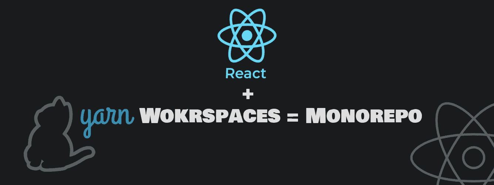
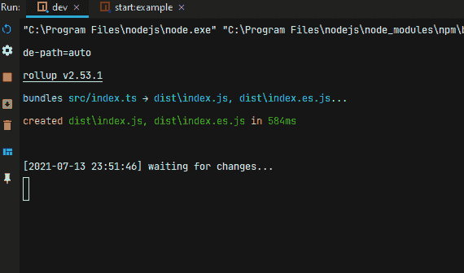
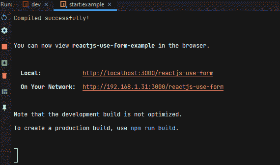
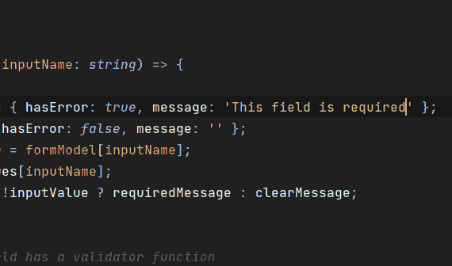
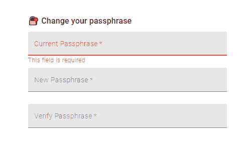

# 仅使用 Yarn 工作空间反应 Monorepo(无 Lerna)

> 原文：<https://javascript.plainenglish.io/react-monorepo-using-yarn-workspaces-only-no-lerna-766c7a395140?source=collection_archive---------0----------------------->

> 我希望将我的一个 GitHub 回购转换成 monorepo。我做了一点研究，发现有几个解决方案。我给了 Lerna 一个机会，因为它非常受欢迎，拥有大量用户。它做到了它所说的，“一个用多个包管理 JavaScript 项目的工具。”

后来才发现 Lerna 使用了 Yarn，但也有一些与我的用例不相关的高级特性。管理 monorepo 也可以仅通过 Yarn 工作空间来实现！

这个概念并不新鲜，近十年前，像谷歌这样的公司使用 monorepos 来管理大型代码库。单个存储库包含其他独立的存储库，它们可以作为依赖关系相互导入。

想象一个 web 应用程序，它的 iOS 应用程序，它的 Android 应用程序和其他共享的 UI 组件和模块。在我的用例中，我有一个表单管理模块库，以及一个使用表单管理作为依赖项的示例应用程序。我想同时开发主模块和示例应用程序。这可以通过将两个回购合并为一个并设置一个带有 Yarn 工作空间的 monorepo 配置来实现。

# 和 Lerna 比怎么样？

“Yarn 的工作空间是像 Lerna 这样的工具可以(和[做](https://github.com/lerna/lerna/pull/899))的低级原语！)使用。他们永远不会尝试支持 Lerna 提供的高级功能，但通过实现解决方案的核心逻辑和连接 Yarn 本身的步骤，我们希望能够实现新的用途并提高性能。”——来自纱线工作区[文档](https://classic.yarnpkg.com/en/docs/workspaces/)。

当我在搜索 monorepos 时，我发现 GitHub 上有许多样板文件演示如何用 Lerna 设置 monorepo，但事实上它们都没有利用 Lerna 的高级功能，如`lerna publish`或`lerna bootstrap`，那么为什么还要额外的 npm 包呢？我的原则是少即是多，记得吗？纱线也有类似的特征。

# 概观

在本教程中，我们将基于 React 应用程序创建一个 monorepo，其结构如下:

1.  一个主根回购与一个中央`package.json`文件管理使用纱。
2.  一个表单管理(主模块)，使用 Rollup 构建，准备发布到 npm。
3.  使用 craco 构建的 React 应用程序示例使用表单管理模块作为依赖项。

当然，monorepo 将使用 TypeScript 进行类型化，因此我们需要一个特定的`tsconfig.json`来扩展到嵌套的 repos 中，并在必要时更改编译器选项。

当谈到典型的 create-react-app 配置时，在 monorepo [中嵌套一个包会破坏 create-react-app 的功能，因为它不是非常可定制的，并且使它在 monorpo 中工作有一些严重的挑战。这就是为什么我们将使用](https://twitter.com/dan_abramov/status/1045809734069170176) [craco](https://medium.com/gsoft-tech/why-i-built-craco-33ff39f4fc94) 来代替。创作者是这样描述的:*“短而甜，是在* [*之上的 hacky 层创建 React App (CRA)*](https://github.com/facebook/create-react-app) *自定义其配置。”。*

monorepo 的目录结构如下:

# 📑该方法

回到我之前提到的用例，我们有:

1.  一个使用 Rollup.js 构建的表单管理库，只是因为它不包含任何 HTML 或 React，只是一个模块包。
2.  用`craco.config`替换`create-react-app`提供的常用`react-scripts`配置的应用包示例。

顶层 package.json 定义了项目的根。用 yarn 设置工作空间只需添加一个`workspaces`属性:

**File path:** ./package.json

Private 设置为`true`是因为我们不想将 monorepo 本身和其中的所有源代码发布给 npm，我们只对发布主模块包中的`dist/`目录感兴趣。将其设置为`true`可防止 monorepo 在运行`npm publish`或`yarn publish`命令时发布到 npm。

回购配置如下:

## 1.📦“主模块”包

**File path:** packages/main/package.json

版本设置正确，包不是私有的。这份报告准备向国家预防机制发表:[https://npmjs.com/package/reactjs-use-form](https://www.npmjs.com/package/reactjs-use-form)

## 2.🕹️“示例应用程序”包

**File path:** packages/examples/package.json

注意我们在这里也是如何将`private`属性设置为`true`的。此外，这里我们将主模块作为一个依赖项使用，并将在运行`yarn install`时正确链接。主模块包`reactjs-use-form`作为依赖项安装。

craco 配置如下:

这是一个使用 craco 创建的 webpack 配置，它获取`src/`目录的内容并使用 [babel](https://babeljs.io/) 构建它。

“Lerna 为每个包多次调用`yarn install`，这造成了开销，因为每个`package.json`被认为是独立的，它们不能相互共享依赖关系。这导致了每个`node_modules`文件夹的大量重复，这些文件夹经常使用相同的第三方包。”—来自纱线工作区[文档](https://classic.yarnpkg.com/en/docs/workspaces/)。

当我们配置工作空间时，当我们在项目中运行`yarn install`时，Yarn 会创建一个优化的依赖结构。由于示例应用程序包使用主模块包，Yarn 将这些包链接在一起，使我们能够开发和观察变化。

对于根`package.json`中的主脚本，我们有如下:

工作区由:`yarn workspace <workspacename> <scriptname>` 从我们运行的 CI 环境中访问，例如:`npm run test`。

我推荐阅读 Yarn [文档](https://classic.yarnpkg.com/en/docs/workspaces/)了解更多关于它的特性。

📄**源代码:**[https://github.com/amir0ff/reactjs-use-form](https://github.com/amir0ff/reactjs-use-form)

# 让我们看看✨

这是我们的示例 React 应用程序更新，当它的一个依赖项更新时，因为 Yarn 正在以所需的方式链接依赖项，因为我们希望更改主模块文件并观察消费者组件(示例应用程序)中的更改。

`$yarn workspace **reactjs-use-form** dev`

`$yarn workspace **reactjs-use-form-example** start`

changes in the IDE

in the browser

# 结论

我们设置了一个只有一个依赖项的 React monorepo。已经打印好了。Yarn 比 npm 快，所以我们也获得了速度提升！

我希望你喜欢阅读，
请[**关注**](https://medium.com/@amir0ff) 和**分享**更多科技内容🤖💖

## 进一步阅读

 [## 使用 Bit 进行无痛 monorepo 依赖管理

### 简化 monorepo 中的依赖关系管理，以避免虚拟依赖关系和版本问题。了解…

比特云](https://bit.cloud/blog/painless-monorepo-dependency-management-with-bit-l4f9fzyw) 

*更多内容请看*[***plain English . io***](https://plainenglish.io/)*。报名参加我们的* [***免费周报***](http://newsletter.plainenglish.io/) *。关注我们关于*[***Twitter***](https://twitter.com/inPlainEngHQ)[***LinkedIn***](https://www.linkedin.com/company/inplainenglish/)*[***YouTube***](https://www.youtube.com/channel/UCtipWUghju290NWcn8jhyAw)***，以及****[***不和***](https://discord.gg/GtDtUAvyhW) *对成长黑客感兴趣？检查* [***电路***](https://circuit.ooo/) ***。*****