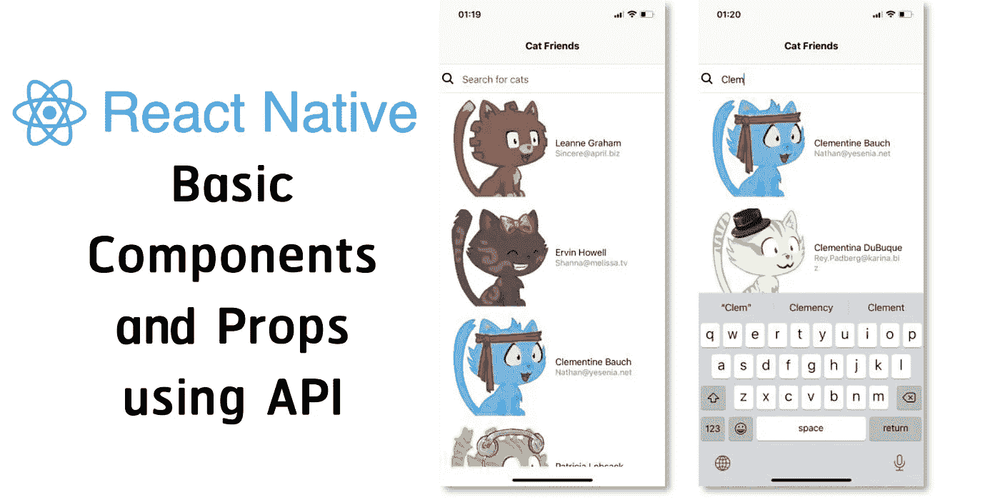
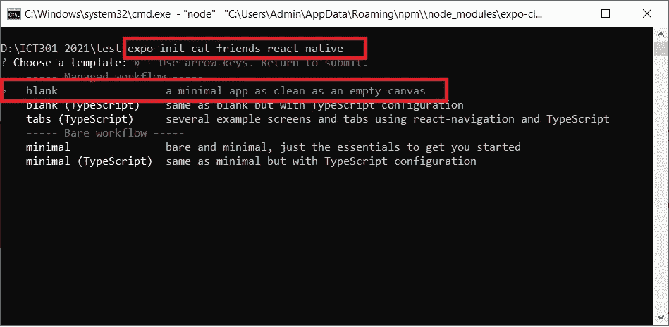
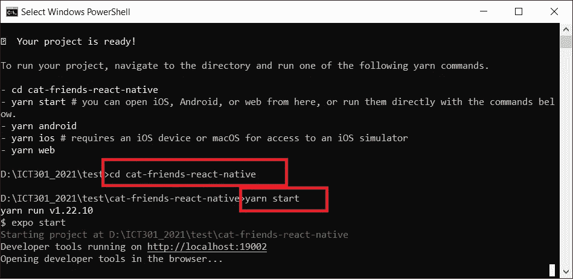
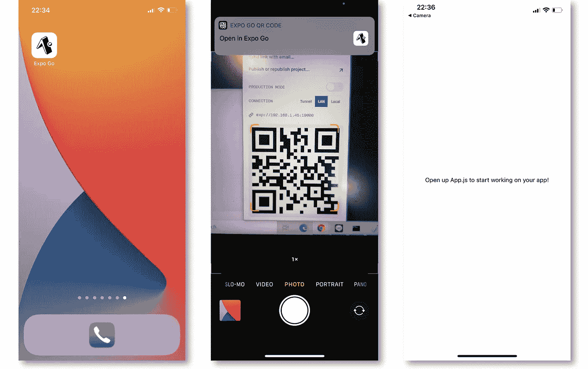
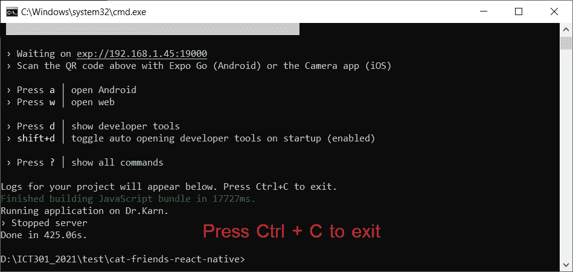
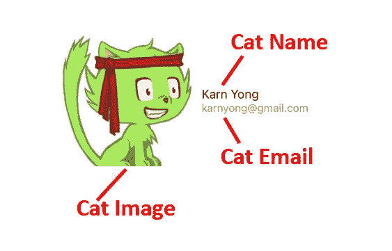
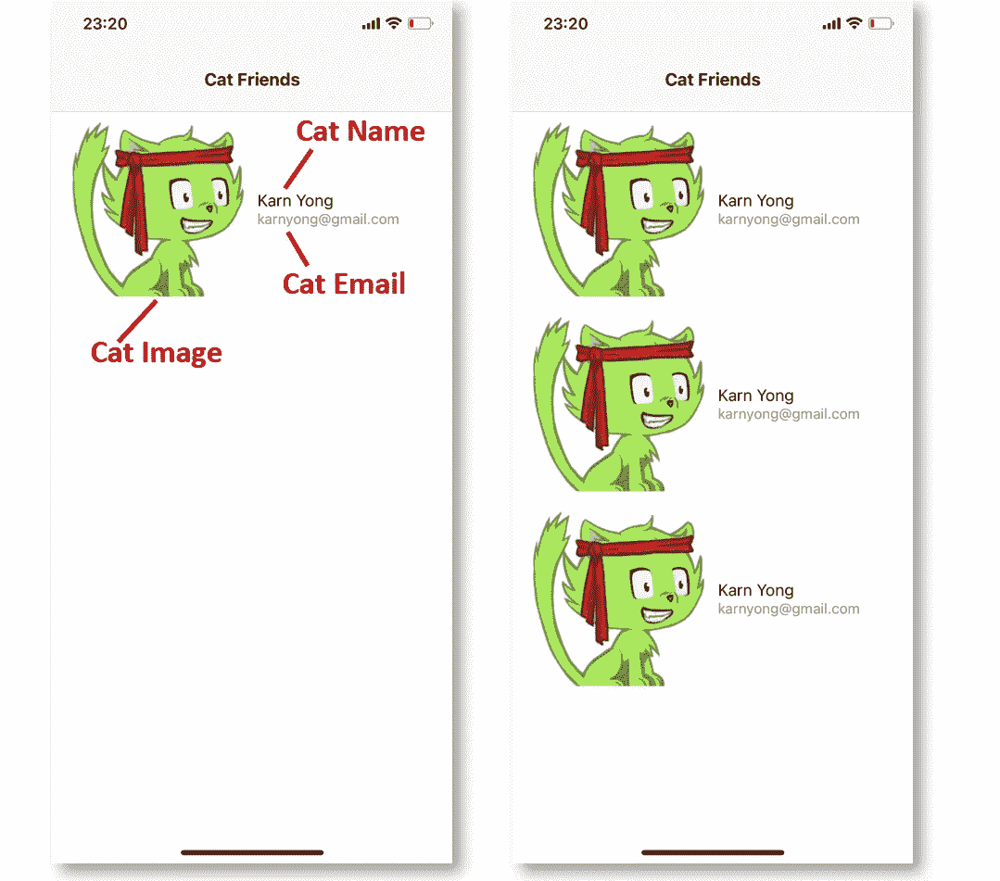
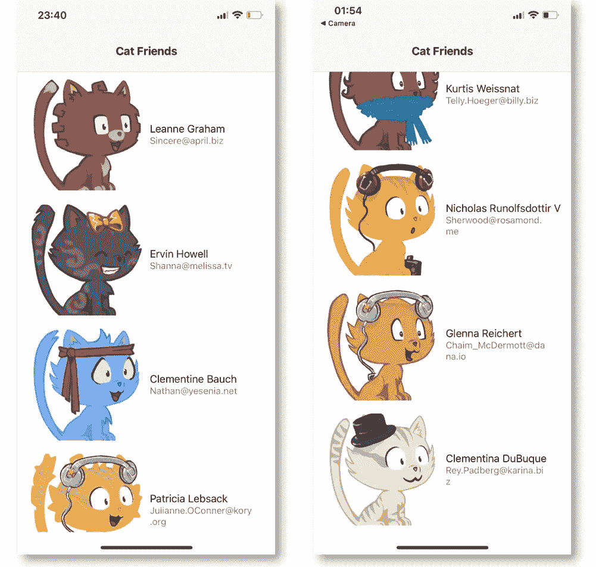
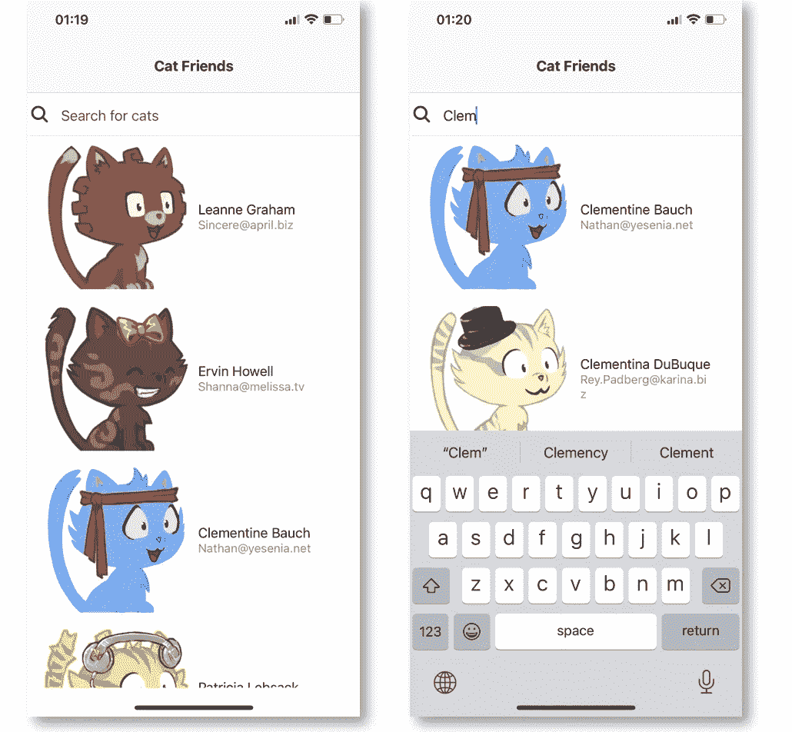

# 反应原生基础:组件和道具

> 原文：<https://javascript.plainenglish.io/react-native-basic-components-and-props-using-rest-api-8b034e3ea758?source=collection_archive---------8----------------------->

本教程将向您展示如何使用一些基本的**组件**和**道具**开发一个简单的 **React Native** 应用程序，并请求一个 **REST API** 在我们的应用程序中呈现一些 cat 数据。😻



# 软件安装

*   **node . js**https://nodejs.org
*   **Expo-cli** 可以使用以下命令行安装(我建议同时使用这两个命令):

```
npm install -g expo-cli
yarn global add expo-cli
```

*   **Expo Go** 应用程序安装在您的移动设备上(支持 iOS 和 Android)


# 创建新的 React 本机应用程序

启动命令提示符(Windows)或终端(Mac OS)。然后，使用**Expo init<<Your App Name>>**命令创建新的空白 **React Native** app。在这个例子中，我们将我们的应用程序命名为**猫朋友反应本地**。通过按**回车**为 app 选择**空白**模板。之后会创建与 app 同名的文件夹，里面会有一些初始的源代码。

```
expo init cat-friends-react-native
```



用 **cd** 进入你的项目文件夹**cat-friends-React-Native**，然后用 **yarn start** 启动你的 **React Native** app(这里会用到 **expo-cli** )。

```
cd cat-friends-react-native
yarn start
```



**Expo** 开发者工具将会显示在你的浏览器中。使用您的移动设备扫描二维码，然后您的应用程序将通过 **Expo Go** 打开，如下所示:



# 安装本机基础 CSS 框架

为了让我们的应用程序更漂亮一点，我们将在项目中添加原生的 CSS 框架。首先，在你的命令提示符/终端中，按下 **Ctrl + C** 退出 **Expo** 。



使用 **yarn add** 命令将 native-base 添加到您的应用程序中，并使用 **yarn start** 再次启动 Expo developer tools。使用 **Expo Go** 在您的移动设备上再次测试您的应用。

```
yarn add native-base --save
yarn start
```

# CatCard 组件

我们将创建一个**组件**用于显示猫的数据，包括猫的图像、名字和电子邮件，如下所示:



对于猫的图像，我们将使用[**【robohash.org】**](https://robohash.org/karnyong?set=set4)从一个使用 URL[https://robohash.org/<<any text>>的文本中生成一个猫的图像？set=set4](https://robohash.org/karnyong?set=set4) 。例如，[https://robohash.org/karnyong?set=set4](https://robohash.org/karnyong?set=set4)。

创建 **Card.js** 来包含猫的形象、名字和电子邮件。

编辑 **App.js** 在 App 的入口点包含 **CatCard 组件**(一个 **pp 组件**)。

*   从 **native-base** 导入**组件**，我们将在这个 **App 组件**(第 2 行)**中使用它。**
*   从 **CatCard.js** (第 3 行)导入 **CatCard 组件**。
*   **构造器**被定义为默认，还没有**状态**。
*   使用一些我们的 **CatCard 组件**来渲染带有**本地基础组件**的组件(第 20–22 行)。

结果根据 **App.js** 中 **CatCard 组件**的数量显示。



# 卡片列表组件

接下来，我们将创建一个 **CardList 组件向**显示一个 **CatCard 组件**的列表。首先，我们将使用这个**REST API**:[https://jsonplaceholder.typicode.com/users](https://jsonplaceholder.typicode.com/users)的实体模型。基本上，它响应为 10 个用户的 **JSON** 数据(本例中仅使用了 **id** 、**名称**和 **email** )。


添加 **CardList.js**

*   在构造函数中，我们将数组**猫**定义为一个状态。(第 5–10 行)
*   我们使用 **componentDidMount** 从[https://jsonplaceholder.typicode.com/users](https://jsonplaceholder.typicode.com/users)获取数据，并存储在 **cats** 状态中。(第 12–16 行)
*   使用定义的**道具** **键**、 **id** 、**名称**和**电子邮件**从**猫**状态渲染多个猫**组件**，以将该数据传递给**猫卡**组件(来自第 18 行)。

编辑 **CatCard.js** 以合并 **CardList 组件**发送的**道具{name，email，id}** 。

编辑 **App.js** 增加 **CardList 组件**代替 **CatCard** (第 3、20 行)。

结果:



为了更好地了解**反应组件**、**状态**和**道具**，这个图描述得相当好:


Source: [https://www.techdiagonal.com/reactjs_courses/beginner/reactjs-component-state/](https://www.techdiagonal.com/reactjs_courses/beginner/reactjs-component-state/)

# 添加搜索猫的输入

编辑 **App.js** 添加**输入 react-base 组件**:

*   从**原基**(线 2) **导入附加**组件** ( **项目**、**图标**和**输入**)。**
*   添加 **searchfield** 作为状态(第 9 行)。
*   将**搜索字段状态**合并到渲染中。
*   使用 **onChangeText** 添加**输入组件**，将**搜索字段状态**设置为该组件的值(第 24–27 行)。
*   将**搜索字段**数据传递给**卡片列表组件**。

编辑 **CardList.js** :

*   添加 **searchfield** 作为一个州(第 9 行)。
*   添加 **componentDidUpdate** 用 **searchfield** 属性更新 **searchfield** 状态。
*   添加变量 **filteredCats** 以根据**搜索字段**过滤猫列表(第 29–31 行)。
*   循环通过**过滤的猫**来渲染多个**猫组件**(来自第 34 行)

现在，您可以在应用程序中搜索猫，如下所示:



这就是用基本的**组件**和**道具**以及 **REST API** 构建一个简单的 **React Native** 应用的全部内容。您可以从这里下载完整的源代码:

[](https://github.com/KarnYong/cat-friends-react-native) [## karn Yong/猫友-反应-本地

### 在 GitHub 上创建一个帐户，为 karn Yong/cat-friends-react-native 开发做出贡献。

github.com](https://github.com/KarnYong/cat-friends-react-native) 

*文章作者 Karn Yongsiriwit 博士
兰西大学数字创新技术学院*