# 与 React 本地 BLE 的外设通信(蓝牙低能耗)

> 原文：<https://javascript.plainenglish.io/react-native-bluetooth-low-energy-peripheral-communication-e7cb93abf69?source=collection_archive---------0----------------------->


Image by [Don GIannatti](https://medium.com/u/32a8392c63cb?source=post_page-----e7cb93abf69--------------------------------)

在这个物联网时代，制作能够与硬件通信的软件不像以前那么难了。尤其是随着无线技术的许多发展更新。

日常生活中大量使用的最著名的无线技术之一是蓝牙。

通过使用蓝牙，我们将能够跨设备共享数据，连接到耳机，从我们的智能手表中读取数据，甚至远程控制空调、电视、智能灯等。

这是巫术！

大约在 2011 年，最新版本的蓝牙技术被推出，它被称为蓝牙 4.0 或**蓝牙低能耗**。

*BLE(Bluetooth Low Energy)是由蓝牙特别兴趣小组(Bluetooth SIG)设计和营销的无线个人区域网技术，旨在医疗保健、健身、信标、安全和家庭娱乐行业的新颖应用~* [*维基百科*](https://en.wikipedia.org/wiki/Bluetooth_Low_Energy)

我不打算在这里做一个关于 BLE 的大学演讲，但让我快速解释一下。基本上，BLE 是蓝牙技术的最新版本，提供了与其前身相同的功能，但大大降低了功耗和成本，并对许多操作系统提供了更好的本地支持。

在这篇文章中，我们将创建一个简单的 react-native 移动应用程序，它使用蓝牙外设并向其写入数据。

*   在 react-native 端，我们将利用[react-native-ble-manager](https://github.com/innoveit/react-native-ble-manager)库。
*   这里将使用模拟外设进行测试。感谢 [Bleno](https://github.com/noble/bleno/) 团队提供了一个强大的工具，让 BLE 外设实现变得如此容易。

# BLE 角色与关贸总协定交易

在我们开始做任何工程的东西之前，让我们先谈谈 BLE 的角色。我保证会速战速决。

BLE 通信有两个关键角色:

*   第一个角色是**外围**。血压计、智能手表、耳机都是外设的例子。外围设备通告自己，并等待中央设备与其连接。
*   第二个作用是**中枢。**智能手机就是一个例子。中央设备将连接到外围设备，然后与之通信。

现在谈谈关贸总协定。在 BLE 世界…

*GATT 是通用属性配置文件的缩写，它定义了两个蓝牙低能耗设备使用称为* ***服务*** *和* ***特征*** *的概念来回传输数据的方式。*

[*https://learn . adafruit . com/introduction-to-bluetooth-low-energy/GATT*](https://learn.adafruit.com/introduction-to-bluetooth-low-energy/gatt)

BLE 的 GATT 事务是基于高级嵌套对象的，这些对象称为**配置文件**、**服务**和**特征**，如下图所示:

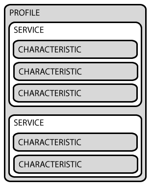

Image from [https://learn.adafruit.com/introduction-to-bluetooth-low-energy/gatt](https://learn.adafruit.com/introduction-to-bluetooth-low-energy/gatt)

*   **配置文件**实际上并不存在于 BLE 外设本身，它只是一个由蓝牙 SIG 或外设设计者编译的预定义服务集合。
*   **服务**用于将数据分解成逻辑实体，并包含称为特征的特定数据块。一个服务可以有一个或多个特征，每个服务通过一个称为 UUID 的唯一数字 ID 来区别于其他服务，该 ID 可以是 16 位(用于官方采用的 BLE 服务)或 128 位(用于定制服务)。
*   GATT 交易中最底层的概念是**特征**，它封装了单个数据点(尽管它可能包含一组相关数据，如来自三轴加速度计的 X/Y/Z 值等)。).

# 学习期望

在高层次上，我们要做的是创建一个名为 **Foodbank** 的模拟虚拟外设，然后将其托管在我们的计算机上。这个外围设备存储中央设备发送的食物信息。我们还可以阅读那里储存的食物。食物银行通常就是这么做的，储存食物，获取食物。

移动应用程序将显示可用的 ble 外围设备列表。稍后，我们将从列表中连接到我们的 Foodbank 外围设备，存储一个披萨并获得一个[😁](https://emojipedia.org/beaming-face-with-smiling-eyes/)

*蓝牙功能只能在实际设备上测试。它在模拟器或仿真器上不起作用。*

好，我们开始吧！

# Node.js 中模拟的虚拟食物银行外围设备

初始化新的 Node.js 项目。在上面安装名为 Bleno 的第三方库。

仅供参考，由于一些问题，我们将不会使用官方的 Bleno 包。相反，我们将使用由@abandonware 维护的[分叉 Bleno。](https://github.com/abandonware/bleno)

```
mkdir food-bank-peripheral
cd food-bank-peripheral
npm init
npm install @abandonware/bleno --save
touch food-bank-characteristic.js # for storing characteristic code
touch food-bank-service.js # for storing service code
touch food-bank.js # for storing the main code
```

剧透警告，尽管项目设置已经完成，但让它运行起来并不容易。

我们需要根据我们的操作系统设置几个本机依赖项。更多详情请看[https://github.com/abandonware/bleno](https://github.com/abandonware/bleno)。

## 食物银行特征定义

接下来，让我们导航到`food-bank-characteristic.js`文件。准备`FoodBankCharacteristic`功能。

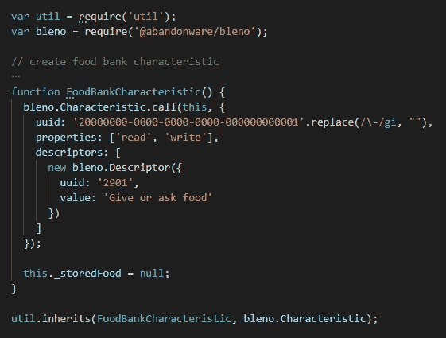

FoodBankCharacteristic definition

> 我们选择前缀为数字 **2000…** 的有效 UUID 字符串作为特征 UUID

从`properties: ['read', 'write']`语句中，我们可以假设将创建两个事件处理程序，read 和 write。

现在让我们创建它。在新创建的特性上设置`onWriteRequest`事件监听器。这个特定的监听器用于处理来自中央设备的写请求。

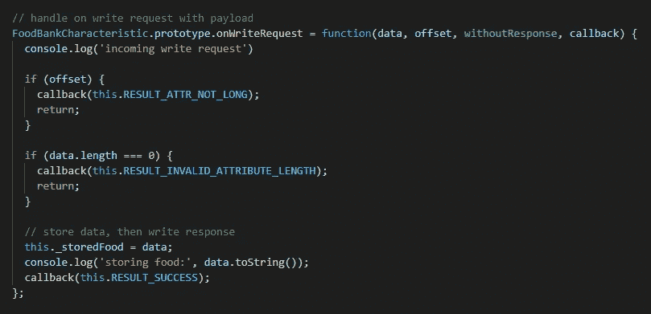

Characteristic onWriteRequest definition

中心将向外围设备发送一个写请求，有效载荷是食物名称。然后我们将有效载荷存储到`this._storedFood`。

好了，现在让我们继续第二个监听器，即`onReadRequest`处理程序。这个处理程序将做与`onWriteRequest`监听器相反的动作。存储的食物将被用作对来自中央设备的呼叫的响应。

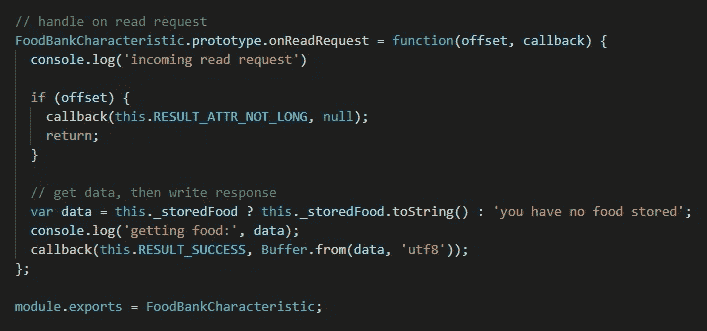

Characteristic onReadRequest definition

## 食物银行服务定义

没有服务就无法访问外设，所以现在让我们创建`FoodBankService`。

这个服务所做的就是公开这个特征，使它可以从中央设备上使用。

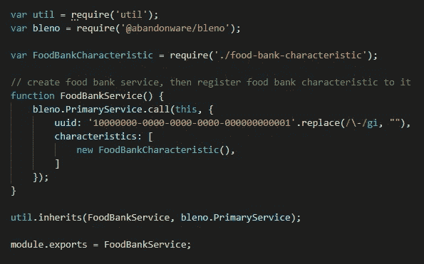

FoodBankService definition

> 我们选择前缀为数字 **1000…** 的有效 UUID 字符串作为服务 UUID

## 粮食银行主要代码

在这个主代码中，我们要做的是检查 BLE 电台的可用性。如果它在那里，那么让我们宣传我们的**食物银行**外围设备，让它对每一个最近的中央设备可用。

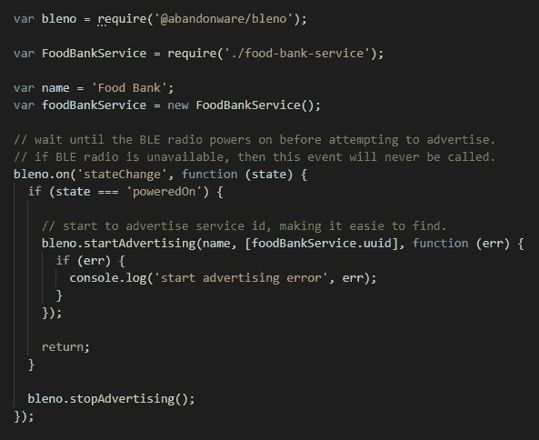

Check BLE radio then advertise peripheral if it’s available

如果广告有效，那么让我们建立我们的`FoodBankServices`(以及它的`FoodBankCharacteristic`)。将代码放在`advertisingStart`事件监听器上。

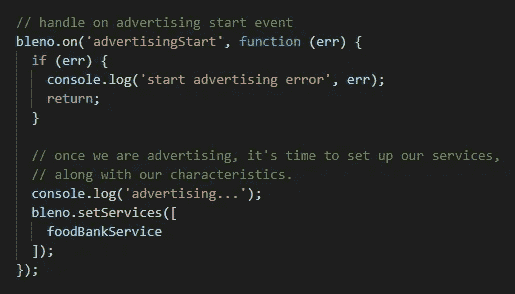

Handle Bleno advertisingStart event

好了，外围设备到此为止。

# 使用 React Native 的移动 BLE 中心应用程序

现在让我们编写 react-native 移动应用程序。

> 在这一部分，我不打算分享整个编码细节，因为它太多了。我只写下重要的步骤。
> 
> 然而，你总是可以在本文结尾分享的 Gitbub 链接上看到完整的工作示例源代码。

## 准备基本代码

首先，创建一个新的 BLE 中央移动应用程序。你可以使用`react-native-cli`或`expo`，没关系。仅供参考，对于 expo，您必须退出裸工作流，它需要使用外部本机模块。

```
# expo
npm install -g expo-cli
expo init BLECentralApp
cd BLECentralApp
expo eject# react native cli
npx react-native init BLECentralApp
cd BLECentralApp
```

然后添加`react-native-ble-manager`、`convert-string`和`buffer`依赖项。

```
npm install --save react-native-ble-manager
npm install --save convert-string
npm install --save buffer
```

对于`react-native-ble-manager`依赖项，需要一些额外的步骤。详情请见 https://github.com/innoveit/react-native-ble-manager。

之后，在场景文件中导入已安装的库。

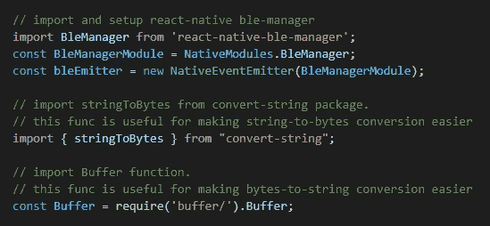

开始用一些钩子定义和一个名为`startScan()`的函数来填充主场景函数，这个函数将触发设备扫描过程。

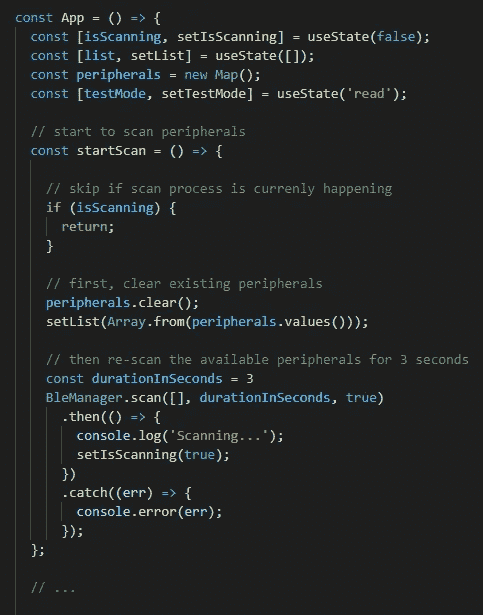

`BleManager.scan()`将在我们的中央设备旁边列出任何可用的 ble 外设。设备列表将通过 BLE 发射器监听器`BleManagerDiscoverPeripheral`依次返回。

下面，我们将为`bleEmitter`对象准备几个监听器处理程序，包括用于`BleManagerDiscoverPeripheral`监听器的处理程序。

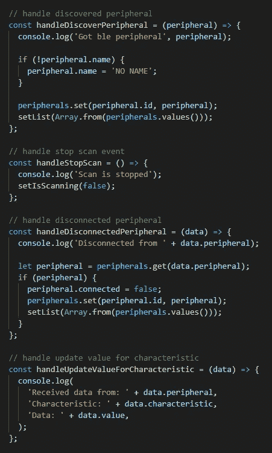

接下来，在`mount`生命周期中，初始化 BLE 模块，应用 BLE 监听器，并验证某些电话权限(对于 android)。

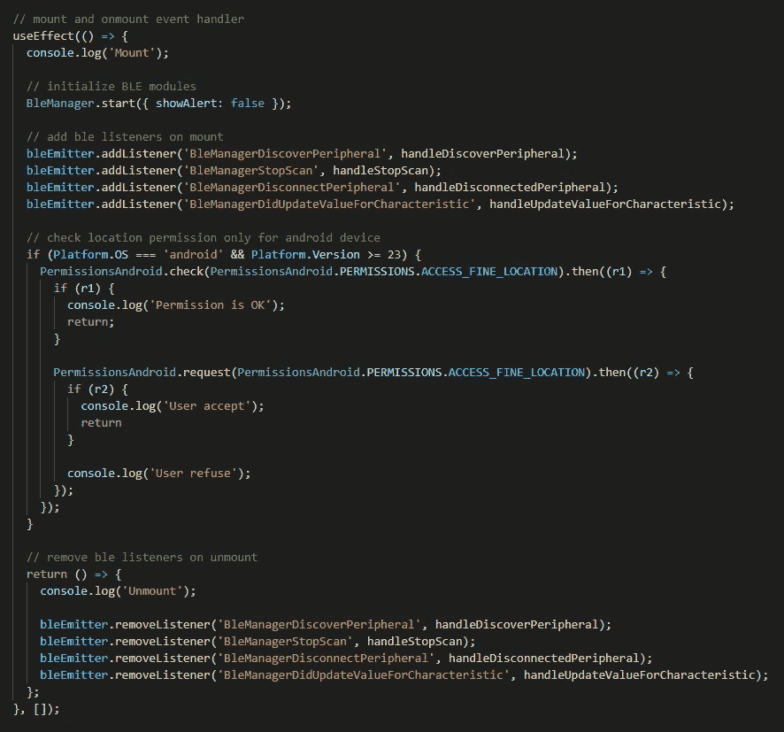

在卸载时，不要忘记删除 BLE 发射器监听器。

## 准备用户界面

现在，让我们为我们的 BLE 扫描仪应用程序创建一个简单的 UI，它包含以下几个部分:

*   内部带有单个按钮的标题，用于触发 BLE 设备扫描。
*   没有可用设备时的消息。
*   显示可用设备列表的`FlatList`。
*   页脚包含两个用于切换测试模式的按钮，`read`或`write`。

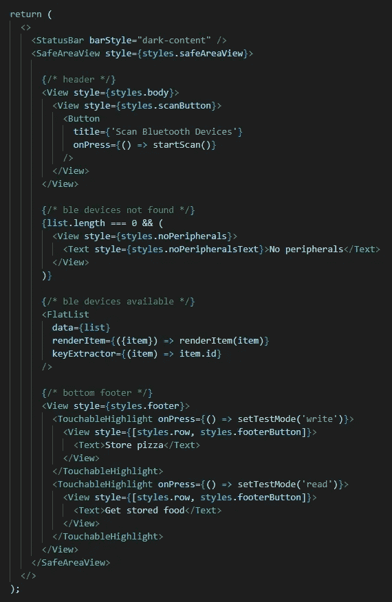

在`FlatList.renderItem`处理器上，在列表外设部分添加`TouchableHighlight`。当点击该部分时，会触发`connectAndTestPeripheral()`功能。

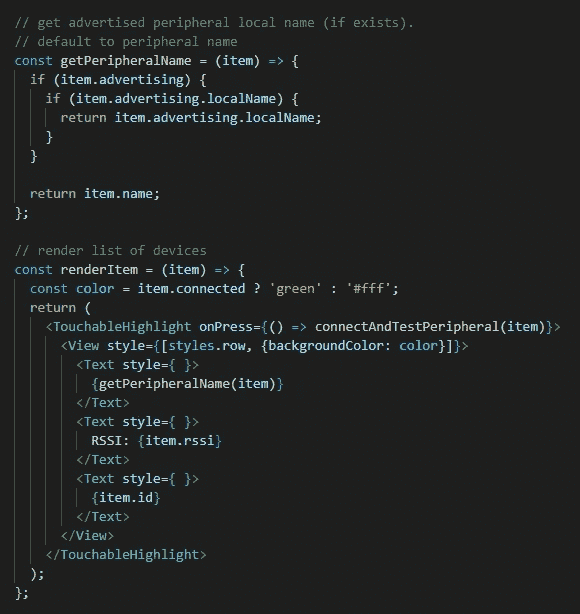

现在最有趣的部分，让我们准备`connectAndTestPeripheral()`函数。

在这个函数中，我们将尝试连接到外围设备，然后检索服务和 RSSI 信息。如果需要，您可以检查返回的数据。

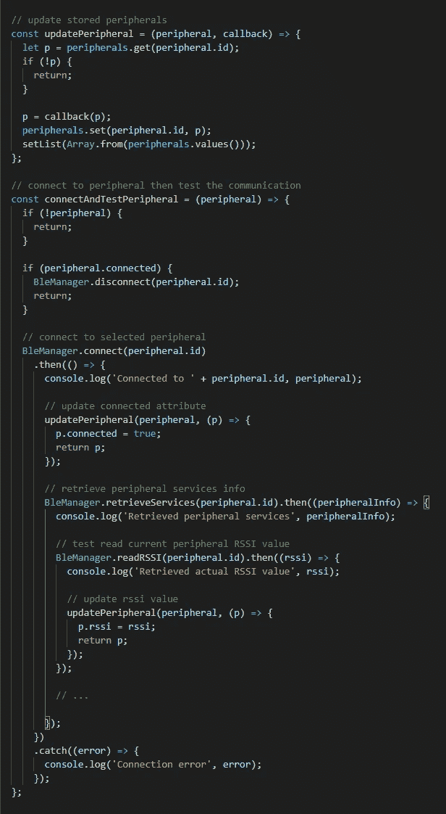

接下来，让我们准备`read`和`write`语句。下面的代码块不一定需要放在`BleManager.retrieveServices()`回调中。只要确保它被放在`BleManager.connect()`回调中。

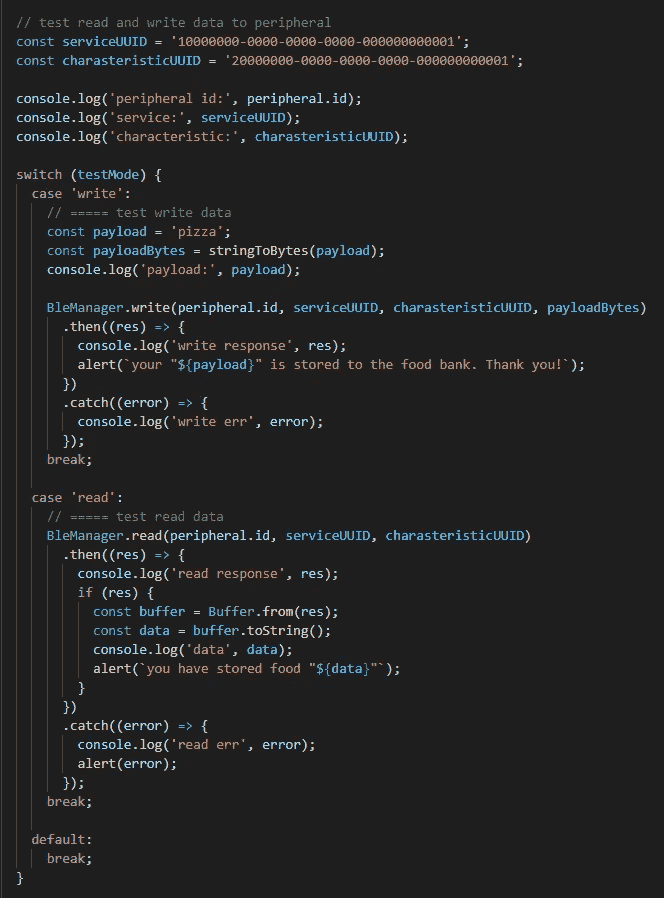

*   `BleManager.write()`用于向外围设备写入数据。它接受几个强制参数:外设 id、服务 UUID、特征 UUID 和字节格式的有效负载。
*   `BleManager.read()`用于从外围设备读取数据。接受的参数与 write 函数相同，只是有效载荷被排除在外。

当`BleManager.write()`操作成功时，特定的请求将到达外围设备，准确地说是我们之前创建的`FoodBankCharacteristic.onWriteRequest()`处理程序。这也适用于读操作，它将到达外设上的`onReadRequest()`处理程序。

好了，编程的东西到此为止。现在我们来测试一下。

# 测试 BLE 通信

使用`node peripheral`启动外围设备。

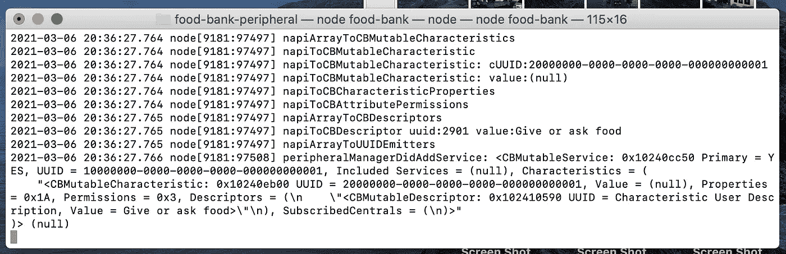

Run the Virtual Peripheral Device

然后在您的设备上运行移动应用程序。正如我前面所说，这个应用程序需要在实际的移动设备上进行测试，蓝牙功能将无法在模拟器或仿真器上工作。

应用程序运行后，点击扫描蓝牙设备，然后最近的外围设备列表将弹出，包括我们的食物银行外围设备。

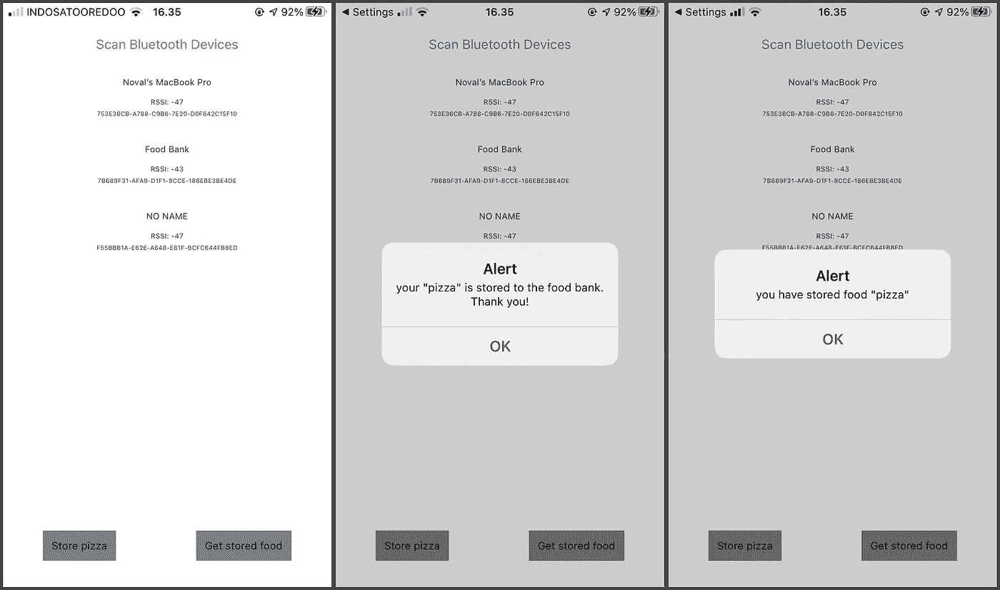

点击**商店披萨**将测试模式设置为`write`，然后点击食物银行外围设备，我们将进入第二个屏幕。我们的披萨储存在食物银行外围。太好了！

然后试着去拿储存的披萨。做同样的步骤，但现在点击**获取储存的食物**。外设会用存储的食物信息响应我们的 read 调用，就是**披萨。**因此，该消息来自外设，证明我们的 react 原生移动应用与外设之间的通信工作正常。

Github 示例源代码链接[https://github . com/novalagung/react-native-ble-read-peripheral](https://github.com/novalagung/react-native-ble-read-peripheral)