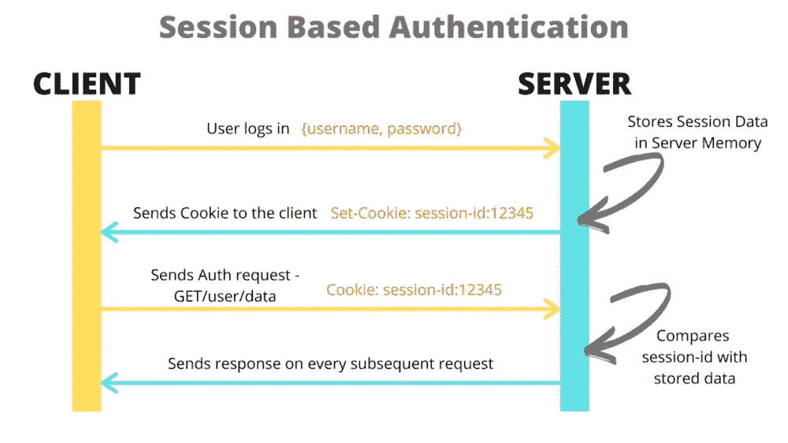
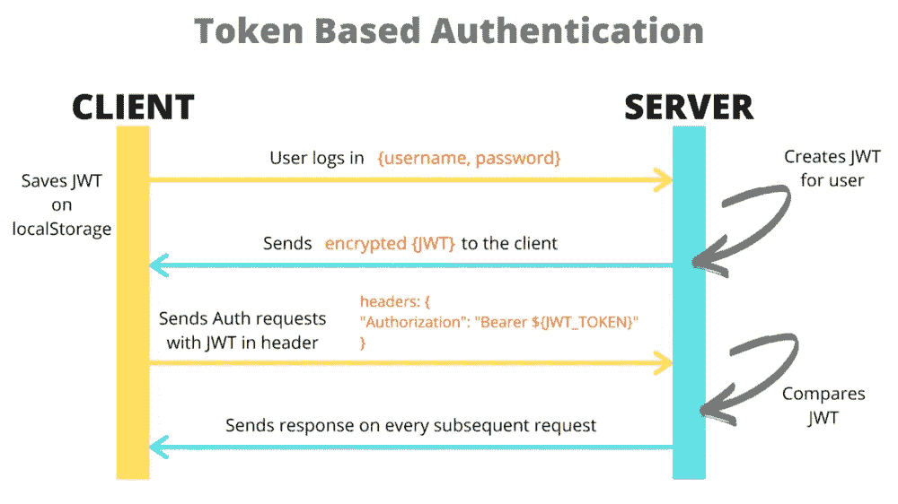
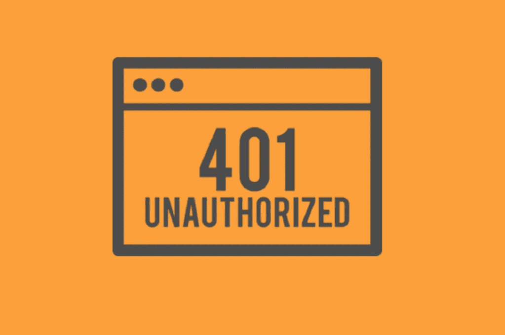

# 对本机 Cookie 身份验证做出反应

> 原文：<https://javascript.plainenglish.io/react-native-cookie-authentication-83ef6e84ba70?source=collection_archive---------1----------------------->

## 如何解决 React Native 应用程序中基于 cookies 的身份验证问题。

在我们开始之前，需要大喊@[loca tical](https://locastic.medium.com/?source=post_page-----80ee18f4c71b--------------------------------)。本文主要基于 [***【反应原生基于 cookie 的认证】***](https://medium.com/locastic/react-native-cookie-based-authentication-80ee18f4c71b) ，但包含更详细的代码示例。

# 介绍

在构建现代网络或移动应用程序时，对用户进行身份验证是最需要的功能。它允许验证用户、用户会话，最重要的是，它为实现用户授权(角色和权限)提供了基础。

那么，这是用来做什么的呢？作为前端开发人员，我们通常只需开发一个登录表单并向服务器发送一个请求。如果服务器的响应是肯定的，用户就登录了。听起来很容易，对吧？到目前为止，一切都很好。

但是服务器返回了另外一件事:您需要传递的某种用户标识，以及访问某些端点的以下请求。此外，当用户关闭应用程序而不注销时，由于这一点，我们可以让他保持登录，并在用户每次打开应用程序时跳过登录步骤。

它是基于令牌的身份验证或基于会话的身份验证。

Cookie Based Authentication

在基于 cookie 的身份验证中，成功登录后，服务器会创建会话，并将会话 id 值作为 Cookie 返回。随后的请求包含会话 id 为的 cookie，该 cookie 将根据服务器上的会话 id 进行验证，以确定该会话是否有效。

JWT Based Authentication

另一方面，我们有基于令牌的认证。成功登录后，服务器返回签名的令牌。然后，该令牌通常存储在本地存储器中。以下请求与保存的令牌一起发送到授权头。服务器解码令牌，如果令牌有效，则处理请求。

# 哪一个更好用？

如果你有能力选择，使用 JWT。在大多数现代 web 应用程序中，JWTs 被广泛使用，因为它比基于会话 cookie 的扩展得更好，因为令牌存储在客户端，而会话使用服务器内存来存储用户数据，当大量用户同时访问应用程序时，这可能是一个问题。然而，一些公司仍然宁愿使用 cookie 流，因为他们依赖遗留代码。所以，如果你像我一样，在某个时候，你不能选择并且必须使用组织中现有的安全认证系统，这篇文章是给你的。

在本文中，我将介绍 React Native 中基于 cookie 的身份验证，这里有一个问题——它并不像您想象的那么简单。

The Cookie Monster

# 问题

React Native 依赖于用 Java 和 Objective-C 编写的原生(Android 和 iOS)API。您可能认为 cookie 的使用和在浏览器中使用一样简单，但不幸的是，事实并非如此。

默认情况下，本地网络 API**正在保存**g**cookie**，开始时可能看起来完全没问题，但一段时间后&很少发出请求，请求可能变得不一致，导致服务器拒绝访问。因为我们发送的 cookies 是无效的，即使它们在调试时没有任何问题——当它们最初被传递给请求时。相信我，当我说，你可以花几个小时发现认证系统是你得到那些讨厌的 401 的原因。

控制 Android 上的 cookies 非常复杂，React 本地团队在官方[文档](https://reactnative.dev/docs/0.61/network#known-issues-with-fetch-and-cookie-based-authentication)上发布了一个关于它的章节！这是一个已知的问题，无论你决定在前端使用哪个提取库，本地端都会为你处理 cookies。

 [## 基于 Cookie 的身份验证问题聚合问题#23185 facebook/react-native

### kelset 更改了标题基于 Cookie 的身份验证问题聚合+问题未解决就关闭了。饼干…

github.com](https://github.com/facebook/react-native/issues/23185) 

这与 Java 使用基于键的值的方式有关，因此当您收到一个 cookie 键时，它会覆盖前一个。

# 走向解决方案

当你试图勇敢面对它时，你总是以下面的方式绕过它。你对自己说，“嗯，我有一个本地存储，我可以在那里设置 cookie，对于每个 API 调用，只需将它取出并追加它。”

因此，在成功登录后，服务器用状态和 cookies 进行响应。现在，您尝试将 cookies 保存在设备上(异步存储、本地存储或者甚至使用像 Redux 这样的状态管理)。然后，每个后续的请求报头都被来自设备存储器的 cookie 填充。

但是我们来分析一下到底是怎么回事，好吗？

React Native 有自己的 cookie 管理，这意味着当服务器返回 header Set-cookie 时，下一个 API 调用在默认情况下已经在它的头上设置了 Cookie，因此在这里提供 Cookie 必须生效。

我们实现了自己的处理程序，但它们实际上没有本机意义，因为我们使用一个 fetch 库(如 Axios)来构建处理请求和响应的 API 回调，而本机设备才是实际发送请求的设备。用我们自己的覆盖 cookie 会导致同样的问题出现，在我的例子中，它只发生在 Android 上——想想看。🤷‍♂️

经过一些研究，我遇到了 [react-native-cookies](https://github.com/react-native-cookies/cookies) 。这是 React Native 的一个 cookie 管理库，可以让你本地管理 cookie**。现在实际上有了一种操纵本机 cookie 管理的方法，可以进一步改进在设备上存储 cookie 的方法。**

**因此，让我们完全删除本机 cookiess，只使用存储在设备上的 cookie。最简单的方法是清理本地存储的 cookies。**

# **解决方案**

**幸运的是，我在我的项目中有一个分离的关注点。网络管理器(在我的例子中是 *Axios* ，但也可以是任何其他的……)只创建一次。每次我想进行 API 调用时，我都会导入‘fetcher’并发出网络请求。**

**下面是我如何在代码中使用它**

**网络管理器的基本实现如下所示:**

**Simple network manager**

**因此，使用 cookie-manager，我们可以更新网络管理器文件，删除所有 cookie，然后在 get 请求上重新分配(作为一个例子)。**

**Updated network manager with Cookie Manager integrated**

**这样，任何使用网络管理器(` *fetcher()的人。get()* `)将获得现成的 cookie 管理，甚至他们都不知道这个令人头痛的 cookie😎**

**注意，我们不需要使用`fetcher`实例来改变组件的任何用法。**

**由于在每次请求之前会清理本机存储的 cookie，因此可以肯定的是，只有那些手动存储在设备上的 cookie 才会随请求一起传递。**

# **结论**

**使用更新的网络管理器确保我们没有更多的 cookies 相互干扰，同时在使用应用程序时保持一致的会话！**

**我希望我说得更清楚一点——你是如何解决 React Native 上的 cookie 管理问题的？如果您有任何问题，请随时在 Twitter [@matan.kastel](https://twitter.com/MatanKastel) 上联系我。**

****

**如果你喜欢这篇文章，你可以看看我的其他文章，如 [***我的 React 原生风格构建模块***](https://zmtmaster.medium.com/my-react-native-style-building-blocks-f144a22cbcad) ，或 [***自定义标签导航器使用 React 导航&***](https://medium.com/swlh/custom-tab-navigator-using-react-navigation-svg-b659b395a7c4)***。*****

**下次再见，保重！😷**

***更多内容请看*[*plain English . io*](http://plainenglish.io/)**