# 反应本机:创建列表项组件

> 原文：<https://javascript.plainenglish.io/react-native-create-list-items-component-57e6b48eb729?source=collection_archive---------4----------------------->

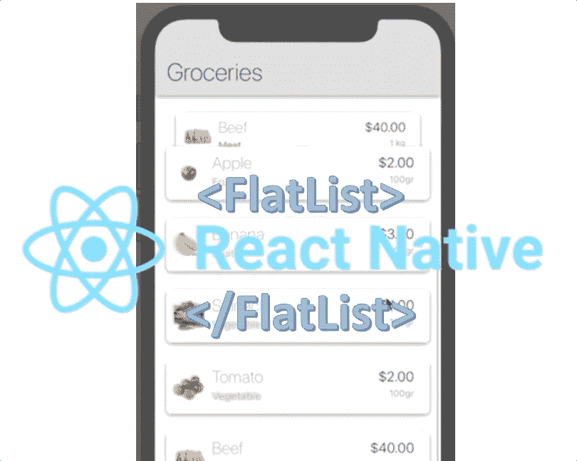

在这篇文章中，我将解释您将反复使用的最重要的组件之一。这是一个组件，您将使用它来列出设备上的项目。我们将基于我们在步骤/文章 7[https://lnkd.in/gVJspwG](https://lnkd.in/gVJspwG)中创建的应用程序，列出我们从 REST 端点收到的项目

本文是系列文章的一部分(它建立在前面的步骤之上)

1.  [https://lnkd.in/guBuBVP](https://www.linkedin.com/pulse/create-redux-hello-world-rany-elhousieny-phd%E1%B4%AC%E1%B4%AE%E1%B4%B0/):[𝑪𝒓𝒆𝒂𝒕𝒆𝒂𝑹𝒆𝒅𝒖𝒙](https://lnkd.in/guBuBVP)

2.[创建 React 原生 App](https://www.linkedin.com/pulse/create-react-native-base-project-run-rany-elhousieny-phd%25E1%25B4%25AC%25E1%25B4%25AE%25E1%25B4%25B0/?trackingId=fVq%2FbGEzug0okFdN6aGbPQ%3D%3D) [此处](https://www.linkedin.com/pulse/create-react-native-base-project-run-rany-elhousieny-phd%25E1%25B4%25AC%25E1%25B4%25AE%25E1%25B4%25B0/?trackingId=fVq%2FbGEzug0okFdN6aGbPQ%3D%3D)[https://lnkd.in/gDWG7AC](https://lnkd.in/gDWG7AC)

3.redux with React Native:1-阅读状态:[https://lnkd.in/gUbBRs8](https://lnkd.in/gUbBRs8)

4.[Redux with React Native:2-更新状态 https://lnkd.in/gPcUcMx](https://www.linkedin.com/pulse/redux-react-native-2-updating-state-rany-elhousieny-phd%E1%B4%AC%E1%B4%AE%E1%B4%B0/?published=t)

5.[了解 Redux 中的中间件:](https://lnkd.in/g5tVFn8)[https://lnkd.in/g5tVFn8](https://lnkd.in/g5tVFn8)

6.[使用 Json-Server 创建一个模拟 REST 端点，用于测试 https://www . LinkedIn . com/pulse/Creating-Mock-REST-Server-testing-using-Json-Server-rany/](http://creating%20a%20mock%20rest%20endpoint%20using%20json-server%2C%20for%20testing/)

7.[在 React Native App 中用 Redux-Thunk 取数据](https://www.linkedin.com/pulse/fetch-data-redux-thunk-react-native-app-rany-elhousieny-phd%25E1%25B4%25AC%25E1%25B4%25AE%25E1%25B4%25B0/?trackingId=IByiw0No1y9DS%2BlGk9KdTw%3D%3D):[https://lnkd.in/gVJspwG](https://lnkd.in/gVJspwG)

8。[本文]: React Native:创建列表项组件

该应用的最终代码可以在[Github https://Github . com/ranyelhousieny/ReactNativeFoodApplication](https://github.com/ranyelhousieny/ReactNativeFoodApplication)中找到

您可以克隆并使用

```
git clone [https://github.com/ranyelhousieny/ReactNativeFoodApplication.git](https://github.com/ranyelhousieny/ReactNativeFoodApplication.git)
```

================================================================

在您按照在 https://lnkd.in/gVJspwG[的说明从 REST 端点获取数据之后，我们将在设备上列出。在上一篇文章中，我们只是使用 console.log 将它们打印到控制台来解释这个概念](https://lnkd.in/gVJspwG)

# 1.首先创建一个功能组件

与 MainComponent 类似，让我们在文件夹 Components 下创建一个文件，并将其命名为 ListItems.js

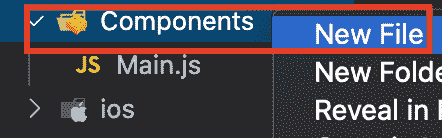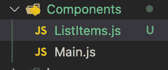

在这个文件中，让我们添加所有组件的基础知识

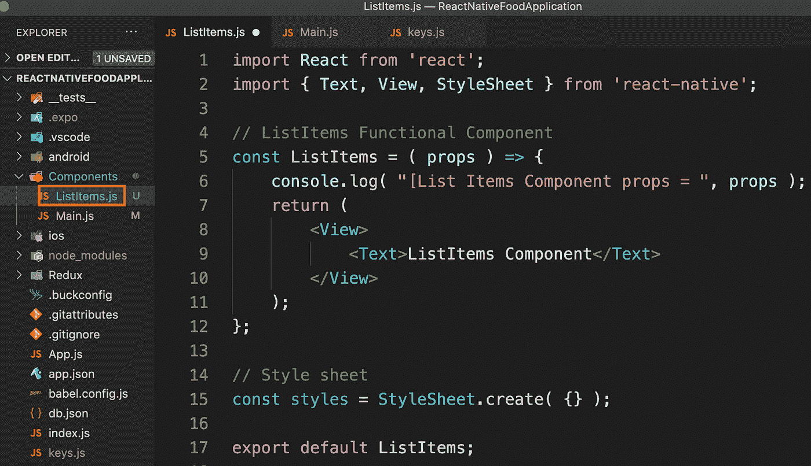

— — — — — — — — — — — — — — — — — — — — — — — — — — — — — — — — — — — — — — — — — — — -

旁注[可选]:如果你使用的是 VS 代码，我建议安装 React 原生工具

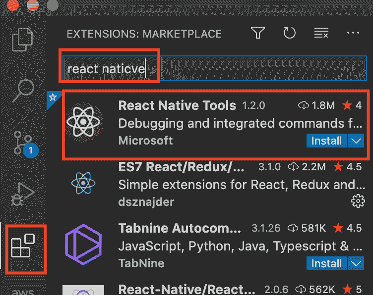

和代码片段，用几个字母创建功能组件

【https://marketplace.visualstudio.com/items? itemName = dsznajder . es7-react-js-snippets

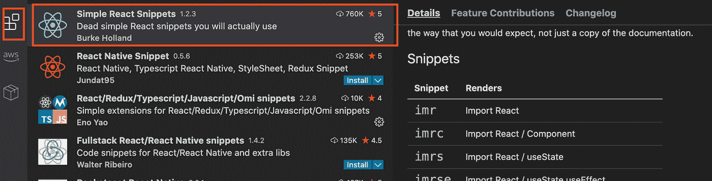

— — — — — — — — — — — — — — — — — — — — — — — — — — — — — — — — — — — -

# 2.在 MainComponent 中导入列表项

让我们导入 Main.js 中的 ListItems 并将其添加到主体中

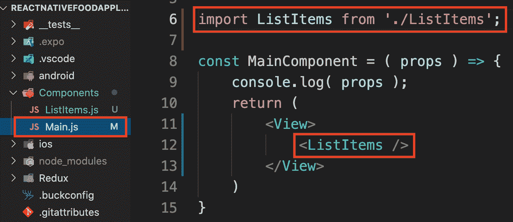

如果应用程序尚未运行，请再次运行它(npm 运行 web)

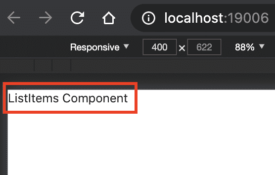

# 将 mapDispatch 和 mapState 移动到列表项

因为我们将检索这些项并在 ListItems 组件中显示它们，所以让我们按原样从主组件中移走这段代码，同时也移动 connect

下面是最后的 Main.js

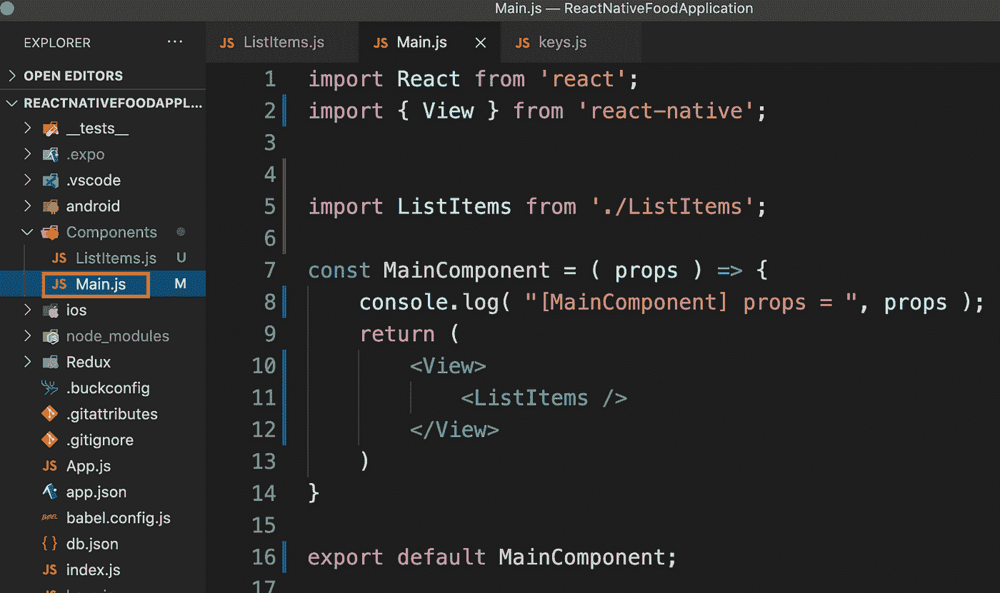

这是 ListItems.js

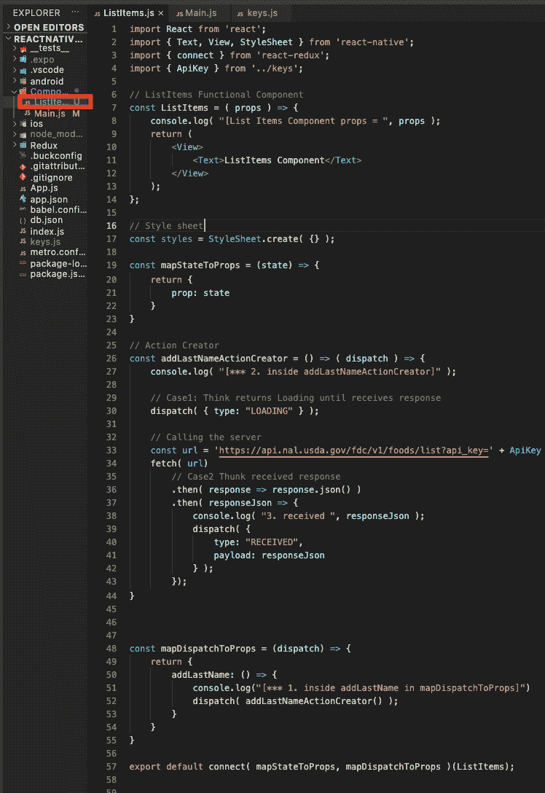

# 组织行动

在 Redux 下创建一个名为 actions.js 的文件

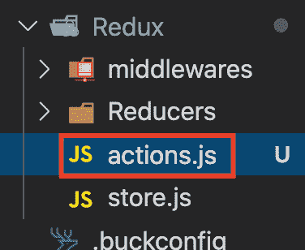

将动作创建者从 ListItems.js 移动到 actions.js，导出函数，并将其名称改为 getItemsListActionCreator，如下所示:

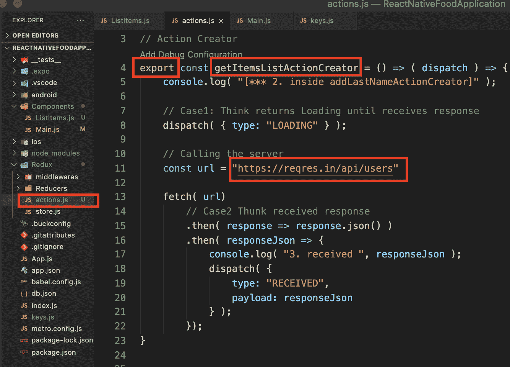

然后对 ListItems.js 进行如下修改(所有修改都用矩形包围

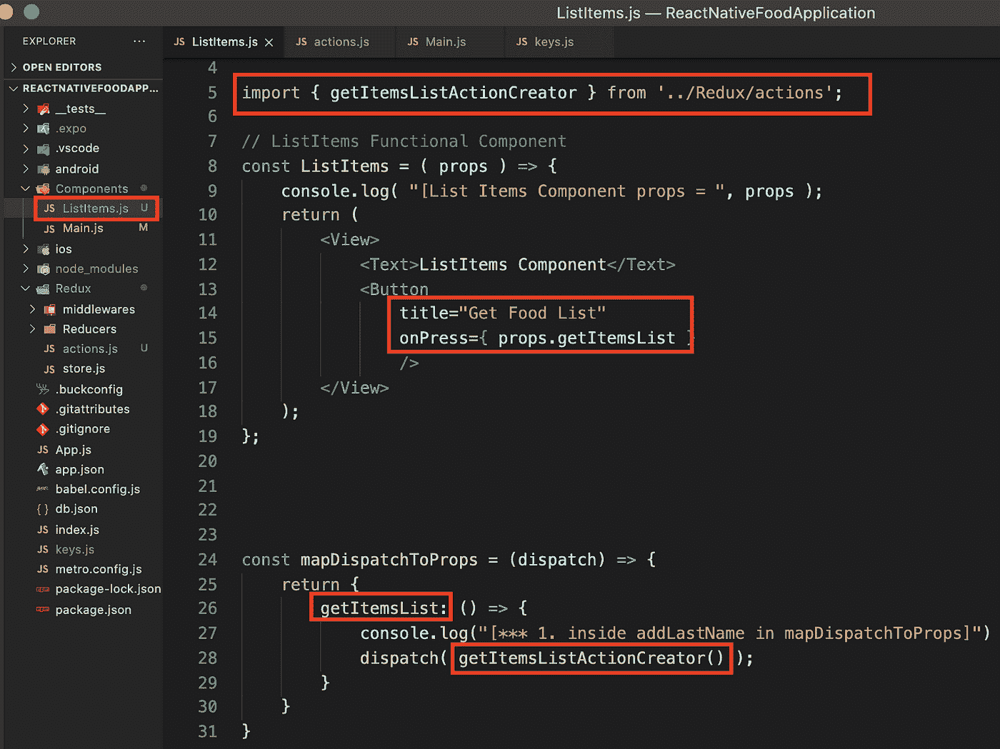

我已经在中更改为 [https://reqres .以避免 API 键](https://reqres.in)

输出如下所示:

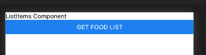

# 使用 FlatList 元素

从 react-native 导入平面列表

```
import { Text, View, StyleSheet, Button, FlatList } from 'react-native';
```

在我们显示从服务器接收的区域之前，让我用一个本地数组解释一下 FlatList。让我们创建一个名为 people 的对象数组，并将其放在 ListItem 组件中:

```
const people = [
     { name: 'Person 1' },
     { name: 'Person 2' },
     { name: 'Person 3' },
     { name: 'Person 4' },
  ];
```

然后在按钮前添加 FlatList 组件，如下所示

```
<FlatList
                data={ people }
                renderItem={ ( element ) => {}}
 />
```

FlatList 组件有两个主要特性:

1.  *数据*:这是为了传递数组
2.  *renderItem* :这是一个函数，它获取一个元素，并将数组中的每个元素呈现给设备

如果我们将元素打印到控制台，您会发现它是一个内部有其他字段的对象。我们现在感兴趣的两个主要领域是:

1.  *索引*:这是数组中项目的索引
2.  *项*:这是数组中的项

以下是完整的图片:

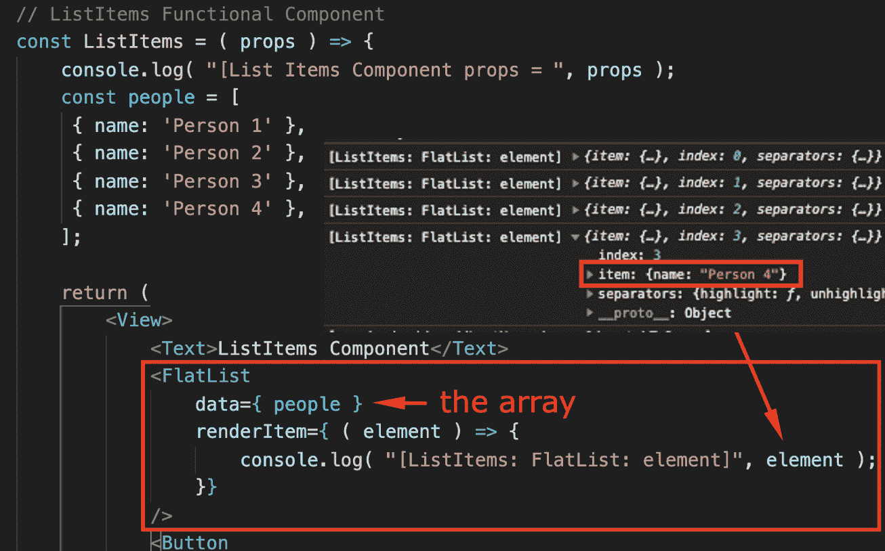

因为我们只想打印项目，所以我们将只从元素中获取项目字段。我们将把名称打印到屏幕上，如下所示:

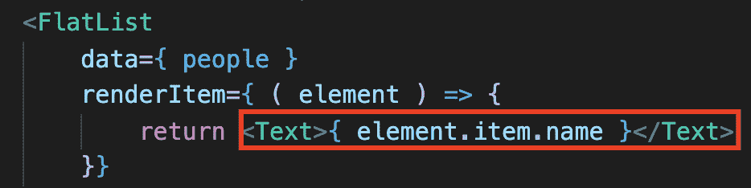

将在屏幕上显示如下:

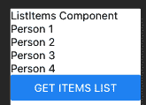

## 结论

我们找到了！我希望您已经发现了这一点，并对在 React Native 中创建列表更有信心。

*多读《三国演义》*[](https://plainenglish.io/)