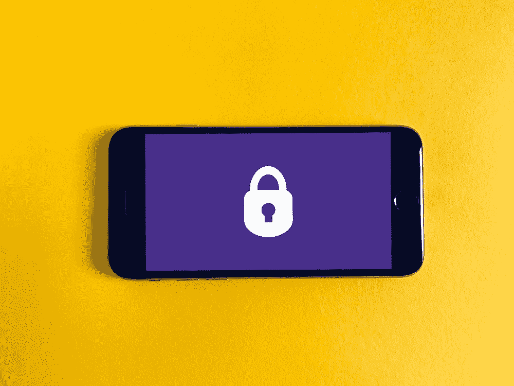

# 如果你没有考虑这 6 个安全方面，你的 React 原生应用就有大麻烦了

> 原文：<https://javascript.plainenglish.io/react-native-if-youre-not-considering-these-6-security-aspects-then-your-application-is-in-deep-266df367478c?source=collection_archive---------4----------------------->

众所周知，React Native 正在成为开发 Android 和 iOS 应用程序的首选框架。

在最初的日子里，只有初创公司和 POC 项目在 React Native 中开发，最终，像 Swiggy、Flipkart、Walmart 等大公司采用了它。随着越来越多的采用，处理安全问题变得非常重要。下面是每个 React 本机应用程序必须遵循的几个主要安全方面。

1.  **存储用户详细信息:**对于每个应用程序来说，存储一些用户详细信息是非常重要的，如身份验证令牌、用户名、电子邮件等。在设备存储器中。无论何时这样做，都不要使用 JavaScript 本地存储，通过简单的修改就可以很容易地获得这些值。相反，在 Android 中使用共享偏好，在 iOS 中使用钥匙链存储。以下是你可以留意的软件包。

[react-native-keychain](https://github.com/oblador/react-native-keychain)——在 iOS 的情况下

[react-native-shared-preference](https://github.com/sriraman/react-native-shared-preferences)——以安卓为例

2.**维护本地数据库:**如果您有一个电子商务或社交媒体应用程序，那么为了提供更好的用户体验，缓存用户帖子或项目细节是必须的。在这种情况下， [SQLite](https://github.com/andpor/react-native-sqlite-storage) 是最好的选择。通过使用其他包(如[react-native-sqlcipher-storage](https://github.com/axsy-dev/react-native-sqlcipher-storage)或[react-native-sqlcipher-2](https://github.com/craftzdog/react-native-sqlite-2))来使用这个包以及一些加密层。

3.**代码混淆:**由于 React Native 是一个基于 JavaScript 的框架，当应用被捆绑时，默认情况下 JavaScript 代码只是被缩小。借助一个简单的技巧(在本文[的](https://mevasanth.medium.com/ionic-how-to-obfuscate-your-code-37194ffca3f8)中有解释)，你可以解开它并查看简化的 JavaScript。通过查看代码，黑客可以理解流程并试图篡改业务。我们可以通过混淆代码来避免它。最好的工具是 Jscrambler——参考这个官方[链接](https://blog.jscrambler.com/how-to-protect-react-native-apps-with-jscrambler/),了解如何在 React Native 中使用 Jscrambler 混淆代码。

4.**存储 API 密钥:**每个流行的应用程序都会使用一些提供者，他们希望应用程序在移动应用程序项目的特定文件中存储一些 API 密钥。业余开发人员通常会在应用程序中硬编码这些值。这有两个主要问题:由于某种原因，如果密钥已经过期，那么它会影响应用程序的可用性；第二，应用程序密钥可以被黑客用来免费调用某些服务，如谷歌地图、Firebase 等。**为了避免这种情况，最好的解决方案是不要以硬编码的形式存储 API 密钥，也不要存储在本地存储中。通过 API 调用获取它，并在会话中使用它。**由于大多数 API 密匙都是用来与互联网上的某个服务器进行交互的，所以它无论如何都需要互联网。所以，做一个 API 调用并没有坏处。

5.**构造 API 调用:**这是安全性的一个重要方面。假设你正在开发一个类似 Tinder 的应用程序，当用户打开这个应用程序时，你会向他/她展示附近的人。一种糟糕的 API 设计方式是，当服务器返回大量数据时，应用程序将根据用户需求过滤数据并呈现细节。看起来它没有安全问题，但这是一个严重的威胁；通过使用 charles 这样的代理进行简单的攻击，人们可以很容易地检查移动应用程序发出的所有 API 调用。在这种情况下，黑客将获得所有用户的详细信息，他们可能会滥用它。最好的方法是从客户端获取有效的参数，然后只发送所需的细节。

6.**检查越狱和 root 手机:**在 iOS 中，设备可以越狱，在 Android 中，设备可以 root 以获得管理员权限。这将允许用户下载谷歌 Play 商店或苹果应用商店不允许的应用程序。这些可以用来破解你的应用程序，获取重要的细节。因此，根据你的应用在越狱或根设备中的表现来设计你的应用。我的建议是保留一个检查，不要执行任何通常的活动，如果他们越狱或扎根。你可以在下面的帮助下检查它

[监狱猴](https://github.com/GantMan/jail-monkey)

快乐阅读！下一篇文章再见。

同一作者的其他文章

1.  [React Native — Redux，最简单的解释](https://medium.com/nerd-for-tech/react-native-redux-the-most-simplest-explanation-220ba72f6266)
2.  [如何在 React Native 中动态使用本地图像](https://mevasanth.medium.com/how-to-use-local-images-dynamically-in-react-native-71b9f3b0db20)

在这里阅读作者[的所有文章。](http://mevasanth.medium.com)

*更多内容尽在*[*plain English . io*](http://plainenglish.io/)