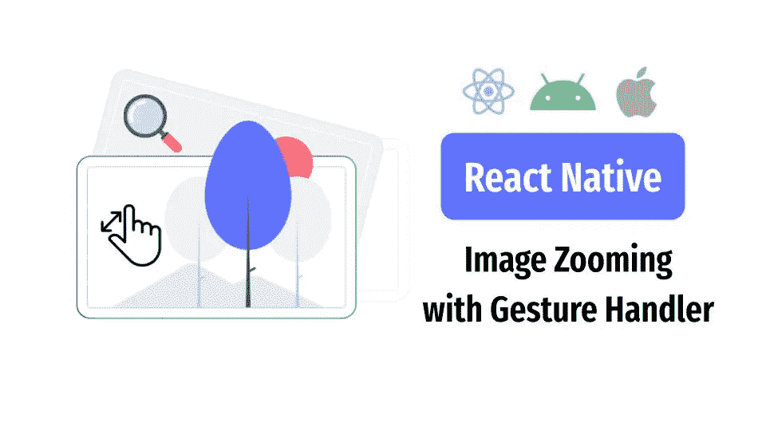
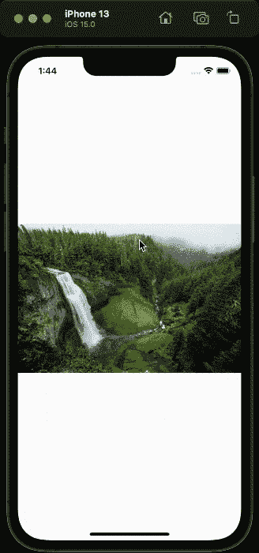
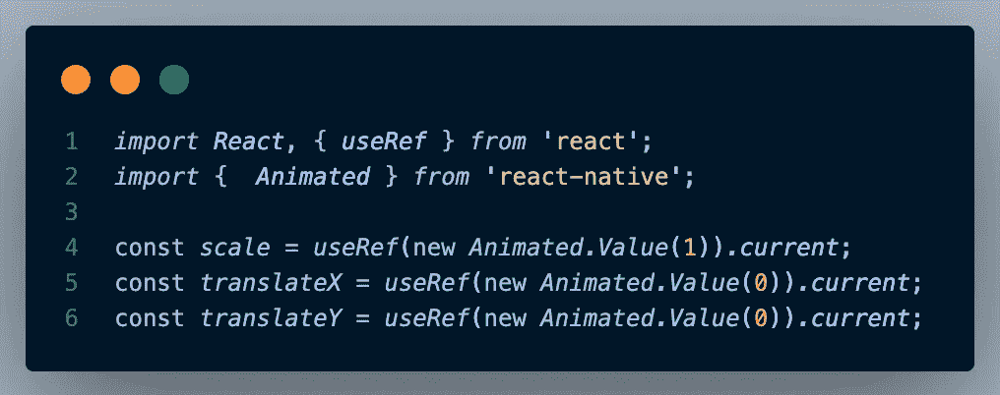
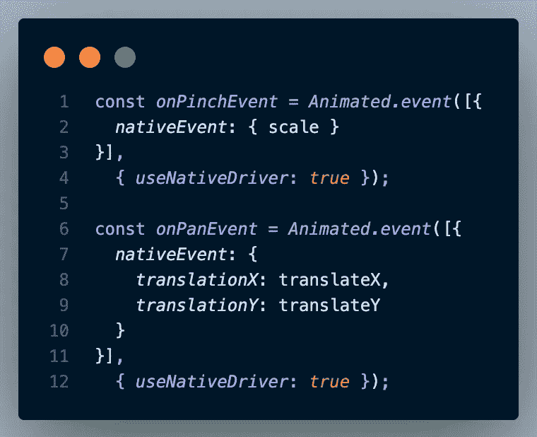
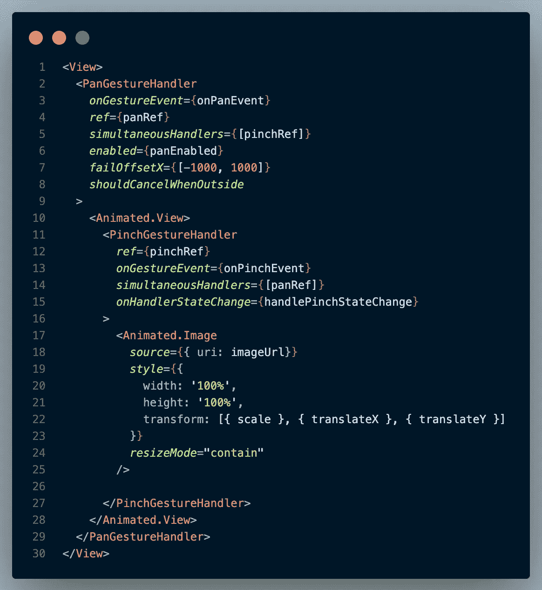
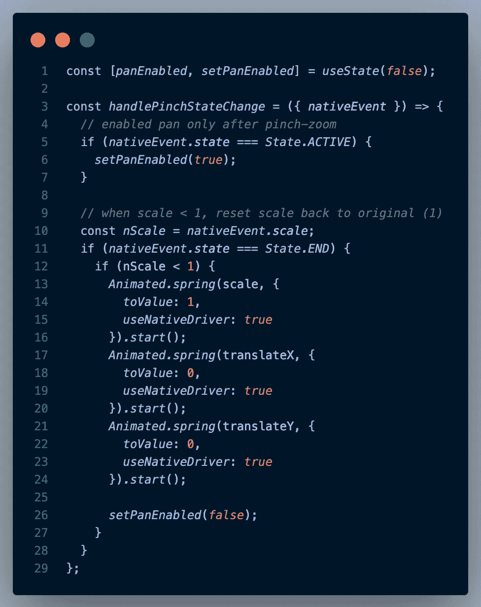

# React Native —使用手势处理器缩放图像

> 原文：<https://javascript.plainenglish.io/react-native-image-zooming-with-gesture-handler-376193e3d3b4?source=collection_archive---------0----------------------->

对于每个移动开发者来说，**图片**是带来更好插图的最重要元素之一。但是我们怎样才能获得特定图像的更多细节呢？变焦将是答案！

在学习 React Native (RN)的时候，我发现 React Native 提供了一个简单明了的方法，叫做 [**手势处理程序**](https://docs.swmansion.com/react-native-gesture-handler/docs/) **。**这个库有助于处理我们的电话系统和行为中的各种手势，就像本地人的手势一样。

# 给我举个例子！🌸

Showcase for Image Zooming

以上显示了使用 **PanGestureHandler** 和 **PinchGestureHandler 进行图像缩放的示例。** PanGestureHandler 用于左右移动图像，PinchGestureHandler 用于放大/缩小图像。示例照片取自 [**Lorem Ipsum**](https://picsum.photos/) 。

# 如何归档？也给我看看代码！🐥

1.  让我们声明一些有用的**变量**。

`scale`用于测量图像的缩放状态，默认值为 1，`translateX` & `translateY`用于测量左右平移。所有的变量都是使用`useRef` & `Animated.Value()`创建的，这样所有这些值都可以被动画化，并在组件的整个生命周期内保持不变。

2.我们既要申报**潘&捏事件**。

`**onPinchEvent**`会设置`scale`值，同时`**onPanEvent**`会将其两个`translationX` & `translationY`分别设置为`translateX` & `translateY`。这两个事件都被设置为`useNativeDriver`，这意味着所有的动画都将被发送到本机代码，以便在 UI 线程上执行动画，而不必在每一帧上都通过桥。 [**此处**](https://reactnative.dev/blog/2017/02/14/using-native-driver-for-animated) 了解更多`useNativeDriver`。

3.构建我们的 **UI 代码**。

我们将拥有`<Image>`，但是将它转换成`<Animated.Image>`，以便它能够接收动画变化。然后，用`<PinchGestureHandler>` & `<PanGestureHandler>`把`<Image>`包起来。在`<Image>`中，将动画值放入`style — transform`中，以便`<Image>`知道要变换什么。

有一些重要的事情需要记下来:

*   当使用 2 个不同的手势处理程序时，必须用`<Animated.View>`包裹子元素，否则什么都不会显示。
*   为每个手势处理器创建`ref`,并将每个引用传入另一个手势处理器的`simultaneousHandlers`,这样另一个就知道彼此的存在。

4.一些**捏事件的增强**。

到目前为止，基本上，我们完成了我们的图像缩放代码。您可以运行代码，看看效果如何。然而，你会注意到，即使没有缩放，图像也可以被平移**并且**缩小事件会使图像变得非常小**。**

*   为了解决平移图像而不缩放的问题，我们设置了一个`panEnabled`状态来避免图像在缩放之前被平移。当收缩事件激活(持续)时，我们将`panEnabled`设置为真。
*   为了修复缩小到不可思议的小的图像，我们检查`scale < 1`，我们通过使用`Animated.Spring`将所有的动画值重置回它们的原始值，以获得漂亮的跳跃效果。

我们完了！

# 结论

这是我第一次尝试手势处理器，我甚至没有在原生 Android 中处理这样的动作。原生 Android 的手势处理对我来说要复杂得多，对于这种图像缩放，我总是会参考第三方库，而不是自己编写所有代码。

仍然有许多不同的手势处理器可以使用，例如`TapGestureHandler`、`RotateGestureHandler`等。用母语学习感觉很好。如果我犯了什么错误，请给我反馈。感谢您花时间阅读我的文章。🧀

**完整源代码**

*更多内容请看*[***plain English . io***](http://plainenglish.io/)*。报名参加我们的* [***免费周报***](http://newsletter.plainenglish.io/) *。在我们的* [***社区***](https://discord.gg/GtDtUAvyhW) *获得独家获得写作机会和建议。*