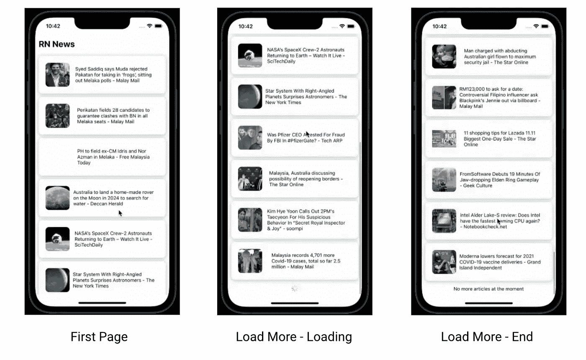
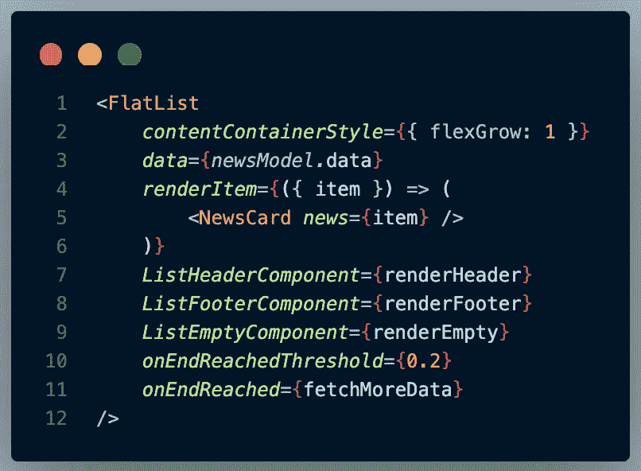
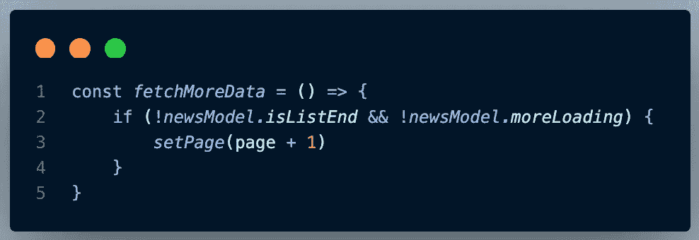
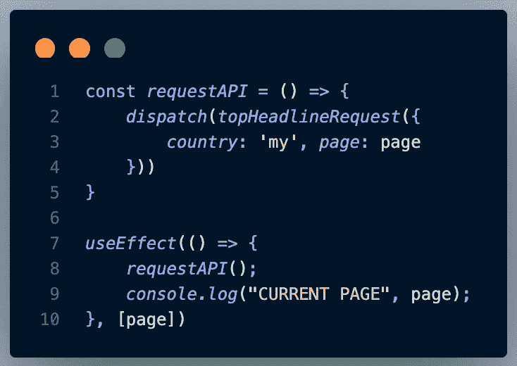
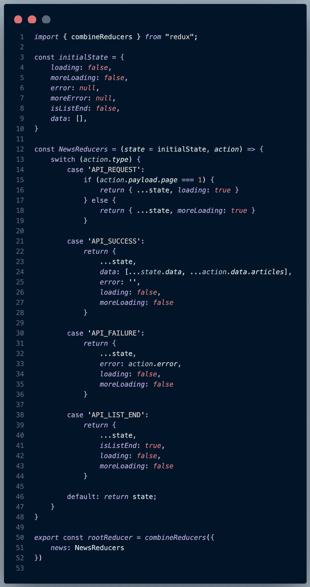
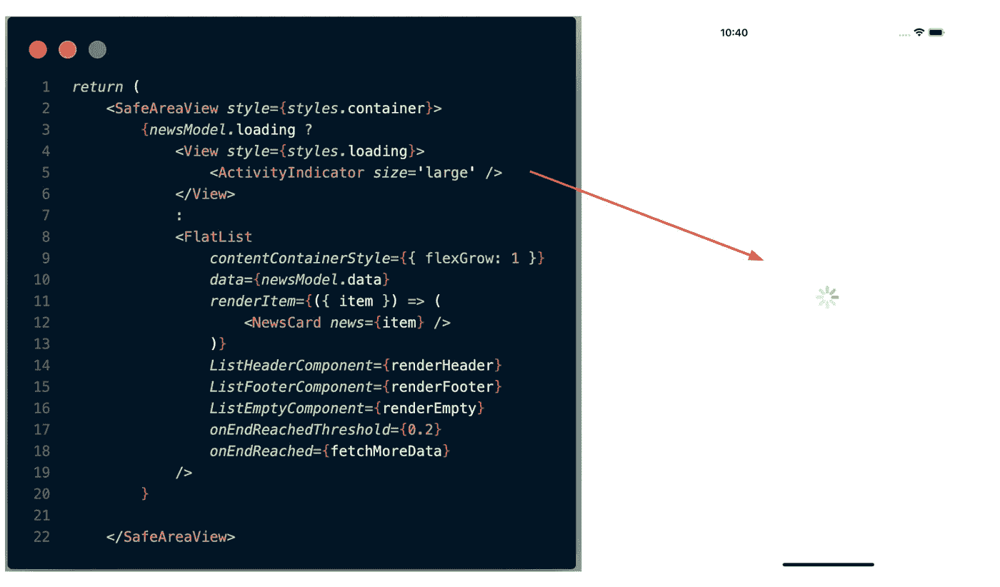
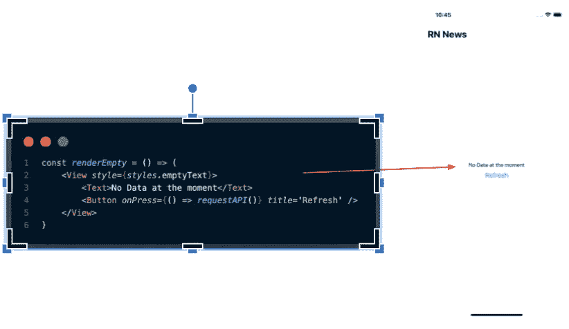
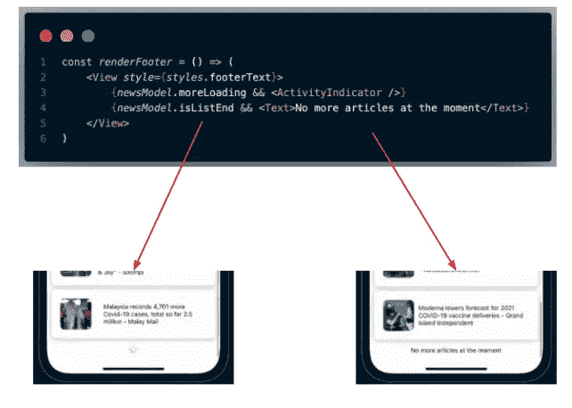

# React Native —使用 FlatList 进行无限滚动分页

> 原文：<https://javascript.plainenglish.io/react-native-infinite-scroll-pagination-with-flatlist-e5fe5db6c1cb?source=collection_archive---------0----------------------->

分页是一个重要的概念，它可以帮助开发人员加载大量的数据，而不是一次性加载。对于 web 开发，开发人员通常使用基于页面索引的方法，但是对于移动开发，我们通常使用无限滚动方法。

作为一名 Android 开发人员，我们知道用 RecyclerView 建立一个列表并实现一个分页库有多难。然而，使用 React Native，我们可以轻松地用 FlatList 构建无限滚动分页！

# 使用案例— NewsAPI

我用[新闻 API](https://newsapi.org/) 构建了一个简单的用例，用`page` & `pageSize`参数加载文章页面。

Demo of Infinite Scroll Pagination on News App

只有`10`的文章被放在第一页。然后，当用户滚动到底部时，另一篇`10`文章将在第二页被取出，反之亦然。当它到达列表的末尾时，一个指示器将提示用户此时没有更多的文章可用。

# 给我看看代码！

FlatList implementation

好吧，好吧，让我们把手弄脏。为了实现无限滚动，我们的 FlatList 中有`onEndReached` & `onEndReachedThreshold`道具。`onEndReachedThreshold`用于确定距离底部多远才能触发`onEndReached`。阈值越小，离底部的距离越小，因此越向下滚动将触发`onEndReached`。

fetchMoreData()

当`onEndReached`被触发时，将调用`fetchMoreData`以增加当前页码。同时，为了**防止 API 请求**的重复，检查 API 是否已经到达其结尾或者当前正在加载更多数据。

当页码增加时，`useEffect` hook 会检测并调用`requestAPI()`函数。

但是，Redux reducer 是如何处理所有这些状态并正确返回到 UI 中的呢？

Redux Reducers

有 4 种不同的状态，让我们一个一个来看。

1.  `API_REQUEST`

当用户请求 API 时，有两种加载方式，初始加载和更多数据加载。因此，我们要做的是检查`page`并确定加载的是初始数据还是更多数据。

2.`API_SUCCESS`

当用户从 API 响应中获得值时，我们通过使用数组扩展操作符`[...]`将它附加到`data`中，这样`data`将不断地被附加新数据。

3.`API_FAILURE`

设置`error`状态及其错误信息，并显示在 UI 中。

4.`API_LIST_END`

将`isListEnd`状态设置为 true，以指示 FlatList 在下一页上没有更多数据。`isListEnd`还有助于阻止任何进一步的 API 请求。

# 让我们回到用户界面

下面是与 UI 工作方式相关的代码片段。

UI for Initial Data Loading

UI for error/no internet connection

Bottom indicator for more data loading and no more data

沃拉。我们已经完成了覆盖多个状态的 FlatList 的无限滚动分页。🌸

# 结论

与命令式 UI (Android)相比，声明式 UI (React Native)可以在没有大量复杂代码的情况下做这些事情，这真的很酷(PS:我知道 Jetpack Compose 正在路上。稍后会试用)。然而，有一些**弱点**需要修正和克服。

1.  如何处理本地 db 值？在 Android Paging3 中，有一个`RemoteMediator`有助于方便来自远程和本地的数据，但我在 RN 中找不到。
2.  在请求更多数据时，如果没有互联网连接，如何实现底部刷新指示器？我知道这可以通过控制 Redux 状态来实现，但我不确定这样做是否有效。

无论如何，我认为分页是一个重要的概念，也许有更多的人关注这个领域。一起，我们将使社区变得更好！快乐的反应！✅

github:[https://github.com/WenLonG12345/RNNewsPagination](https://github.com/WenLonG12345/RNNewsPagination)

*更多内容请看* [***说白了。报名参加我们的***](http://plainenglish.io/) **[***免费周报***](http://newsletter.plainenglish.io/) *。在我们的* [***社区不和谐***](https://discord.gg/GtDtUAvyhW) *获得独家获取写作机会和建议。***