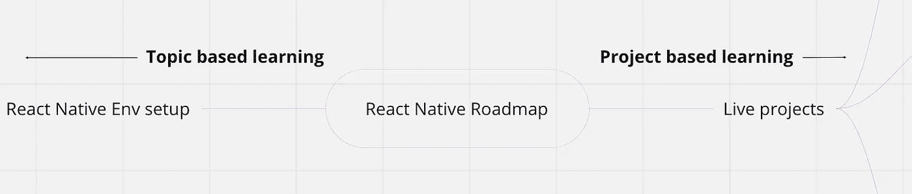
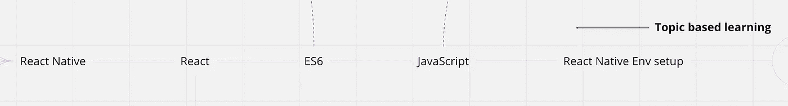

# 基于我的专业和教学经验的 React 本地学习路线图

> 原文：<https://javascript.plainenglish.io/react-native-learning-roadmap-7b1fcd1ab065?source=collection_archive---------0----------------------->

在与 React Native 一起工作了大约 4 年，并通过我的 [devskill 课程](https://training.devskill.com/Course/ViewDetails/84daae02-0c6e-cb37-5eb7-08d6b52086bc)教了 40 多名学生熟悉 React Native 之后，我想出了一个学习 React Native 的基本路线图。

* *显然，学习任何技术都没有固定/直接的路线图，但我希望我在 React Native 上的专业和教学经验可以帮助正在开始使用 React Native 的人。**

# 路线图分解

基于主题的学习+基于项目的学习

我将整个路线图分为两个主要部分。它们是:

1.  基于项目的学习——通过这种方式，你可以在真实的项目中工作，通过构建东西来学习。(待办事项应用、预订应用、日志应用等)
2.  基于主题的学习——通过这种方式，你可以专注于特定的主题，并通过动手练习很好地理解这些主题。(JavaScript、React、核心 React Native、导航、全局状态管理等)

**基于主题的学习**

我已经指出了一些对于开始使用 React Native 的人来说非常重要的主题。所以这些题目需要额外的学习和专注。

我试着按顺序列出需要涵盖的主题。所以任何从 React Native 开始的人都可以按照这个顺序关注主题。

# **1。环境设置**

# **2。JavaScript & ES6:**

在我们进入 React & React Native 之前，最好我们已经有了这门语言的基础。否则，我们可能会陷入困境，失去继续旅程的动力。我在 JS & ES6 中包含的部分可以在 [freecodecamp 学习地图中找到。](https://www.freecodecamp.org/learn)

# **3。反应**

很好，现在我们知道了编写应用程序需要使用的语言。我们现在可以直接跳到原生反应，或者我们可以在开始原生反应之前学习原生反应的基础知识。React native 基于 React 的基本原则。因此，我们可以先了解 React 的概念，这将有助于我们更轻松地使用 react-native。

# **4。反应原生**

有了以上所有内容，我们就可以开始使用 React Native 了。

# **基于项目的学习**

除了学习特定的主题，最有效的方法是通过构建真实的项目来学习。这样，我们的学习将持续很长时间，我们可以开始成长为专业的本地开发人员。在我所有的课程中，我都试着和全班一起建立三个项目。我试着以适当的顺序将主题包含在项目中。以便我们循序渐进地学习。这三个项目的想法可以如下

# 1.第一个项目——关注用户界面

# 2.第二个项目——关注应用程序的功能

# 3.第三个项目——尽可能模仿真实世界的项目

这就是全部，我相信如果开始使用 React Native 的人完成了这个路线图，他们将会以非常好的状态开始他们的 React Native 专业之旅。

*更多内容看* [*说白了. io*](http://plainenglish.io/) *。在这里注册我们的* [*免费周报*](http://newsletter.plainenglish.io/) *。*